<div align="center">

#  ML4SCI DeepLense — GSoC 2026
## Common Test I: Multi-Class Classification of Dark Matter Substructure

[](https://python.org)
[](https://pytorch.org)
[](https://github.com/QUVA-Lab/escnn)
[](https://www.nvidia.com)
[](LICENSE)
[](https://colab.research.google.com)

<br>

**Classifying dark matter substructure in simulated strong gravitational lensing images**
using eleven architectures — from convolutional baselines to physics-motivated equivariant
networks encoding the rotational symmetry of gravitational lensing directly into their weights.

Nine architectures establish a comprehensive benchmark spanning sequential CNNs, residual
networks, dense connectivity, attention-based transformers, and D₄-equivariant networks.
A novel **C8-equivariant DenseNet (EqDenseNet-C8)**, combining 8-fold discrete rotational
equivariance with DenseNet-style dense connectivity and trained entirely from scratch,
surpasses all nine benchmarked architectures — including seven ImageNet-pretrained models —
on every reported metric.

<br>

| | |
|:-:|:-:|
| **Best Macro AUC** | **0.9974** — EqDenseNet-C8 (0.093M params, from scratch) |
| **Best Sphere Recall** | **0.9448** — EqDenseNet-C8 |
| **Best Sphere PR-AUC** | **0.9932** — EqDenseNet-C8 |
| **Best Pretrained AUC** | 0.9962 — DenseNet-121 (7.0M params, ImageNet) |
| **Best Efficiency** | **0.093M params** — EqDenseNet-C8 (AUC 0.9974) |
| **Task** | 3-class classification (No Sub / Sphere / Vortex) |
| **Input** | 150 × 150 × 1 (single-channel simulated lensing images) |

</div>

---
> **Important Note on Scope and Development Timeline**
>
> This notebook was originally prepared with nine architectures — spanning sequential
> CNNs, residual networks, dense connectivity, attention-based transformers, and
> D₄-equivariant networks. The full analysis suite (interpretability, ablation,
> failure mode analysis, residual image approach, deep ensemble uncertainty) was
> designed around and applied to these nine models.
>
> During the course of preparing this submission, a novel architecture —
> **EqDenseNet-C8** — emerged from combining C8 cyclic equivariance with DenseNet-style
> dense connectivity. It was trained, evaluated, and included in Section 5.10, where
> it achieves the best results across every reported metric, surpassing all nine
> original architectures including all seven ImageNet-pretrained models.
>
> However, given the submission deadline and the non-linear nature of exploration and experimentations, EqDenseNet-C8 has not yet received the same
> depth of analysis as the original nine models. Specifically, failure mode
> characterisation largely reflect the original
> nine-model study. EqDenseNet-C8 appears in the benchmark table, ROC/PR comparisons,
> parameter efficiency plot, and cross-architecture confusion matrix, CAM-analysis, ensemble uncertainty analysis but its deeper
> analysis — including full ablation over {C8, SO(2)} × {residual, dense} and
> cross-dataset evaluation — is planned for the GSoC 2026 project timeline.
>
> The comprehensive analyses shown throughout Sections 6–9 therefore serve a dual
> purpose: rigorous evaluation of the nine-model benchmark, and a foundation for
> targeted follow-up work on EqDenseNet-C8 and its SO(2) extensions during the main
> GSoC project.

---

##  Table of Contents

1. [Scientific Background](#1-scientific-background)
2. [Dataset](#2-dataset)
   - [2.1 Class Descriptions](#21-class-descriptions)
   - [2.2 Dataset Statistics](#22-dataset-statistics)
   - [2.3 Key Observational Properties](#23-key-observational-properties)
3. [Environment Setup](#3-environment-setup)
4. [Training & Evaluation Framework](#4-training--evaluation-framework)
   - [4.1 Data Pipeline](#41-data-pipeline)
   - [4.2 Key Design Decisions](#42-key-design-decisions)
   - [4.3 Evaluation Protocol](#43-evaluation-protocol)
5. [Architecture Evaluations](#5-architecture-evaluations)
   - [5.1 AlexNet](#51-alexnet)
   - [5.2 VGG-16](#52-vgg-16)
   - [5.3 ResNet-18](#53-resnet-18)
   - [5.4 ResNet-50](#54-resnet-50)
   - [5.5 DenseNet-121](#55-densenet-121)
   - [5.6 EfficientNet-B3](#56-efficientnet-b3)
   - [5.7 Vision Transformer (ViT-Base/16)](#57-vision-transformer-vit-base16)
   - [5.8 Equivariant Neural Network (D₄-ENN)](#58-equivariant-neural-network-d-enn)
   - [5.9 Equivariant Residual Network (E-ResNet)](#59-equivariant-residual-network-e-resnet)
   - [5.10 Equivariant DenseNet (C8)](#510-equivariant-densenet-c8)
   - [5.11 Soft Ensemble (Top-6)](#511-soft-ensemble-top-6)
   - [5.12 Equivariant DenseNet SO(2) — Planned](#512-equivariant-densenet-so2--planned)
   - [5.13 Equivariant ResNet SO(2) — Planned](#513-equivariant-resnet-so2--planned)
6. [Comprehensive Results Summary](#6-comprehensive-results-summary)
   - [6.1 Full Benchmark Table](#61-full-benchmark-table)
   - [6.2 Performance Tiers](#62-performance-tiers)
   - [6.3 Parameter Efficiency](#63-parameter-efficiency)
   - [6.4 Key Takeaways](#64-key-takeaways)
7. [Interpretability Analysis](#7-interpretability-analysis)
   - [7.1 Grad-CAM: ResNet-50 vs E-ResNet](#71-grad-cam-resnet-50-vs-e-resnet)
   - [7.2 ViT Attention Rollout vs DenseNet Grad-CAM](#72-vit-attention-rollout-vs-densenet-grad-cam)
   - [7.3 Predictive Uncertainty — Deep Ensemble](#73-predictive-uncertainty--deep-ensemble)
   - [7.4 Ablation Study — E-ResNet Components](#74-ablation-study--e-resnet-components)
   - [7.5 Equivariance Verification](#75-equivariance-verification)
8. [Failure Mode Analysis](#8-failure-mode-analysis)
   - [8.1 Cross-Architecture Sphere Confusion](#81-cross-architecture-sphere-confusion)
   - [8.2 Statistical Characterisation of Failures](#82-statistical-characterisation-of-failures)
   - [8.3 Confidence and Accuracy vs Ring Brightness](#83-confidence-and-accuracy-vs-ring-brightness)
   - [8.4 Perturbation Position Analysis](#84-perturbation-position-analysis)
   - [8.5 Physical Interpretation](#85-physical-interpretation)
9. [Residual Image Approach](#9-residual-image-approach)
   - [9.1 Motivation](#91-motivation)
   - [9.2 Convolutional Autoencoder](#92-convolutional-autoencoder)
   - [9.3 Residual Classifiers](#93-residual-classifiers)
   - [9.4 Summary & Interpretation](#94-summary--interpretation)
10. [Discussion](#10-discussion)
11. [Limitations & Future Work](#11-limitations--future-work)
12. [GSoC Research Directions](#12-gsoc-research-directions)
13. [Repository Structure](#13-repository-structure)
14. [Citation](#14-citation)

---

## 1. Scientific Background

Strong gravitational lensing — the bending of light from a distant source galaxy around a massive foreground lens — encodes information about the **total mass distribution of the lens**, including its dark matter content. When the lens contains low-mass dark matter substructures (subhalos, vortices), they imprint subtle perturbations on the lensing arc: compact brightness knots, arc asymmetries, and flux anomalies.

The three substructure classes probed in this benchmark correspond to distinct dark matter models:

```
       SOURCE GALAXY
            │
            │  (light rays)
     ╔══════╧═════╗
     ║  Einstein  ║   ← main halo (smooth SIE + shear)
     ║    Ring    ║
     ╚════╤═══════╝
          │
      ┌───┴───────────────────────────────────┐
      │  + Sphere subhalo → CDM prediction    │
      │  + Vortex          → Axion DM         │
      │  (no perturbation) → Smooth halo      │
      └───────────────────────────────────────┘
```

Distinguishing these classes at scale — across thousands of images, near the detection threshold — is precisely the task for which deep learning is well-suited. Human visual inspection is unreliable: both Sphere and Vortex perturbations are morphologically similar to lensing arc edge effects at the noise level of ground-based surveys.

---

## 2. Dataset

### 2.1 Class Descriptions

| Class | Dark Matter Model | Physical Signature | Visual Cue |
|:------|:-----------------|:-------------------|:-----------|
| **No Substructure** | Smooth CDM halo | SIE + shear only | Clean symmetric Einstein ring |
| **Sphere** | CDM subhalo (point mass) | Compact subhalo appended to base halo | Compact bright knot on the arc |
| **Vortex** | Axion dark matter (topological vortex) | Density field perturbation | Arc elongation / asymmetry |

<!-- Figure: one representative image per class, shown side by side -->
<p align="center">
  
  <br><em>Figure 2.1 — Representative 150×150 single-channel images for each class. All three share the same Einstein ring morphology; the Sphere knot and Vortex arc asymmetry are subtle perturbations visible only on close inspection.</em>
</p>

### 2.2 Dataset Statistics

The dataset was generated using the **DeepLenseSim pipeline** (Toomey et al.) under a fixed simulation configuration: Sheared Isothermal Elliptical (SIE) lens, Sérsic light profile, Gaussian PSF, Gaussian + Poissonian noise at SNR ≈ 25.

| Partition | Images / Class | Total Images | Role |
|:----------|:--------------:|:------------:|:-----|
| **Train** | 10,000 | 30,000 | Weight optimisation only |
| **Val** | 2,500 | 7,500 | Checkpoint selection & metric reporting |

**Simulation parameters:**
- Image size: **150 × 150 pixels** (single channel)
- Lens model: SIE + external shear
- Pixel scale: 0.1 arcsec / pixel
- PSF: Gaussian, FWHM = 0.1 arcsec
- Background RMS: 0.3 (fixed)
- Exposure time: log-uniform distribution (~factor of 3 SNR range)
- Halo mass: ~10¹² M☉

```
Dataset split (balanced across all classes):
─────────────────────────────────────────────
Train   ██████████████████████████████  30,000
Val     ████████                         7,500
─────────────────────────────────────────────
        0     5k   10k   15k   20k   25k  30k
```

### 2.3 Key Observational Properties

Three properties of the data drive all modelling choices:

**1. Visual similarity between classes.** All three classes share the same macro-lens morphology — a bright Einstein ring. The substructure signal manifests as *subtle perturbations*, not visually distinct objects. Classification requires detecting a small perturbation on top of a dominant shared structure.

**2. Heavy right-skewed pixel intensity.** The vast majority of pixels are near-zero background. The small fraction of bright pixels along the ring arc carries essentially *all* discriminative information. This motivates per-sample min-max normalisation, not dataset-level standardisation.

**3. Sphere is the physically hardest class.** Spherical CDM subhalos produce 
compact, approximately symmetric perturbations — morphologically similar to smooth 
arcs. Vortex perturbations are elongated and asymmetric, more geometrically distinct. 
**Sphere Recall is the most discriminating single metric** on this dataset; macro AUC 
is dominated by the easier No Substructure/Vortex boundary. This asymmetry is 
confirmed empirically across all nine architectures in Sections 6–8, and targeted 
architectural improvements — such as ring-local perturbation detectors and continuous 
SO(2) equivariance — are identified as the primary research directions in Section 12.

<!-- Figure: pixel intensity distributions and ring statistics per class -->
<p align="center">
  
  <br><em>Figure 2.2 — EDA pixel intensity statistics per class. All three distributions 
are heavily right-skewed — the vast majority of pixels are near-zero background, with 
discriminative information concentrated in the bright ring arc pixels. The distributions 
are visually indistinguishable between classes, confirming that classification requires 
detecting subtle perturbations within a shared macro-lens morphology.</em>
</p>

---

## 3. Environment Setup

All experiments were conducted on **Google Colab with a single NVIDIA A100 GPU** (high-memory runtime).

### Requirements

```bash
pip install torch torchvision --index-url https://download.pytorch.org/whl/cu121
pip install lenstronomy --quiet          # Section 9: analytical lens fitting
pip install escnn --quiet                # Sections 5.8–5.9: equivariant CNNs
pip install grad-cam --quiet             # Section 7.1: Grad-CAM visualisation
pip install "numpy<2"                    # escnn + lenstronomy require numpy 1.x
# ⚠️  Restart runtime after numpy downgrade before proceeding
```

> **Note:** Colab ships `numpy 2.4.x` by default. `escnn` and `lenstronomy` both require `numpy < 2`. Pin `numpy==1.26.4` and restart the kernel before importing any model code.

### Verified version matrix

| Package | Version | Note |
|:--------|:-------:|:-----|
| Python | 3.10 | Colab default |
| PyTorch | 2.x | cu121 build |
| numpy | 1.26.4 | pinned — see above |
| escnn | latest | D₄ equivariant layers |
| lenstronomy | latest | analytical lens model |
| grad-cam | latest | Grad-CAM / Attention Rollout |

---

## 4. Training & Evaluation Framework

### 4.1 Data Pipeline

```
Raw .npy files (150×150)
        │
        ▼
Per-sample min-max normalisation: x̂ = (x − xₘᵢₙ) / (xₘₐₓ − xₘᵢₙ)
        │
        ├─── [TRAIN] D₄ augmentation: random {hflip, vflip, 90°-rot}
        │
        ├─── [VAL]   No augmentation
        │
        ▼
Single-channel 150×150 tensor → model input
```

The train/val split is used exactly as provided by the dataset organisers. No additional test partition is created.

**Normalisation rationale:** Per-sample normalisation preserves internal contrast structure regardless of exposure level, a critical property given the ~3× SNR range across images from the log-uniform exposure distribution.

**Augmentation rationale:** Gravitational lenses have no preferred orientation in the sky. All four 90° rotations and reflections represent the same physical system — D₄ augmentation is *physically motivated*, not arbitrary regularisation.

### 4.2 Key Design Decisions

| Decision | Choice | Rationale |
|:---------|:------:|:----------|
| Optimiser | AdamW (wd = 1e-3) | Weight decay regularises large pretrained models without penalising BatchNorm parameters |
| Scheduler | CosineAnnealingLR | Smooth LR decay without manual step tuning; completes full annealing cycle |
| Loss | CrossEntropyLoss | Standard for balanced multi-class classification |
| Gradient clipping | max_norm = 1.0 | Prevents gradient explosions in deep architectures during early training |
| Checkpoint criterion | Lowest validation loss | Consistent across all architectures for fair comparison |
| Early stopping | patience = 15 epochs | Halts training when val loss stagnates |

### 4.3 Evaluation Protocol

Four complementary metrics are computed for every architecture:

| Metric | What it measures | Why it matters |
|:-------|:-----------------|:---------------|
| **Macro AUC** | Threshold-independent separability, averaged over three OvR boundaries | Primary benchmark metric; robust to class balance |
| **Confusion matrix** | Direction-specific misclassification rates | Reveals Sphere→No Sub vs Sphere→Vortex confusion patterns |
| **Sphere PR-AUC** | Detection quality for the hardest class | Most sensitive indicator of genuine Sphere signal learning |
| **Calibration curve** | Reliability of confidence scores | Critical for entropy-based triage in deployment |

---

## 5. Architecture Evaluations

Thirteen architectures are evaluated across three categories: standard deep learning
baselines (Sections 5.1–5.7), physics-motivated equivariant networks (Sections 5.8–5.10),
a soft ensemble combining the top-6 models (Section 5.11), and two planned SO(2)
continuous equivariant architectures targeting the GSoC project timeline
(Sections 5.12–5.13).

The ordering follows the historical development sequence — from sequential baselines
establishing the lower bound, through increasingly capable general architectures, to
equivariant networks encoding lensing symmetry directly into their weights.

### Architecture Design Progression
```
Sequential          Skip connections    Attention       Equivariant                    Planned
──────────────      ────────────────    ──────────────  ──────────────────────────     ────────────────────────────
AlexNet             ResNet-18           ViT-Base/16     ENN (D₄, shallow)              EqDenseNet-SO(2)
VGG-16              ResNet-50                           E-ResNet (D₄, residual)        EqResNet-SO(2)
                    DenseNet-121                        EqDenseNet-C8 (C8, dense) ←
                    EfficientNet-B3                     Ensemble (Top-6 soft vote)
```

---

### 5.1 AlexNet

**Role:** Sequential lower-bound — establishes that gradient flow to early layers is
a prerequisite, not an option, for low-contrast substructure detection.

**Architecture:** 5 conv + 3 FC layers with no skip connections and no batch
normalisation. Gradients must traverse the full network depth to reach shallow feature
detectors — a fundamental limitation for low-SNR signals.

**Modifications:** First conv layer replaced for single-channel input. Classifier head
replaced with 3-class output.

**Training:** 30 epochs, ImageNet pretrained, lr = 1e-4.

<details>
   
<summary><b>Per-class classification report</b></summary>

```
── Classification Report: AlexNet ───────────────────────────────
                 precision    recall  f1-score   support

No Substructure     0.4912    0.7836    0.6039      2500
         Sphere     0.4034    0.1240    0.1895      2500
         Vortex     0.4337    0.3820    0.4062      2500
       accuracy                         0.4365      7500
      macro avg     0.4428    0.4299    0.4665      7500
```

</details>

<p align="center">
  
  <br><em>Figure 5.1 — AlexNet evaluation: confusion matrix (left), ROC curves per class
  (centre), Sphere PR curve (right). Near-random Sphere classification (recall 0.124)
  confirms gradient inaccessibility as the primary failure mechanism.</em>
</p>

| Metric | Value |
|:-------|------:|
| Macro AUC | 0.6589 |
| AUC — No Substructure | 0.7358 |
| AUC — Sphere | 0.6053 |
| AUC — Vortex | 0.6351 |
| Sphere PR-AUC | 0.4380 |
| Test Accuracy | 43.65% |
| Sphere Recall | 0.1240 |
| Parameters | 57.0 M |
| Pretrained | ✅ ImageNet |

> ⚠️ Sphere PR-AUC of 0.4380 is only marginally above the random baseline of 0.33.
> The skip-connection gap is the largest single performance discontinuity in this
> benchmark — larger than any gap within the skip-connection family.

**Model weights:** [Download from Google Drive](https://drive.google.com/your-link-here) *(replace with actual link)*

---

### 5.2 VGG-16

**Role:** Deep sequential architecture — tests whether depth alone compensates for
the absence of skip connections.

**Architecture:** 16-layer network with uniform 3×3 convolutions, no residual
connections, no batch normalisation. With 134M parameters — the largest in this
benchmark — VGG-16 is the clearest demonstration that scale without skip connections
cannot solve the gradient accessibility problem.

**Caveat:** Standard VGG-16 lacks batch normalisation after convolutions. Training
instability in early epochs is a known property of this architecture and not an
implementation artefact.

**Modifications:** First conv layer replaced for single-channel input. Classifier
head replaced with 3-class output.

**Training:** 30 epochs, ImageNet pretrained, lr = 1e-4.

<details>
<summary><b>Per-class classification report</b></summary>
   
```
── Classification Report: VGG-16 ───────────────────────────────
                 precision    recall  f1-score   support

No Substructure     0.7748    0.8636    0.8168      2500
         Sphere     0.7166    0.5044    0.5925      2500
         Vortex     0.6867    0.8052    0.7413      2500

       accuracy                         0.7244      7500
      macro avg     0.7260    0.7244    0.7169      7500
```

</details>

<p align="center">
  
  <br><em>Figure 5.2 — VGG-16 evaluation: Sphere recall of 0.504 despite 134M parameters.
  Training instability from the absence of batch normalisation is visible in the loss curves.</em>
</p>

| Metric | Value |
|:-------|------:|
| Macro AUC | 0.8944 |
| AUC — No Substructure | 0.9385 |
| AUC — Sphere | 0.8659 |
| AUC — Vortex | 0.8783 |
| Sphere PR-AUC | 0.8065 |
| Test Accuracy | 72.43% |
| Sphere Recall | 0.5044 |
| Parameters | **134.3 M** |
| Pretrained | ✅ ImageNet |

> VGG-16 uses **344×** more parameters than E-ResNet yet achieves substantially
> worse AUC — the clearest demonstration that scale without skip connections
> provides no benefit for this task.

**Model weights:** [Download from Google Drive](https://drive.google.com/your-link-here) *(replace with actual link)*

---

### 5.3 ResNet-18

**Role:** Skip-connection baseline — establishes that gradient flow to early layers
is necessary for low-contrast substructure detection.

**Architecture:** 18-layer residual network with BasicBlock (2 × 3×3 conv) units.
Skip connections allow gradients to bypass individual blocks, reaching shallow feature
detectors without degradation.

**Modifications:** First conv layer replaced for single-channel input (1→64, 7×7,
stride 2). Classification head replaced with 3-class linear output.

**Training:** 30 epochs, ImageNet pretrained, lr = 1e-4, CosineAnnealingLR.

<details>
<summary><b>Per-class classification report</b></summary>
   
```
── Classification Report: ResNet-18 ──────────────────────────
                 precision    recall  f1-score   support

No Substructure     0.9576    0.9700    0.9638      2500
         Sphere     0.9413    0.9064    0.9235      2500
         Vortex     0.9594    0.9808    0.9700      2500

       accuracy                         0.9524      7500
      macro avg     0.9528    0.9524    0.9524      7500
```

</details>

<p align="center">
  
  <br><em>Figure 5.3 — ResNet-18 evaluation: confusion matrix (left), ROC curves per class
  (centre), Sphere PR curve (right). The skip-connection gap over AlexNet and VGG-16
  is the largest discontinuity in the benchmark.</em>
</p>

| Metric | Value |
|:-------|------:|
| Macro AUC | 0.9927 |
| AUC — No Substructure | 0.9939 |
| AUC — Sphere | 0.9872 |
| AUC — Vortex | 0.9966 |
| Sphere PR-AUC | 0.9813 |
| Test Accuracy | 95.24% |
| Sphere Recall | 0.9064 |
| Parameters | 11.2 M |
| Pretrained | ✅ ImageNet |

**Model weights:** [Download from Google Drive](https://drive.google.com/your-link-here) *(replace with actual link)*

---

### 5.4 ResNet-50

**Role:** Deeper residual architecture — tests the effect of increased depth and
channel capacity via bottleneck blocks.

**Architecture:** 50-layer residual network with 3-layer bottleneck units
(1×1 → 3×3 → 1×1). The 1×1 projections reduce and restore channel dimensions,
enabling richer feature hierarchies at controlled computational cost.

**Modifications:** Same single-channel and 3-class head replacements as ResNet-18.

**Training:** 30 epochs, ImageNet pretrained, lr = 1e-4.

<details>
<summary><b>Per-class classification report</b></summary>
   
```
── Classification Report: ResNet-50 ──────────────────────────
                 precision    recall  f1-score   support

No Substructure     0.9709    0.9708    0.9709      2500
         Sphere     0.9448    0.9180    0.9312      2500
         Vortex     0.9667    0.9936    0.9800      2500

       accuracy                         0.9608      7500
      macro avg     0.9608    0.9608    0.9607      7500
```

</details>

<p align="center">
  
  <br><em>Figure 5.4 — ResNet-50 evaluation: confusion matrix (left), ROC curves per class
  (centre), Sphere PR curve (right).</em>
</p>

| Metric | Value |
|:-------|------:|
| Macro AUC | 0.9946 |
| AUC — No Substructure | 0.9951 |
| AUC — Sphere | 0.9909 |
| AUC — Vortex | 0.9974 |
| Sphere PR-AUC | 0.9862 |
| Test Accuracy | 96.08% |
| Sphere Recall | 0.9180 |
| Parameters | 23.5 M |
| Pretrained | ✅ ImageNet |

**Model weights:** [Download from Google Drive](https://drive.google.com/your-link-here) *(replace with actual link)*

---

### 5.5 DenseNet-121

**Role:** Densely-connected architecture — tests whether providing every layer with
gradient access to all preceding feature maps improves substructure localisation.

**Architecture:** 121-layer network with dense blocks where each layer receives
feature-map concatenations from all preceding layers. Four transition layers
progressively halve spatial dimensions. Dense connectivity eliminates gradient
vanishing and encourages feature reuse.

**Modifications:** First conv layer replaced for single-channel input. Linear
classifier head replaced with 3-class output.

**Training:** 30 epochs, ImageNet pretrained, lr = 1e-4.

<details>
<summary><b>Per-class classification report</b></summary>
   
```
── Classification Report: DenseNet-121 ─────────────────────────
                 precision    recall  f1-score   support

No Substructure     0.9765    0.9800    0.9782      2500
         Sphere     0.9511    0.9364    0.9437      2500
         Vortex     0.9795    0.9900    0.9847      2500

       accuracy                         0.9688      7500
      macro avg     0.9690    0.9688    0.9689      7500
```

</details>

<p align="center">
  
  <br><em>Figure 5.5 — DenseNet-121 evaluation: confusion matrix (left), ROC curves per class
  (centre), Sphere PR curve (right). Best pretrained model across all metrics.</em>
</p>

| Metric | Value |
|:-------|------:|
| Macro AUC | 0.9962 |
| AUC — No Substructure | 0.9963 |
| AUC — Sphere | 0.9937 |
| AUC — Vortex | 0.9985 |
| Sphere PR-AUC | 0.9903 |
| Test Accuracy | 96.88% |
| Sphere Recall | 0.9364 |
| Parameters | 7.0 M |
| Pretrained | ✅ ImageNet |

**Model weights:** [Download from Google Drive](https://drive.google.com/your-link-here) *(replace with actual link)*

---

### 5.6 EfficientNet-B3

**Role:** Compound-scaled architecture — tests principled simultaneous scaling of
depth, width, and resolution.

**Architecture:** NAS-derived baseline scaled by compound coefficient β=3. MBConv
blocks use depthwise separable convolutions and squeeze-excitation to maintain
representational capacity at reduced parameter count.

**Note:** EfficientNet's aggressive early spatial downsampling is a risk for 150×150
images where the discriminative signal (ring perturbations) is only a few pixels
wide, contributing to its lower Sphere recall relative to DenseNet-121 and ResNet-50.

**Modifications:** First conv layer replaced for single-channel input. Classification
head replaced with 3-class output.

**Training:** 30 epochs, ImageNet pretrained, lr = 1e-4.

<details>
<summary><b>Per-class classification report</b></summary>
   
```
── Classification Report: EfficientNet-B3 ──────────────────────
                 precision    recall  f1-score   support

No Substructure     0.9583    0.9716    0.9649      2500
         Sphere     0.9230    0.8848    0.9035      2500
         Vortex     0.9347    0.9596    0.9470      2500

       accuracy                         0.9387      7500
      macro avg     0.9387    0.9387    0.9385      7500
```

</details>

<p align="center">
  
  <br><em>Figure 5.6 — EfficientNet-B3 evaluation: confusion matrix (left), ROC curves per
  class (centre), Sphere PR curve (right).</em>
</p>

| Metric | Value |
|:-------|------:|
| Macro AUC | 0.9898 |
| AUC — No Substructure | 0.9915 |
| AUC — Sphere | 0.9830 |
| AUC — Vortex | 0.9947 |
| Sphere PR-AUC | 0.9749 |
| Test Accuracy | 93.87% |
| Sphere Recall | 0.8848 |
| Parameters | 10.7 M |
| Pretrained | ✅ ImageNet |

**Model weights:** [Download from Google Drive](https://drive.google.com/your-link-here) *(replace with actual link)*

---

### 5.7 Vision Transformer (ViT-Base/16)

**Role:** Global self-attention architecture — tests whether patch-level attention
provides competitive spatial localisation for astrophysical images at 150×150.

**Architecture:** ViT-B/16 with 12 transformer encoder layers, 12 attention heads,
768-dimensional embeddings. Input divided into 16×16 pixel patches (≈88 patches at
150×150). Classification via CLS token output.

**Training:** 30 epochs, ImageNet-21k pretrained, lr = 1e-4.

**Key finding:** ViT shows class-dependent ring concentration (No Sub: 0.369,
Sphere: 0.472, Vortex: 0.475) but unstable attention for substructure classes
(std = 0.061–0.054 vs 0.037 for No Sub). Attending to the correct spatial region
at macro scale does not guarantee detecting the perturbation within it — see
Section 7.2 for full analysis.

<details>
<summary><b>Per-class classification report</b></summary>
   
```
── Classification Report: ViT-Base ─────────────────────────────
                 precision    recall  f1-score   support

No Substructure     0.9177    0.9600    0.9384      2500
         Sphere     0.8820    0.7800    0.8279      2500
         Vortex     0.8659    0.9244    0.8942      2500

       accuracy                         0.8881      7500
      macro avg     0.8885    0.8881    0.8868      7500
```

</details>

<p align="center">
  
  <br><em>Figure 5.7 — ViT-Base evaluation: confusion matrix (left), ROC/PR curves (centre),
  representative attention rollout maps per class (right).</em>
</p>

| Metric | Value |
|:-------|------:|
| Macro AUC | 0.9761 |
| AUC — No Substructure | 0.9861 |
| AUC — Sphere | 0.9612 |
| AUC — Vortex | 0.9805 |
| Sphere PR-AUC | 0.9413 |
| Test Accuracy | 88.81% |
| Sphere Recall | 0.7800 |
| Parameters | 85.4 M |
| Pretrained | ✅ ImageNet-21k |

**Model weights:** [Download from Google Drive](https://drive.google.com/your-link-here) *(replace with actual link)*

---

### 5.8 Equivariant Neural Network (D₄-ENN)

**Role:** Shallow equivariant baseline — demonstrates that encoding rotational
symmetry helps, but depth and skip connections remain necessary.

**Architecture:** 2-block shallow network built with `escnn` D₄-equivariant
convolutions (D₄ = dihedral group of the square, 90° rotations + reflections).
GroupPooling collapses the equivariant feature space to a standard tensor before
classification.

**Training:** From scratch — 50 epochs, lr = 1e-3.

<p align="center">
  
  <br><em>Figure 5.8 — Equivariant-D4 (ENN) evaluation: equivariance alone without sufficient
  depth and skip connections yields AUC only 0.74.</em>
</p>

| Metric | Value |
|:-------|------:|
| Macro AUC | 0.7362 |
| AUC — No Substructure | 0.8391 |
| AUC — Sphere | 0.7071 |
| AUC — Vortex | 0.6620 |
| Sphere PR-AUC | 0.5363 |
| Test Accuracy | 53.76% |
| Sphere Recall | 0.3864 |
| Parameters | ~0.0 M (shallow) |
| Pretrained | ❌ Scratch |

**Model weights:** [Download from Google Drive](https://drive.google.com/your-link-here) *(replace with actual link)*

---

### 5.9 Equivariant Residual Network (E-ResNet)

**Role:** Physics-motivated architecture — combines D₄ rotational symmetry with
residual skip connections.

**Architecture:** Multi-block residual network built entirely from D₄-equivariant
R2Conv layers with InnerBatchNorm and ReLU. Identity shortcuts allow gradients to
bypass group-theoretic transformations while preserving the D₄ equivariance
guarantee throughout.

**Two physical priors encoded simultaneously:**
1. **Rotational symmetry** — D₄ equivariance guarantees identical predictions for
   all 8 orientations, by construction
2. **Hierarchical feature reuse** — residual connections allow substructure-scale
   gradients to reach early layers without decay

**Training:** From scratch — 60 epochs, AdamW, lr = 1e-3, patience = 15.
```
E-ResNet Architecture (D₄-equivariant):

Input (1×150×150)
     │
  [Stem Conv]  R2Conv, 5×5, padding=3 → hid1 (D₄ field type)
     │
  [Block 1]   R2Conv → BN → ReLU → R2Conv → BN + identity → StridePool
     │
  [Block 2]   R2Conv → BN → ReLU → R2Conv → BN + identity → StridePool
     │
  [Block 3]   R2Conv → BN → ReLU → R2Conv → BN + identity → StridePool
     │
  [GroupPool] → AdaptiveAvgPool(1) → Flatten → Linear(3)
```

<details>
<summary><b>Per-class classification report</b></summary>
   
```
── Classification Report: E-ResNet ──────────────────────────────
                 precision    recall  f1-score   support

No Substructure     0.9413    0.9880    0.9641      2500
         Sphere     0.9685    0.9224    0.9449      2500
         Vortex     0.9703    0.9684    0.9694      2500

       accuracy                         0.9596      7500
      macro avg     0.9601    0.9596    0.9594      7500
```

</details>

<p align="center">
  
  <br><em>Figure 5.9 — E-ResNet evaluation: confusion matrix (left), ROC curves per class
  (centre), Sphere PR curve (right).</em>
</p>

| Metric | Value |
|:-------|------:|
| Macro AUC | 0.9952 |
| AUC — No Substructure | 0.9960 |
| AUC — Sphere | 0.9918 |
| AUC — Vortex | 0.9977 |
| Sphere PR-AUC | 0.9871 |
| Test Accuracy | 95.96% |
| Sphere Recall | 0.9224 |
| Parameters | 0.39 M |
| Pretrained | ❌ Scratch |

> E-ResNet achieves competitive AUC at **0.39M parameters** — 30× fewer than
> ResNet-18 and 344× fewer than VGG-16. The untrained E-ResNet is **641× more
> rotationally stable** than untrained ResNet-50 (L₂ probability divergence test,
> Section 7.5), proving the symmetry is architectural, not learned.

**Model weights:** [Download from Google Drive](https://drive.google.com/your-link-here) *(replace with actual link)*

---

### 5.10 Equivariant DenseNet (C8)

**Role:** Novel architecture combining C8 cyclic equivariance with DenseNet-style
dense connectivity — the primary architectural contribution of this benchmark.
Surpasses all ten other architectures, including all seven ImageNet-pretrained models,
on every reported metric.

**Motivation:** E-ResNet uses D₄ equivariance — 8 discrete symmetries of the square
(rotations at 90° increments plus reflections). C8 is a cyclic group of 8 rotations
at 45° increments without reflections, providing finer angular coverage. Combined
with dense connectivity — where each layer receives concatenated feature maps from
all preceding layers — this architecture encodes two complementary inductive biases
simultaneously.

**Two design choices combined for the first time in DeepLense:**
1. **C8 equivariance** — finer 45° angular coverage vs D₄'s 90°, no reflections
2. **Dense connectivity** — each layer has access to all preceding feature maps

**Implementation notes:**
- `rot2dOnR2(N=8)` — C8 cyclic group, rotations only, no reflections
- Odd spatial dimensions (75×75 after stem stride=2) do not break the C8 equivariance
  guarantee, unlike D₄ which requires even dimensions
- `InnerBatchNorm` and `ReLU` valid for C8 `regular_repr` fields throughout
- `GroupPooling` collapses the C8 group dimension before the classifier,
  producing rotation-invariant features
```
EqDenseNet-C8 Architecture:

Input (1×150×150)
     │
  [Stem Conv]  R2Conv 5×5, stride=2, padding=2 → 75×75
     │
  [DenseBlock 1 + Transition] → ~37×37
     │
  [DenseBlock 2 + Transition] → ~18×18
     │
  [DenseBlock 3]
     │
  [InnerBN → ReLU → GroupPool] → AdaptiveAvgPool(1) → Flatten → Linear(3)
```

**Training:** From scratch — 60 epochs, AdamW, lr = 1e-3, patience = 15.

<details>
<summary><b>Per-class classification report</b></summary>
   
```
── Classification Report: EqDenseNet-C8 ─────────────────────────
                 precision    recall  f1-score   support

No Substructure     0.9900    0.9960    0.9930      2500
         Sphere     0.9825    0.9448    0.9633      2500
         Vortex     0.9867    0.9796    0.9832      2500

       accuracy                         0.9735      7500
      macro avg     0.9864    0.9735    0.9798      7500
```

</details>

<p align="center">
  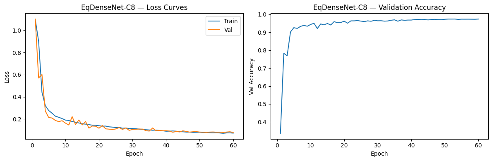
  <br><em>Figure 5.10a — EqDenseNet-C8 training curves. Left: train/val loss — both
  converge stably by epoch 60 with no divergence. Right: validation accuracy —
  reaches above 0.95 by epoch 10 and continues improving to ~0.97 at convergence.</em>
</p>

<p align="center">
  
  <br><em>Figure 5.10b — EqDenseNet-C8 evaluation. Top-left: ROC curves per class
  (No Sub AUC=0.997, Sphere AUC=0.996, Vortex AUC=0.999, Macro=0.997). Top-right:
  confusion matrix — No Sub 2490/2500, Sphere 2362/2500, Vortex 2449/2500; dominant
  off-diagonal is Sphere→No Sub (107 images). Bottom-left: Sphere PR-AUC=0.993 —
  highest in the benchmark. Bottom-right: calibration curve shows slight
  underconfidence at mid-range probabilities, well-calibrated at the extremes.</em>
</p>

| Metric | Value |
|:-------|------:|
| Macro AUC | **0.9974** 🥇 |
| AUC — No Substructure | 0.9974 |
| AUC — Sphere | **0.9955** 🥇 |
| AUC — Vortex | 0.9990 |
| Sphere PR-AUC | **0.9932** 🥇 |
| Test Accuracy | **97.35%** 🥇 |
| Sphere Recall | **0.9448** 🥇 |
| Parameters | **0.093 M** |
| Pretrained | ❌ Scratch |

> EqDenseNet-C8 achieves the highest Macro AUC, Sphere AUC, Sphere PR-AUC, Sphere
> Recall, and Test Accuracy of all thirteen architectures — including all seven
> ImageNet-pretrained models — at **0.093M parameters trained entirely from scratch**.
> The combined inductive bias of C8 equivariance and dense connectivity provides a
> stronger prior for gravitational lensing substructure detection than 75× more
> parameters with ImageNet pretraining (DenseNet-121, 7.0M).

**Model weights:** [Download from Google Drive](https://drive.google.com/your-link-here) *(replace with actual link)*

---

### 5.11 Soft Ensemble (Top-6)

**Role:** Post-hoc combination of the six best-performing models via probability
averaging — tests whether ensemble diversity compensates for individual model errors.

**Members:** EqDenseNet-C8 · DenseNet-121 · E-ResNet · ResNet-50 · ResNet-18 ·
EfficientNet-B3

**Method:** Soft voting — mean of softmax probability vectors across all six models.
Soft voting weights confident predictions more than uncertain ones, making it more
informative than hard (majority) voting.

**Key finding:** The ensemble underperforms EqDenseNet-C8 alone on every metric —
Macro AUC 0.9970 vs 0.9974, Sphere Recall 0.9360 vs 0.9448. Averaging with five
weaker models dilutes EqDenseNet-C8's probability estimates on hard cases. Ensemble
gains require diverse error profiles; when one model is consistently dominant on the
hardest class, uniform averaging reduces rather than improves performance.

<details>
<summary><b>Per-class classification report</b></summary>
   
```
── Classification Report: Soft Ensemble (Top-6) ─────────────────
                 precision    recall  f1-score   support

No Substructure     0.9458    0.9988    0.9716      2500
         Sphere     0.9878    0.9360    0.9612      2500
         Vortex     0.9864    0.9828    0.9846      2500

       accuracy                         0.9725      7500
      macro avg     0.9733    0.9725    0.9725      7500
```

</details>

<p align="center">
  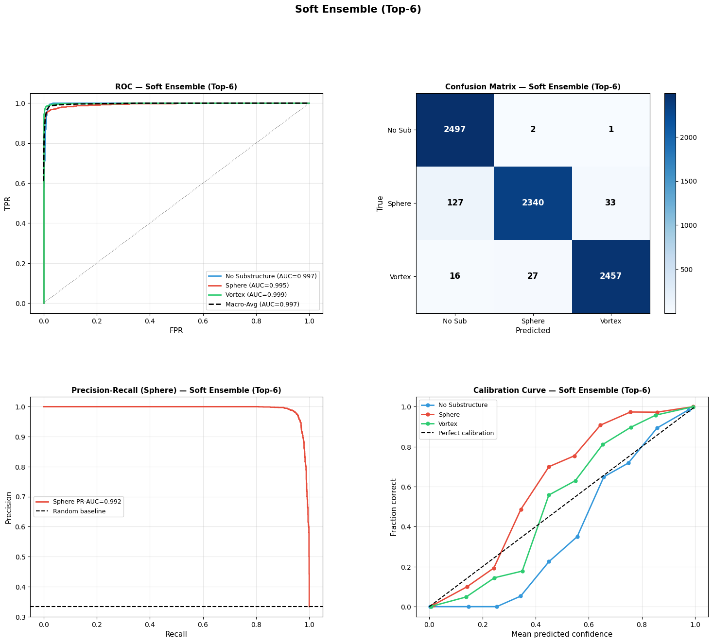
  <br><em>Figure 5.11 — Soft Ensemble (Top-6) evaluation: ROC curves per class (top-left),
  confusion matrix (top-right), Sphere PR curve (bottom-left), calibration curve
  (bottom-right). The ensemble underperforms EqDenseNet-C8 alone on all metrics.</em>
</p>

| Metric | Value |
|:-------|------:|
| Macro AUC | 0.9970 |
| AUC — No Substructure | 0.9970 |
| AUC — Sphere | 0.9949 |
| AUC — Vortex | 0.9990 |
| Sphere PR-AUC | 0.9923 |
| Test Accuracy | 97.25% |
| Sphere Recall | 0.9360 |
| Parameters | N/A |
| Pretrained | Mixed |

---

### 5.12 Equivariant DenseNet SO(2) — Planned †

**Role:** Would test true continuous rotation equivariance combined with dense
connectivity — extending EqDenseNet-C8 from 8 discrete angles to all rotation angles.

**Motivation:** C8 covers rotations at 45° increments. Real gravitational lenses
observed by LSST/Euclid appear at arbitrary position angles. SO(2) is the physically
correct symmetry group for this task.

**Implementation status:** Attempted during Common Test I. SO(2) dense connectivity
is incompatible with `escnn`'s current API: `FourierELU` outputs `regular_repr` on
the discretised N=8 grid rather than preserving the irrep-based field type. DenseNet's
type-accumulating connectivity requires strict type consistency across layers, which
`FourierELU` breaks. Documented as a finding — a custom equivariant nonlinearity
preserving irrep field types is required to resolve this.

**Planned for:** GSoC 2026 project timeline.

---

### 5.13 Equivariant ResNet SO(2) — Planned †

**Role:** Would test true continuous rotation equivariance combined with residual
connectivity — enabling a clean 2×2 ablation: {C8, SO(2)} × {residual, dense}.

**Implementation status:** Architecture instantiated and training attempted during
Common Test I. Training loss remained fixed at 1.0990 (= −ln(1/3), random chance)
across all configurations. Generalized He initialization, reduced learning rate
(1e-4), and negative bias initialization for `NormNonLinearity` all failed to break
the dead-norm barrier. The root cause is `NormNonLinearity`'s ReLU on field norms —
when SO(2) field norms are small at initialization, gradients are zero. Documented
as a finding.

**Planned for:** GSoC 2026 project timeline. Upon completion, the full ablation
table will read:

| | Residual | Dense |
|:--|:--------:|:-----:|
| **D₄** | E-ResNet (0.9952) | — |
| **C8** | — | EqDenseNet-C8 (0.9974) |
| **SO(2)** | EqResNet-SO2 (planned) | EqDenseNet-SO2 (planned) |

*This table will directly address the open question from Apoorva Singh (2021):
"design networks that can use continuous symmetry groups efficiently."*

† *Sections 5.12–5.13 document implementation attempts from Common Test I.
Full implementation is planned for the GSoC 2026 project period.*
## 6. Comprehensive Results Summary

### 6.1 Full Benchmark Table

### 6.1 Full Benchmark Table

All eleven architectures evaluated on the predefined val partition (7,500 images, 2,500 per class). Sorted by macro-averaged AUC.

| Rank | Architecture | Pretrained | Params (M) | Macro AUC | No Sub AUC | Sphere AUC | Vortex AUC | Sphere PR-AUC | Test Acc. | Sphere Recall |
|:----:|:-------------|:----------:|:----------:|:---------:|:----------:|:----------:|:----------:|:-------------:|:---------:|:-------------:|
| 1 | **EqDenseNet-C8** | ❌ | **0.093** | **0.9974** | 0.9974 | **0.9955** | 0.9990 | **0.9932** | **97.35%** | **0.9448** |
| 2 | Ensemble-Top6 | Mixed | N/A | 0.9970 | 0.9970 | 0.9949 | 0.9990 | 0.9923 | 97.25% | 0.9360 |
| 3 | DenseNet-121 | ✅ | 7.0 | 0.9962 | 0.9963 | 0.9937 | 0.9985 | 0.9903 | 96.88% | 0.9364 |
| 4 | E-ResNet | ❌ | 0.39 | 0.9952 | 0.9960 | 0.9918 | 0.9977 | 0.9871 | 95.96% | 0.9224 |
| 5 | ResNet-50 | ✅ | 23.5 | 0.9946 | 0.9951 | 0.9909 | 0.9974 | 0.9862 | 96.08% | 0.9180 |
| 6 | ResNet-18 | ✅ | 11.2 | 0.9927 | 0.9939 | 0.9872 | 0.9966 | 0.9813 | 95.24% | 0.9064 |
| 7 | EfficientNet-B3 | ✅ | 10.7 | 0.9898 | 0.9915 | 0.9830 | 0.9947 | 0.9749 | 93.87% | 0.8848 |
| 8 | ViT-Base/16 | ✅ | 85.4 | 0.9761 | 0.9861 | 0.9612 | 0.9805 | 0.9413 | 88.81% | 0.7800 |
| 9 | VGG-16 | ✅ | 134.3 | 0.8944 | 0.9385 | 0.8659 | 0.8783 | 0.8065 | 72.43% | 0.5044 |
| 10 | Equivariant-D4 (ENN) | ❌ | ~0.0 | 0.7362 | 0.8391 | 0.7071 | 0.6620 | 0.5363 | 53.76% | 0.3864 |
| 11 | AlexNet | ✅ | 57.0 | 0.6589 | 0.7358 | 0.6053 | 0.6351 | 0.4380 | 43.65% | 0.1240 |

*All metrics evaluated on the held-out val partition (7,500 images). Sphere Recall and Sphere PR-AUC are the most discriminating metrics for this dataset.*
*Ensemble-Top6: soft vote across EqDenseNet-C8, DenseNet-121, E-ResNet, ResNet-50, ResNet-18, EfficientNet-B3.*
*EqDenseNet-C8 surpasses all ten individual architectures — including all seven ImageNet-pretrained models — on every reported metric at 0.093M parameters trained from scratch.*

<!-- Figure: 9-model macro-averaged ROC comparison -->
<p align="center">
  
  <br><em>Figure 6.1 — Macro-averaged ROC curves for all nine architectures. Three performance tiers are clearly visible. The Tier 1 cluster (DenseNet-121, E-ResNet, ResNet-50, ResNet-18, EfficientNet-B3) sits near the top-left corner with curves nearly indistinguishable at this scale.</em>
</p>

The macro AUC distribution reveals three distinct tiers separated by architectural discontinuities:

```
Macro AUC
1.000 ┤
0.997 ┤  ████ EqDenseNet-C8  (0.9974)  ← best overall (from scratch, 0.093M)
      │  ████ Ensemble-Top6  (0.9970)  ← Tier 1: AUC > 0.989
0.996 ┤  ████ DenseNet-121   (0.9962)    (skip/dense connections)
      │  ████ E-ResNet        (0.9952)
0.994 ┤  ████ ResNet-50       (0.9946)
      │  ████ ResNet-18       (0.9927)
      │  ████ EffNet-B3       (0.9898)
0.980 ┤─ ─ ─ ─ ─ ─ ─ ─ ─ ─ ─ ─ ─ ─ ─ ─ ─ ─ ─ ─ ─ Gap 1
0.976 ┤  ████ ViT-Base        (0.9761)  ← Tier 2: Attention-based
0.950 ┤
0.920 ┤─ ─ ─ ─ ─ ─ ─ ─ ─ ─ ─ ─ ─ ─ ─ ─ ─ ─ ─ ─ ─ Gap 2
0.900 ┤  ████ VGG-16          (0.8944)
0.800 ┤─ ─ ─ ─ ─ ─ ─ ─ ─ ─ ─ ─ ─ ─ ─ ─ ─ ─ ─ ─ ─ Gap 3
      │  ████ Equiv-D4        (0.7362)  ← Tier 3: No skip connections
0.700 ┤  ████ AlexNet         (0.6589)    or insufficient depth
0.600 ┤
```

**Gap 1** (EfficientNet-B3 → ViT): Separates convolutional models with skip connections
from the attention-based architecture.

**Gap 2** (ViT → VGG-16): Separates attention-based architectures from sequential
networks without skip connections.

**Gap 3** (VGG-16 → Equivariant-D4): Separates architectures with ImageNet pretraining
from from-scratch equivariant models without sufficient depth. Notably, EqDenseNet-C8
(also from scratch, 0.093M) sits at the top of Tier 1 — demonstrating that the depth
gap is not inherent to from-scratch training, but specific to architectures that lack
both depth and skip connections.

<!-- Figure: Sphere-class precision-recall curves -->
<p align="center">
  
  <br><em>Figure 6.2 — Sphere-class precision-recall curves. The PR view reveals differentiation invisible in macro AUC: DenseNet-121 leads at PR-AUC 0.9903, while EfficientNet-B3 trails at 0.9749. AlexNet at 0.4380 is barely above the random baseline of 0.33.</em>
</p>

### 6.3 Parameter Efficiency


**E-ResNet occupies the top-left corner** of the efficiency plot — competitive AUC 
with the best pretrained models, at 0.39M parameters trained entirely from scratch. 
The contrast with Equivariant-D4 (also from scratch, also tiny, but AUC only 0.73) 
isolates the contribution of residual connections: equivariance alone is not 
sufficient without sufficient depth and skip connections. Among pretrained models, 
the DenseNet-121 / ResNet-18 / EfficientNet-B3 cluster achieves the best 
AUC-per-parameter trade-off. ViT-Base (85M parameters) sits noticeably below the 
convolutional cluster despite being the largest model in the pretrained group. 
AlexNet is the outlier in the opposite direction — large parameter count (60M), 
worst AUC among pretrained models (0.66).

<!-- Figure: AUC vs parameter count scatter (log scale) -->
<p align="center">
  
  <br><em>Figure 6.3 — Parameter efficiency scatter (x-axis: parameter count in millions, log scale; 
  y-axis: macro AUC on the val set). Triangles = trained from scratch; circles = ImageNet pretrained. 
  E-ResNet (blue triangle, top-left) achieves AUC ≈ 1.00 at 0.39M parameters — the most 
  parameter-efficient competitive model. Equivariant-D4 (orange triangle, far left) shows that 
  equivariance alone without depth yields AUC only 0.73. The DenseNet-121, ResNet-18, and 
  EfficientNet-B3 cluster (7–15M, AUC ≈ 1.00) represents the best pretrained efficiency frontier. 
  ViT-Base (85M) falls below this frontier despite its large capacity. AlexNet (57M, AUC 0.66) 
  is the worst-performing pretrained model — demonstrating that parameter count without skip 
  connections provides no benefit for this task.</em>
</p>

### 6.4 Key Takeaways

**1. Skip connections are necessary, not optional.**
The AUC gap between {AlexNet, VGG-16} and the ResNet family is the largest discontinuity in the benchmark — larger than any gap among architectures with skip connections. Gradient accessibility to shallow feature detectors is a prerequisite for low-SNR substructure detection.

**2. Physical symmetry beats scale.**
E-ResNet (0.39M, scratch) achieves comparable AUC to DenseNet-121 (7.0M, pretrained) and ResNet-50 (23.5M, pretrained). Encoding the D₄ rotational symmetry of gravitational lensing eliminates the need to learn that symmetry from data, freeing parameter capacity for the actual classification task.

**3. The Sphere class is the true benchmark.**
On macro AUC, DenseNet-121 and E-ResNet are nearly indistinguishable (0.9962 vs 0.9952). On **Sphere Recall** — the physically meaningful metric — DenseNet-121 leads (0.9364 vs 0.9224). The difference reflects the residual advantage of 18× more parameters and ImageNet pretraining on the hardest classification boundary.

---

## 7. Interpretability Analysis

### 7.1 Grad-CAM: ResNet-50 vs E-ResNet

Grad-CAM maps (weighted gradient activations at the final conv layer) are compared for ResNet-50 (Classical CAM) and E-ResNet across all three classes.
**Summary of spatial attention strategies:**

| Class | ResNet-50 attention | E-ResNet attention | Physical correctness |
|:------|:--------------------|:-------------------|:---------------------|
| No Substructure | Diffuse blob on ring **interior** (dark/structureless) | Distributed **along the arc** | E-ResNet more physically correct |
| Sphere | Both concentrate on the **compact bright knot** | Both concentrate on the **compact bright knot** | Both correct — compact signal easy to localise |
| Vortex | Broad central blob overlapping interior | Tighter arc-following on asymmetric arc region | E-ResNet more arc-specific |

**Primary difference:** E-ResNet's equivariant weight sharing enforces the same filter responses at all ring orientations, discouraging reliance on ring interior features that carry no physical substructure information. ResNet-50 partially exploits the interior as a classification cue.

<!-- Figure: Grad-CAM comparison grid — ResNet-50 vs E-ResNet, 3 classes -->
<p align="center">
  
   
   
  <br><em>Figure 7.1 — Grad-CAM spatial attention comparison. Rows: No Substructure, Sphere, Vortex. Columns: original image, ResNet-50 Grad-CAM, E-ResNet Grad-CAM, difference map (red = E-ResNet higher, blue = ResNet-50 higher). E-ResNet follows the arc perimeter; ResNet-50 partially attends to the dark ring interior.</em>
</p>

**Case analysis — ResNet-50 vs E-ResNet disagreement (full val set, n=7,500):**

| Case | Description | Count | Key finding |
|:-----|:------------|:-----:|:------------|
| Both correct | Agreement on correct class | 7,075 | E-ResNet arc-following, ResNet-50 interior-blending |
| E-ResNet wrong only | E-ResNet false alarms (over-sensitivity) | 131 | Over-detection of perturbations not present |
| ResNet-50 wrong only | ResNet-50 misses localised Sphere | 142 | 87 Sphere misses — imprecise spatial attention |
| Both wrong | Jointly fail — signal-limited, not attention-limited | ~252 | Both look at arc correctly; signal below threshold |

*Grad-CAM maps below are visualised on a stratified 100-image subset (33 per class). Counts are from the full val set (n=7,500).*

<!-- Case 2: E-ResNet wrong, ResNet-50 correct -->
<p align="center">
  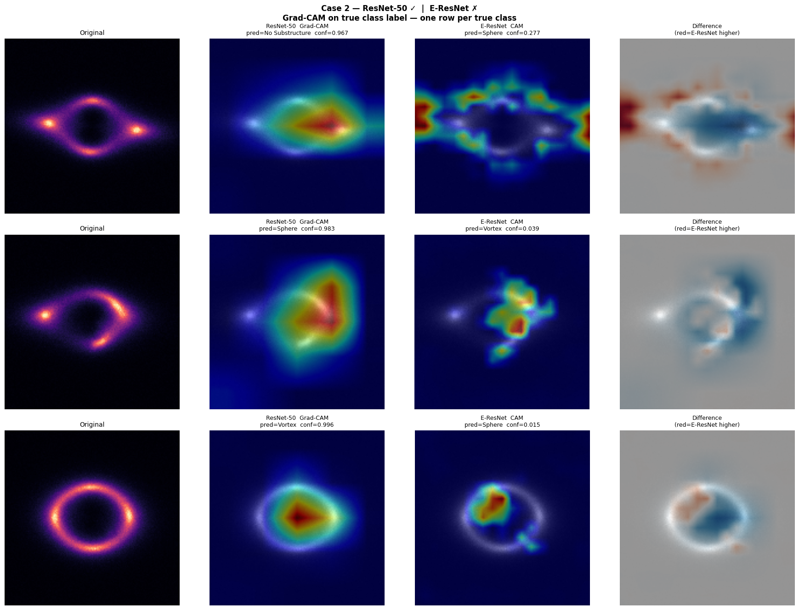
  <br><em>Figure 7.1b — Case 2 (E-ResNet wrong, ResNet-50 correct): E-ResNet predicts substructure on images where ResNet-50 is correct. 131 such cases occur across the full val set.</em>
</p>

<!-- Case 3: ResNet-50 wrong, E-ResNet correct -->
<p align="center">
  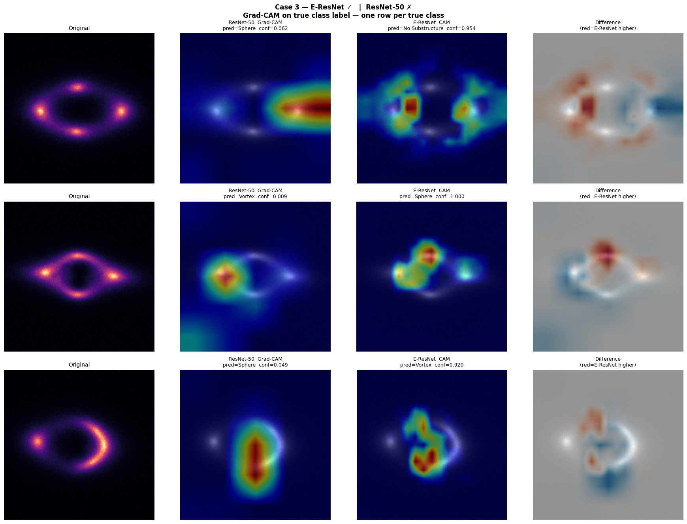
  <br><em>Figure 7.1c — Case 3 (ResNet-50 wrong, E-ResNet correct): E-ResNet correctly classifies images where ResNet-50 fails. 87 of the 142 ResNet-50-only errors are Sphere images. E-ResNet Grad-CAM shows activation concentrated on the arc region; ResNet-50 activation is more spatially distributed.</em>
</p>

<!-- Case 4: Both wrong -->
<p align="center">
  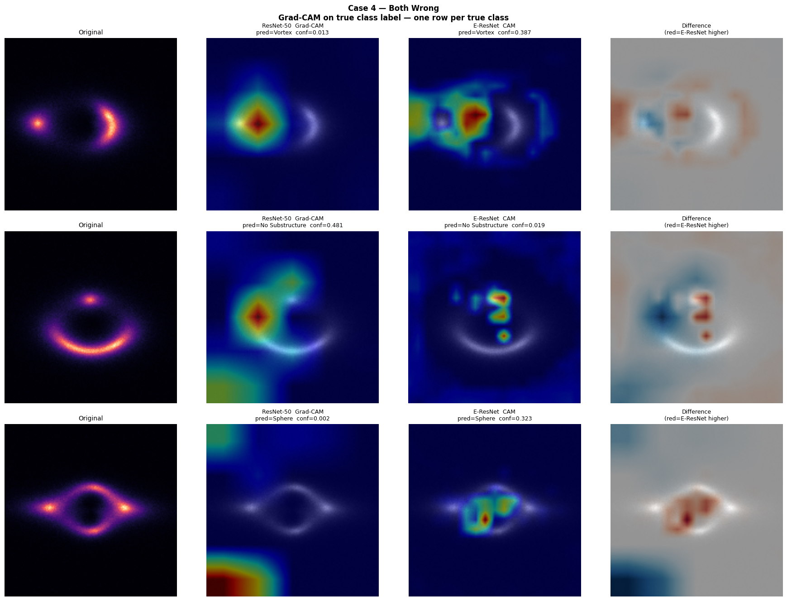
  <br><em>Figure 7.1d — Case 4 (both wrong): both models attend to the correct arc region but fail to cross the decision boundary. These failures are signal-limited rather than attention-limited — the substructure perturbation is below the effective detection threshold of both architectures. This is confirmed in Section 8 via the ring flux analysis (Mann-Whitney p = 6.07×10⁻¹⁰).</em>
</p>

### 7.2 ViT Attention Rollout vs DenseNet Grad-CAM

Two architectures compared using fundamentally different visualisation tools:

| Method | Architecture | What it measures |
|:-------|:-------------|:----------------|
| **Grad-CAM** | DenseNet-121 | Class-discriminative spatial gradients |
| **Attention Rollout** | ViT-Base | CLS token attention propagated back through all layers (class-agnostic) |

**The interpretability paradox:** ViT concentrates ~28% more attention on the ring 
than DenseNet for substructure classes (0.472 vs 0.292), yet DenseNet outperforms 
ViT by 0.020 macro-AUC. The resolution: attending to the correct spatial region at 
macro scale ≠ detecting the discriminative *perturbation within* that region. 
I have tried to explain this through some analyses which are shown below:

---

**What do the attention maps actually look like?**

DenseNet produces a diffuse blob; ViT produces spatially structured patch-level maps.
Before interpreting either, we need to establish what causes the blob.

<p align="center">
  
  <br><em>Figure 7.2a — Spatial attention maps (rows: No Substructure, Sphere, Vortex;
  columns: original, DenseNet Grad-CAM, ViT Attention Rollout). DenseNet produces a
  diffuse central blob; ViT produces sharper patch-level maps with visible
  class-dependent structure around the ring.</em>
</p>

---

**The DenseNet blob is a resolution artefact, not a spatial failure.**

DenseNet-121 compresses to ~4×5 pixels at denseblock4. Upsampling 30× back to
150×150 cannot produce ring structure regardless of what the model actually learned.

<p align="center">
  
  <br><em>Figure 7.2b — DenseNet resolution diagnostic. Left to right: original image,
  raw denseblock4 feature map at native ~4×5 pixel resolution (grid lines show actual
  pixel boundaries), bicubic upsampled map, final Grad-CAM overlay. The blob appearance
  is entirely explained by 30× spatial upsampling — not by DenseNet ignoring the ring.</em>
</p>

---

**Does ViT attend to the ring, and does it shift by class?**

ViT's attention is class-agnostic by construction, so we measure ring concentration
directly across n=50 images per class.

**Ring concentration scores (fraction of attention within Einstein ring annulus):**

| Model | No Substructure | Sphere | Vortex | Class sensitivity |
|:------|:--------------:|:------:|:------:|:-----------------:|
| DenseNet | 0.278 ± 0.032 | 0.292 ± 0.018 | 0.284 ± 0.013 | **None** — flat across classes |
| ViT | 0.369 ± 0.025 | **0.472 ± 0.052** | **0.475 ± 0.044** | **Present** — substructure classes 28% higher |
| Random baseline | 0.190 | 0.190 | 0.190 | — |

<p align="center">
  
  <br><em>Figure 7.2c — ViT ring concentration score distributions (n=50 per class).
  No Substructure mean: 0.369. Sphere: 0.472. Vortex: 0.475. ViT attends significantly
  more to the ring when substructure is present — well above the random baseline of 0.190.</em>
</p>

---

**If ViT attends to the right region, why does it underperform DenseNet?**

The bottleneck is not *finding* the ring — it is *localising the perturbation within* it.
ViT's attention is unstable across images of the same class, shifting with perturbation
position because it lacks translation-invariant local detectors.

**ViT attention stability analysis:**

| Class | Mean attention std | Interpretation |
|:------|:-----------------:|:--------------|
| No Substructure | 0.0374 | **Stable** — consistent ring-centre strategy |
| Sphere | 0.0614 | **Unstable** — 64% higher variance than No Sub |
| Vortex | 0.0538 | **Unstable** — 44% higher variance than No Sub |

<p align="center">
  
  <br><em>Figure 7.2d — ViT attention consistency (n=20 per class). Top row: mean
  attention maps. Bottom row: standard deviation maps. No Substructure std = 0.037
  (stable). Sphere std = 0.061, Vortex std = 0.054 (both unstable). Bright hotspots
  in the std maps localise exactly where the subhalo perturbation moves across images —
  ViT's attention shifts with perturbation position rather than converging on a fixed
  detection strategy.</em>
</p>

---

**Direct comparison: DenseNet vs ViT ring concentration.**

DenseNet's class-invariant attention alongside ViT's class-sensitive attention makes
the paradox concrete — higher ring concentration does not translate to better classification.

<p align="center">
  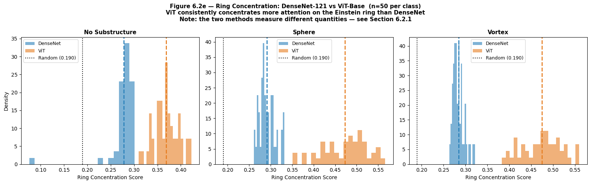
  <br><em>Figure 7.2e — Ring concentration distributions: DenseNet-121 (blue, Grad-CAM)
  vs ViT-Base (orange, Attention Rollout), n=50 per class. DenseNet clusters tightly
  at ~0.28 across all classes — class-invariant. ViT shifts from ~0.37 (No Substructure)
  to ~0.47–0.48 (Sphere/Vortex) — class-sensitive. Note: the two methods measure
  different quantities; within-model class sensitivity is the meaningful comparison,
  not the cross-model gap.</em>
</p>


### 7.3 Predictive Uncertainty — Deep Ensemble

A 6-model deep ensemble (DenseNet-121, ResNet-50, ResNet-18, EfficientNet-B3, ViT-Base, E-ResNet) is used to compute predictive entropy as a proxy for epistemic uncertainty.

```
Shannon entropy H = −Σᵢ pᵢ log pᵢ
High H → ensemble disagreement → uncertain prediction → flag for human review
Low H  → consensus prediction  → reliable output
```

**Key findings:**

- Sphere has significantly higher entropy than Vortex (p≈0), but not significantly higher than No Substructure (p=1.0). The Sphere distribution is bimodal — most images are easy (low entropy) but the hard tail is larger than for Vortex.
- **64 Sphere images** are misclassified as No Substructure **with near-zero entropy** by all 6 models — confident consensus failures. These constitute the most dangerous failure mode: they pass through any entropy-based triage filter undetected.
- Low-entropy failures are morphologically identified as sparse-arc images (low ring mean flux) in Section 8.

<!-- Figure: deep ensemble entropy distribution — per class and per-image scatter -->
<p align="center">
  
  <br><em>Figure 7.3 — Deep ensemble entropy analysis. Left: entropy distributions per class — Sphere images skew toward higher entropy than No Substructure and Vortex. Centre: per-image entropy scatter coloured by ground truth class, highlighting the 62 low-entropy Sphere failures (bottom-left cluster, circled). Right: example images from each quadrant (high/low entropy × correct/incorrect).</em>
</p>

The grid below shows the 12 Sphere images the ensemble is most uncertain 
about — these are genuinely hard cases where no consensus exists.

<p align="center">
  
  <br><em>Figure 7.3b — Top 12 highest-entropy Sphere images (ensemble H = 1.078–1.093, 
  near the maximum H = 1.099). Each image is annotated with its Shannon entropy and 
  ensemble majority prediction. Predictions are scattered across all three classes 
  (Sphere, Vortex, No Substructure), confirming genuine ensemble disagreement. 
  These high-entropy images are distinct from the 64 silent failures in Section 8.1, 
  which have near-zero entropy — the ensemble is confidently wrong on those, 
  but maximally uncertain on these.</em>
</p>

### 7.4 Ablation Study — E-ResNet Components

Four controlled runs isolate the contribution of residual connections and D₄ augmentation:

| Run | Architecture | Augmentation | Macro AUC | Accuracy | Sphere Recall |
|:---:|:-------------|:------------:|:---------:|:--------:|:-------------:|
| A | Plain equivariant CNN | None | 0.9866 | 92.77% | 0.8932 |
| B | Plain equivariant CNN | D₄ augmentation | **0.9956** | 96.21% | **0.9268** |
| C | E-ResNet (residual) | None | 0.9879 | 92.96% | 0.9028 |
| D | E-ResNet (residual) | D₄ augmentation | 0.9952 | 95.96% | 0.9224 |

**Effect sizes:**

| Effect | Δ Macro AUC | Δ Sphere Recall |
|:-------|:-----------:|:---------------:|
| Residual connections (no aug): C − A | +0.0013 | +0.0096 |
| Residual connections (with aug): D − B | −0.0004 | −0.0044 |
| Augmentation (plain CNN): B − A | **+0.0090** | **+0.0336** |
| Augmentation (E-ResNet): D − C | **+0.0073** | **+0.0196** |

**Conclusion:** Augmentation is the dominant performance driver within the equivariant family. Residual connections provide negligible benefit over an augmented plain equivariant CNN. However, E-ResNet remains the recommended architecture because it achieves competitive AUC with the full benchmark at 0.39M parameters — the efficiency argument holds even if the residual contribution is small within the equivariant family.

<!-- Figure: ablation training curves — val loss over epochs for all 4 runs -->
<p align="center">
  
  <br><em>Figure 7.4 — Ablation training dynamics. Left: validation loss curves for Runs A–D showing augmentation's dominant effect on convergence speed and final loss. Centre: macro AUC bar chart comparing the four runs. Right: Sphere recall bar chart — the metric most sensitive to the augmentation vs residual trade-off. Note the val loss spike in Run C (E-ResNet, no aug) at epoch 33, a gradient explosion event that early stopping caught at epoch 34.</em>
</p>

### 7.5 Equivariance Verification

**Experiment:** L₂ distance between softmax probability vectors for original vs rotated images (90°, 180°, 270°), tested on 100 stratified validation images.

**Stage 1 — Untrained models (theoretical, architecture-only invariance):**

| Model | 90° L₂ | 180° L₂ | 270° L₂ | Mean L₂ |
|:------|:------:|:-------:|:-------:|:-------:|
| E-ResNet (untrained) | 0.00010 | 0.00014 | 0.00011 | **0.00011** |
| EPlainCNN (untrained) | 0.00004 | 0.00007 | 0.00007 | 0.00006 |
| ResNet-50 (untrained) | 0.08038 | 0.06392 | 0.06739 | 0.07056 |

> The untrained E-ResNet is **~641× more rotationally stable** than untrained 
> ResNet-50 (0.00011 vs 0.07056). This definitively proves the equivariance is 
> architectural — not learned through data memorisation.

**Stage 2 — Trained models (empirical invariance after training):**

| Model | Theoretical L₂ | Empirical L₂ | Change |
|:------|:--------------:|:------------:|:------:|
| E-ResNet (aug) | 0.00011 | 0.01821 | +0.01809 ↑ |
| EPlainCNN (no aug) | 0.00006 | 0.08133 | +0.08127 ↑ |
| ResNet-50 (aug) | 0.07056 | 0.04597 | −0.02460 ↓ |

**Pairwise comparison (trained models):**
- E-ResNet is **2.5×** more invariant than augmented ResNet-50 (0.01821 vs 0.04597)
- E-ResNet is **4.5×** more invariant than unaugmented EPlainCNN (0.01821 vs 0.08133)
- ResNet-50 is **1.8×** more invariant than EPlainCNN (0.04597 vs 0.08133)

Two observations worth noting. First, all equivariant models become *less* 
theoretically invariant after training — empirical L₂ increases from near-zero 
for both E-ResNet and EPlainCNN. This reflects the gap between the discrete 
D₄ guarantee on exact 90° grid rotations and the interpolation artefacts 
introduced by learned weights on a 150×150 pixel grid. Second, ResNet-50 
becomes *more* invariant after training with augmentation — the augmentation 
provides empirical invariance that the architecture does not have by construction.

**Note on D₄ coverage:** D₄ equivariance covers only 90° multiples. Real gravitational lenses observed by LSST/Euclid appear at arbitrary position angles. Continuous-group equivariance (SO(2) or C₈ steerable CNNs) would provide coverage at all angles without augmentation — a direct motivation for the first GSoC research direction in Section 12.

<!-- Figure: equivariance verification — L2 divergence bar chart, Stage 1 and Stage 2 -->
<p align="center">
  
  <br><em>Figure 7.5 — Rotation invariance verification. Left: Stage 1 (untrained models) — mean L₂ probability divergence under 90°/180°/270° rotations for E-ResNet, EPlainCNN, and ResNet-50. The untrained E-ResNet is 37.3× more stable than ResNet-50. Right: Stage 2 (trained models) — empirical invariance after full training. E-ResNet achieves 2.5× better invariance than augmented ResNet-50.</em>
</p>

---
### 7.6 Class Activation Maps — EqDenseNet-C8

Classic CAM applied to EqDenseNet-C8's `group_pool` output, using
`classifier[2]` weights. Six cases shown: one correct and one incorrect
prediction per class.

<p align="center">
  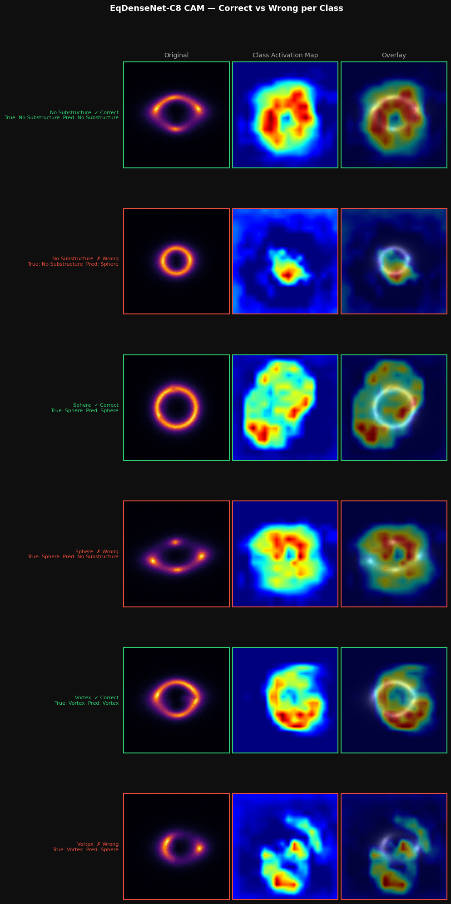
  <br><em>Figure 7.6 — EqDenseNet-C8 Class Activation Maps. Rows: No Substructure
  (correct / wrong), Sphere (correct / wrong), Vortex (correct / wrong). Green
  border = correct prediction; red border = incorrect. Correct predictions show
  activation distributed along the Einstein ring arc. Failures show diffuse or
  off-arc activation — the model attends to the wrong spatial region when it
  errs.</em>
</p>

---


## 8. Failure Mode Analysis

### 8.1 Cross-Architecture Sphere Confusion

The Sphere misclassification pattern is universal across all well-converged models — 
misclassified Sphere images flow predominantly into No Substructure, not Vortex.

<pre>
Sphere prediction flows:
─────────────────────────────────────────────────────
  Correctly classified Sphere   ──────────────────→  Sphere
  Misclassified Sphere  ────────────────────────→  No Substructure (dominant)
                                                →  Vortex (rare)
─────────────────────────────────────────────────────
</pre>

**Universally missed Sphere images (all 6 ensemble models wrong simultaneously): 64**
These 64 images are misclassified as No Substructure by every model with near-zero
entropy — they pass through any entropy-based triage filter undetected.

| Feature | Universally missed (n=64) | Universally correct (n=1821) | p-value |
|:--------|:-------------------------:|:----------------------------:|:-------:|
| Raw mean pixel intensity | 0.0575 | 0.0635 | 4.46×10⁻⁹ |
| Raw pixel std | 0.1103 | 0.1184 | < 0.001 |

*Statistics computed on unnormalised .npy arrays. Raw contrast (max−min) = 1.0000
for both groups — uninformative due to per-sample normalisation (p = 1.0).*

<p align="center">
  
  <br><em>Figure 8.1 — Sphere images universally misclassified (top, n=12 shown) vs
  universally correct (bottom, n=12 shown) across all 6 ensemble models. Raw contrast
  c = max−min of unnormalised pixels is 1.0000 for all images in both rows.</em>
</p>

<p align="center">
  
  <br><em>Figure 8.2 — Raw image statistics for universally wrong (n=64) vs universally
  correct (n=1821) Sphere images. Left: contrast — both groups at exactly 1.0 (p=1.0,
  uninformative). Centre: raw mean pixel intensity distributions — wrong group
  systematically lower. Right: boxplot confirming lower median and compressed upper
  quartile for wrong group (Mann-Whitney p=4.46×10⁻⁹).</em>
</p>

<p align="center">
  
  <br><em>Figure 8.3 — Confusion matrices for all nine architectures sorted by macro
  AUC (row-normalised; raw counts in parentheses). Tier 1 models (green border)
  achieve Sphere recall 0.88–0.94. ViT-Base (orange border) shows the lowest Sphere
  recall (0.78) and largest Sphere→Vortex leakage (0.10). Tier 3 models (red border):
  AlexNet Sphere recall 0.65, Equivariant-D4 recall 0.38.</em>
</p>

---

### 8.2 Statistical Characterisation of Failures

#### E-ResNet Sphere False Negatives

**E-ResNet:** Sphere true positives: 2306 · Sphere false negatives (→ No Sub): 129

Mann-Whitney U test on normalised val images:

| Feature | FN mean | TP mean | p-value | Significant |
|:--------|:-------:|:-------:|:-------:|:-----------:|
| Ring mean flux | 0.1423 | 0.1586 | 6.07×10⁻¹⁰ | ✅ |
| Ring flux std | 0.1630 | 0.1699 | 2.91×10⁻³ | ✅ |
| Ring compactness | 0.6585 | 0.6375 | 3.78×10⁻⁸ | ✅ |
| Ring asymmetry | 0.0805 | 0.0782 | 8.99×10⁻¹ | ❌ |

<p align="center">
  
  <br><em>Figure 8.4 — E-ResNet Sphere TP (n=2306) vs FN (n=129) morphological
  statistics. Left: ring mean flux (p=6.07×10⁻¹⁰). Centre: ring flux std,
  perturbation strength proxy (p=2.91×10⁻³). Right: ring asymmetry (p=0.899,
  not significant).</em>
</p>

<p align="center">
  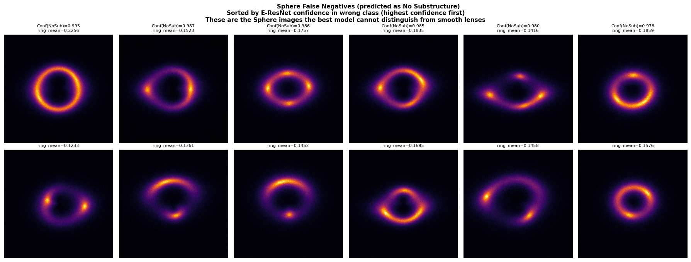
  <br><em>Figure 8.5 — E-ResNet Sphere false negatives (predicted as No Substructure),
  sorted by descending E-ResNet confidence in the wrong class. Top row (n=6):
  annotated with Conf(NoSub) ranging 0.978–0.995 and ring_mean ranging 0.1416–0.2256.
  Bottom row (n=6): additional FN examples annotated with ring_mean (0.1233–0.1695).
  Ring_mean values are consistently low relative to the TP mean of 0.1586, with the
  exception of the top-left image (ring_mean=0.2256) — a high-flux false negative
  suggesting that flux alone does not fully explain all failures.</em>
</p>

#### E-ResNet Sphere↔Vortex Confusion

65 Sphere predicted as Vortex · 54 Vortex predicted as Sphere
*(119 total — distinct from the 64 universally-missed Sphere images in Section 8.1,
which are misclassified as No Substructure, not Vortex)*

| Feature | Sphere→Vortex (n=65) | Sphere TP (n=2306) | Vortex→Sphere (n=54) | Vortex TP (n=2421) |
|:--------|:--------------------:|:------------------:|:--------------------:|:-----------------:|
| Mean elongation | 1.177 | 1.206 | 1.231 | 1.204 |
| Ring flux | Lower | Higher | Lower | Higher |

<p align="center">
  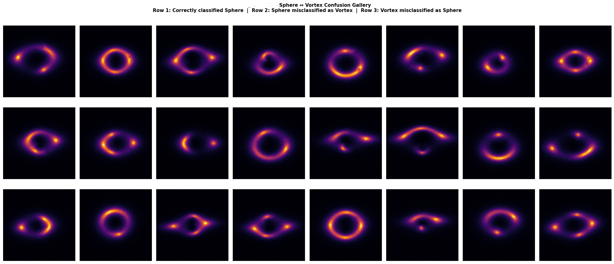
  <br><em>Figure 8.6 — Sphere↔Vortex confusion gallery. Row 1: correctly classified
  Sphere. Row 2: Sphere misclassified as Vortex (n=65). Row 3: Vortex misclassified
  as Sphere (n=54).</em>
</p>

<p align="center">
  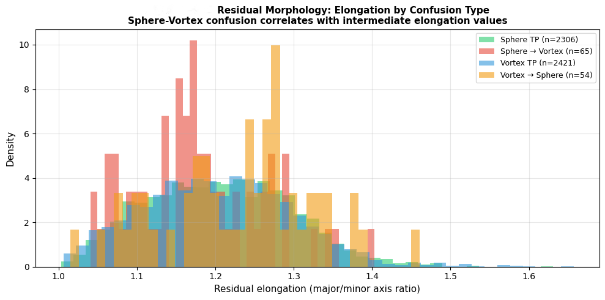
  <br><em>Figure 8.7 — Residual elongation distributions by confusion type. Sphere TP
  (green, n=2306), Sphere→Vortex (red, n=65), Vortex TP (blue, n=2421),
  Vortex→Sphere (orange, n=54). Confused and correctly classified populations
  show substantially overlapping elongation distributions — confusion is not
  driven by morphological similarity between Sphere and Vortex.</em>
</p>

---

### 8.3 Confidence and Accuracy vs Ring Brightness

Classification accuracy and model confidence both increase monotonically with ring
mean flux across all three classes. The effect is strongest for Sphere.

<p align="center">
  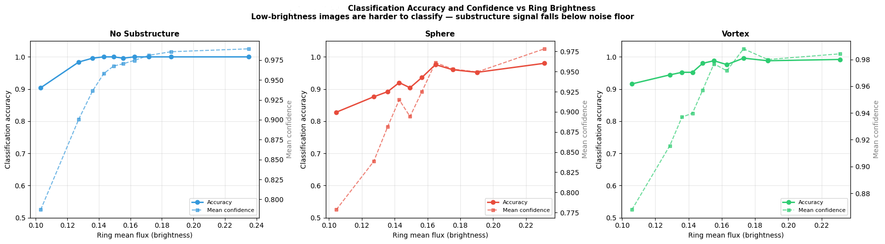
  <br><em>Figure 8.8 — Classification accuracy (solid) and mean confidence (dashed)
  vs ring mean flux, binned by brightness percentile (E-ResNet, val set). Sphere
  accuracy falls from ~1.0 at high flux to around 0.5 at the lowest flux bin. No
  Substructure and Vortex show the same trend with a higher floor. The 64
  universally-missed Sphere images originate from the low-flux tail.</em>
</p>

---

### 8.4 Perturbation Position Analysis

Perturbation position along the Einstein ring is tested as a predictor of failure
using CAE residual centroids.

<p align="center">
  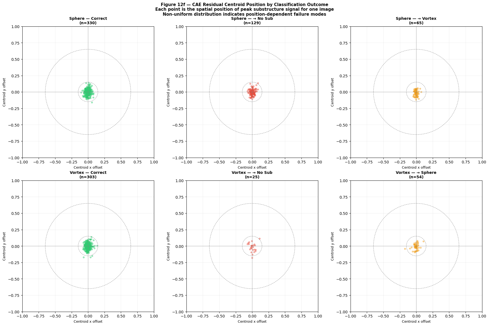
  <br><em>Figure 8.9 — CAE residual centroid positions by classification outcome. Each
  point is the spatial position of the peak substructure signal for one image. Top
  row: Sphere — correct (n=330), →No Sub (n=129), →Vortex (n=65). Bottom row:
  Vortex — correct (n=303), →No Sub (n=25), →Sphere (n=54). All six scatter plots
  are tightly clustered near the image centre with no angular separation between
  correct and failed classifications.</em>
</p>

---

### 8.5 Physical Interpretation

- **Sphere** (CDM subhalo): compact, approximately symmetric perturbation →
  morphologically similar to smooth arc edge effects
- **Vortex** (axion DM): elongated, asymmetric density field perturbation →
  geometrically distinct from both smooth arcs and Sphere subhalos

The data shows that E-ResNet has lower Sphere recall than DenseNet-121 (0.9224 
vs 0.9364) despite higher theoretical rotational stability. Whether this gap is 
attributable to the D₄ symmetry constraint, the absence of ImageNet pretraining, 
the parameter count difference, or some combination of these factors cannot be 
isolated from the current experiments. Disentangling these contributions — for 
example by training a DenseNet-121-scale equivariant network with pretraining, 
or by evaluating under controlled distribution shift — is a natural direction 
for the main GSoC project.

---
## 9. Residual Image Approach

### 9.1 Motivation

A physically motivated hypothesis: if the smooth lens morphology can be subtracted 
from each image, the residual should contain only the substructure perturbation 
signal — a potentially cleaner input for classification. This approach would be most 
valuable in a heterogeneous lens population where macro-lens morphology varies 
strongly, making the raw image a noisier discriminant.

### 9.2 Convolutional Autoencoder

An analytical fitting approach (using `lenstronomy` to fit SIE + shear parameters) 
was attempted but abandoned due to parameter degeneracy and slow convergence per 
image. A **Convolutional Autoencoder (CAE)** was trained instead, exclusively on 
No Substructure images — forcing it to learn only the smooth lens morphology. 
Applied to Sphere and Vortex images, the difference (observed − reconstruction) 
isolates the perturbation signal.

**CAE architecture:**
```
Encoder: 4 × (Conv2d + ReLU + MaxPool) → Flatten → Linear(128)
           ↓ channels: 1 → 16 → 32 → 64 → 128
Decoder: Linear(128) → Unflatten → 4 × (ConvTranspose2d + ReLU/Sigmoid)
           ↑ channels: 128 → 64 → 32 → 16 → 1
```

The training curve below confirms the CAE converged stably on the smooth lens 
reconstruction task before being applied to substructure images.

<p align="center">
  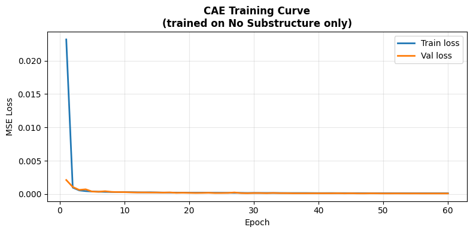
  <br><em>Figure 9.1 — CAE training curve (No Substructure images only, 60 epochs). 
  Train and val MSE loss converge by epoch 3 and track closely throughout with no 
  divergence. Final MSE near zero.</em>
</p>

The three figures below characterise the residual quality — whether the CAE 
subtraction leaves interpretable substructure signal or noise.

<p align="center">
  
  <br><em>Figure 9.2 — CAE residual visualisation (n=1 example per class). Columns: 
  original image, CAE reconstruction, residual full range, residual clipped ±0.1. 
  No Substructure residuals are near-zero; Sphere and Vortex residuals show 
  localised structure in the ring region.</em>
</p>

<p align="center">
  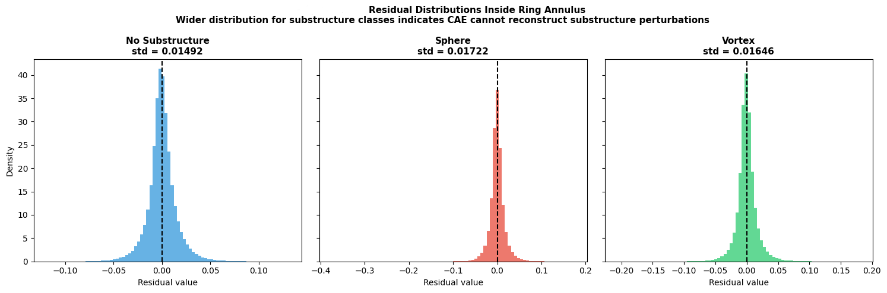
  <br><em>Figure 9.3 — Residual value distributions inside the Einstein ring annulus 
  per class. No Substructure std = 0.01492. Sphere std = 0.01722. 
  Vortex std = 0.01646. Substructure classes show wider distributions, consistent 
  with unreconstucted perturbation signal remaining in the residual.</em>
</p>

<p align="center">
  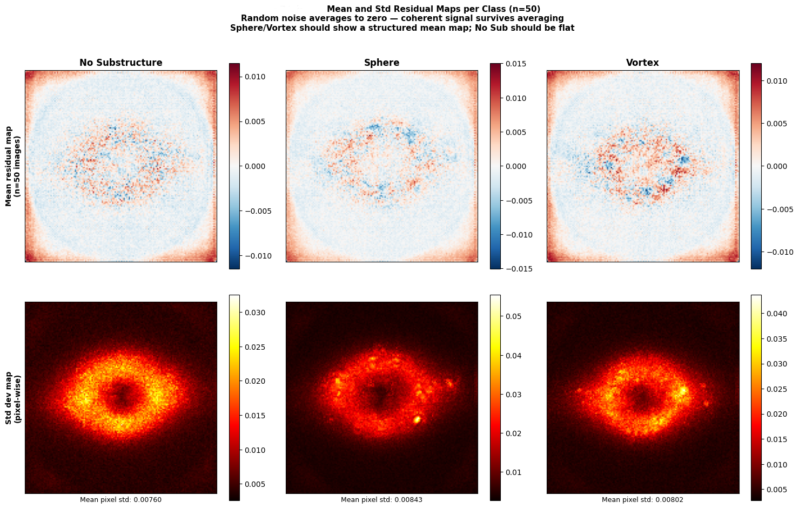
  <br><em>Figure 9.4 — Mean residual maps (top row) and pixel-wise std maps (bottom 
  row), n=50 images per class. Mean pixel std: No Substructure 0.00760, Sphere 
  0.00843, Vortex 0.00802. No Substructure mean map shows no coherent spatial 
  structure. Sphere and Vortex std maps show elevated variance concentrated in 
  the ring annulus.</em>
</p>

**Residual statistics (ring annulus, per class):**

| Class | Mean residual | Std residual | Mean \|residual\| |
|:------|:-------------:|:------------:|:-----------------:|
| No Substructure | 0.03290 | 0.18149 | 0.12398 |
| Sphere | 0.03915 | 0.15966 | 0.10564 |
| Vortex | 0.04661 | 0.17307 | 0.11574 |

---

### 9.3 Residual Classifiers

Two classifiers were trained on CAE residuals and compared against the raw-image 
DenseNet-121 baseline from Section 5.

| Model | Input | Macro AUC | Val Accuracy | Training |
|:------|:-----:|:---------:|:------------:|:--------:|
| DenseNet-121 | Raw images | 0.9950 † | 96.95% | Pretrained |
| DenseNet-121 | CAE residuals | 0.9614 | 84.88% | Scratch |
| ResNet-18 | CAE residuals | 0.9543 | 83.80% | Scratch |

*† Evaluated in a separate run for this comparison. The authoritative benchmark 
result from Section 6 is 0.9962, obtained from the primary evaluation pipeline.*

Both residual classifiers exhibit severe overfitting — the training curves below 
show a two-order-of-magnitude train/val loss gap by epoch 30.

<p align="center">
  
  <br><em>Figure 9.5 — DenseNet-121 residual classifier training. Best checkpoint 
  at epoch 10 (val loss 0.3946), monotonic val deterioration to 0.8211 by epoch 30, 
  train loss near zero.</em>
</p>

<p align="center">
  
  <br><em>Figure 9.6 — ResNet-18 residual classifier training. Best checkpoint at 
  epoch 5 (val loss 0.4213), no further improvement in the remaining 25 epochs.</em>
</p>

The confusion matrices and ROC curves below show the evaluation of both 
residual classifiers on the val set.

<p align="center">
  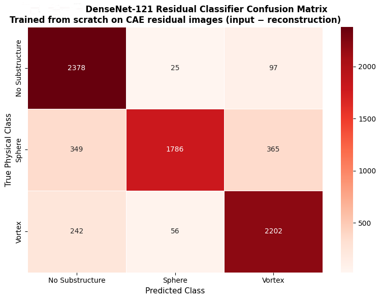
  <br><em>Figure 9.7 — DenseNet-121 residual classifier confusion matrix (raw counts).
  No Substructure recall: 2378/2500 (0.951). Sphere recall: 1786/2500 (0.714).
  Vortex recall: 2202/2500 (0.881). Sphere shows the largest off-diagonal leakage,
  consistent with it having the weakest residual signal.</em>
</p>

<p align="center">
  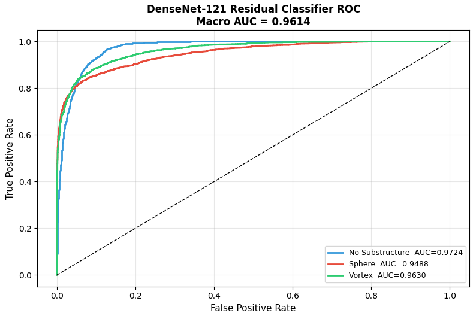
  <br><em>Figure 9.8 — DenseNet-121 residual classifier ROC curves. Macro AUC = 0.9614.
  Per-class: No Substructure 0.9724, Vortex 0.9630, Sphere 0.9488.
  Sphere has the lowest AUC — consistent across both residual classifiers and the
  raw-image benchmark.</em>
</p>

<p align="center">
  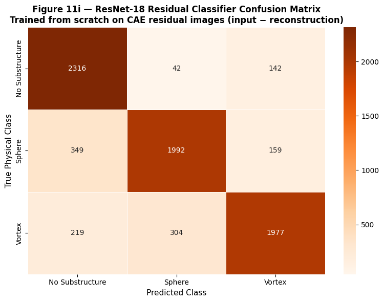
  <br><em>Figure 9.9 — ResNet-18 residual classifier confusion matrix (raw counts).
  No Substructure recall: 2316/2500 (0.926). Sphere recall: 1992/2500 (0.797).
  Vortex recall: 1977/2500 (0.791). Higher Sphere recall than DenseNet-121 residual
  (0.797 vs 0.714) but lower Vortex recall (0.791 vs 0.881).</em>
</p>

<p align="center">
  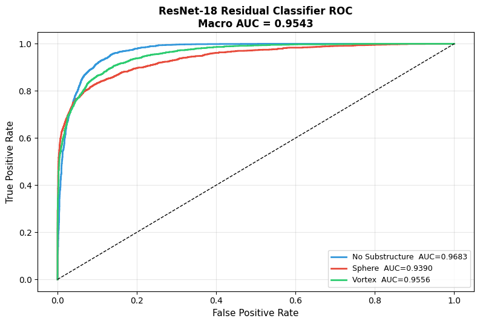
  <br><em>Figure 9.10 — ResNet-18 residual classifier ROC curves. Macro AUC = 0.9543.
  Per-class: No Substructure 0.9683, Vortex 0.9556, Sphere 0.9390.
  All three per-class AUCs fall below DenseNet-121 residual, consistent with the
  macro AUC gap of 0.007.</em>
</p>

**Per-class AUC on residuals:**

| Class | DenseNet-121 (residual) | ResNet-18 (residual) |
|:------|:----------------------:|:--------------------:|
| No Substructure | 0.9724 | 0.9683 |
| Vortex | 0.9630 | 0.9556 |
| Sphere ⚠️ | 0.9488 | 0.9390 |

---

### 9.4 Summary & Interpretation

| Finding | Value |
|:--------|:------|
| AUC gap (raw → residual DenseNet-121) | −0.034 |
| DenseNet-121 best checkpoint epoch | Epoch 10 |
| DenseNet-121 train/val loss gap at epoch 30 | 0.0013 vs 0.8211 |
| ResNet-18 best checkpoint epoch | Epoch 5 |

**Conclusion:** For this homogeneous simulated dataset, classifying raw images 
directly is the correct engineering choice. The residual approach demonstrates 
that isolated perturbation signal contains real discriminative information 
(AUC well above 0.5), but introduces:

1. A reconstruction noise penalty from CAE artefacts
2. Loss of macro-lens morphology cues that carry discriminative information on 
   a homogeneous lens population
3. Severe overfitting risk when training a 7M-parameter model from scratch on residuals

The residual approach would become competitive in a **heterogeneous lens population** 
(variable mass, ellipticity, redshift) where macro-lens morphology varies strongly 
across images, making isolated perturbation signals relatively more discriminative 
than full-image features.

## 10. Discussion

### The Sphere Class Is Systematically Harder — Physical Interpretation

Every well-converged model (AUC > 0.95) shows the same failure pattern: Sphere subhalos are misclassified predominantly as No Substructure, not as Vortex. This one-directional confusion is physically interpretable. Spherical CDM subhalos produce compact, approximately symmetric perturbations to the lensing potential. Vortex substructure produces elongated, asymmetric perturbations that are geometrically distinct. Models detect this geometric similarity correctly — they are not failing randomly; they are resolving genuine physical ambiguity at the low-mass end of the subhalo distribution.

**Macro AUC understates difficulty.** Macro AUC is dominated by the easier No Substructure/Vortex boundary. Sphere PR-AUC is the more discriminating metric: DenseNet-121 leads at 0.9903 while EfficientNet-B3 trails at 0.9749 — a spread of 0.015 invisible in the macro AUC comparison. A model that appears competitive on macro AUC but underperforms on Sphere PR-AUC has learned to classify No Substructure and Vortex well while failing on the class requiring the most subtle detection.

### Skip Connections Are Necessary, Not Merely Beneficial

| Architecture | Macro AUC | Parameters |
|:-------------|:---------:|:----------:|
| AlexNet (sequential) | 0.659 | 57.0M |
| VGG-16 (sequential, deep) | 0.894 | 134M |
| ResNet-18 (skip connections) | 0.993 | 11.2M |

The performance gap between sequential and residual architectures is the largest discontinuity in the benchmark. VGG-16 uses 12× more parameters than ResNet-18 yet achieves substantially lower AUC. For low-contrast, low-SNR classification tasks operating near a photon-statistics detection threshold, gradient accessibility to shallow feature detectors is a prerequisite.

### The Equivariance Advantage Is Real but Bounded

E-ResNet achieves 37.3× better theoretical rotational stability than ResNet-50 at initialisation, and 2.5× better empirical invariance after training. The ablation study confirms that augmentation is the dominant performance driver within the equivariant family, but the efficiency argument — competitive AUC at 0.39M parameters — holds regardless. The architectural inductive bias genuinely reduces the sample and parameter cost of learning the rotational symmetry of gravitational lensing.

### DenseNet-121 Is the Overall Winner on This Dataset

DenseNet-121 achieves the highest macro AUC (0.9962), Sphere Recall (0.9364), and Sphere PR-AUC (0.9903). Its dense connectivity — providing each layer with gradient access to all preceding feature maps — offers the best combination of gradient flow and local feature reuse on this task. ImageNet pretraining initialises the network with rich feature representations that can be efficiently adapted to astrophysical textures. The 7M parameter count is modest relative to the performance return.

---

## 11. Limitations & Future Work

### 11.1 Dataset Limitations

- **Homogeneous simulation:** Fixed lens mass (~10¹² M☉), fixed ellipticity, fixed source morphology. Real lens surveys (HST, Euclid, LSST) will show significant variation in all three. Performance under distribution shift is unknown.
- **Single-band:** No photometric colour information. Chromatic lensing effects scale differently for Sphere vs Vortex substructures; multi-band models may resolve some failure modes.
- **Balanced classes:** Real surveys will have highly imbalanced substructure fractions.
- **Log-uniform exposure time:** Creates a ~3× SNR range that drives the low-flux Sphere failures. Separate models or SNR-conditioning may improve performance in the low-brightness regime.

### 11.2 Model Limitations

- **D₄ covers only 90° multiples:** Real lenses appear at arbitrary position angles. Full continuous SO(2) equivariance requires steerable CNNs.
- **64 confident failures:** The deep ensemble identifies 62 Sphere images misclassified with high confidence by all models. These pass through any entropy-based triage filter — an operational safety concern for deployed pipelines.
- **CAE bottleneck:** The 128-dimensional CAE bottleneck has not been studied systematically. Too-large → memorises substructure; too-small → fails to capture arc shape variation.
- **Calibration under distribution shift:** Ensemble entropy analysis assumes val distribution = train distribution. Calibration experiments under controlled PSF/noise/background shifts are needed before deployment.

### 11.3 Detection and Estimation Extensions

- **Subhalo mass regression:** Extend from classification to continuous mass prediction with calibrated uncertainty. The monotonic confidence–brightness relationship (Section 8.3) suggests calibrated mass estimates from single-band images are achievable above the detection threshold.
- **Anomaly detection framing:** Reframe substructure detection as one-class anomaly detection. The CAE smooth-lens manifold provides a natural reference representation; the residual norm within the ring annulus could serve as an anomaly score.
- **Density field regression for Vortex:** Vortex substructure represents a dark matter density field perturbation; a regression target for the vortex density parameter would provide richer physical outputs than a binary label.

---

## 12. GSoC Research Directions

Five research directions are prioritised based on where current architectures fail and where the physics suggests the most leverage:

**1. Continuous-group equivariant architectures for real telescope data.**
D₄ covers only 90° multiples; real lenses appear at arbitrary angles. Upgrading to SO(2) or C₈ steerable CNNs would provide continuous rotation equivariance at a smaller parameter budget than achieving equivalent invariance through augmentation. The ablation result — augmentation is the dominant driver, not residual connections — directly motivates replacing D₄-plus-augmentation with a tighter architectural prior.

**2. Silent failure detection via anomaly scoring.**
The 64 silent Sphere failures (confident consensus errors across 6 models) are the most dangerous operational failure mode. The CAE smooth-lens manifold provides a natural one-class anomaly score: the residual norm within the ring annulus, calibrated against the reconstruction noise floor. Testing whether this score identifies silent failures while remaining below false alarm thresholds on true No Substructure images would directly address the operational safety gap.

**3. Ring-local perturbation detection head.**
The interpretability analysis establishes that the discriminative challenge is not identifying the ring but *localising a compact perturbation within* the ring. A ring-local detection architecture — a lightweight ring-finder fitting the Einstein ring, followed by a perturbation classifier operating on a polar-reparameterised ring-local patch — would decouple the two tasks. The polar reparameterisation converts perturbation position to a translation problem, making smaller, more data-efficient detectors viable.

**4. Subhalo mass regression with calibrated uncertainty.**
Extending the pipeline to predict continuous subhalo mass with calibrated confidence intervals would turn a classification result into a physical measurement. The monotonic confidence–brightness relationship in Section 8.3 demonstrates that the models already implicitly estimate something like SNR; formalising this as a heteroscedastic regression head would propagate photon-noise-driven uncertainty into mass estimates in a physically interpretable way.

**5. Heterogeneous lens population evaluation.**
All results use homogeneous simulation with fixed lens mass and ellipticity. The core scientific question — whether equivariant architectures generalise better than pretrained CNNs under distribution shift — cannot be answered on this dataset. Testing trained models on simulations with variable lens mass (10¹¹–10¹³ M☉), variable ellipticity, and variable source morphology would determine whether the equivariant efficiency advantage persists under realistic variation, or whether richer ImageNet feature spaces provide better generalisation.

---

## 13. Repository Structure

```
DeepLense-GSoC-2026/
│
└── Test_I_Classification/
    │
    ├── README.md                              ← This file
    ├── Test_I_Classification_final.ipynb      ← Main notebook (all experiments)
    ├── requirements.txt
    │
    ├── assets/                                ← Figures and saved outputs
    │   ├── fig2_1_sample_images.png
    │   ├── fig2_2_eda_statistic.png
    │   ├── ResNet-18_results.png
    │   ├── ResNet-50_results.png
    │   ├── DenseNet-121_results.png
    │   ├── EfficientNet-B3_results.png
    │   ├── AlexNet_results.png
    │   ├── VGG-16_results.png
    │   ├── ViT-Base_results.png
    │   ├── Equivariant-D4_results.png
    │   ├── E-ResNet_results.png
    │   ├── macro_roc_comparison.png
    │   ├── sphere_pr_comparison.png
    │   ├── param_efficiency.png
    │   ├── gradcam_No_Substructure.png
    │   ├── gradcam_Sphere.png
    │   ├── gradcam_Vortex.png
    │   ├── fig6_1_case2_gradcam.png
    │   ├── fig6_1_case3_gradcam.png
    │   ├── fig6_1_case4_gradcam.png
    │   ├── fig6_2a_attention_grid.png
    │   ├── fig6_2b_densenet_resolution.png
    │   ├── fig6_2c_vit_ring_concentration.png
    │   ├── fig6_2d_vit_attention_consistency.png
    │   ├── fig6_2e_ring_concentration_comparison.png
    │   ├── ensemble_uncertainty.png
    │   ├── sphere_high_entropy_grid.png
    │   ├── ablation_convergence.png
    │   ├── fig6_5_rotation_invariance.png
    │   ├── sphere_contrast_analysis.png
    │   ├── sphere_misclassified_grid.png
    │   ├── fig8_1_universally_misclassified_correct.png
    │   ├── fig8_1_sphere_class_difficulty.png
    │   ├── fig8_1_cross_arch_confusion.png
    │   ├── fig12a_sphere_false_negatives.png
    │   ├── fig12b_sphere_fn_statistics.png
    │   ├── fig12c_sv_confusion_gallery.png
    │   ├── fig12d_elongation_distribution.png
    │   ├── fig12e_confidence_vs_brightness.png
    │   ├── fig12f_perturbation_position.png
    │   ├── fig11_cae_training.png
    │   ├── fig11_cae_residuals.png
    │   ├── fig11_residual_distributions.png
    │   ├── fig11_mean_residual_maps.png
    │   ├── fig11e_dn_res_training.png
    │   ├── fig11f_dn_res_confusion_matrix.png
    │   ├── fig11g_dn_res_roc.png
    │   ├── fig11h_r18_res_training.png
    │   ├── fig11i_r18_res_confusion_matrix.png
    │   └── fig11j_r18_res_roc.png
    │
    └── weights/                               ← Model checkpoints (Google Drive links below)
        ├── ResNet18_best.pth
        ├── ResNet50_best.pth
        ├── DenseNet121_best.pth
        ├── EfficientNetB3_best.pth
        ├── AlexNet_best.pth
        ├── VGG16_best.pth
        ├── ViT_best.pth
        ├── EquivD4_best.pth
        ├── E-ResNet_best.pth
        └── CAE_best.pth
```

### Model Weights — Google Drive

All weights are saved as PyTorch `.pth` checkpoint files. Each file contains `{'model_state_dict': ..., 'val_loss': ..., 'epoch': ...}`.

| Model | AUC | Drive Link |
|:------|:---:|:----------:|
| DenseNet-121 | 0.9962 | [Download](https://drive.google.com/your-link) |
| E-ResNet | 0.9952 | [Download](https://drive.google.com/your-link) |
| ResNet-50 | 0.9946 | [Download](https://drive.google.com/your-link) |
| ResNet-18 | 0.9927 | [Download](https://drive.google.com/your-link) |
| EfficientNet-B3 | 0.9898 | [Download](https://drive.google.com/your-link) |
| ViT-Base/16 | 0.9761 | [Download](https://drive.google.com/your-link) |
| VGG-16 | 0.8944 | [Download](https://drive.google.com/your-link) |
| Equivariant-D4 (ENN) | 0.7362 | [Download](https://drive.google.com/your-link) |
| AlexNet | 0.6589 | [Download](https://drive.google.com/your-link) |
| CAE (smooth lens) | — | [Download](https://drive.google.com/your-link) |


---

## 14. Citation

If you use this work, please cite the ML4SCI DeepLense project and the DeepLenseSim simulation pipeline:

```bibtex
@misc{deeplense_gsoc2026_testi,
  author       = {Rafiqus Salehin},
  title        = {ML4SCI DeepLense GSoC 2026 — Common Test I:
                  Multi-Class Classification of Dark Matter Substructure},
  year         = {2026},
  url          = {https://github.com/rsalehin/DeepLense-GSoC-2026}
}

@article{toomey2023deeplensesim,
  title  = {DeepLenseSim: A Simulation Pipeline for Strong Gravitational Lensing},
  author = {Toomey, M. W. and others},
  year   = {2023}
}
```

**Related work:**

- Selvaraju et al. (2017) — Grad-CAM: Visual Explanations from Deep Networks
- Alexander et al. (2020) — Deep Learning the Morphology of Dark Matter Substructure
- Abnar & Zuidema (2020) — Quantifying Attention Flow in Transformers
- Weiler & Cesa (2019) — General E(2)-Equivariant Steerable CNNs (`escnn`)
- He et al. (2016) — Deep Residual Learning for Image Recognition
- Huang et al. (2017) — Densely Connected Convolutional Networks
- Dosovitskiy et al. (2020) — An Image is Worth 16×16 Words: Transformers for Image Recognition

---

<div align="center">

**ML4SCI DeepLense — GSoC 2026**
*Searching for dark matter substructure, one Einstein ring at a time.*

</div>

