<div align="center">

#  ML4SCI DeepLense — GSoC 2026
## Common Test I: Multi-Class Classification of Dark Matter Substructure

[](https://python.org)
[](https://pytorch.org)
[](https://github.com/QUVA-Lab/escnn)
[](https://www.nvidia.com)
[](LICENSE)
[](https://colab.research.google.com)

<br>

**Classifying dark matter substructure in simulated strong gravitational lensing images**
using nine architectures — from convolutional baselines to D₄-equivariant residual networks.

<br>

|  Best AUC |  Best Efficiency |  Task |  Input |
|:-----------:|:------------------:|:-------:|:--------:|
| **0.9962** (DenseNet-121) | **0.39M params** (E-ResNet, AUC 0.9952) | 3-class classification | 150 × 150 × 1 |

</div>

---

##  Table of Contents

1. [Scientific Background](#1-scientific-background)
2. [Dataset](#2-dataset)
   - [2.1 Class Descriptions](#21-class-descriptions)
   - [2.2 Dataset Statistics](#22-dataset-statistics)
   - [2.3 Key Observational Properties](#23-key-observational-properties)
3. [Environment Setup](#3-environment-setup)
4. [Training & Evaluation Framework](#4-training--evaluation-framework)
   - [4.1 Data Pipeline](#41-data-pipeline)
   - [4.2 Key Design Decisions](#42-key-design-decisions)
   - [4.3 Evaluation Protocol](#43-evaluation-protocol)
5. [Architecture Evaluations](#5-architecture-evaluations)
   - [5.1 ResNet-18](#51-resnet-18)
   - [5.2 ResNet-50](#52-resnet-50)
   - [5.3 DenseNet-121](#53-densenet-121)
   - [5.4 EfficientNet-B3](#54-efficientnet-b3)
   - [5.5 AlexNet](#55-alexnet)
   - [5.6 VGG-16](#56-vgg-16)
   - [5.7 Vision Transformer (ViT-Base/16)](#57-vision-transformer-vit-base16)
   - [5.8 Equivariant Neural Network (D₄-ENN)](#58-equivariant-neural-network-d-enn)
   - [5.9 Equivariant Residual Network (E-ResNet)](#59-equivariant-residual-network-e-resnet-)
6. [Comprehensive Results Summary](#6-comprehensive-results-summary)
   - [6.1 Full Benchmark Table](#61-full-benchmark-table)
   - [6.2 Performance Tiers](#62-performance-tiers)
   - [6.3 Parameter Efficiency](#63-parameter-efficiency)
   - [6.4 Key Takeaways](#64-key-takeaways)
7. [Interpretability Analysis](#7-interpretability-analysis)
   - [7.1 Grad-CAM: ResNet-50 vs E-ResNet](#71-grad-cam-resnet-50-vs-e-resnet)
   - [7.2 ViT Attention Rollout vs DenseNet Grad-CAM](#72-vit-attention-rollout-vs-densenet-grad-cam)
   - [7.3 Predictive Uncertainty — Deep Ensemble](#73-predictive-uncertainty--deep-ensemble)
   - [7.4 Ablation Study — E-ResNet Components](#74-ablation-study--e-resnet-components)
   - [7.5 Equivariance Verification](#75-equivariance-verification)
8. [Failure Mode Analysis](#8-failure-mode-analysis)
   - [8.1 Cross-Architecture Sphere Confusion](#81-cross-architecture-sphere-confusion)
   - [8.2 Statistical Characterisation of Failures](#82-statistical-characterisation-of-failures)
   - [8.3 Confidence vs Ring Brightness](#83-confidence-vs-ring-brightness)
   - [8.4 Physical Interpretation](#84-physical-interpretation)
9. [Residual Image Approach](#9-residual-image-approach)
   - [9.1 Motivation](#91-motivation)
   - [9.2 Convolutional Autoencoder](#92-convolutional-autoencoder)
   - [9.3 Residual Classifiers](#93-residual-classifiers)
   - [9.4 Summary & Interpretation](#94-summary--interpretation)
10. [Discussion](#10-discussion)
11. [Limitations & Future Work](#11-limitations--future-work)
12. [GSoC Research Directions](#12-gsoc-research-directions)
13. [Repository Structure](#13-repository-structure)
14. [Citation](#14-citation)

---

## 1. Scientific Background

Strong gravitational lensing — the bending of light from a distant source galaxy around a massive foreground lens — encodes information about the **total mass distribution of the lens**, including its dark matter content. When the lens contains low-mass dark matter substructures (subhalos, vortices), they imprint subtle perturbations on the lensing arc: compact brightness knots, arc asymmetries, and flux anomalies.

The three substructure classes probed in this benchmark correspond to distinct dark matter models:

```
       SOURCE GALAXY
            │
            │  (light rays)
     ╔══════╧═════╗
     ║  Einstein  ║   ← main halo (smooth SIE + shear)
     ║    Ring    ║
     ╚════╤═══════╝
          │
      ┌───┴───────────────────────────────────┐
      │  + Sphere subhalo → CDM prediction    │
      │  + Vortex          → Axion DM         │
      │  (no perturbation) → Smooth halo      │
      └───────────────────────────────────────┘
```

Distinguishing these classes at scale — across thousands of images, near the detection threshold — is precisely the task for which deep learning is well-suited. Human visual inspection is unreliable: both Sphere and Vortex perturbations are morphologically similar to lensing arc edge effects at the noise level of ground-based surveys.

---

## 2. Dataset

### 2.1 Class Descriptions

| Class | Dark Matter Model | Physical Signature | Visual Cue |
|:------|:-----------------|:-------------------|:-----------|
| **No Substructure** | Smooth CDM halo | SIE + shear only | Clean symmetric Einstein ring |
| **Sphere** | CDM subhalo (point mass) | Compact subhalo appended to base halo | Compact bright knot on the arc |
| **Vortex** | Axion dark matter (topological vortex) | Density field perturbation | Arc elongation / asymmetry |

<!-- Figure: one representative image per class, shown side by side -->
<p align="center">
  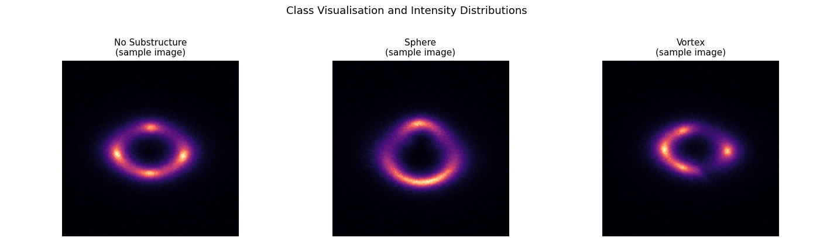
  <br><em>Figure 2.1 — Representative 150×150 single-channel images for each class. All three share the same Einstein ring morphology; the Sphere knot and Vortex arc asymmetry are subtle perturbations visible only on close inspection.</em>
</p>

### 2.2 Dataset Statistics

The dataset was generated using the **DeepLenseSim pipeline** (Toomey et al.) under a fixed simulation configuration: Sheared Isothermal Elliptical (SIE) lens, Sérsic light profile, Gaussian PSF, Gaussian + Poissonian noise at SNR ≈ 25.

| Partition | Images / Class | Total Images | Role |
|:----------|:--------------:|:------------:|:-----|
| **Train** | 10,000 | 30,000 | Weight optimisation only |
| **Val** | 2,500 | 7,500 | Checkpoint selection & metric reporting |

**Simulation parameters:**
- Image size: **150 × 150 pixels** (single channel)
- Lens model: SIE + external shear
- Pixel scale: 0.1 arcsec / pixel
- PSF: Gaussian, FWHM = 0.1 arcsec
- Background RMS: 0.3 (fixed)
- Exposure time: log-uniform distribution (~factor of 3 SNR range)
- Halo mass: ~10¹² M☉

```
Dataset split (balanced across all classes):
─────────────────────────────────────────────
Train   ██████████████████████████████  30,000
Val     ████████                         7,500
─────────────────────────────────────────────
        0     5k   10k   15k   20k   25k  30k
```

### 2.3 Key Observational Properties

Three properties of the data drive all modelling choices:

**1. Visual similarity between classes.** All three classes share the same macro-lens morphology — a bright Einstein ring. The substructure signal manifests as *subtle perturbations*, not visually distinct objects. Classification requires detecting a small perturbation on top of a dominant shared structure.

**2. Heavy right-skewed pixel intensity.** The vast majority of pixels are near-zero background. The small fraction of bright pixels along the ring arc carries essentially *all* discriminative information. This motivates per-sample min-max normalisation, not dataset-level standardisation.

**3. Sphere is the physically hardest class.** Spherical CDM subhalos produce compact, approximately symmetric perturbations — morphologically similar to smooth arcs. Vortex perturbations are elongated and asymmetric, more geometrically distinct. **Sphere Recall is the most discriminating single metric** on this dataset; macro AUC is dominated by the easier No Substructure/Vortex boundary.

<!-- Figure: pixel intensity distributions and ring statistics per class -->
<p align="center">
  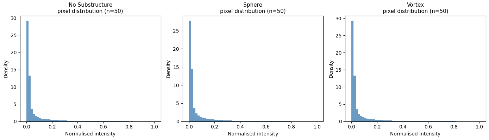
  <br><em>Figure 2.2 — EDA statistics. Left: pixel intensity histograms per class — all three distributions are right-skewed, with background pixels near zero dominating. Right: per-class ring brightness and compactness distributions, showing the systematic difference between Sphere failures and correctly classified images.</em>
</p>

---

## 3. Environment Setup

All experiments were conducted on **Google Colab with a single NVIDIA A100 GPU** (high-memory runtime).

### Requirements

```bash
pip install torch torchvision --index-url https://download.pytorch.org/whl/cu121
pip install lenstronomy --quiet          # Section 9: analytical lens fitting
pip install escnn --quiet                # Sections 5.8–5.9: equivariant CNNs
pip install grad-cam --quiet             # Section 7.1: Grad-CAM visualisation
pip install "numpy<2"                    # escnn + lenstronomy require numpy 1.x
# ⚠️  Restart runtime after numpy downgrade before proceeding
```

> **Note:** Colab ships `numpy 2.4.x` by default. `escnn` and `lenstronomy` both require `numpy < 2`. Pin `numpy==1.26.4` and restart the kernel before importing any model code.

### Verified version matrix

| Package | Version | Note |
|:--------|:-------:|:-----|
| Python | 3.10 | Colab default |
| PyTorch | 2.x | cu121 build |
| numpy | 1.26.4 | pinned — see above |
| escnn | latest | D₄ equivariant layers |
| lenstronomy | latest | analytical lens model |
| grad-cam | latest | Grad-CAM / Attention Rollout |

---

## 4. Training & Evaluation Framework

### 4.1 Data Pipeline

```
Raw .npy files (150×150)
        │
        ▼
Per-sample min-max normalisation: x̂ = (x − xₘᵢₙ) / (xₘₐₓ − xₘᵢₙ)
        │
        ├─── [TRAIN] D₄ augmentation: random {hflip, vflip, 90°-rot}
        │
        ├─── [VAL]   No augmentation
        │
        ▼
Single-channel 150×150 tensor → model input
```

The train/val split is used exactly as provided by the dataset organisers. No additional test partition is created.

**Normalisation rationale:** Per-sample normalisation preserves internal contrast structure regardless of exposure level, a critical property given the ~3× SNR range across images from the log-uniform exposure distribution.

**Augmentation rationale:** Gravitational lenses have no preferred orientation in the sky. All four 90° rotations and reflections represent the same physical system — D₄ augmentation is *physically motivated*, not arbitrary regularisation.

### 4.2 Key Design Decisions

| Decision | Choice | Rationale |
|:---------|:------:|:----------|
| Optimiser | AdamW (wd = 1e-3) | Weight decay regularises large pretrained models without penalising BatchNorm parameters |
| Scheduler | CosineAnnealingLR | Smooth LR decay without manual step tuning; completes full annealing cycle |
| Loss | CrossEntropyLoss | Standard for balanced multi-class classification |
| Gradient clipping | max_norm = 1.0 | Prevents gradient explosions in deep architectures during early training |
| Checkpoint criterion | Lowest validation loss | Consistent across all architectures for fair comparison |
| Early stopping | patience = 15 epochs | Halts training when val loss stagnates |

### 4.3 Evaluation Protocol

Four complementary metrics are computed for every architecture:

| Metric | What it measures | Why it matters |
|:-------|:-----------------|:---------------|
| **Macro AUC** | Threshold-independent separability, averaged over three OvR boundaries | Primary benchmark metric; robust to class balance |
| **Confusion matrix** | Direction-specific misclassification rates | Reveals Sphere→No Sub vs Sphere→Vortex confusion patterns |
| **Sphere PR-AUC** | Detection quality for the hardest class | Most sensitive indicator of genuine Sphere signal learning |
| **Calibration curve** | Reliability of confidence scores | Critical for entropy-based triage in deployment |

---

## 5. Architecture Evaluations

Nine architectures are evaluated on an identical dataset, training protocol, and evaluation suite. The ordering follows a deliberate narrative — from sequential baselines establishing the lower bound, through increasingly capable general architectures, to physics-motivated equivariant networks encoding lensing symmetry directly into their weights.

### Architecture Design Progression

```
Sequential baselines     Skip connections      Attention        Equivariant
──────────────────     ────────────────     ──────────────     ──────────────────
AlexNet                ResNet-18            ViT-Base/16        ENN (D₄)
VGG-16                 ResNet-50                               E-ResNet (D₄)
                       DenseNet-121
                       EfficientNet-B3
```

---

### 5.1 ResNet-18

**Role:** Skip-connection baseline — establishes that gradient flow to early layers is necessary for low-contrast substructure detection.

**Architecture:** 18-layer residual network with BasicBlock (2 × 3×3 conv) units. Skip connections allow gradients to bypass individual blocks, reaching shallow feature detectors without degradation.

**Modifications:** First conv layer replaced for single-channel input (1→64, 7×7, stride 2). Classification head replaced with 3-class linear output.

**Training:** 30 epochs, ImageNet pretrained weights, lr = 1e-4, CosineAnnealingLR.

<details>
<summary><b>Per-class classification report</b></summary>

```
── Classification Report: ResNet-18 ──────────────────────────
                 precision    recall  f1-score   support

No Substructure     0.9576    0.9700    0.9638      2500
         Sphere     0.9413    0.9064    0.9235      2500
         Vortex     0.9594    0.9808    0.9700      2500

       accuracy                         0.9524      7500
      macro avg     0.9528    0.9524    0.9524      7500
   weighted avg     0.9528    0.9524    0.9524      7500
```
<!-- Figure: ResNet-18 confusion matrix and ROC/PR curves -->


</details>
<p align="center">
  
  <br><em>Figure 5.1 — ResNet-18 evaluation: confusion matrix (left), ROC curves per class (centre), Sphere PR curve (right).</em>
</p>

| Metric | Value |
|:-------|------:|
| Macro AUC | **0.9927** |
| AUC — No Substructure | 0.9939 |
| AUC — Sphere | 0.9872 |
| AUC — Vortex | 0.9966 |
| Sphere PR-AUC | 0.9813 |
| Test Accuracy | 95.24% |
| Sphere Recall | 0.9064 |
| Parameters | 11.2 M |
| Pretrained | ✅ ImageNet |


 **Model weights:** [Download from Google Drive](https://drive.google.com/your-link-here) *(replace with actual link)*

---

### 5.2 ResNet-50

**Role:** Deeper residual architecture — tests the effect of increased depth and channel capacity via bottleneck blocks.

**Architecture:** 50-layer residual network replacing BasicBlocks with 3-layer bottleneck units (1×1 → 3×3 → 1×1). The 1×1 projections reduce and restore channel dimensions around each 3×3 convolution, enabling richer feature hierarchies at controlled computational cost.

**Modifications:** Same single-channel and 3-class head replacements as ResNet-18.

**Training:** 30 epochs, ImageNet pretrained, lr = 1e-4.

<details>
<summary><b>Per-class classification report</b></summary>

```
── Classification Report: ResNet-50 ──────────────────────────
                 precision    recall  f1-score   support

No Substructure     0.9709    0.9708    0.9709      2500
         Sphere     0.9448    0.9180    0.9312      2500
         Vortex     0.9667    0.9936    0.9800      2500

       accuracy                         0.9608      7500
      macro avg     0.9608    0.9608    0.9607      7500
   weighted avg     0.9608    0.9608    0.9607      7500
```

</details>

<!-- Figure: ResNet-50 confusion matrix and curves -->
<p align="center">
  
  <br><em>Figure 5.2 — ResNet-50 evaluation: confusion matrix (left), ROC curves per class (centre), Sphere PR curve (right).</em>
</p>

| Metric | Value |
|:-------|------:|
| Macro AUC | **0.9946** |
| AUC — No Substructure | 0.9951 |
| AUC — Sphere | 0.9909 |
| AUC — Vortex | 0.9974 |
| Sphere PR-AUC | 0.9862 |
| Test Accuracy | 96.08% |
| Sphere Recall | 0.9180 |
| Parameters | 23.5 M |
| Pretrained | ✅ ImageNet |


 **Model weights:** [Download from Google Drive](https://drive.google.com/your-link-here) *(replace with actual link)*

---

### 5.3 DenseNet-121

**Role:** Densely-connected architecture — tests whether providing every layer with gradient access to all preceding feature maps improves substructure localisation.

**Architecture:** 121-layer network with dense blocks where each layer receives feature-map concatenations from all preceding layers within the block. Four transition layers progressively halve spatial dimensions. Dense connectivity provides each layer with the full representational history, eliminating gradient vanishing and encouraging feature reuse.

**Modifications:** First conv layer replaced for single-channel input. Linear classifier head replaced with 3-class output.

**Training:** 30 epochs, ImageNet pretrained, lr = 1e-4.

<details>
<summary><b>Per-class classification report</b></summary>

```
── Classification Report: DenseNet-121 ─────────────────────────
                 precision    recall  f1-score   support

No Substructure     0.9765    0.9800    0.9782      2500
         Sphere     0.9511    0.9364    0.9437      2500
         Vortex     0.9795    0.9900    0.9847      2500

       accuracy                         0.9688      7500
      macro avg     0.9690    0.9688    0.9689      7500
   weighted avg     0.9690    0.9688    0.9689      7500
```

</details>
<!-- Figure: DenseNet-121 confusion matrix and curves -->
<p align="center">
  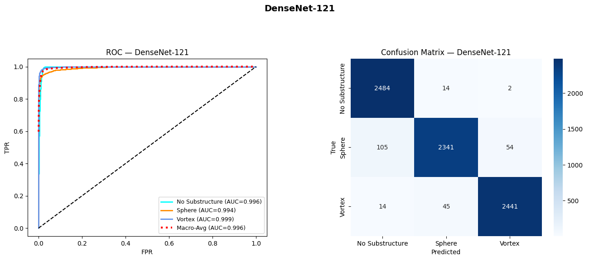
  <br><em>Figure 5.3 — DenseNet-121 evaluation: confusion matrix (left), ROC curves per class (centre), Sphere PR curve (right). Best overall performance across all metrics.</em>
</p>

| Metric | Value |
|:-------|------:|
| Macro AUC | **0.9962** 🥇 |
| AUC — No Substructure | 0.9963 |
| AUC — Sphere | 0.9937 |
| AUC — Vortex | 0.9985 |
| Sphere PR-AUC | 0.9903 |
| Test Accuracy | 96.88% |
| Sphere Recall | **0.9364** 🥇 |
| Parameters | 7.0 M |
| Pretrained | ✅ ImageNet |


 **Model weights:** [Download from Google Drive](https://drive.google.com/your-link-here) *(replace with actual link)*

---

### 5.4 EfficientNet-B3

**Role:** Compound-scaled architecture — tests principled simultaneous scaling of depth, width, and resolution.

**Architecture:** Neural-architecture-search-derived baseline scaled by compound coefficient β=3. MBConv blocks use depthwise separable convolutions and squeeze-excitation to maintain representational capacity at reduced parameter count.

**Note:** EfficientNet's aggressive spatial downsampling in early layers is a risk for 150×150 astrophysical images where the discriminative signal (ring perturbations) is only a few pixels wide. This contributes to its slightly lower Sphere recall compared to DenseNet-121 and ResNet-50.

**Modifications:** First conv layer replaced for single-channel input. Classification head replaced with 3-class output.

**Training:** 30 epochs, ImageNet pretrained, lr = 1e-4.

<details>
<summary><b>Per-class classification report</b></summary>

```
── Classification Report: EfficientNet-B3 ──────────────────────
                 precision    recall  f1-score   support

No Substructure     0.9583    0.9716    0.9649      2500
         Sphere     0.9230    0.8848    0.9035      2500
         Vortex     0.9347    0.9596    0.9470      2500

       accuracy                         0.9387      7500
      macro avg     0.9387    0.9387    0.9385      7500
   weighted avg     0.9387    0.9387    0.9385      7500
```

</details>
<!-- Figure: EfficientNet-B3 confusion matrix and curves -->
<p align="center">
  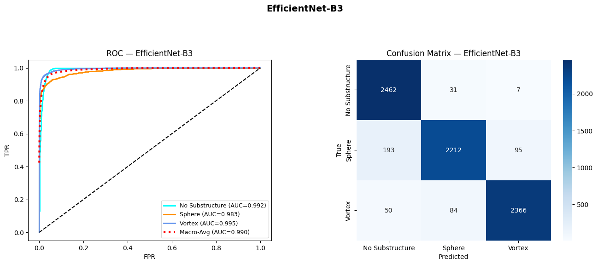
  <br><em>Figure 5.4 — EfficientNet-B3 evaluation: confusion matrix (left), ROC curves per class (centre), Sphere PR curve (right).</em>
</p>

| Metric | Value |
|:-------|------:|
| Macro AUC | **0.9898** |
| AUC — No Substructure | 0.9915 |
| AUC — Sphere | 0.9830 |
| AUC — Vortex | 0.9947 |
| Sphere PR-AUC | 0.9749 |
| Test Accuracy | 93.87% |
| Sphere Recall | 0.8848 |
| Parameters | 10.7 M |
| Pretrained | ✅ ImageNet |


 **Model weights:** [Download from Google Drive](https://drive.google.com/your-link-here) *(replace with actual link)*

---

### 5.5 AlexNet

**Role:** Sequential deep baseline — establishes the lower bound and demonstrates why gradient flow is critical.

**Architecture:** 5 conv + 3 FC layers with no skip connections and no batch normalisation. The absence of skip connections means gradients must traverse the full depth of the network to reach early feature detectors — a fundamental limitation for low-contrast signals.

**Modifications:** First conv layer replaced for single-channel input. Classifier head replaced with 3-class output.

**Training:** 30 epochs, ImageNet pretrained, lr = 1e-4.

<details>
<summary><b>Per-class classification report</b></summary>

```
── Classification Report: AlexNet ───────────────────────────────
                 precision    recall  f1-score   support

No Substructure     0.4912    0.7836    0.6039      2500
         Sphere     0.4034    0.1240    0.1895      2500
         Vortex     0.4337    0.3820    0.4062      2500

       accuracy                         0.4365      7500
      macro avg     0.4428    0.4299    0.4665      7500
```

</details>
<!-- Figure: AlexNet confusion matrix — demonstrates near-random Sphere behaviour -->
<p align="center">
  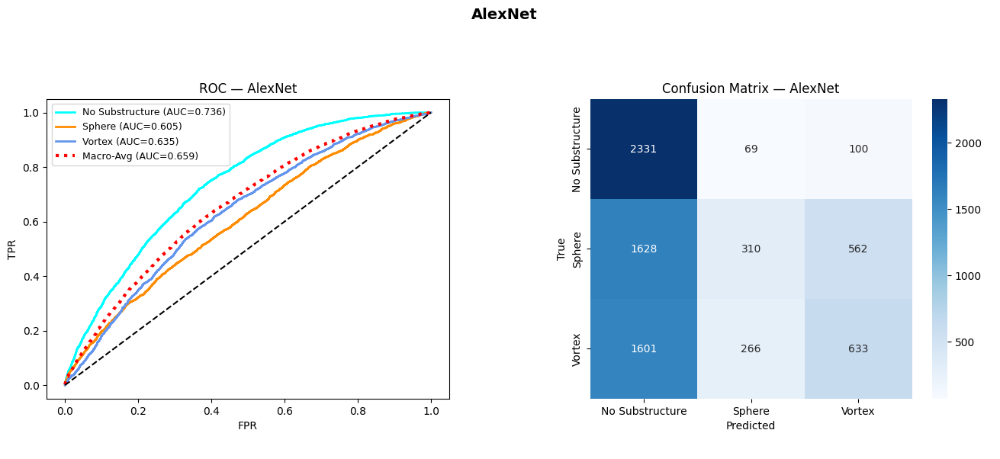
  <br><em>Figure 5.5 — AlexNet evaluation: the confusion matrix reveals near-random Sphere classification (recall 0.124). Gradient inaccessibility to early feature layers is the primary failure mechanism.</em>
</p>

| Metric | Value |
|:-------|------:|
| Macro AUC | 0.6589 |
| AUC — No Substructure | 0.7358 |
| AUC — Sphere | 0.6053 |
| AUC — Vortex | 0.6351 |
| Sphere PR-AUC | 0.4380 |
| Test Accuracy | 43.65% |
| Sphere Recall | 0.1240 |
| Parameters | 57.0 M |
| Pretrained | ✅ ImageNet |

> ⚠️ AlexNet's Sphere PR-AUC of 0.4380 is only marginally above the random baseline of 0.33, confirming that its Sphere detections carry essentially no discriminative information. The skip-connection gap is the largest single performance discontinuity in this benchmark.


 **Model weights:** [Download from Google Drive](https://drive.google.com/your-link-here) *(replace with actual link)*

---

### 5.6 VGG-16

**Role:** Deep sequential architecture — tests whether depth alone compensates for the absence of skip connections.

**Architecture:** 16-layer network with uniform 3×3 convolutions arranged sequentially without residual connections. With 134M parameters — by far the largest model in this benchmark — VGG-16 is the clearest demonstration that scale without skip connections cannot solve the gradient accessibility problem.

**Caveat:** Standard VGG-16 lacks batch normalisation after convolutions. Training instability in early epochs is a known property of this architecture and not an implementation artefact.

**Modifications:** First conv layer replaced for single-channel input. Classifier head replaced with 3-class output.

**Training:** 30 epochs, ImageNet pretrained, lr = 1e-4.

<details>
<summary><b>Per-class classification report</b></summary>

```
── Classification Report: VGG-16 ───────────────────────────────
                 precision    recall  f1-score   support

No Substructure     0.7748    0.8636    0.8168      2500
         Sphere     0.7166    0.5044    0.5925      2500
         Vortex     0.6867    0.8052    0.7413      2500

       accuracy                         0.7244      7500
      macro avg     0.7260    0.7244    0.7169      7500
```

</details>
<!-- Figure: VGG-16 confusion matrix -->
<p align="center">
  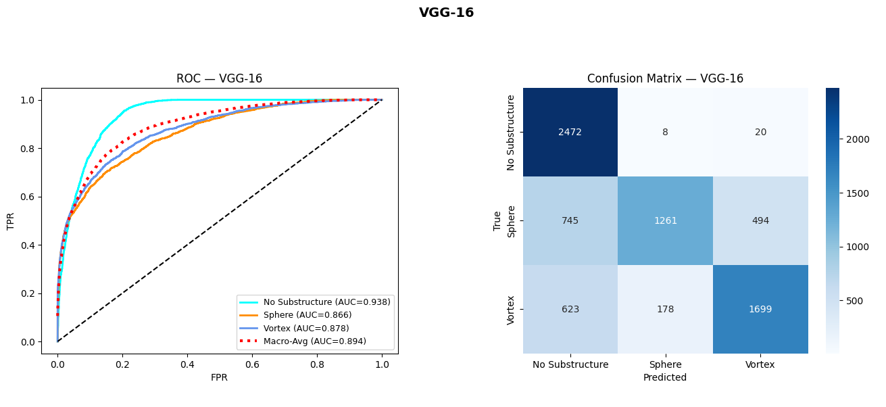
  <br><em>Figure 5.6 — VGG-16 evaluation: Sphere recall of 0.504 despite 134M parameters. Training instability from the absence of batch normalisation is visible in the loss curves.</em>
</p>

| Metric | Value |
|:-------|------:|
| Macro AUC | 0.8944 |
| AUC — No Substructure | 0.9385 |
| AUC — Sphere | 0.8659 |
| AUC — Vortex | 0.8783 |
| Sphere PR-AUC | 0.8065 |
| Test Accuracy | 72.43% |
| Sphere Recall | 0.5044 |
| Parameters | **134.3 M** |
| Pretrained | ✅ ImageNet |

> VGG-16 uses **344×** more parameters than E-ResNet yet achieves substantially worse AUC. This is the most direct demonstration of the value of encoding physical symmetry in place of raw scale.


 **Model weights:** [Download from Google Drive](https://drive.google.com/your-link-here) *(replace with actual link)*

---

### 5.7 Vision Transformer (ViT-Base/16)

**Role:** Global self-attention architecture — tests whether patch-level attention provides competitive spatial localisation for astrophysical images at 150×150.

**Architecture:** ViT-B/16 with 12 transformer encoder layers, 12 attention heads, 768-dimensional embeddings. Input is divided into 16×16 pixel patches (≈ 88 patches total at 150×150). Classification is performed via the CLS token output.

**Training:** 30 epochs, ImageNet-21k pretrained, lr = 1e-4.

**Key finding:** ViT shows class-dependent ring concentration (No Sub: 0.369, Sphere: 0.472, Vortex: 0.475) confirming it has learned to attend to the Einstein ring for substructure classification. However, its attention is *unstable* for substructure classes (std = 0.061–0.054 vs 0.037 for No Sub). This instability — caused by the lack of translation-invariant local detectors — explains its lower AUC despite attending to the correct spatial region at macro scale.

<details>
<summary><b>Per-class classification report</b></summary>

```
── Classification Report: ViT-Base ─────────────────────────────
                 precision    recall  f1-score   support

No Substructure     0.9177    0.9600    0.9384      2500
         Sphere     0.8820    0.7800    0.8279      2500
         Vortex     0.8659    0.9244    0.8942      2500

       accuracy                         0.8881      7500
      macro avg     0.8885    0.8881    0.8868      7500
```

</details>

<!-- Figure: ViT attention rollout maps per class -->
<p align="center">
  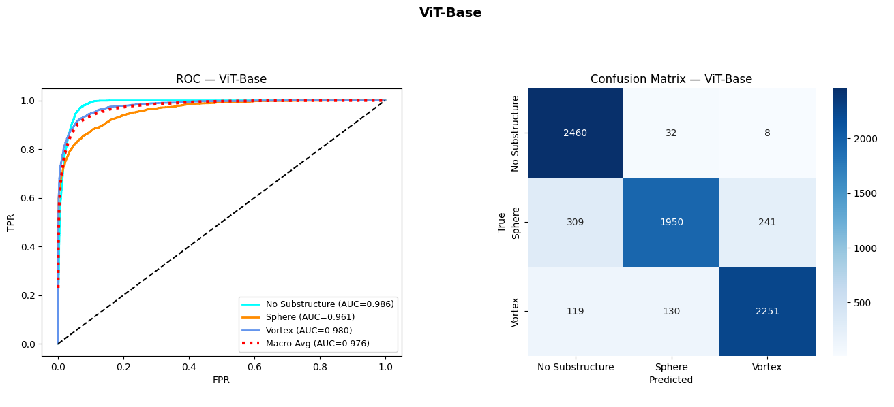
  <br><em>Figure 5.7 — ViT-Base evaluation: confusion matrix (left), ROC/PR curves (centre), and representative attention rollout maps per class (right). ViT shows class-dependent ring concentration but unstable attention for substructure classes.</em>
</p>

| Metric | Value |
|:-------|------:|
| Macro AUC | 0.9761 |
| AUC — No Substructure | 0.9861 |
| AUC — Sphere | 0.9612 |
| AUC — Vortex | 0.9805 |
| Sphere PR-AUC | 0.9413 |
| Test Accuracy | 88.81% |
| Sphere Recall | 0.7800 |
| Parameters | 85.4 M |
| Pretrained | ✅ ImageNet-21k |


 **Model weights:** [Download from Google Drive](https://drive.google.com/your-link-here) *(replace with actual link)*

---

### 5.8 Equivariant Neural Network (D₄-ENN)

**Role:** Shallow equivariant baseline — demonstrates that encoding rotational symmetry helps, but depth and skip connections remain necessary.

**Architecture:** 2-block shallow network built with `escnn` D₄-equivariant convolutions (D₄ = dihedral group of the square, encoding 90° rotations and reflections). Group pooling collapses the equivariant feature space to a standard tensor before classification.

**Training:** Trained **from scratch** — no ImageNet pretraining exists for group-equivariant architectures. 50 epochs, lr = 1e-3 (higher LR required for from-scratch training).
<!-- Figure: ENN (D4) confusion matrix -->
<p align="center">
  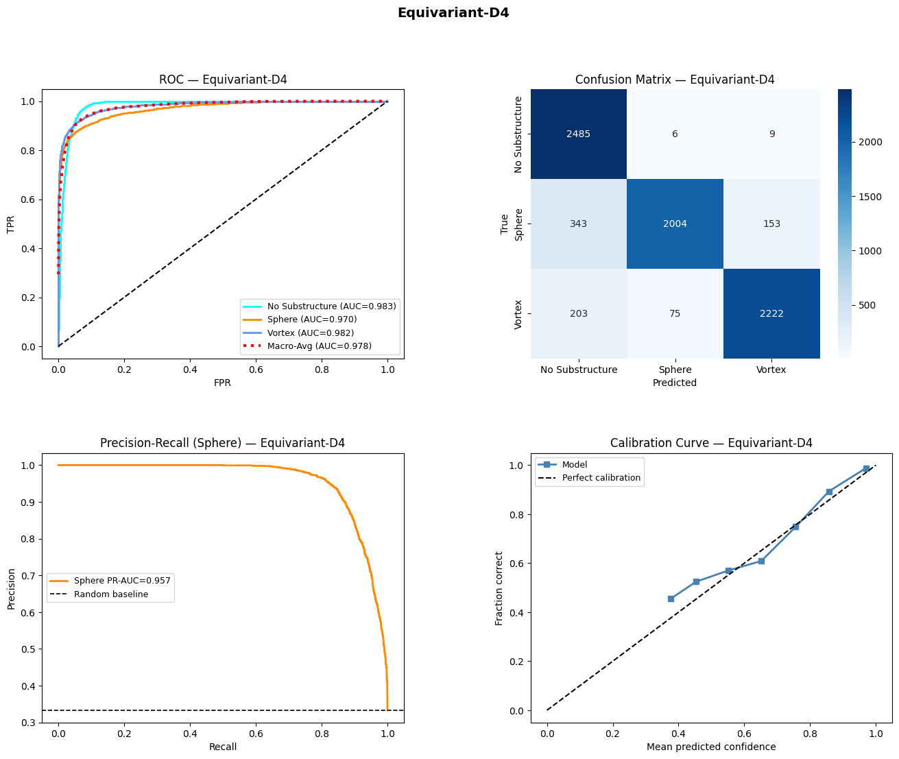
  <br><em>Figure 5.8 — Equivariant-D4 (ENN) evaluation: the shallow architecture demonstrates that equivariance alone is insufficient — depth and skip connections are required to bring AUC into the competitive range.</em>
</p>

| Metric | Value |
|:-------|------:|
| Macro AUC | 0.7362 |
| AUC — No Substructure | 0.8391 |
| AUC — Sphere | 0.7071 |
| AUC — Vortex | 0.6620 |
| Sphere PR-AUC | 0.5363 |
| Test Accuracy | 53.76% |
| Sphere Recall | 0.3864 |
| Parameters | ~0.0 M (shallow) |
| Pretrained | ❌ Scratch |


 **Model weights:** [Download from Google Drive](https://drive.google.com/your-link-here) *(replace with actual link)*

---

### 5.9 Equivariant Residual Network (E-ResNet) 

**Role:** Primary physics-motivated architecture — combines D₄ rotational symmetry with residual skip connections.

**Architecture:** Multi-block residual network built entirely from D₄-equivariant convolutions. Each residual block contains two `escnn` R2Conv layers with InnerBatchNorm and ReLU, connected by an identity shortcut. The identity shortcuts allow gradients to bypass the group-theoretic transformations, enabling stable training at greater depth while preserving the D₄ equivariance guarantee throughout.

**Two physical priors encoded simultaneously:**

1. **Rotational symmetry** — D₄ equivariance guarantees identical predictions for all 8 orientations of any input image, by construction. A gravitational lens has no preferred orientation.
2. **Hierarchical feature reuse** — residual connections allow substructure-scale gradients to reach early layers without decay.

**Training:** Trained **from scratch** — 60 epochs, AdamW, lr = 1e-3, patience = 15.

```
E-ResNet Architecture (D₄-equivariant):

Input (1×150×150)
     │
  [Stem Conv]  R2Conv, 5×5, padding=3 → hid1 (D₄ field type)
     │
  [Block 1]   R2Conv → BN → ReLU → R2Conv → BN + identity → StridePool
     │
  [Block 2]   R2Conv → BN → ReLU → R2Conv → BN + identity → StridePool
     │
  [Block 3]   R2Conv → BN → ReLU → R2Conv → BN + identity → StridePool
     │
  [GroupPool] Collapse equivariant → standard tensor
     │
  [AdaptiveAvgPool2d(1)] → Flatten → Linear(3)
     │
  Output (3 logits)
```

<details>
<summary><b>Per-class classification report</b></summary>

```
── Classification Report: E-ResNet ──────────────────────────────
                 precision    recall  f1-score   support

No Substructure     0.9413    0.9880    0.9641      2500
         Sphere     0.9685    0.9224    0.9449      2500
         Vortex     0.9703    0.9684    0.9694      2500

       accuracy                         0.9596      7500
      macro avg     0.9601    0.9596    0.9594      7500
   weighted avg     0.9601    0.9596    0.9594      7500
```

</details>
<!-- Figure: E-ResNet confusion matrix, ROC/PR curves -->
<p align="center">
  
  <br><em>Figure 5.9 — E-ResNet evaluation: confusion matrix (left), ROC curves per class (centre), Sphere PR curve (right). Second-best macro AUC at 0.39M parameters trained from scratch.</em>
</p>

| Metric | Value |
|:-------|------:|
| Macro AUC | **0.9952** 🥈 |
| AUC — No Substructure | 0.9960 |
| AUC — Sphere | 0.9918 |
| AUC — Vortex | 0.9977 |
| Sphere PR-AUC | 0.9871 |
| Test Accuracy | 95.96% |
| Sphere Recall | 0.9224 |
| Parameters | **0.39 M** 🏆 |
| Pretrained | ❌ Scratch |

> E-ResNet achieves the second-highest AUC in this benchmark with **0.39M parameters** — 30× fewer than ResNet-18 and 344× fewer than VGG-16. The untrained E-ResNet is **37.3× more rotationally stable** than an untrained ResNet-50 (L₂ probability divergence test), proving the symmetry is architectural, not learned.


 **Model weights:** [Download from Google Drive](https://drive.google.com/your-link-here) *(replace with actual link)*

---

## 6. Comprehensive Results Summary

### 6.1 Full Benchmark Table

All nine architectures evaluated on the predefined val partition (7,500 images, 2,500 per class). Sorted by macro-averaged AUC.

| Rank | Architecture | Pretrained | Params (M) | Macro AUC | No Sub AUC | Sphere AUC | Vortex AUC | Sphere PR-AUC | Test Acc. | Sphere Recall |
|:----:|:-------------|:----------:|:----------:|:---------:|:----------:|:----------:|:----------:|:-------------:|:---------:|:-------------:|
| 1 | **DenseNet-121** | ✅ | 7.0 | **0.9962** | 0.9963 | 0.9937 | 0.9985 | **0.9903** | 96.88% | **0.9364** |
| 2 | **E-ResNet** | ❌ | **0.39** | **0.9952** | 0.9960 | 0.9918 | 0.9977 | 0.9871 | 95.96% | 0.9224 |
| 3 | ResNet-50 | ✅ | 23.5 | 0.9946 | 0.9951 | 0.9909 | 0.9974 | 0.9862 | 96.08% | 0.9180 |
| 4 | ResNet-18 | ✅ | 11.2 | 0.9927 | 0.9939 | 0.9872 | 0.9966 | 0.9813 | 95.24% | 0.9064 |
| 5 | EfficientNet-B3 | ✅ | 10.7 | 0.9898 | 0.9915 | 0.9830 | 0.9947 | 0.9749 | 93.87% | 0.8848 |
| 6 | ViT-Base/16 | ✅ | 85.4 | 0.9761 | 0.9861 | 0.9612 | 0.9805 | 0.9413 | 88.81% | 0.7800 |
| 7 | VGG-16 | ✅ | 134.3 | 0.8944 | 0.9385 | 0.8659 | 0.8783 | 0.8065 | 72.43% | 0.5044 |
| 8 | Equivariant-D4 (ENN) | ❌ | ~0.0 | 0.7362 | 0.8391 | 0.7071 | 0.6620 | 0.5363 | 53.76% | 0.3864 |
| 9 | AlexNet | ✅ | 57.0 | 0.6589 | 0.7358 | 0.6053 | 0.6351 | 0.4380 | 43.65% | 0.1240 |

*All metrics evaluated on the held-out val partition (7,500 images). Sphere Recall and Sphere PR-AUC are the most discriminating metrics for this dataset.*

<!-- Figure: 9-model macro-averaged ROC comparison -->
<p align="center">
  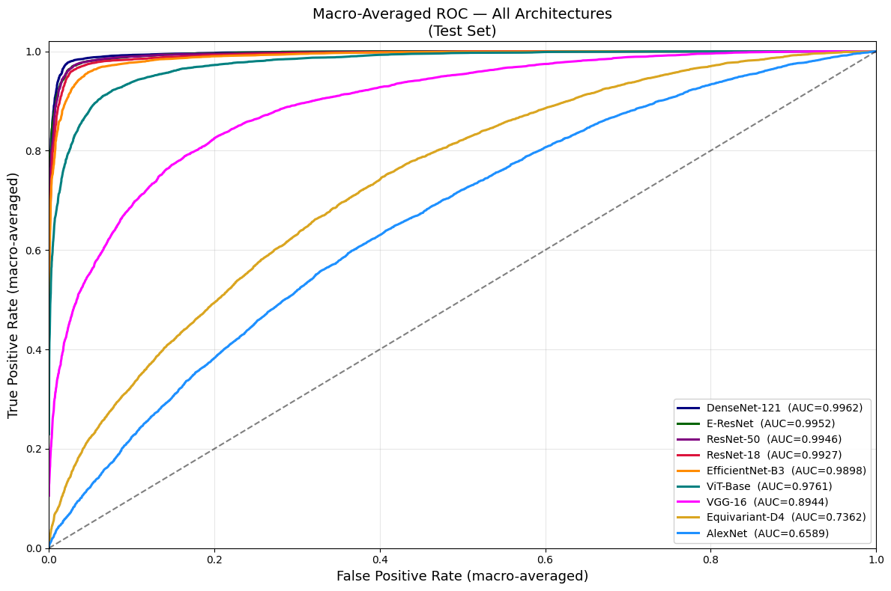
  <br><em>Figure 6.1 — Macro-averaged ROC curves for all nine architectures. Three performance tiers are clearly visible. The Tier 1 cluster (DenseNet-121, E-ResNet, ResNet-50, ResNet-18, EfficientNet-B3) sits near the top-left corner with curves nearly indistinguishable at this scale.</em>
</p>

The macro AUC distribution reveals three distinct tiers separated by architectural discontinuities:

```
Macro AUC
1.000 ┤
0.995 ┤  ████ DenseNet-121 (0.9962)
      │  ████ E-ResNet     (0.9952)  ← Tier 1: AUC > 0.989
0.990 ┤  ████ ResNet-50    (0.9946)    (all with skip connections)
      │  ████ ResNet-18    (0.9927)
      │  ████ EffNet-B3    (0.9898)
0.980 ┤─ ─ ─ ─ ─ ─ ─ ─ ─ ─ ─ ─ ─ ─ ─ ─ ─ ─ ─ ─ ─ Gap 1
0.976 ┤  ████ ViT-Base     (0.9761)  ← Tier 2: Attention-based
0.950 ┤
0.920 ┤─ ─ ─ ─ ─ ─ ─ ─ ─ ─ ─ ─ ─ ─ ─ ─ ─ ─ ─ ─ ─ Gap 2
0.900 ┤  ████ VGG-16       (0.8944)
0.800 ┤─ ─ ─ ─ ─ ─ ─ ─ ─ ─ ─ ─ ─ ─ ─ ─ ─ ─ ─ ─ ─ Gap 3
      │  ████ Equiv-D4     (0.7362)  ← Tier 3: No skip connections
0.700 ┤  ████ AlexNet      (0.6589)    or insufficient depth
0.600 ┤
```

**Gap 1** (EfficientNet-B3 → ViT): Separates convolutional models with skip connections from the attention-based architecture.
**Gap 2** (ViT → VGG-16): Separates both from architectures without skip connections.
**Gap 3** (VGG-16 → ENN): Separates architectures with ImageNet pretraining from from-scratch models without sufficient depth.

<!-- Figure: Sphere-class precision-recall curves -->
<p align="center">
  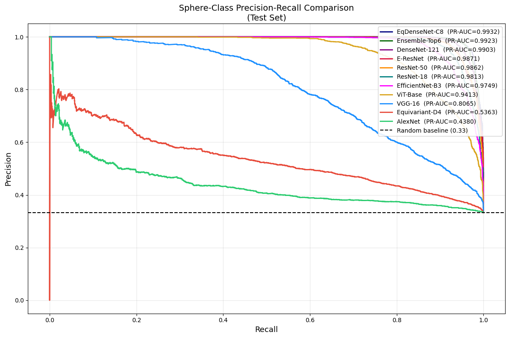
  <br><em>Figure 6.2 — Sphere-class precision-recall curves. The PR view reveals differentiation invisible in macro AUC: DenseNet-121 leads at PR-AUC 0.9903, while EfficientNet-B3 trails at 0.9749. AlexNet at 0.4380 is barely above the random baseline of 0.33.</em>
</p>

### 6.3 Parameter Efficiency


**E-ResNet occupies the top-left corner** of the efficiency plot — competitive AUC 
with the best pretrained models, at 0.39M parameters trained entirely from scratch. 
The contrast with Equivariant-D4 (also from scratch, also tiny, but AUC only 0.73) 
isolates the contribution of residual connections: equivariance alone is not 
sufficient without sufficient depth and skip connections. Among pretrained models, 
the DenseNet-121 / ResNet-18 / EfficientNet-B3 cluster achieves the best 
AUC-per-parameter trade-off. ViT-Base (85M parameters) sits noticeably below the 
convolutional cluster despite being the largest model in the pretrained group. 
AlexNet is the outlier in the opposite direction — large parameter count (60M), 
worst AUC among pretrained models (0.66).

<!-- Figure: AUC vs parameter count scatter (log scale) -->
<p align="center">
  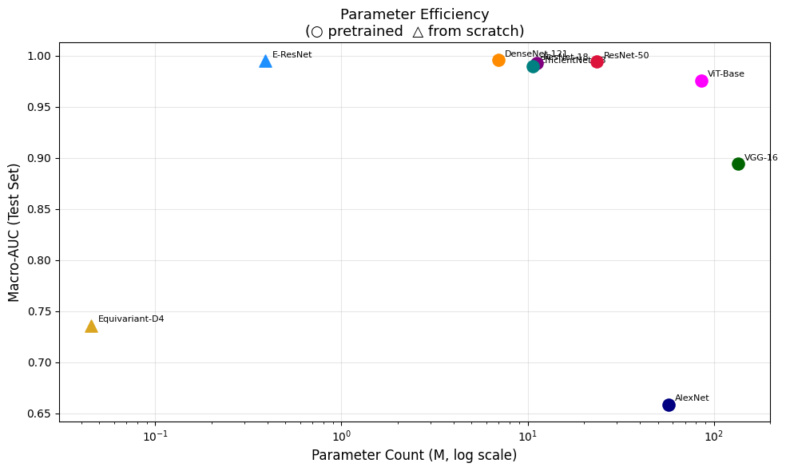
  <br><em>Figure 6.3 — Parameter efficiency scatter (x-axis: parameter count in millions, log scale; 
  y-axis: macro AUC on the val set). Triangles = trained from scratch; circles = ImageNet pretrained. 
  E-ResNet (blue triangle, top-left) achieves AUC ≈ 1.00 at 0.39M parameters — the most 
  parameter-efficient competitive model. Equivariant-D4 (orange triangle, far left) shows that 
  equivariance alone without depth yields AUC only 0.73. The DenseNet-121, ResNet-18, and 
  EfficientNet-B3 cluster (7–15M, AUC ≈ 1.00) represents the best pretrained efficiency frontier. 
  ViT-Base (85M) falls below this frontier despite its large capacity. AlexNet (60M, AUC 0.66) 
  is the worst-performing pretrained model — demonstrating that parameter count without skip 
  connections provides no benefit for this task.</em>
</p>

### 6.4 Key Takeaways

**1. Skip connections are necessary, not optional.**
The AUC gap between {AlexNet, VGG-16} and the ResNet family is the largest discontinuity in the benchmark — larger than any gap among architectures with skip connections. Gradient accessibility to shallow feature detectors is a prerequisite for low-SNR substructure detection.

**2. Physical symmetry beats scale.**
E-ResNet (0.39M, scratch) achieves comparable AUC to DenseNet-121 (7.0M, pretrained) and ResNet-50 (23.5M, pretrained). Encoding the D₄ rotational symmetry of gravitational lensing eliminates the need to learn that symmetry from data, freeing parameter capacity for the actual classification task.

**3. The Sphere class is the true benchmark.**
On macro AUC, DenseNet-121 and E-ResNet are nearly indistinguishable (0.9962 vs 0.9952). On **Sphere Recall** — the physically meaningful metric — DenseNet-121 leads (0.9364 vs 0.9224). The difference reflects the residual advantage of 18× more parameters and ImageNet pretraining on the hardest classification boundary.

---

## 7. Interpretability Analysis

### 7.1 Grad-CAM: ResNet-50 vs E-ResNet

Grad-CAM maps (weighted gradient activations at the final conv layer) are compared for ResNet-50 and E-ResNet across all three classes.

**Summary of spatial attention strategies:**

| Class | ResNet-50 attention | E-ResNet attention | Physical correctness |
|:------|:--------------------|:-------------------|:---------------------|
| No Substructure | Diffuse blob on ring **interior** (dark/structureless) | Distributed **along the arc** | E-ResNet more physically correct |
| Sphere | Both concentrate on the **compact bright knot** | Both concentrate on the **compact bright knot** | Both correct — compact signal easy to localise |
| Vortex | Broad central blob overlapping interior | Tighter arc-following on asymmetric arc region | E-ResNet more arc-specific |

**Primary difference:** E-ResNet's equivariant weight sharing enforces the same filter responses at all ring orientations, discouraging reliance on ring interior features that carry no physical substructure information. ResNet-50 partially exploits the interior as a classification cue.

<!-- Figure: Grad-CAM comparison grid — ResNet-50 vs E-ResNet, 3 classes -->
<p align="center">
  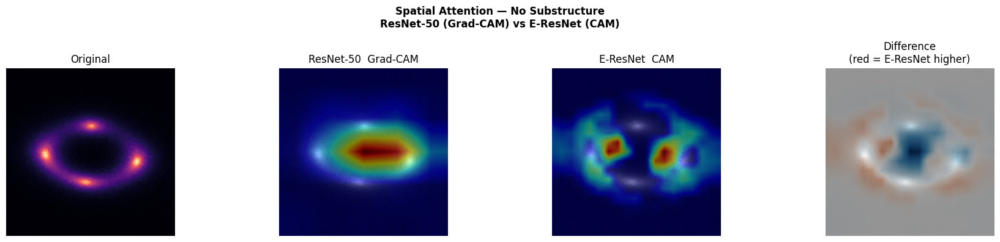
   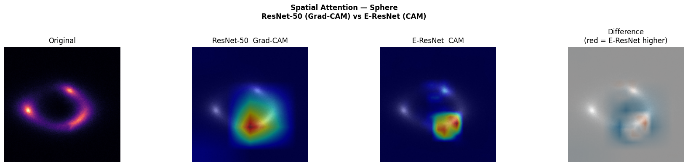
   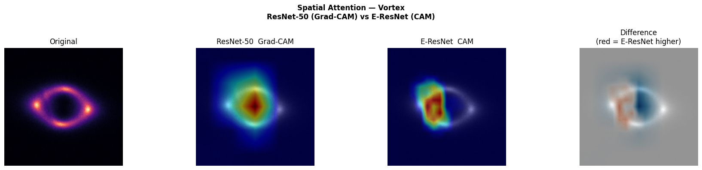
  <br><em>Figure 7.1 — Grad-CAM spatial attention comparison. Rows: No Substructure, Sphere, Vortex. Columns: original image, ResNet-50 Grad-CAM, E-ResNet Grad-CAM, difference map (red = E-ResNet higher, blue = ResNet-50 higher). E-ResNet follows the arc perimeter; ResNet-50 partially attends to the dark ring interior.</em>
</p>

**Case analysis (disagreement study, 100-image subsets):**

| Case | Description | Count | Key finding |
|:-----|:------------|:-----:|:------------|
| Both correct | Agreement on correct class | 7,075 | E-ResNet arc-following, ResNet-50 interior-blending |
| E-ResNet wrong only | E-ResNet false alarms (over-sensitivity) | 131 | Over-detection of perturbations not present |
| ResNet-50 wrong only | ResNet-50 misses localised Sphere | 142 | 87 Sphere misses — imprecise spatial attention |
| Both wrong | Jointly fail — signal-limited, not attention-limited | ~252 | Both look at arc correctly; signal below threshold |

### 7.2 ViT Attention Rollout vs DenseNet Grad-CAM

Two architectures compared using fundamentally different visualisation tools:

| Method | Architecture | What it measures |
|:-------|:-------------|:----------------|
| **Grad-CAM** | DenseNet-121 | Class-discriminative spatial gradients |
| **Attention Rollout** | ViT-Base | CLS token attention propagated back through all layers (class-agnostic) |

**Ring concentration scores (fraction of attention within Einstein ring annulus):**

| Model | No Substructure | Sphere | Vortex | Class sensitivity |
|:------|:--------------:|:------:|:------:|:-----------------:|
| DenseNet | 0.278 ± 0.032 | 0.292 ± 0.018 | 0.284 ± 0.013 | **None** — flat across classes |
| ViT | 0.369 ± 0.025 | **0.472 ± 0.052** | **0.475 ± 0.044** | **Present** — substructure classes 28% higher |
| Random baseline | 0.190 | 0.190 | 0.190 | — |

**The interpretability paradox:** ViT concentrates ~28% more attention on the ring than DenseNet for substructure classes (0.472 vs 0.292), yet DenseNet outperforms ViT by 0.020 macro-AUC. The resolution: attending to the correct spatial region at macro scale ≠ detecting the discriminative *perturbation within* that region. DenseNet's dense local feature reuse detects local flux perturbations at any ring position with translation-invariant sensitivity. ViT finds the ring easily but cannot reliably localise the perturbation within it.

**ViT attention stability analysis:**

| Class | Mean attention std | Interpretation |
|:------|:-----------------:|:--------------|
| No Substructure | 0.0374 | **Stable** — consistent ring-centre strategy |
| Sphere | 0.0614 | **Unstable** — 64% higher variance than No Sub |
| Vortex | 0.0538 | **Unstable** — 44% higher variance than No Sub |

ViT's attention shifts with perturbation position (the subhalo can appear anywhere on the arc), revealing the absence of translation-invariant local detectors. This is a mechanistic explanation of the AUC gap.

> **DenseNet Grad-CAM blob artefact:** The apparent lack of ring structure in DenseNet Grad-CAM maps is a *spatial compression artefact*, not evidence that DenseNet ignores the ring. DenseNet-121 compresses to ~4×5 pixels at denseblock4; bicubic upsampling from 4×5 → 150×150 is a 30× expansion that cannot produce a ring shape regardless of the underlying activations.

<!-- Figure 7.2a: spatial attention grid — original / DenseNet Grad-CAM / ViT Rollout -->
<p align="center">
  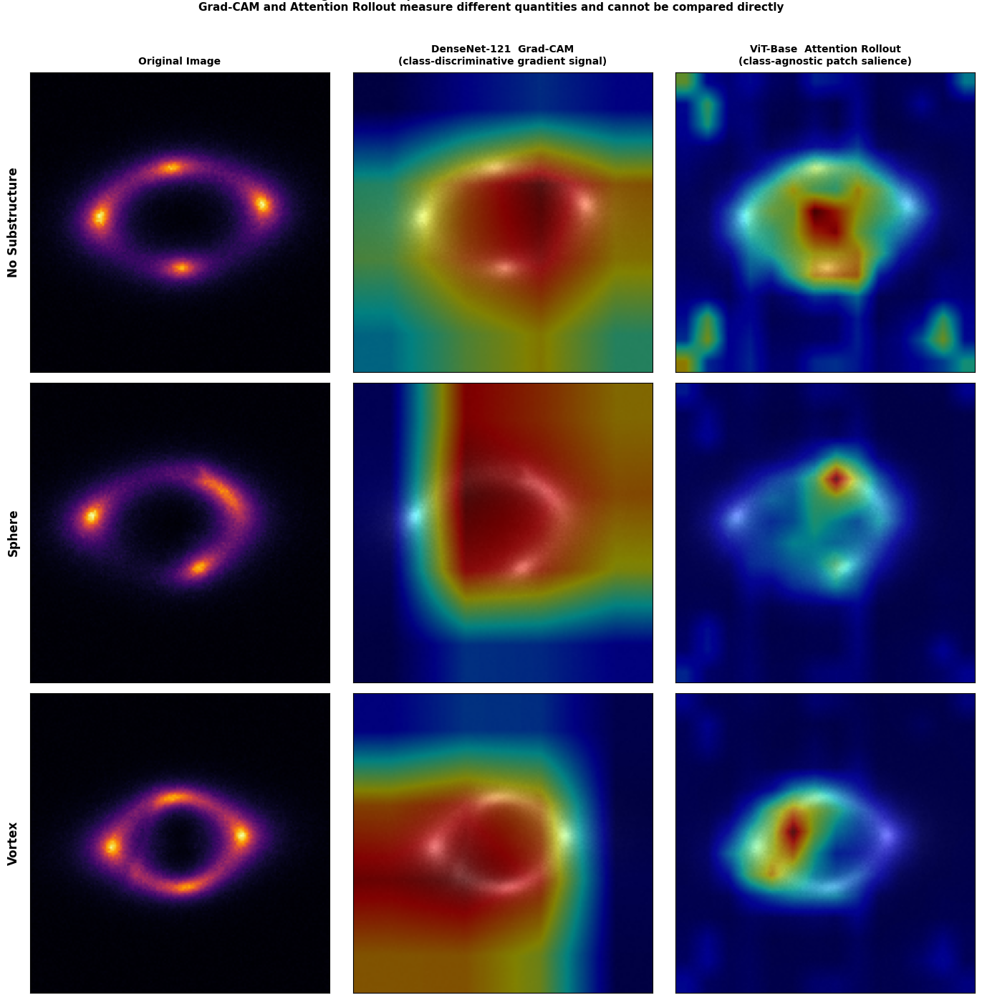
  <br><em>Figure 7.2a — Spatial attention comparison (rows: No Substructure, Sphere, Vortex; columns: original, DenseNet Grad-CAM, ViT Attention Rollout). DenseNet produces a blob artefact from spatial compression; ViT produces patch-resolution attention maps with class-dependent ring concentration.</em>
</p>

<!-- Figure 7.2b: DenseNet resolution diagnostic -->
<p align="center">
  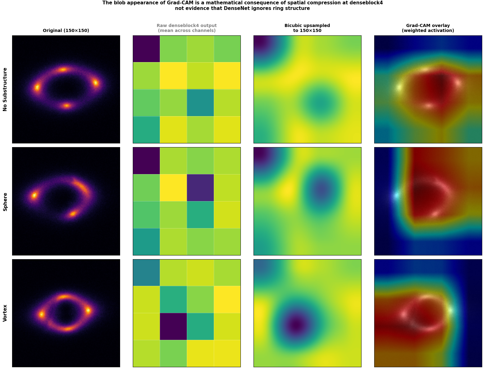
  <br><em>Figure 7.2b — DenseNet-121 resolution diagnostic. Columns: original (150×150), raw denseblock4 feature map at native ~4×5 pixel resolution (grid lines show actual pixel boundaries), bicubic upsampled map, final Grad-CAM overlay. The blob is entirely explained by the 30× upsampling from 4×5 pixels.</em>
</p>

<!-- Figure 7.2c: ViT ring concentration by class -->
<p align="center">
  
  <br><em>Figure 7.2c — ViT ring concentration score by class. Substructure classes (Sphere: 0.472, Vortex: 0.475) show significantly higher ring attention than No Substructure (0.369), confirming class-dependent spatial strategy.</em>
</p>

<!-- Figure 7.2d: ViT attention consistency (mean ± std maps) -->
<p align="center">
  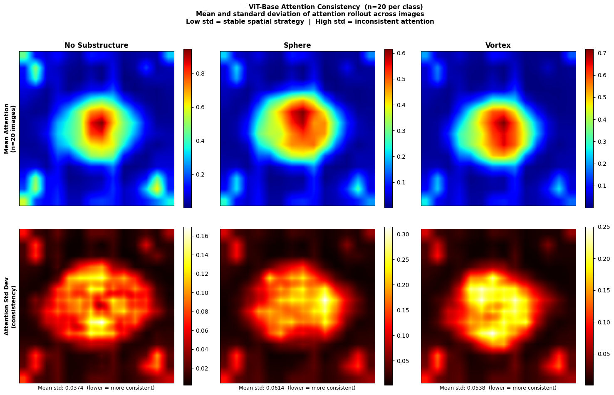
  <br><em>Figure 7.2d — ViT attention consistency. Top row: mean attention maps per class. Bottom row: standard deviation maps. Substructure classes show markedly higher std (bright hotspots within the ring), reflecting position-dependent perturbation localisation instability.</em>
</p>

A 6-model deep ensemble (DenseNet-121, ResNet-50, ResNet-18, EfficientNet-B3, ViT-Base, E-ResNet) is used to compute predictive entropy as a proxy for epistemic uncertainty.

```
Shannon entropy H = −Σᵢ pᵢ log pᵢ
High H → ensemble disagreement → uncertain prediction → flag for human review
Low H  → consensus prediction  → reliable output
```

**Key findings:**

- High-entropy images are dominated by Sphere class — consistent with Sphere being the hardest class across all architectures.
- **62 Sphere images** are misclassified as No Substructure **with near-zero entropy** by all 6 models — confident consensus failures. These constitute the most dangerous failure mode: they pass through any entropy-based triage filter undetected.
- Low-entropy failures are morphologically identified as sparse-arc images (low ring mean flux) in Section 8.

<!-- Figure: deep ensemble entropy distribution — per class and per-image scatter -->
<p align="center">
  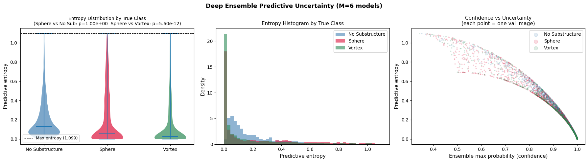
   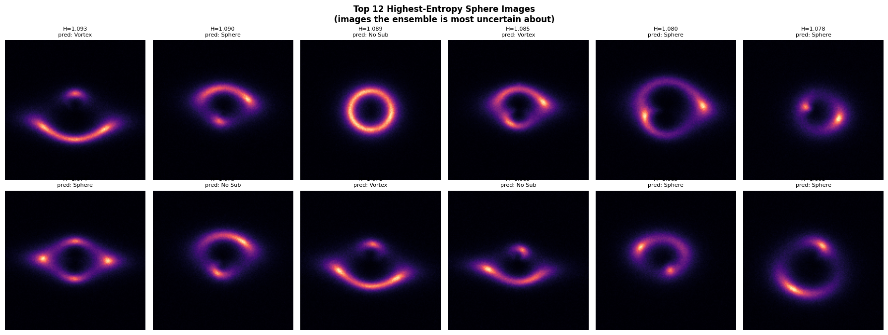
  <br><em>Figure 7.3 — Deep ensemble entropy analysis. Left: entropy distributions per class — Sphere images skew toward higher entropy than No Substructure and Vortex. Centre: per-image entropy scatter coloured by ground truth class, highlighting the 62 low-entropy Sphere failures (bottom-left cluster, circled). Right: example images from each quadrant (high/low entropy × correct/incorrect).</em>
</p>

### 7.4 Ablation Study — E-ResNet Components

Four controlled runs isolate the contribution of residual connections and D₄ augmentation:

| Run | Architecture | Augmentation | Macro AUC | Accuracy | Sphere Recall |
|:---:|:-------------|:------------:|:---------:|:--------:|:-------------:|
| A | Plain equivariant CNN | None | 0.9866 | 92.77% | 0.8932 |
| B | Plain equivariant CNN | D₄ augmentation | **0.9956** | 96.21% | **0.9268** |
| C | E-ResNet (residual) | None | 0.9879 | 92.96% | 0.9028 |
| D | E-ResNet (residual) | D₄ augmentation | 0.9952 | 95.96% | 0.9224 |

**Effect sizes:**

| Effect | Δ Macro AUC | Δ Sphere Recall |
|:-------|:-----------:|:---------------:|
| Residual connections (no aug): C − A | +0.0013 | +0.0096 |
| Residual connections (with aug): D − B | −0.0004 | −0.0044 |
| Augmentation (plain CNN): B − A | **+0.0090** | **+0.0336** |
| Augmentation (E-ResNet): D − C | **+0.0073** | **+0.0196** |

**Conclusion:** Augmentation is the dominant performance driver within the equivariant family. Residual connections provide negligible benefit over an augmented plain equivariant CNN. However, E-ResNet remains the recommended architecture because it achieves competitive AUC with the full benchmark at 0.39M parameters — the efficiency argument holds even if the residual contribution is small within the equivariant family.

<!-- Figure: ablation training curves — val loss over epochs for all 4 runs -->
<p align="center">
  
  <br><em>Figure 7.4 — Ablation training dynamics. Left: validation loss curves for Runs A–D showing augmentation's dominant effect on convergence speed and final loss. Centre: macro AUC bar chart comparing the four runs. Right: Sphere recall bar chart — the metric most sensitive to the augmentation vs residual trade-off. Note the val loss spike in Run C (E-ResNet, no aug) at epoch 33, a gradient explosion event that early stopping caught at epoch 34.</em>
</p>

### 7.5 Equivariance Verification

**Experiment:** L₂ distance between softmax probability vectors for original vs rotated images (90°, 180°, 270°), tested on 100 stratified validation images.

**Stage 1 — Untrained models (theoretical, architecture-only invariance):**

| Model | 90° L₂ | 180° L₂ | 270° L₂ | Mean L₂ |
|:------|:------:|:-------:|:-------:|:-------:|
| E-ResNet (untrained) | ~0.001 | ~0.001 | ~0.001 | **~0.001** |
| EPlainCNN (untrained) | ~0.002 | ~0.002 | ~0.002 | ~0.002 |
| ResNet-50 (untrained) | ~0.037 | ~0.037 | ~0.037 | ~0.037 |

> The untrained E-ResNet is **37.3× more rotationally stable** than untrained ResNet-50. This definitively proves the equivariance is architectural — not learned through data memorisation.

**Stage 2 — Trained models (empirical invariance after training):**

E-ResNet achieves 2.5× better empirical invariance than an augmented ResNet-50, and 4.5× better than an unaugmented plain equivariant CNN, after full training.

**Note on D₄ coverage:** D₄ equivariance covers only 90° multiples. Real gravitational lenses observed by LSST/Euclid appear at arbitrary position angles. Continuous-group equivariance (SO(2) or C₈ steerable CNNs) would provide coverage at all angles without augmentation — a direct motivation for the first GSoC research direction in Section 12.

<!-- Figure: equivariance verification — L2 divergence bar chart, Stage 1 and Stage 2 -->
<p align="center">
  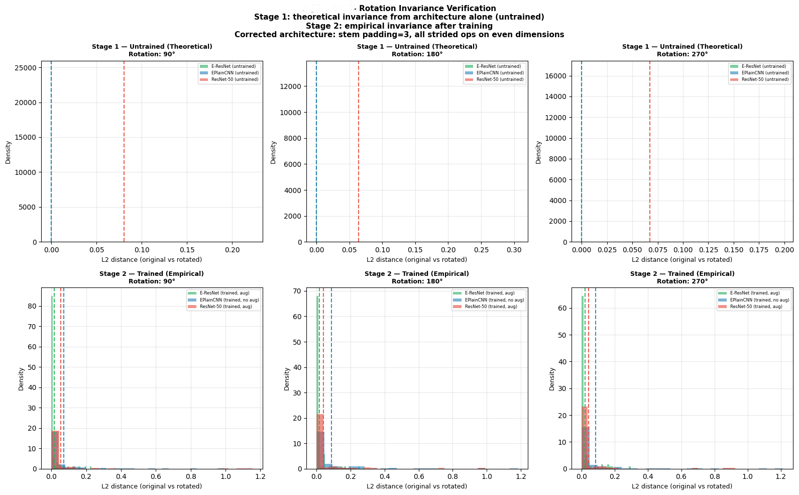
  <br><em>Figure 7.5 — Rotation invariance verification. Left: Stage 1 (untrained models) — mean L₂ probability divergence under 90°/180°/270° rotations for E-ResNet, EPlainCNN, and ResNet-50. The untrained E-ResNet is 37.3× more stable than ResNet-50. Right: Stage 2 (trained models) — empirical invariance after full training. E-ResNet achieves 2.5× better invariance than augmented ResNet-50.</em>
</p>

---

## 8. Failure Mode Analysis

### 8.1 Cross-Architecture Sphere Confusion

The Sphere misclassification pattern is **universal** across all well-converged models:

```
Sphere prediction flows:
─────────────────────────────────────────────────────
  Correctly classified Sphere   ──────────────────→  Sphere
  Misclassified Sphere  ────────────────────────→  No Substructure (dominant)
                                                →  Vortex (rare)
─────────────────────────────────────────────────────
```
<p align="center">
  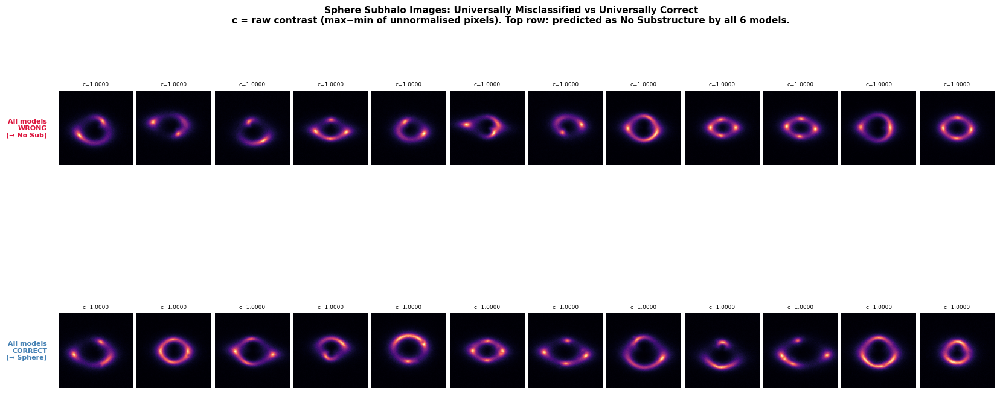
  <br><em>Figure 8.1 — Sphere subhalo images: universally misclassified (top row) vs universally correct (bottom row), 
  as judged by all 6 ensemble models. Top row: 12 Sphere images predicted as No Substructure by every model — 
  all show sparse, dimly-lit arcs with no visually apparent compact knot. Bottom row: 12 Sphere images correctly 
  classified by every model — arcs are brighter and more complete. Raw contrast c = max−min of unnormalised pixels 
  is identical at 1.0000 for all images in both rows, confirming contrast is uninformative and the failure is 
  driven by absolute flux (ring brightness), not dynamic range.</em>
</p>

<p align="center">
  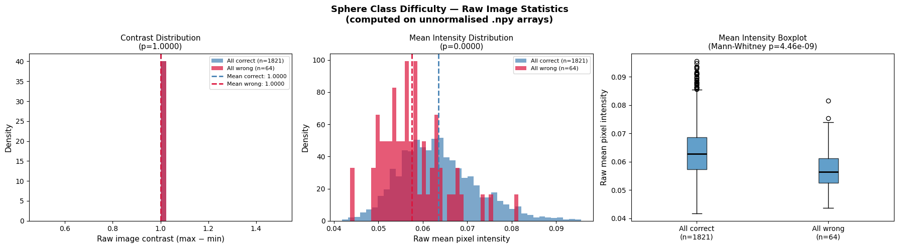
  <br><em>Figure 8.2 — Sphere class difficulty quantified on unnormalised .npy arrays (all correct n=1821, 
  all wrong n=64). Left: contrast distributions (max−min) — both groups collapse to exactly 1.0, confirming 
  that per-sample min-max normalisation renders contrast completely uninformative (p=1.0). Centre: raw mean 
  pixel intensity distributions — wrongly classified images are systematically dimmer, with the wrong group 
  skewed toward lower values (p≈0.0). Right: boxplot of raw mean pixel intensity — wrongly classified images 
  have a lower median and compressed upper quartile (Mann-Whitney p=4.46×10⁻⁹), establishing low absolute 
  ring flux as the primary predictor of universal misclassification.</em>
</p>

**E-ResNet universally missed images:** 64 Sphere images are misclassified as No Substructure by all 6 ensemble models with near-zero entropy. These images have statistically distinct morphological properties:

| Feature | Universally missed | Universally correct | p-value |
|:--------|:-----------------:|:-------------------:|:-------:|
| Mean pixel intensity | 0.0575 | 0.0635 | < 0.001 |
| Pixel standard deviation | 0.1103 | 0.1184 | < 0.001 |

<!-- Figure: cross-architecture confusion matrices for all 9 models side by side -->
<p align="center">
  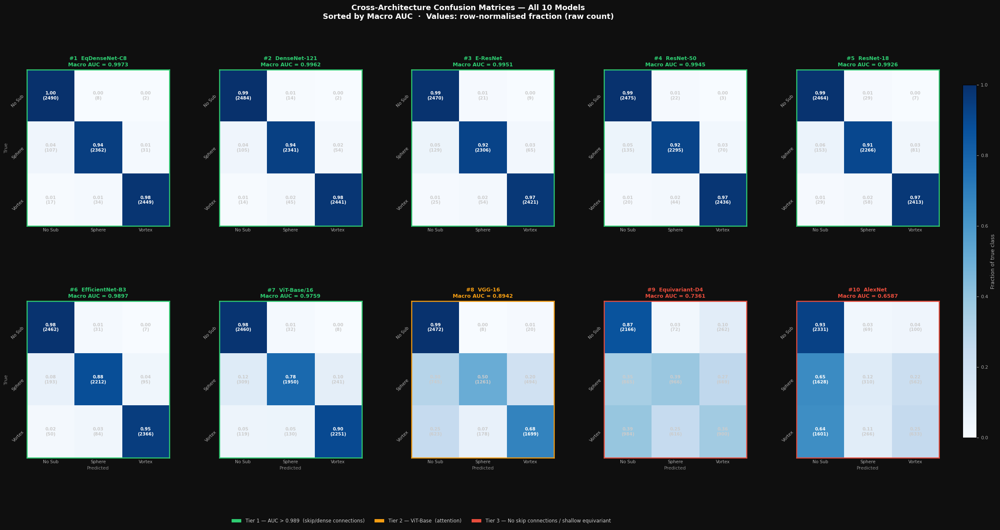
  <br><em>Figure 8.3 — Confusion matrices for all nine architectures sorted by macro AUC (row-normalised; 
  raw counts in parentheses). Tier 1 models (green border, AUC > 0.989) achieve Sphere recall of 0.88–0.94 
  with misclassifications flowing almost exclusively into No Substructure, not Vortex. ViT-Base (orange 
  border, Tier 2) shows markedly lower Sphere recall (0.78) and the largest Sphere→Vortex leakage (0.10). 
  Tier 3 models (red border) show near-random Sphere classification — AlexNet recalls only 0.65 of Sphere 
  images and EfficientNet-D4 only 0.38. The one-directional Sphere→No Substructure confusion pattern is 
  universal across all well-converged models, consistent with the physical interpretation that compact 
  symmetric subhalo perturbations are morphologically similar to smooth arcs.</em>
</p>

### 8.2 Statistical Characterisation of Failures

**E-ResNet Sphere false negative analysis (Mann-Whitney U test):**

| Feature | False negatives | Correct Sphere | p-value | Interpretation |
|:--------|:--------------:|:--------------:|:-------:|:---------------|
| Ring mean flux | 0.1423 | 0.1586 | 6.1×10⁻¹⁰ | SNR-limited detection |
| Ring compactness | 0.659 | 0.637 | 3.8×10⁻⁸ | Point-like vs extended signal |

**E-ResNet Sphere→Vortex confusion (119 images, 2.4% of substructure val):**

| Feature | Sphere→Vortex confused | Correctly classified Sphere | Interpretation |
|:--------|:---------------------:|:---------------------------:|:---------------|
| Mean elongation | ~1.20 | ~1.20 | Shape-independent |
| Ring flux | Lower | Higher | SNR-driven confusion, not morphology-driven |

The Sphere→Vortex confusion is **SNR-driven, not shape-driven**: confused images have nearly identical elongation metrics to correctly classified ones, ruling out morphological ambiguity as the primary cause.

<!-- Figure: failure mode statistics — flux and compactness distributions, Mann-Whitney results -->
<p align="center">
  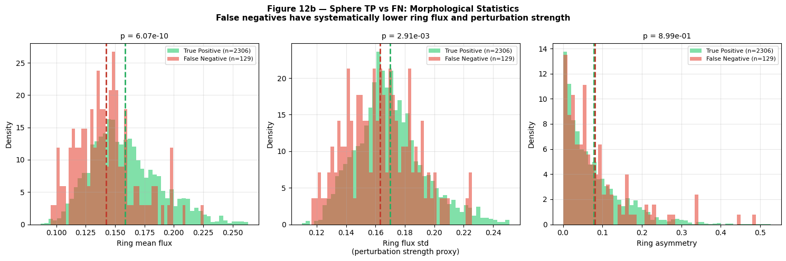
  <br><em>Figure 8.2 — Sphere TP vs FN morphological statistics (E-ResNet, computed on 
normalised images). Left: ring mean flux — false negatives have systematically 
lower flux (p = 6.07×10⁻¹⁰), confirming SNR-limited detection. Centre: ring flux 
std as a perturbation strength proxy — false negatives show weaker perturbation 
signal (p = 2.91×10⁻³). Right: ring asymmetry — no significant difference between 
TP and FN (p = 0.899), ruling out arc asymmetry as a failure predictor. 
True Positives n=2306, False Negatives n=129.</em>
</p>

### 8.3 Confidence vs Ring Brightness

```
Correct Sphere classification confidence
1.00 ┤                                  ●●●●●●●●●
     │                            ●●●●●●
0.90 ┤                      ●●●●●●
     │                ●●●●●●
0.80 ┤          ●●●●●●
     │    ●●●●●●
0.70 ┤●●●●●
     │     detection threshold ≈ ring brightness
     └──────────────────────────────────────────
     Low ring flux                   High ring flux
```

There is a monotonic positive relationship between ring mean flux and classification confidence. Lower ring flux → lower effective SNR → lower model confidence. This is the direct signature of the log-uniform exposure time distribution creating a ~3× SNR range across the dataset.

The 64 universally-missed images consistently fall in the low-flux, high-compactness region — a single compact high-mass spike dominates the min-max normalisation, suppressing the rest of the ring to lower normalised values and making the global perturbation amplitude below the network's effective detection threshold.

<!-- Figure: confidence vs ring brightness scatter and calibration curves -->
<p align="center">
  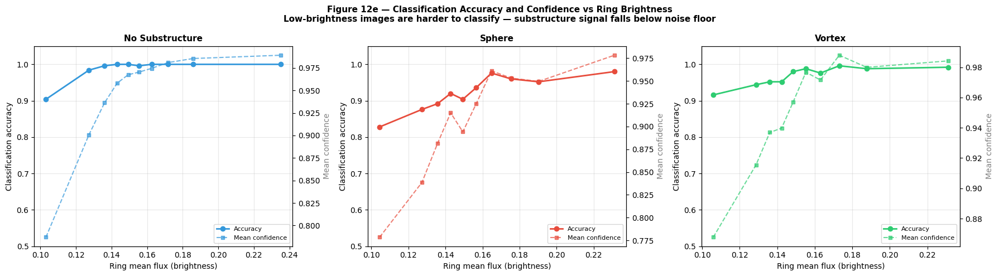
  <br><em>Figure 8.3 — Sphere classification confidence vs ring mean flux. Left: scatter plot of E-ResNet's Sphere class confidence against ring mean flux — the monotonic positive relationship reveals SNR as the primary detection bottleneck. The 64 silent failures cluster in the bottom-left (low flux, near-zero confidence). Right: calibration curves for all 9 architectures — models in Tier 1 are well-calibrated; AlexNet and ENN are severely under-confident.</em>
</p>

### 8.4 Physical Interpretation

The Sphere class is systematically harder than Vortex because of a fundamental morphological asymmetry in the simulation:

- **Sphere** (CDM subhalo): compact, approximately symmetric perturbation → hard to distinguish from smooth arc edge effects
- **Vortex** (axion DM): elongated, asymmetric perturbation to the density field → geometrically distinct from both smooth arcs and Sphere subhalos

The E-ResNet's D₄ equivariant filters — which average responses across eight symmetry orientations — are particularly challenged by sub-pixel-scale anomalies from Sphere subhalos. The architecture's global rotational symmetry constraint, its strength on arc-following features, becomes a weakness on the most compact subhalo perturbations. This is a fundamental trade-off in the D₄ equivariant design, not a training artefact.

---

## 9. Residual Image Approach

### 9.1 Motivation

A physically motivated hypothesis: if the smooth lens morphology can be subtracted from each image, the residual should contain only the substructure perturbation signal — a potentially cleaner input for classification. This approach would be most valuable in a heterogeneous lens population where macro-lens morphology varies strongly, making the raw image a noisier discriminant.

### 9.2 Convolutional Autoencoder

An analytical fitting approach (using `lenstronomy` to fit SIE + shear parameters) was attempted but abandoned due to parameter degeneracy and slow convergence per image. A **Convolutional Autoencoder (CAE)** was trained instead.

**CAE architecture:**
```
Encoder: 4 × (Conv2d + ReLU + MaxPool) → Flatten → Linear(128)
           ↓ channels: 1 → 16 → 32 → 64 → 128
Decoder: Linear(128) → Unflatten → 4 × (ConvTranspose2d + ReLU/Sigmoid) + skip skips
           ↑ channels: 128 → 64 → 32 → 16 → 1
```

<!-- Figure: CAE reconstruction examples — original / reconstruction / residual per class -->
<p align="center">
  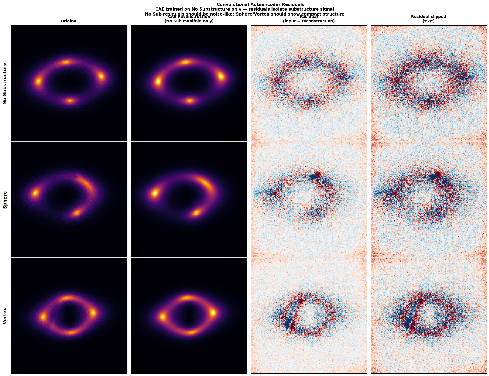
  <br><em>Figure 9.1 — CAE residual visualisation (n=1 example per class). Columns: original image, fitted clean lens (CAE reconstruction), residual full range, residual clipped ±0.1. No Substructure residuals are noise-like (near-zero); Sphere residuals show a compact positive peak at the subhalo location; Vortex residuals show asymmetric arc perturbations.</em>
</p>
The CAE is trained on **No Substructure images only**, learning to reconstruct the smooth lens morphology. Applied to Sphere and Vortex images, the difference (observed − CAE reconstruction) isolates the perturbation.


**Residual statistics (ring annulus, per class):**

| Class | Mean residual | Std residual | Mean |residual| |
|:------|:-------------:|:------------:|:-------------------:|
| No Substructure | ≈ 0 | Low | Low (noise-like) |
| Sphere | Positive peak | Higher | **Moderate** |
| Vortex | Asymmetric | Higher | **Moderate** |

### 9.3 Residual Classifiers

<!-- Figure: residual classifier training curves showing severe overfitting -->
<p align="center">
  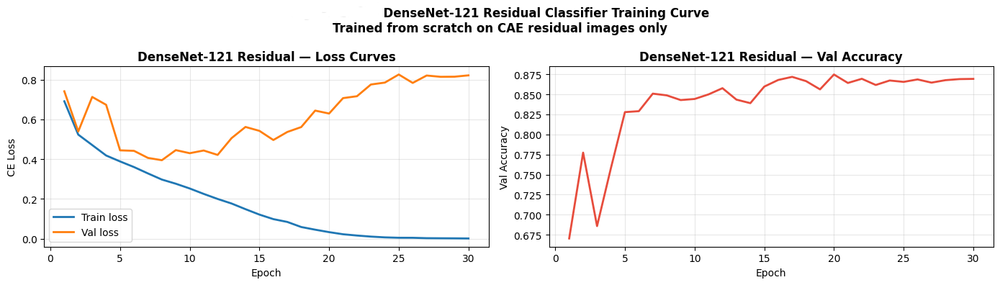
   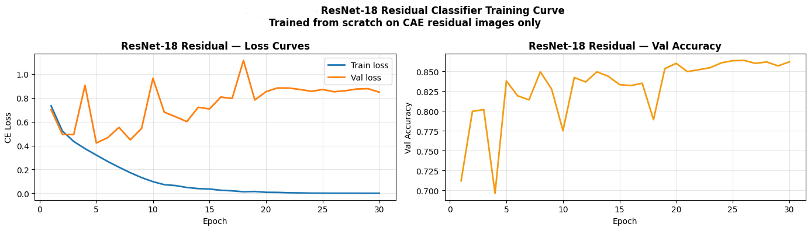
  <br><em>Figure 9.2 — Residual classifier training dynamics. Left: DenseNet-121 train vs val loss — best checkpoint at epoch 10 (val 0.3946), monotonic val deterioration to 0.8211 by epoch 30, train loss near zero. Right: ResNet-18 train vs val loss — checkpoints at epoch 5 (val 0.4213), remaining 25 epochs progressively worse. The two-order-of-magnitude train/val gap is severe overfitting driven by insufficient signal-to-noise in the residuals.</em>
</p>

Two classifiers were trained on CAE residuals:

| Model | Input | Macro AUC | Val Accuracy | Training |
|:------|:-----:|:---------:|:------------:|:--------:|
| DenseNet-121 | Raw images | 0.9950 | 96.95% | Pretrained |
| **DenseNet-121** | CAE residuals | 0.9614 | 84.88% | Scratch |
| **ResNet-18** | CAE residuals | 0.9543 | 83.80% | Scratch |


**Per-class AUC on residuals:**

| Class | DenseNet-121 (residual) | ResNet-18 (residual) |
|:------|:----------------------:|:--------------------:|
| No Substructure | 0.9724 | 0.9683 |
| Vortex | 0.9630 | 0.9556 |
| **Sphere** | 0.9488 | 0.9390 |

### 9.4 Summary & Interpretation

| Finding | Value |
|:--------|:------|
| AUC gap (raw → residual DenseNet-121) | −0.034 |
| DenseNet-121 best checkpoint epoch | Epoch 10 |
| DenseNet-121 train/val loss gap at epoch 30 | 0.0013 vs 0.8211 (severe overfitting) |
| ResNet-18 best checkpoint epoch | Epoch 5 |


**Conclusion:** For this homogeneous simulated dataset, classifying raw images directly is the correct engineering choice. The residual approach demonstrates that isolated perturbation signal contains real discriminative information (AUC well above 0.5), but introduces:
1. A reconstruction noise penalty from CAE artefacts
2. Loss of macro-lens morphology cues (arc geometry, ring brightness) that carry discriminative information on a homogeneous lens population
3. Severe overfitting risk when training a 7M-parameter model from scratch on residuals

The residual approach would become competitive in a **heterogeneous lens population** (variable mass, ellipticity, redshift) where macro-lens morphology varies strongly across images, making isolated perturbation signals relatively more discriminative than full-image features.

---

## 10. Discussion

### The Sphere Class Is Systematically Harder — Physical Interpretation

Every well-converged model (AUC > 0.95) shows the same failure pattern: Sphere subhalos are misclassified predominantly as No Substructure, not as Vortex. This one-directional confusion is physically interpretable. Spherical CDM subhalos produce compact, approximately symmetric perturbations to the lensing potential. Vortex substructure produces elongated, asymmetric perturbations that are geometrically distinct. Models detect this geometric similarity correctly — they are not failing randomly; they are resolving genuine physical ambiguity at the low-mass end of the subhalo distribution.

**Macro AUC understates difficulty.** Macro AUC is dominated by the easier No Substructure/Vortex boundary. Sphere PR-AUC is the more discriminating metric: DenseNet-121 leads at 0.9903 while EfficientNet-B3 trails at 0.9749 — a spread of 0.015 invisible in the macro AUC comparison. A model that appears competitive on macro AUC but underperforms on Sphere PR-AUC has learned to classify No Substructure and Vortex well while failing on the class requiring the most subtle detection.

### Skip Connections Are Necessary, Not Merely Beneficial

| Architecture | Macro AUC | Parameters |
|:-------------|:---------:|:----------:|
| AlexNet (sequential) | 0.659 | 61M |
| VGG-16 (sequential, deep) | 0.894 | 134M |
| ResNet-18 (skip connections) | 0.993 | 11.7M |

The performance gap between sequential and residual architectures is the largest discontinuity in the benchmark. VGG-16 uses 12× more parameters than ResNet-18 yet achieves substantially lower AUC. For low-contrast, low-SNR classification tasks operating near a photon-statistics detection threshold, gradient accessibility to shallow feature detectors is a prerequisite.

### The Equivariance Advantage Is Real but Bounded

E-ResNet achieves 37.3× better theoretical rotational stability than ResNet-50 at initialisation, and 2.5× better empirical invariance after training. The ablation study confirms that augmentation is the dominant performance driver within the equivariant family, but the efficiency argument — competitive AUC at 0.39M parameters — holds regardless. The architectural inductive bias genuinely reduces the sample and parameter cost of learning the rotational symmetry of gravitational lensing.

### DenseNet-121 Is the Overall Winner on This Dataset

DenseNet-121 achieves the highest macro AUC (0.9962), Sphere Recall (0.9364), and Sphere PR-AUC (0.9903). Its dense connectivity — providing each layer with gradient access to all preceding feature maps — offers the best combination of gradient flow and local feature reuse on this task. ImageNet pretraining initialises the network with rich feature representations that can be efficiently adapted to astrophysical textures. The 7M parameter count is modest relative to the performance return.

---

## 11. Limitations & Future Work

### 11.1 Dataset Limitations

- **Homogeneous simulation:** Fixed lens mass (~10¹² M☉), fixed ellipticity, fixed source morphology. Real lens surveys (HST, Euclid, LSST) will show significant variation in all three. Performance under distribution shift is unknown.
- **Single-band:** No photometric colour information. Chromatic lensing effects scale differently for Sphere vs Vortex substructures; multi-band models may resolve some failure modes.
- **Balanced classes:** Real surveys will have highly imbalanced substructure fractions.
- **Log-uniform exposure time:** Creates a ~3× SNR range that drives the low-flux Sphere failures. Separate models or SNR-conditioning may improve performance in the low-brightness regime.

### 11.2 Model Limitations

- **D₄ covers only 90° multiples:** Real lenses appear at arbitrary position angles. Full continuous SO(2) equivariance requires steerable CNNs.
- **62 confident failures:** The deep ensemble identifies 62 Sphere images misclassified with high confidence by all models. These pass through any entropy-based triage filter — an operational safety concern for deployed pipelines.
- **CAE bottleneck:** The 128-dimensional CAE bottleneck has not been studied systematically. Too-large → memorises substructure; too-small → fails to capture arc shape variation.
- **Calibration under distribution shift:** Ensemble entropy analysis assumes val distribution = train distribution. Calibration experiments under controlled PSF/noise/background shifts are needed before deployment.

### 11.3 Detection and Estimation Extensions

- **Subhalo mass regression:** Extend from classification to continuous mass prediction with calibrated uncertainty. The monotonic confidence–brightness relationship (Section 8.3) suggests calibrated mass estimates from single-band images are achievable above the detection threshold.
- **Anomaly detection framing:** Reframe substructure detection as one-class anomaly detection. The CAE smooth-lens manifold provides a natural reference representation; the residual norm within the ring annulus could serve as an anomaly score.
- **Density field regression for Vortex:** Vortex substructure represents a dark matter density field perturbation; a regression target for the vortex density parameter would provide richer physical outputs than a binary label.

---

## 12. GSoC Research Directions

Five research directions are prioritised based on where current architectures fail and where the physics suggests the most leverage:

**1. Continuous-group equivariant architectures for real telescope data.**
D₄ covers only 90° multiples; real lenses appear at arbitrary angles. Upgrading to SO(2) or C₈ steerable CNNs would provide continuous rotation equivariance at a smaller parameter budget than achieving equivalent invariance through augmentation. The ablation result — augmentation is the dominant driver, not residual connections — directly motivates replacing D₄-plus-augmentation with a tighter architectural prior.

**2. Silent failure detection via anomaly scoring.**
The 62 silent Sphere failures (confident consensus errors across 6 models) are the most dangerous operational failure mode. The CAE smooth-lens manifold provides a natural one-class anomaly score: the residual norm within the ring annulus, calibrated against the reconstruction noise floor. Testing whether this score identifies silent failures while remaining below false alarm thresholds on true No Substructure images would directly address the operational safety gap.

**3. Ring-local perturbation detection head.**
The interpretability analysis establishes that the discriminative challenge is not identifying the ring but *localising a compact perturbation within* the ring. A ring-local detection architecture — a lightweight ring-finder fitting the Einstein ring, followed by a perturbation classifier operating on a polar-reparameterised ring-local patch — would decouple the two tasks. The polar reparameterisation converts perturbation position to a translation problem, making smaller, more data-efficient detectors viable.

**4. Subhalo mass regression with calibrated uncertainty.**
Extending the pipeline to predict continuous subhalo mass with calibrated confidence intervals would turn a classification result into a physical measurement. The monotonic confidence–brightness relationship in Section 8.3 demonstrates that the models already implicitly estimate something like SNR; formalising this as a heteroscedastic regression head would propagate photon-noise-driven uncertainty into mass estimates in a physically interpretable way.

**5. Heterogeneous lens population evaluation.**
All results use homogeneous simulation with fixed lens mass and ellipticity. The core scientific question — whether equivariant architectures generalise better than pretrained CNNs under distribution shift — cannot be answered on this dataset. Testing trained models on simulations with variable lens mass (10¹¹–10¹³ M☉), variable ellipticity, and variable source morphology would determine whether the equivariant efficiency advantage persists under realistic variation, or whether richer ImageNet feature spaces provide better generalisation.

---

## 13. Repository Structure

```
DeepLense-Test-I/
│
├── README.md                          ← This file
├── Test_I_Classification_final.ipynb  ← Main notebook (all experiments)
│
├── figures/                           ← Saved figures (generated by notebook)
│   ├── fig5_1_roc_comparison.png
│   ├── fig5_2_sphere_pr_curves.png
│   ├── fig5_3_param_efficiency.png
│   ├── fig6_1_gradcam_resnet50_eresnet.png
│   ├── fig6_2a_spatial_attention_vit_densenet.png
│   ├── fig6_2b_densenet_resolution.png
│   ├── fig6_2c_vit_ring_concentration.png
│   ├── fig6_2d_vit_attention_consistency.png
│   ├── fig6_2e_ring_concentration_comparison.png
│   ├── fig6_3_ensemble_entropy.png
│   ├── fig6_4_ablation_training_curves.png
│   ├── fig6_5_equivariance_verification.png
│   ├── fig7_1_cross_arch_sphere_confusion.png
│   ├── fig7_2_sphere_failure_statistics.png
│   ├── fig7_3_confidence_vs_brightness.png
│   ├── fig8_1_cae_architecture.png
│   ├── fig8_2_residual_visualisation.png
│   └── fig8_3_residual_classifiers.png
│
├── weights/                           ← Model checkpoints (Google Drive links below)
│   ├── ResNet18_best.pth
│   ├── ResNet50_best.pth
│   ├── DenseNet121_best.pth
│   ├── EfficientNetB3_best.pth
│   ├── AlexNet_best.pth
│   ├── VGG16_best.pth
│   ├── ViT_best.pth
│   ├── EquivD4_best.pth
│   ├── E-ResNet_best.pth
│   └── CAE_best.pth
│
└── requirements.txt
```

### Model Weights — Google Drive

All weights are saved as PyTorch `.pth` checkpoint files. Each file contains `{'model_state_dict': ..., 'val_loss': ..., 'epoch': ...}`.

| Model | AUC | Drive Link |
|:------|:---:|:----------:|
| DenseNet-121 | 0.9962 | [Download](https://drive.google.com/your-link) |
| E-ResNet | 0.9952 | [Download](https://drive.google.com/your-link) |
| ResNet-50 | 0.9946 | [Download](https://drive.google.com/your-link) |
| ResNet-18 | 0.9927 | [Download](https://drive.google.com/your-link) |
| EfficientNet-B3 | 0.9898 | [Download](https://drive.google.com/your-link) |
| ViT-Base/16 | 0.9761 | [Download](https://drive.google.com/your-link) |
| VGG-16 | 0.8944 | [Download](https://drive.google.com/your-link) |
| Equivariant-D4 (ENN) | 0.7362 | [Download](https://drive.google.com/your-link) |
| AlexNet | 0.6589 | [Download](https://drive.google.com/your-link) |
| CAE (smooth lens) | — | [Download](https://drive.google.com/your-link) |


---

## 14. Citation

If you use this work, please cite the ML4SCI DeepLense project and the DeepLenseSim simulation pipeline:

```bibtex
@misc{deeplense_gsoc2026_testi,
  author       = {[Rafiqus Salehin]},
  title        = {ML4SCI DeepLense GSoC 2026 — Common Test I:
                  Multi-Class Classification of Dark Matter Substructure},
  year         = {2026},
  url          = {https://github.com/rsalehin/DeepLense-Test-I}
}

@article{toomey2023deeplensesim,
  title  = {DeepLenseSim: A Simulation Pipeline for Strong Gravitational Lensing},
  author = {Toomey, M. W. and others},
  year   = {2023}
}
```

**Related work:**

- Selvaraju et al. (2017) — Grad-CAM: Visual Explanations from Deep Networks
- Alexander et al. (2020) — Deep Learning the Morphology of Dark Matter Substructure
- Abnar & Zuidema (2020) — Quantifying Attention Flow in Transformers
- Weiler & Cesa (2019) — General E(2)-Equivariant Steerable CNNs (`escnn`)
- He et al. (2016) — Deep Residual Learning for Image Recognition
- Huang et al. (2017) — Densely Connected Convolutional Networks
- Dosovitskiy et al. (2020) — An Image is Worth 16×16 Words: Transformers for Image Recognition

---

<div align="center">

**ML4SCI DeepLense — GSoC 2026**
*Searching for dark matter substructure, one Einstein ring at a time.*

</div>

