<div align="center">

#  ML4SCI DeepLense — GSoC 2026
## Common Test I: Multi-Class Classification of Dark Matter Substructure

[](https://python.org)
[](https://pytorch.org)
[](https://github.com/QUVA-Lab/escnn)
[](https://www.nvidia.com)
[](LICENSE)
[](https://colab.research.google.com)

<br>

**Classifying dark matter substructure in simulated strong gravitational lensing images**
using **eleven evaluated architectures** — from convolutional baselines to
physics-motivated equivariant networks that encode rotational structure directly
into the model.

This benchmark compares sequential CNNs, residual networks, dense connectivity,
transformer-based attention, and equivariant architectures under a common evaluation
pipeline. A novel **C8-equivariant DenseNet (EqDenseNet-C8)**, trained entirely from
scratch, achieves the strongest overall single-model result in the benchmark.

| | |
|:-:|:-:|
| **Best Macro AUC** | **0.9973** — EqDenseNet-C8 (~0.1M params, from scratch) |
| **Best Sphere Recall** | **0.9448** — EqDenseNet-C8 |
| **Best Sphere PR-AUC** | **0.9932** — EqDenseNet-C8 |
| **Best Pretrained AUC** | 0.9962 — DenseNet-121 (7.0M params, ImageNet) |
| **Best Efficiency** | **~0.1M params** — EqDenseNet-C8 (Macro AUC 0.9973) |
| **Task** | 3-class classification (No Sub / Sphere / Vortex) |
| **Input** | 150 × 150 × 1 (single-channel simulated lensing images) |

</div>

---
> **Note on benchmark scope**
>
> This README now treats the **final Section 6.1 benchmark table** as the canonical
> result summary for the project. The document includes:
>
> - **11 evaluated architectures** in the main benchmark
> - additional **planned / exploratory SO(2)-equivariant directions** documented
>   separately as future work or implementation attempts, not as evaluated benchmark
>   entries
>
> Earlier stages of the project were organised around a smaller architecture set, but
> the present README has been updated to reflect the expanded final benchmark.
> Wherever summary metrics or rankings are reported, Section 6.1 is the source of
> truth.

---

##  Table of Contents

1. [Scientific Background](#1-scientific-background)
2. [Dataset](#2-dataset)
   - [2.1 Class Descriptions](#21-class-descriptions)
   - [2.2 Dataset Statistics](#22-dataset-statistics)
   - [2.3 Key Observational Properties](#23-key-observational-properties)
3. [Environment Setup](#3-environment-setup)
4. [Training & Evaluation Framework](#4-training--evaluation-framework)
   - [4.1 Data Pipeline](#41-data-pipeline)
   - [4.2 Key Design Decisions](#42-key-design-decisions)
   - [4.3 Evaluation Protocol](#43-evaluation-protocol)
5. [Architecture Evaluations](#5-architecture-evaluations)
   - [5.1 AlexNet](#51-alexnet)
   - [5.2 VGG-16](#52-vgg-16)
   - [5.3 ResNet-18](#53-resnet-18)
   - [5.4 ResNet-50](#54-resnet-50)
   - [5.5 DenseNet-121](#55-densenet-121)
   - [5.6 EfficientNet-B3](#56-efficientnet-b3)
   - [5.7 Vision Transformer (ViT-Base/16)](#57-vision-transformer-vit-base16)
   - [5.8 Equivariant Neural Network (D₄-ENN)](#58-equivariant-neural-network-d-enn)
   - [5.9 Equivariant Residual Network (E-ResNet)](#59-equivariant-residual-network-e-resnet)
   - [5.10 Equivariant DenseNet (C8)](#510-equivariant-densenet-c8)
   - [5.11 Soft Ensemble (Top-6)](#511-soft-ensemble-top-6)
   - [5.12 Equivariant DenseNet SO(2) — Planned](#512-equivariant-densenet-so2--planned)
   - [5.13 Equivariant ResNet SO(2) — Planned](#513-equivariant-resnet-so2--planned)
6. [Comprehensive Results Summary](#6-comprehensive-results-summary)
   - [6.1 Full Benchmark Table](#61-full-benchmark-table)
   - [6.2 Performance Tiers](#62-performance-tiers)
   - [6.3 Parameter Efficiency](#63-parameter-efficiency)
   - [6.4 Key Takeaways](#64-key-takeaways)
7. [Interpretability Analysis](#7-interpretability-analysis)
   - [7.1 Grad-CAM: ResNet-50 vs E-ResNet](#71-grad-cam-resnet-50-vs-e-resnet)
   - [7.2 ViT Attention Rollout vs DenseNet Grad-CAM](#72-vit-attention-rollout-vs-densenet-grad-cam)
   - [7.3 Predictive Uncertainty — Deep Ensemble](#73-predictive-uncertainty--deep-ensemble)
   - [7.4 Ablation Study — E-ResNet Components](#74-ablation-study--e-resnet-components)
   - [7.5 Equivariance Verification](#75-equivariance-verification)
   - [7.6 Class Activation Maps — EqDenseNet-C8](#76-class-activation-maps--eqdensenet-c8)
8. [Failure Mode Analysis](#8-failure-mode-analysis)
   - [8.1 Cross-Architecture Sphere Confusion](#81-cross-architecture-sphere-confusion)
   - [8.2 Statistical Characterisation of Failures](#82-statistical-characterisation-of-failures)
   - [8.3 Confidence and Accuracy vs Ring Brightness](#83-confidence-and-accuracy-vs-ring-brightness)
   - [8.4 Perturbation Position Analysis](#84-perturbation-position-analysis)
   - [8.5 Physical Interpretation](#85-physical-interpretation)
9. [Residual Image Approach](#9-residual-image-approach)
   - [9.1 Motivation](#91-motivation)
   - [9.2 Convolutional Autoencoder](#92-convolutional-autoencoder)
   - [9.3 Residual Classifiers](#93-residual-classifiers)
   - [9.4 Summary & Interpretation](#94-summary--interpretation)
10. [Discussion](#10-discussion)
11. [Limitations & Future Work](#11-limitations--future-work)
12. [GSoC Research Directions](#12-gsoc-research-directions)
13. [Repository Structure](#13-repository-structure)
14. [Citation](#14-citation)

---

## 1. Scientific Background

Strong gravitational lensing — the bending of light from a distant source galaxy around a massive foreground lens — encodes information about the **total mass distribution of the lens**, including its dark matter content. When the lens contains low-mass dark matter substructures (subhalos, vortices), they imprint subtle perturbations on the lensing arc: compact brightness knots, arc asymmetries, and flux anomalies.

The three substructure classes probed in this benchmark correspond to distinct dark matter models:

```
       SOURCE GALAXY
            │
            │  (light rays)
     ╔══════╧═════╗
     ║  Einstein  ║   ← main halo (smooth SIE + shear)
     ║    Ring    ║
     ╚════╤═══════╝
          │
      ┌───┴───────────────────────────────────┐
      │  + Sphere subhalo → CDM prediction    │
      │  + Vortex          → Axion DM         │
      │  (no perturbation) → Smooth halo      │
      └───────────────────────────────────────┘
```

Distinguishing these classes at scale — across thousands of images, near the detection threshold — is precisely the task for which deep learning is well-suited. Human visual inspection is unreliable: both Sphere and Vortex perturbations are morphologically similar to lensing arc edge effects at the noise level of ground-based surveys.

---

## 2. Dataset

### 2.1 Class Descriptions

| Class | Dark Matter Model | Physical Signature | Visual Cue |
|:------|:-----------------|:-------------------|:-----------|
| **No Substructure** | Smooth CDM halo | SIE + shear only | Clean symmetric Einstein ring |
| **Sphere** | CDM subhalo (point mass) | Compact subhalo appended to base halo | Compact bright knot on the arc |
| **Vortex** | Axion dark matter (topological vortex) | Density field perturbation | Arc elongation / asymmetry |

<!-- Figure: one representative image per class, shown side by side -->
<p align="center">
  
  <br><em>Figure 2.1 — Representative 150×150 single-channel images for each class. All three share the same Einstein ring morphology; the Sphere knot and Vortex arc asymmetry are subtle perturbations visible only on close inspection.</em>
</p>

### 2.2 Dataset Statistics

The dataset was generated using the **DeepLenseSim pipeline** (Toomey et al.) under a fixed simulation configuration: Sheared Isothermal Elliptical (SIE) lens, Sérsic light profile, Gaussian PSF, Gaussian + Poissonian noise at SNR ≈ 25.

| Partition | Images / Class | Total Images | Role |
|:----------|:--------------:|:------------:|:-----|
| **Train** | 10,000 | 30,000 | Weight optimisation only |
| **Val** | 2,500 | 7,500 | Checkpoint selection & metric reporting |

**Simulation parameters:**
- Image size: **150 × 150 pixels** (single channel)
- Lens model: SIE + external shear
- Pixel scale: 0.1 arcsec / pixel
- PSF: Gaussian, FWHM = 0.1 arcsec
- Background RMS: 0.3 (fixed)
- Exposure time: log-uniform distribution (~factor of 3 SNR range)
- Halo mass: ~10¹² M☉

```
Dataset split (balanced across all classes):
─────────────────────────────────────────────
Train   ██████████████████████████████  30,000
Val     ████████                         7,500
─────────────────────────────────────────────
        0     5k   10k   15k   20k   25k  30k
```

### 2.3 Key Observational Properties

Three properties of the data drive all modelling choices:

**1. Visual similarity between classes.** All three classes share the same macro-lens morphology — a bright Einstein ring. The substructure signal manifests as *subtle perturbations*, not visually distinct objects. Classification requires detecting a small perturbation on top of a dominant shared structure.

**2. Heavy right-skewed pixel intensity.** The vast majority of pixels are near-zero background. The small fraction of bright pixels along the ring arc carries essentially *all* discriminative information. This motivates per-sample min-max normalisation, not dataset-level standardisation.

**3. Sphere is the physically hardest class.** Spherical CDM subhalos produce 
compact, approximately symmetric perturbations — morphologically similar to smooth 
arcs. Vortex perturbations are elongated and asymmetric, more geometrically distinct. 
**Sphere Recall is the most discriminating single metric** on this dataset; macro AUC 
is dominated by the easier No Substructure/Vortex boundary. This asymmetry is 
confirmed empirically across all nine architectures in Sections 6–8, and targeted 
architectural improvements — such as ring-local perturbation detectors and continuous 
SO(2) equivariance — are identified as the primary research directions in Section 12.

<!-- Figure: pixel intensity distributions and ring statistics per class -->
<p align="center">
  
  <br><em>Figure 2.2 — EDA pixel intensity statistics per class. All three distributions 
are heavily right-skewed — the vast majority of pixels are near-zero background, with 
discriminative information concentrated in the bright ring arc pixels. The distributions 
are visually indistinguishable between classes, confirming that classification requires 
detecting subtle perturbations within a shared macro-lens morphology.</em>
</p>

---

## 3. Environment Setup

All experiments were conducted on **Google Colab with a single NVIDIA A100 GPU** (high-memory runtime).

### Requirements

```bash
pip install torch torchvision --index-url https://download.pytorch.org/whl/cu121
pip install lenstronomy --quiet          # Section 9: analytical lens fitting
pip install escnn --quiet                # Sections 5.8–5.10: equivariant CNNs
pip install grad-cam --quiet             # Section 7.1: Grad-CAM visualisation
pip install "numpy<2"                    # escnn + lenstronomy require numpy 1.x
# ⚠️  Restart runtime after numpy downgrade before proceeding
```

> **Note:** Colab ships `numpy 2.4.x` by default. `escnn` and `lenstronomy` both require `numpy < 2`. Pin `numpy==1.26.4` and restart the kernel before importing any model code.

### Verified version matrix

| Package | Version | Note |
|:--------|:-------:|:-----|
| Python | 3.10 | Colab default |
| PyTorch | 2.x | cu121 build |
| numpy | 1.26.4 | pinned — see above |
| escnn | latest | D₄ equivariant layers |
| lenstronomy | latest | analytical lens model |
| grad-cam | latest | Grad-CAM / Attention Rollout |

---

## 4. Training & Evaluation Framework

### 4.1 Data Pipeline

```
Raw .npy files (150×150)
        │
        ▼
Per-sample min-max normalisation: x̂ = (x − xₘᵢₙ) / (xₘₐₓ − xₘᵢₙ)
        │
        ├─── [TRAIN] D₄ augmentation: random {hflip, vflip, 90°-rot}
        │
        ├─── [VAL]   No augmentation
        │
        ▼
Single-channel 150×150 tensor → model input
```

The train/val split is used exactly as provided by the dataset organisers. No additional test partition is created.

**Normalisation rationale:** Per-sample normalisation preserves internal contrast structure regardless of exposure level, a critical property given the ~3× SNR range across images from the log-uniform exposure distribution.

**Augmentation rationale:** Gravitational lenses have no preferred orientation in the sky. All four 90° rotations and reflections represent the same physical system — D₄ augmentation is *physically motivated*, not arbitrary regularisation.

### 4.2 Key Design Decisions

| Decision | Choice | Rationale |
|:---------|:------:|:----------|
| Optimiser | AdamW (wd = 1e-3) | Weight decay regularises large pretrained models without penalising BatchNorm parameters |
| Scheduler | CosineAnnealingLR | Smooth LR decay without manual step tuning; completes full annealing cycle |
| Loss | CrossEntropyLoss | Standard for balanced multi-class classification |
| Gradient clipping | max_norm = 1.0 | Prevents gradient explosions in deep architectures during early training |
| Checkpoint criterion | Lowest validation loss | Consistent across all architectures for fair comparison |
| Early stopping | patience = 15 epochs | Halts training when val loss stagnates |

### 4.3 Evaluation Protocol

Four complementary metrics are computed for every architecture:

| Metric | What it measures | Why it matters |
|:-------|:-----------------|:---------------|
| **Macro AUC** | Threshold-independent separability, averaged over three OvR boundaries | Primary benchmark metric; robust to class balance |
| **Confusion matrix** | Direction-specific misclassification rates | Reveals Sphere→No Sub vs Sphere→Vortex confusion patterns |
| **Sphere PR-AUC** | Detection quality for the hardest class | Most sensitive indicator of genuine Sphere signal learning |
| **Calibration curve** | Reliability of confidence scores | Critical for entropy-based triage in deployment |

---

## 5. Architecture Evaluations

Eleven architectures are evaluated in the benchmark below. Two additional
SO(2)-equivariant variants are documented as planned or exploratory directions and
are not included in the evaluated leaderboard.

The ordering follows the historical development sequence — from sequential baselines
establishing the lower bound, through increasingly capable general architectures, to
equivariant networks encoding lensing symmetry directly into their weights.

### Architecture Design Progression
```
Sequential          Skip connections    Attention       Equivariant                    Planned
──────────────      ────────────────    ──────────────  ──────────────────────────     ────────────────────────────
AlexNet             ResNet-18           ViT-Base/16     ENN (D₄, shallow)              EqDenseNet-SO(2)
VGG-16              ResNet-50                           E-ResNet (D₄, residual)        EqResNet-SO(2)
                    DenseNet-121                        EqDenseNet-C8 (C8, dense) ←
                    EfficientNet-B3                     Ensemble (Top-6 soft vote)
```

---

### 5.1 AlexNet

**Role:** Sequential lower-bound — establishes that gradient flow to early layers is
a prerequisite, not an option, for low-contrast substructure detection.

**Architecture:** 5 conv + 3 FC layers with no skip connections and no batch
normalisation. Gradients must traverse the full network depth to reach shallow feature
detectors — a fundamental limitation for low-SNR signals.

**Modifications:** First conv layer replaced for single-channel input. Classifier head
replaced with 3-class output.

**Training:** 30 epochs, ImageNet pretrained, lr = 1e-4.

<details>
   
<summary><b>Per-class classification report</b></summary>

```
── Classification Report: AlexNet ───────────────────────────────
                 precision    recall  f1-score   support

No Substructure     0.4912    0.7836    0.6039      2500
         Sphere     0.4034    0.1240    0.1895      2500
         Vortex     0.4337    0.3820    0.4062      2500
       accuracy                         0.4365      7500
      macro avg     0.4428    0.4299    0.4665      7500
```

</details>

<p align="center">
  
  <br><em>Figure 5.1 — AlexNet evaluation: confusion matrix (left), ROC curves per class
  (centre), Sphere PR curve (right). Near-random Sphere classification (recall 0.124)
  confirms gradient inaccessibility as the primary failure mechanism.</em>
</p>

| Metric | Value |
|:-------|------:|
| Macro AUC | 0.6589 |
| AUC — No Substructure | 0.7358 |
| AUC — Sphere | 0.6053 |
| AUC — Vortex | 0.6351 |
| Sphere PR-AUC | 0.4380 |
| Test Accuracy | 43.65% |
| Sphere Recall | 0.1240 |
| Parameters | 57.0 M |
| Pretrained | ✅ ImageNet |

> ⚠️ Sphere PR-AUC of 0.4380 is only marginally above the random baseline of 0.33.
> The skip-connection gap is the largest single performance discontinuity in this
> benchmark — larger than any gap within the skip-connection family.

**Model weights:** [Download from Google Drive](https://drive.google.com/file/d/13d5yiDvb9LcVxVXu5DmxkVQC0r5s8O9_/view?usp=sharing).

---

### 5.2 VGG-16

**Role:** Deep sequential architecture — tests whether depth alone compensates for
the absence of skip connections.

**Architecture:** 16-layer network with uniform 3×3 convolutions, no residual
connections, no batch normalisation. With 134M parameters — the largest in this
benchmark — VGG-16 is the clearest demonstration that scale without skip connections
cannot solve the gradient accessibility problem.

**Caveat:** Standard VGG-16 lacks batch normalisation after convolutions. Training
instability in early epochs is a known property of this architecture and not an
implementation artefact.

**Modifications:** First conv layer replaced for single-channel input. Classifier
head replaced with 3-class output.

**Training:** 30 epochs, ImageNet pretrained, lr = 1e-4.

<details>
<summary><b>Per-class classification report</b></summary>
   
```
── Classification Report: VGG-16 ───────────────────────────────
                 precision    recall  f1-score   support

No Substructure     0.7748    0.8636    0.8168      2500
         Sphere     0.7166    0.5044    0.5925      2500
         Vortex     0.6867    0.8052    0.7413      2500

       accuracy                         0.7244      7500
      macro avg     0.7260    0.7244    0.7169      7500
```

</details>

<p align="center">
  
  <br><em>Figure 5.2 — VGG-16 evaluation: Sphere recall of 0.504 despite 134M parameters.
  Training instability from the absence of batch normalisation is visible in the loss curves.</em>
</p>

| Metric | Value |
|:-------|------:|
| Macro AUC | 0.8944 |
| AUC — No Substructure | 0.9385 |
| AUC — Sphere | 0.8659 |
| AUC — Vortex | 0.8783 |
| Sphere PR-AUC | 0.8065 |
| Test Accuracy | 72.43% |
| Sphere Recall | 0.5044 |
| Parameters | **134.3 M** |
| Pretrained | ✅ ImageNet |

> VGG-16 uses **344×** more parameters than E-ResNet yet achieves substantially
> worse AUC — the clearest demonstration that scale without skip connections
> provides no benefit for this task.

**Model weights:** [Download from Google Drive](https://drive.google.com/file/d/1GkuBBv8cUmCTDhd5DfZA4WXxA-BEGPob/view?usp=drive_link)

---

### 5.3 ResNet-18

**Role:** Skip-connection baseline — establishes that gradient flow to early layers
is necessary for low-contrast substructure detection.

**Architecture:** 18-layer residual network with BasicBlock (2 × 3×3 conv) units.
Skip connections allow gradients to bypass individual blocks, reaching shallow feature
detectors without degradation.

**Modifications:** First conv layer replaced for single-channel input (1→64, 7×7,
stride 2). Classification head replaced with 3-class linear output.

**Training:** 30 epochs, ImageNet pretrained, lr = 1e-4, CosineAnnealingLR.

<details>
<summary><b>Per-class classification report</b></summary>
   
```
── Classification Report: ResNet-18 ──────────────────────────
                 precision    recall  f1-score   support

No Substructure     0.9576    0.9700    0.9638      2500
         Sphere     0.9413    0.9064    0.9235      2500
         Vortex     0.9594    0.9808    0.9700      2500

       accuracy                         0.9524      7500
      macro avg     0.9528    0.9524    0.9524      7500
```

</details>

<p align="center">
  
  <br><em>Figure 5.3 — ResNet-18 evaluation: confusion matrix (left), ROC curves per class
  (centre), Sphere PR curve (right). The skip-connection gap over AlexNet and VGG-16
  is the largest discontinuity in the benchmark.</em>
</p>

| Metric | Value |
|:-------|------:|
| Macro AUC | 0.9927 |
| AUC — No Substructure | 0.9939 |
| AUC — Sphere | 0.9872 |
| AUC — Vortex | 0.9966 |
| Sphere PR-AUC | 0.9813 |
| Test Accuracy | 95.24% |
| Sphere Recall | 0.9064 |
| Parameters | 11.2 M |
| Pretrained | ✅ ImageNet |

**Model weights:** [Download from Google Drive](https://drive.google.com/file/d/1cRMRDweT49wT09Fu9wDVLrGTqvn5Nh-q/view?usp=sharing)

---

### 5.4 ResNet-50

**Role:** Deeper residual architecture — tests the effect of increased depth and
channel capacity via bottleneck blocks.

**Architecture:** 50-layer residual network with 3-layer bottleneck units
(1×1 → 3×3 → 1×1). The 1×1 projections reduce and restore channel dimensions,
enabling richer feature hierarchies at controlled computational cost.

**Modifications:** Same single-channel and 3-class head replacements as ResNet-18.

**Training:** 30 epochs, ImageNet pretrained, lr = 1e-4.

<details>
<summary><b>Per-class classification report</b></summary>
   
```
── Classification Report: ResNet-50 ──────────────────────────
                 precision    recall  f1-score   support

No Substructure     0.9709    0.9708    0.9709      2500
         Sphere     0.9448    0.9180    0.9312      2500
         Vortex     0.9667    0.9936    0.9800      2500

       accuracy                         0.9608      7500
      macro avg     0.9608    0.9608    0.9607      7500
```

</details>

<p align="center">
  
  <br><em>Figure 5.4 — ResNet-50 evaluation: confusion matrix (left), ROC curves per class
  (centre), Sphere PR curve (right).</em>
</p>

| Metric | Value |
|:-------|------:|
| Macro AUC | 0.9946 |
| AUC — No Substructure | 0.9951 |
| AUC — Sphere | 0.9909 |
| AUC — Vortex | 0.9974 |
| Sphere PR-AUC | 0.9862 |
| Test Accuracy | 96.08% |
| Sphere Recall | 0.9180 |
| Parameters | 23.5 M |
| Pretrained | ✅ ImageNet |

**Model weights:** [Download from Google Drive](https://drive.google.com/file/d/1D0DC-M3HzY8J2Rmz01OcJplzbG5Zz3Rq/view?usp=sharing)

---

### 5.5 DenseNet-121

**Role:** Densely-connected architecture — tests whether providing every layer with
gradient access to all preceding feature maps improves substructure localisation.

**Architecture:** 121-layer network with dense blocks where each layer receives
feature-map concatenations from all preceding layers. Four transition layers
progressively halve spatial dimensions. Dense connectivity eliminates gradient
vanishing and encourages feature reuse.

**Modifications:** First conv layer replaced for single-channel input. Linear
classifier head replaced with 3-class output.

**Training:** 30 epochs, ImageNet pretrained, lr = 1e-4.

<details>
<summary><b>Per-class classification report</b></summary>
   
```
── Classification Report: DenseNet-121 ─────────────────────────
                 precision    recall  f1-score   support

No Substructure     0.9765    0.9800    0.9782      2500
         Sphere     0.9511    0.9364    0.9437      2500
         Vortex     0.9795    0.9900    0.9847      2500

       accuracy                         0.9688      7500
      macro avg     0.9690    0.9688    0.9689      7500
```

</details>

<p align="center">
  
  <br><em>Figure 5.5 — DenseNet-121 evaluation: confusion matrix (left), ROC curves per class
  (centre), Sphere PR curve (right). Best pretrained model across all metrics.</em>
</p>

| Metric | Value |
|:-------|------:|
| Macro AUC | 0.9962 |
| AUC — No Substructure | 0.9963 |
| AUC — Sphere | 0.9937 |
| AUC — Vortex | 0.9985 |
| Sphere PR-AUC | 0.9903 |
| Test Accuracy | 96.88% |
| Sphere Recall | 0.9364 |
| Parameters | 7.0 M |
| Pretrained | ✅ ImageNet |

**Model weights:** [Download from Google Drive](https://drive.google.com/file/d/1A-3ghbzmvuOIs5EZg8HITDRBWMEmQXTn/view?usp=sharing)

---

### 5.6 EfficientNet-B3

**Role:** Compound-scaled architecture — tests principled simultaneous scaling of
depth, width, and resolution.

**Architecture:** NAS-derived baseline scaled by compound coefficient β=3. MBConv
blocks use depthwise separable convolutions and squeeze-excitation to maintain
representational capacity at reduced parameter count.

**Note:** EfficientNet's aggressive early spatial downsampling is a risk for 150×150
images where the discriminative signal (ring perturbations) is only a few pixels
wide, contributing to its lower Sphere recall relative to DenseNet-121 and ResNet-50.

**Modifications:** First conv layer replaced for single-channel input. Classification
head replaced with 3-class output.

**Training:** 30 epochs, ImageNet pretrained, lr = 1e-4.

<details>
<summary><b>Per-class classification report</b></summary>
   
```
── Classification Report: EfficientNet-B3 ──────────────────────
                 precision    recall  f1-score   support

No Substructure     0.9583    0.9716    0.9649      2500
         Sphere     0.9230    0.8848    0.9035      2500
         Vortex     0.9347    0.9596    0.9470      2500

       accuracy                         0.9387      7500
      macro avg     0.9387    0.9387    0.9385      7500
```

</details>

<p align="center">
  
  <br><em>Figure 5.6 — EfficientNet-B3 evaluation: confusion matrix (left), ROC curves per
  class (centre), Sphere PR curve (right).</em>
</p>

| Metric | Value |
|:-------|------:|
| Macro AUC | 0.9898 |
| AUC — No Substructure | 0.9915 |
| AUC — Sphere | 0.9830 |
| AUC — Vortex | 0.9947 |
| Sphere PR-AUC | 0.9749 |
| Test Accuracy | 93.87% |
| Sphere Recall | 0.8848 |
| Parameters | 10.7 M |
| Pretrained | ✅ ImageNet |

**Model weights:** [Download from Google Drive](https://drive.google.com/file/d/1IOim4Px37em7PMdYW3rKLfpTAy2Usq5A/view?usp=sharing)

---

### 5.7 Vision Transformer (ViT-Base/16)

**Role:** Global self-attention architecture — tests whether patch-level attention
provides competitive spatial localisation for astrophysical images at 150×150.

**Architecture:** ViT-B/16 with 12 transformer encoder layers, 12 attention heads,
768-dimensional embeddings. Input divided into 16×16 pixel patches (≈88 patches at
150×150). Classification via CLS token output.

**Training:** 30 epochs, ImageNet-21k pretrained, lr = 1e-4.

**Key finding:** ViT shows class-dependent ring concentration (No Sub: 0.369,
Sphere: 0.472, Vortex: 0.475) but unstable attention for substructure classes
(std = 0.061–0.054 vs 0.037 for No Sub). Attending to the correct spatial region
at macro scale does not guarantee detecting the perturbation within it — see
Section 7.2 for full analysis.

<details>
<summary><b>Per-class classification report</b></summary>
   
```
── Classification Report: ViT-Base ─────────────────────────────
                 precision    recall  f1-score   support

No Substructure     0.9177    0.9600    0.9384      2500
         Sphere     0.8820    0.7800    0.8279      2500
         Vortex     0.8659    0.9244    0.8942      2500

       accuracy                         0.8881      7500
      macro avg     0.8885    0.8881    0.8868      7500
```

</details>

<p align="center">
  
  <br><em>Figure 5.7 — ViT-Base evaluation: confusion matrix (left), ROC/PR curves (centre),
  representative attention rollout maps per class (right).</em>
</p>

| Metric | Value |
|:-------|------:|
| Macro AUC | 0.9761 |
| AUC — No Substructure | 0.9861 |
| AUC — Sphere | 0.9612 |
| AUC — Vortex | 0.9805 |
| Sphere PR-AUC | 0.9413 |
| Test Accuracy | 88.81% |
| Sphere Recall | 0.7800 |
| Parameters | 85.4 M |
| Pretrained | ✅ ImageNet-21k |

**Model weights:** [Download from Google Drive](https://drive.google.com/file/d/1DgXgMUY5hit5lI7_rtetaJ3eIAzsujCO/view?usp=sharing)

---

### 5.8 Equivariant-D4

**Role:** Shallow D₄-equivariant baseline — tests whether encoding rotational
symmetry as an architectural prior is sufficient without sufficient depth and
dense skip connections.

**Architecture:** 2-block shallow network built with `escnn` D₄-equivariant
convolutions (`flipRot2dOnR2`, dihedral group of the square: 90° rotations +
reflections). `GroupPooling` collapses the equivariant feature space to a
standard tensor before the classification head. 0.250M parameters, trained
from scratch.

**D₄ Invariance Verification (all 8 elements, max |Δlogit| = 3.81e-06 ✓):**

| Element | \|Δlogit\| | Element | \|Δlogit\| |
|:--------|:----------:|:--------|:----------:|
| (+, 0) identity | 0.00e+00 | (−, 0) flip | 3.17e-06 |
| (+, 1) rot 90° | 2.08e-06 | (−, 1) flip∘rot90 | 2.35e-06 |
| (+, 2) rot 180° | **3.81e-06** | (−, 2) flip∘rot180 | 1.11e-06 |
| (+, 3) rot 270° | 1.65e-06 | (−, 3) flip∘rot270 | 2.46e-06 |

D₄ invariance holds at machine precision across all 8 group elements. The
architectural constraint is correctly implemented and verified.

**Training:** From scratch, 50 epochs, lr = 1e-3.

<p align="center">
  
  <br><em>Figure 5.8 — Equivariant-D4 evaluation. Top-left: ROC curves — macro
  AUC 0.9784, with Sphere (0.970) below No Substructure (0.983) and Vortex
  (0.982). Top-right: confusion matrix — 343 Sphere images misclassified as No
  Substructure (13.7% FN rate, the highest of any competitive model) and 203
  Vortex images misclassified as No Substructure. Bottom-left: Sphere PR curve
  (PR-AUC = 0.9574). Bottom-right: calibration curve — slight underconfidence
  at intermediate probability levels.</em>
</p>

| Metric | Value |
|:-------|------:|
| **Macro AUC** | **0.9784** |
| AUC — No Substructure | 0.9829 |
| AUC — Sphere | 0.9700 |
| AUC — Vortex | 0.9818 |
| Sphere PR-AUC | 0.9574 |
| Test Accuracy | 0.8948 |
| Sphere Recall | 0.8016 |
| Sphere Precision | 0.9612 |
| Parameters | **0.250M** |
| Pretrained | ❌ Scratch |

**Confusion matrix:**

| | Predicted No Sub | Predicted Sphere | Predicted Vortex |
|:---|:---:|:---:|:---:|
| True No Sub | 2,485 | 6 | 9 |
| True Sphere | 343 | 2,004 | 153 |
| True Vortex | 203 | 75 | 2,222 |

Equivariant-D4 ranks 8th in the benchmark (macro AUC 0.9784), above ViT-Base
(0.9761) and well below Tier 1 (AUC > 0.989). Its Sphere FN rate (13.7%,
343/2,500) is the highest among all models except ViT-Base, VGG-16, and
AlexNet. The architectural D₄ invariance is verified at machine precision —
the performance gap relative to E-ResNet (0.9952) and EqDenseNet-C8 (0.9973)
is not due to broken equivariance, but to insufficient architectural depth
and the absence of dense skip connections. The ablation in §7.4 isolates
this directly: within the equivariant family, connectivity drives performance
more than the symmetry prior alone.

**Model weights:** [Download from Google Drive](https://drive.google.com/file/d/1UYCFOdl_TEqnV8iYnuzLuNalViNkK-qg/view?usp=sharing)

---

### 5.9 Equivariant Residual Network (E-ResNet)

**Role:** Physics-motivated architecture — combines D₄ rotational symmetry with
residual skip connections.

**Architecture:** Multi-block residual network built entirely from D₄-equivariant
R2Conv layers with InnerBatchNorm and ReLU. Identity shortcuts allow gradients to
bypass group-theoretic transformations while preserving the D₄ equivariance
guarantee throughout.

**Two physical priors encoded simultaneously:**
1. **Rotational symmetry** — D₄ equivariance guarantees identical predictions for
   all 8 orientations, by construction
2. **Hierarchical feature reuse** — residual connections allow substructure-scale
   gradients to reach early layers without decay

**Training:** From scratch — 60 epochs, AdamW, lr = 1e-3, patience = 15.
```
E-ResNet Architecture (D₄-equivariant):

Input (1×150×150)
     │
  [Stem Conv]  R2Conv, 5×5, padding=3 → hid1 (D₄ field type)
     │
  [Block 1]   R2Conv → BN → ReLU → R2Conv → BN + identity → StridePool
     │
  [Block 2]   R2Conv → BN → ReLU → R2Conv → BN + identity → StridePool
     │
  [Block 3]   R2Conv → BN → ReLU → R2Conv → BN + identity → StridePool
     │
  [GroupPool] → AdaptiveAvgPool(1) → Flatten → Linear(3)
```

<details>
<summary><b>Per-class classification report</b></summary>
   
```
── Classification Report: E-ResNet ──────────────────────────────
                 precision    recall  f1-score   support

No Substructure     0.9413    0.9880    0.9641      2500
         Sphere     0.9685    0.9224    0.9449      2500
         Vortex     0.9703    0.9684    0.9694      2500

       accuracy                         0.9596      7500
      macro avg     0.9601    0.9596    0.9594      7500
```

</details>

<p align="center">
  
  <br><em>Figure 5.9 — E-ResNet evaluation: confusion matrix (left), ROC curves per class
  (centre), Sphere PR curve (right).</em>
</p>

| Metric | Value |
|:-------|------:|
| Macro AUC | 0.9952 |
| AUC — No Substructure | 0.9960 |
| AUC — Sphere | 0.9918 |
| AUC — Vortex | 0.9977 |
| Sphere PR-AUC | 0.9871 |
| Test Accuracy | 95.96% |
| Sphere Recall | 0.9224 |
| Parameters | 0.39 M |
| Pretrained | ❌ Scratch |

> E-ResNet achieves competitive AUC at **0.39M parameters** — 30× fewer than
> ResNet-18 and 344× fewer than VGG-16. The untrained E-ResNet is **641× more
> rotationally stable** than untrained ResNet-50 (L₂ probability divergence test,
> Section 7.5), proving the symmetry is architectural, not learned.

**Model weights:** [Download from Google Drive](https://drive.google.com/file/d/11KBV8v5_pXaUsrvin8uWFB6o0jqX65SB/view?usp=sharing)

---

### 5.10 Equivariant DenseNet (C8)

**Role:** Novel architecture combining C8 cyclic equivariance with DenseNet-style
dense connectivity — the primary architectural contribution of this benchmark.
Surpasses all ten other architectures, including all seven ImageNet-pretrained models,
on every reported metric.

**Motivation:** E-ResNet uses D₄ equivariance — 8 discrete symmetries of the square
(rotations at 90° increments plus reflections). C8 is a cyclic group of 8 rotations
at 45° increments without reflections, providing finer angular coverage. Combined
with dense connectivity — where each layer receives concatenated feature maps from
all preceding layers — this architecture encodes two complementary inductive biases
simultaneously.

**Two design choices combined for the first time in DeepLense:**
1. **C8 equivariance** — finer 45° angular coverage vs D₄'s 90°, no reflections
2. **Dense connectivity** — each layer has access to all preceding feature maps

**Implementation notes:**
- `rot2dOnR2(N=8)` — C8 cyclic group, rotations only, no reflections
- Odd spatial dimensions (75×75 after stem stride=2) do not break the C8 equivariance
  guarantee, unlike D₄ which requires even dimensions
- `InnerBatchNorm` and `ReLU` valid for C8 `regular_repr` fields throughout
- `GroupPooling` collapses the C8 group dimension before the classifier,
  producing rotation-invariant features
```
EqDenseNet-C8 Architecture:

Input (1×150×150)
     │
  [Stem Conv]  R2Conv 5×5, stride=2, padding=2 → 75×75
     │
  [DenseBlock 1 + Transition] → ~37×37
     │
  [DenseBlock 2 + Transition] → ~18×18
     │
  [DenseBlock 3]
     │
  [InnerBN → ReLU → GroupPool] → AdaptiveAvgPool(1) → Flatten → Linear(3)
```

**Training:** From scratch — 60 epochs, AdamW, lr = 1e-3, patience = 15.

<details>
<summary><b>Per-class classification report</b></summary>
   
```
── Classification Report: EqDenseNet-C8 ─────────────────────────
                 precision    recall  f1-score   support

No Substructure     0.9900    0.9960    0.9930      2500
         Sphere     0.9825    0.9448    0.9633      2500
         Vortex     0.9867    0.9796    0.9832      2500

       accuracy                         0.9735      7500
      macro avg     0.9864    0.9735    0.9798      7500
```

</details>

<p align="center">
  
  <br><em>Figure 5.10a — EqDenseNet-C8 training curves. Left: train/val loss — both
  converge stably by epoch 60 with no divergence. Right: validation accuracy —
  reaches above 0.95 by epoch 10 and continues improving to ~0.97 at convergence.</em>
</p>

<p align="center">
  
  <br><em>Figure 5.10b — EqDenseNet-C8 evaluation. Top-left: ROC curves per class
  (No Sub AUC=0.997, Sphere AUC=0.996, Vortex AUC=0.999, Macro=0.997). Top-right:
  confusion matrix — No Sub 2490/2500, Sphere 2362/2500, Vortex 2449/2500; dominant
  off-diagonal is Sphere→No Sub (107 images). Bottom-left: Sphere PR-AUC=0.993 —
  highest in the benchmark. Bottom-right: calibration curve shows slight
  underconfidence at mid-range probabilities, well-calibrated at the extremes.</em>
</p>

| Metric | Value |
|:-------|------:|
| Macro AUC | **0.9974** 🥇 |
| AUC — No Substructure | 0.9974 |
| AUC — Sphere | **0.9955** 🥇 |
| AUC — Vortex | 0.9990 |
| Sphere PR-AUC | **0.9932** 🥇 |
| Test Accuracy | **97.35%** 🥇 |
| Sphere Recall | **0.9448** 🥇 |
| Parameters | **0.093 M** |
| Pretrained | ❌ Scratch |

> EqDenseNet-C8 achieves the highest Macro AUC, Sphere AUC, Sphere PR-AUC, Sphere
> Recall, and Test Accuracy of all thirteen architectures — including all seven
> ImageNet-pretrained models — at **0.093M parameters trained entirely from scratch**.
> The combined inductive bias of C8 equivariance and dense connectivity provides a
> stronger prior for gravitational lensing substructure detection than 75× more
> parameters with ImageNet pretraining (DenseNet-121, 7.0M).

**Model weights:** [Download from Google Drive](https://drive.google.com/file/d/108P4VtKzX7agb9jeRPM5xGSCqITmA5kQ/view?usp=sharing)

---

### 5.11 Soft Ensemble (Top-6)

**Role:** Post-hoc combination of the six best-performing models via probability
averaging — tests whether ensemble diversity compensates for individual model errors.

**Members:** EqDenseNet-C8 · DenseNet-121 · E-ResNet · ResNet-50 · ResNet-18 ·
EfficientNet-B3

**Method:** Soft voting — mean of softmax probability vectors across all six models.
Soft voting weights confident predictions more than uncertain ones, making it more
informative than hard (majority) voting.

**Key finding:** The ensemble underperforms EqDenseNet-C8 alone on every metric —
Macro AUC 0.9970 vs 0.9974, Sphere Recall 0.9360 vs 0.9448. Averaging with five
weaker models dilutes EqDenseNet-C8's probability estimates on hard cases. Ensemble
gains require diverse error profiles; when one model is consistently dominant on the
hardest class, uniform averaging reduces rather than improves performance.

<details>
<summary><b>Per-class classification report</b></summary>
   
```
── Classification Report: Soft Ensemble (Top-6) ─────────────────
                 precision    recall  f1-score   support

No Substructure     0.9458    0.9988    0.9716      2500
         Sphere     0.9878    0.9360    0.9612      2500
         Vortex     0.9864    0.9828    0.9846      2500

       accuracy                         0.9725      7500
      macro avg     0.9733    0.9725    0.9725      7500
```

</details>

<p align="center">
  
  <br><em>Figure 5.11 — Soft Ensemble (Top-6) evaluation: ROC curves per class (top-left),
  confusion matrix (top-right), Sphere PR curve (bottom-left), calibration curve
  (bottom-right). The ensemble underperforms EqDenseNet-C8 alone on all metrics.</em>
</p>

| Metric | Value |
|:-------|------:|
| Macro AUC | 0.9970 |
| AUC — No Substructure | 0.9970 |
| AUC — Sphere | 0.9949 |
| AUC — Vortex | 0.9990 |
| Sphere PR-AUC | 0.9923 |
| Test Accuracy | 97.25% |
| Sphere Recall | 0.9360 |
| Parameters | N/A |
| Pretrained | Mixed |

---

### 5.12 Equivariant DenseNet SO(2) — Planned †

**Role:** Would test true continuous rotation equivariance combined with dense
connectivity — extending EqDenseNet-C8 from 8 discrete angles to all rotation angles.

**Motivation:** C8 covers rotations at 45° increments. Real gravitational lenses
observed by LSST/Euclid appear at arbitrary position angles. SO(2) is the physically
correct symmetry group for this task.

**Implementation status:** Attempted during Common Test I. SO(2) dense connectivity
is incompatible with `escnn`'s current API: `FourierELU` outputs `regular_repr` on
the discretised N=8 grid rather than preserving the irrep-based field type. DenseNet's
type-accumulating connectivity requires strict type consistency across layers, which
`FourierELU` breaks. Documented as a finding — a custom equivariant nonlinearity
preserving irrep field types is required to resolve this.

**Planned for:** GSoC 2026 project timeline.

---

### 5.13 Equivariant ResNet SO(2) — Planned †

**Role:** Would test true continuous rotation equivariance combined with residual
connectivity — enabling a clean 2×2 ablation: {C8, SO(2)} × {residual, dense}.

**Implementation status:** Architecture instantiated and training attempted during
Common Test I. Training loss remained fixed at 1.0990 (= −ln(1/3), random chance)
across all configurations. Generalized He initialization, reduced learning rate
(1e-4), and negative bias initialization for `NormNonLinearity` all failed to break
the dead-norm barrier. The root cause is `NormNonLinearity`'s ReLU on field norms —
when SO(2) field norms are small at initialization, gradients are zero. Documented
as a finding.

**Planned for:** GSoC 2026 project timeline. Upon completion, the full ablation
table will read:

| | Residual | Dense |
|:--|:--------:|:-----:|
| **D₄** | E-ResNet (0.9952) | — |
| **C8** | — | EqDenseNet-C8 (0.9974) |
| **SO(2)** | EqResNet-SO2 (planned) | EqDenseNet-SO2 (planned) |

*This table will directly address the open question from Apoorva Singh (2021):
"design networks that can use continuous symmetry groups efficiently."*

† *Sections 5.12–5.13 document implementation attempts from Common Test I.
Full implementation is planned for the GSoC 2026 project period.*

---

## 6. Comprehensive Results Summary


### 6.1 Full Benchmark Table

All eleven architectures were evaluated on the predefined `val` partition (7,500 images; 2,500 per class) and sorted by macro-averaged AUC.

| Rank | Architecture | Pretrained | Params (M) | Macro AUC | No Sub AUC | Sphere AUC | Vortex AUC | Sphere PR-AUC | Test Acc. | Sphere Recall |
|:----:|:-------------|:----------:|:----------:|:---------:|:----------:|:----------:|:----------:|:-------------:|:---------:|:-------------:|
| 1 | **EqDenseNet-C8** | ❌ | **0.1** | **0.9973** | **0.9974** | **0.9955** | **0.9990** | **0.9932** | **97.35%** | **0.9448** |
| 2 | Ensemble-Top6 | Mixed | N/A | 0.9970 | 0.9970 | 0.9948 | 0.9990 | 0.9923 | 97.25% | 0.9360 |
| 3 | DenseNet-121 | ✅ | 7.0 | 0.9962 | 0.9963 | 0.9937 | 0.9985 | 0.9903 | 96.88% | 0.9364 |
| 4 | E-ResNet | ❌ | 0.4 | 0.9952 | 0.9960 | 0.9918 | 0.9977 | 0.9871 | 95.96% | 0.9224 |
| 5 | ResNet-50 | ✅ | 23.5 | 0.9946 | 0.9951 | 0.9909 | 0.9974 | 0.9862 | 96.08% | 0.9180 |
| 6 | ResNet-18 | ✅ | 11.2 | 0.9927 | 0.9939 | 0.9872 | 0.9966 | 0.9813 | 95.24% | 0.9064 |
| 7 | EfficientNet-B3 | ✅ | 10.7 | 0.9898 | 0.9915 | 0.9830 | 0.9947 | 0.9749 | 93.87% | 0.8848 |
| 8 | Equivariant-D4 | ❌ | 0.2 | 0.9784 | 0.9829 | 0.9700 | 0.9818 | 0.9574 | 89.48% | 0.8016 |
| 9 | ViT-Base | ✅ | 85.4 | 0.9761 | 0.9861 | 0.9612 | 0.9805 | 0.9413 | 88.81% | 0.7800 |
| 10 | VGG-16 | ✅ | 134.3 | 0.8944 | 0.9385 | 0.8659 | 0.8783 | 0.8065 | 72.43% | 0.5044 |
| 11 | AlexNet | ✅ | 57.0 | 0.6589 | 0.7358 | 0.6053 | 0.6351 | 0.4380 | 43.65% | 0.1240 |

*All metrics were evaluated on the predefined `val` partition (7,500 images). Sphere Recall and Sphere PR-AUC are the most discriminating metrics for this dataset (see Section 6.1).*

*Ensemble-Top6 denotes a soft-voting ensemble over EqDenseNet-C8, DenseNet-121, E-ResNet, ResNet-50, ResNet-18, and EfficientNet-B3.*

*EqDenseNet-C8 is the best single model by Macro AUC, Sphere AUC, Sphere PR-AUC, Test Accuracy, and Sphere Recall, while using only ~0.1M parameters and training from scratch.*

<!-- Figure: 9-model macro-averaged ROC comparison -->
<p align="center">
  
  <br><em>Figure 6.1 — Macro-averaged ROC curves for all eleven architectures on the predefined validation set. A clear top-performing cluster is visible near the top-left corner, led by EqDenseNet-C8 (AUC = 0.9973), followed closely by the Ensemble-Top6, DenseNet-121, E-ResNet, ResNet-50, ResNet-18, and EfficientNet-B3. Equivariant-D4 and ViT-Base form a lower but still strong intermediate tier, while VGG-16 and especially AlexNet show substantially weaker discrimination. At this scale, the leading curves are tightly packed and only weakly separable visually, which is why class-specific metrics such as Sphere PR-AUC and Sphere Recall remain more informative for fine-grained comparison.</em>
</p>

---

### 6.2 Performance Tiers
The macro-AUC distribution reveals three broad performance tiers, but the previous interpretation needs revision because **Equivariant-D4 is no longer a low-performing bottom-tier model**. In the updated results, it sits much closer to ViT-Base than to VGG-16, so the architectural separation is different:

```
Macro AUC
1.000 ┤
0.997 ┤  ████ EqDenseNet-C8    (0.9973)  ← best single model (from scratch, ~0.1M)
      │  ████ Ensemble-Top6    (0.9970)
0.996 ┤  ████ DenseNet-121     (0.9962)  ← Tier 1: high-performing models
      │  ████ E-ResNet         (0.9952)     tightly clustered near ceiling
0.994 ┤  ████ ResNet-50        (0.9946)
      │  ████ ResNet-18        (0.9927)
0.990 ┤  ████ EfficientNet-B3  (0.9898)
0.980 ┤─ ─ ─ ─ ─ ─ ─ ─ ─ ─ ─ ─ Gap 1
0.978 ┤  ████ Equivariant-D4   (0.9784)
      │  ████ ViT-Base         (0.9761)  ← Tier 2: second-tier but still strong
0.950 ┤
0.920 ┤─ ─ ─ ─ ─ ─ ─ ─ ─ ─ ─ ─ Gap 2
0.900 ┤  ████ VGG-16           (0.8944)  ← Tier 3: clearly degraded
0.800 ┤
0.700 ┤─ ─ ─ ─ ─ ─ ─ ─ ─ ─ ─ ─ Gap 3
      │  ████ AlexNet          (0.6589)  ← Tier 4: decisively weakest
0.600 ┤

```
Gap 1 (EfficientNet-B3 → Equivariant-D4) separates the near-ceiling top cluster from a lower but still competent intermediate pair.

Gap 2 (ViT-Base → VGG-16) is the largest practically meaningful architectural break, separating modern high-capacity models from an older sequential CNN that lacks residual or dense skip connectivity.

Gap 3 (VGG-16 → AlexNet) separates a weak but still usable legacy CNN from a decisively underpowered baseline.


<!-- Figure: Sphere-class precision-recall curves -->
<p align="center">
  
  <br><em>Figure 6.2 — Sphere-class precision-recall curves for all eleven architectures on the validation set. This view separates models more clearly than macro-AUC by focusing on the hardest class, Sphere. EqDenseNet-C8 achieves the strongest overall balance of precision and recall (PR-AUC = 0.9932), followed closely by Ensemble-Top6 (0.9923) and DenseNet-121 (0.9903). E-ResNet, ResNet-50, and ResNet-18 form a strong second cluster, while EfficientNet-B3 remains competitive but measurably lower. Equivariant-D4 (0.9574) and ViT-Base (0.9413) fall into an intermediate tier, and VGG-16 degrades substantially as recall increases. AlexNet performs only marginally above the random baseline (0.33), confirming that Sphere-class detection is where architectural differences become most visible.</em>
</p>

### 6.3 Parameter Efficiency

**EqDenseNet-C8 occupies the extreme top-left of the efficiency plot**: it achieves the
highest macro-AUC in the benchmark (**0.9973**) with only **~0.1M parameters**, trained
entirely from scratch. E-ResNet sits slightly to the right at **~0.4M parameters** with
macro-AUC **0.9952**, confirming that compact equivariant models can remain highly
competitive when paired with sufficient architectural capacity. Equivariant-D4, also
trained from scratch and still very small (**~0.2M parameters**), reaches **0.9784** —
well below the top cluster, but far above the earlier low-performing regime. This makes
the architectural lesson more precise: **equivariance alone is not enough to match the
best models, but when combined with deeper feature extraction and strong connectivity,
it becomes extremely parameter-efficient**.

The gap between **EqDenseNet-C8 (~0.1M, 0.9973)** and **DenseNet-121 (7.0M, 0.9962)** is
one of the strongest results in the plot: the pretrained DenseNet-121 uses roughly
**70× more parameters** yet still scores slightly lower on macro-AUC. Among pretrained
models, **DenseNet-121, ResNet-18, ResNet-50, and EfficientNet-B3** form the strongest
accuracy–efficiency cluster, all performing near ceiling but at one to two orders of
magnitude larger parameter budgets than EqDenseNet-C8 and E-ResNet. **ViT-Base**
(**85.4M**, **0.9761**) is substantially larger than this pretrained CNN cluster while
also underperforming it. **VGG-16** is even larger (**134.3M**) yet drops sharply to
**0.8944**, showing that parameter count alone does not guarantee performance.
**AlexNet** is the clearest negative outlier: despite **57.0M parameters**, it achieves
just **0.6589**, making it the least efficient architecture in the benchmark.

<!-- Figure: AUC vs parameter count scatter (log scale) -->
<p align="center">
  
  <br><em>Figure 6.3 — Parameter efficiency scatter (x-axis: parameter count in millions, log scale; y-axis: macro-AUC on the validation set). Triangles denote models trained from scratch; circles denote pretrained models. EqDenseNet-C8 sits at the top-left frontier, achieving the best macro-AUC (0.9973) with only ~0.1M parameters. E-ResNet follows closely at ~0.4M parameters and 0.9952 macro-AUC. Equivariant-D4 (~0.2M, 0.9784) remains highly compact but falls below the top frontier, indicating that equivariance benefits from stronger architectural capacity. The best pretrained trade-off is formed by DenseNet-121, ResNet-18, ResNet-50, and EfficientNet-B3, which cluster near ceiling performance at substantially larger model sizes. ViT-Base (85.4M, 0.9761) underperforms this CNN cluster despite its much larger capacity. VGG-16 (134.3M, 0.8944) and AlexNet (57.0M, 0.6589) demonstrate most clearly that large parameter count without modern connectivity patterns is highly inefficient for this task. Ensemble-Top6 is excluded because it does not have a single parameter count.</em>
</p>

### 6.4 Key Takeaways

**1. Skip connectivity appears highly important, but it is not the only factor.**  
The gap between legacy sequential CNNs (**AlexNet**, **VGG-16**) and the stronger modern architectures (**ResNet**, **DenseNet**, **EfficientNet**, **EqDenseNet-C8**, **E-ResNet**) is one of the clearest structural patterns in the benchmark. Models with residual or dense feature reuse consistently dominate the upper tier, while AlexNet and VGG-16 fall far behind despite large parameter counts. This strongly suggests that effective feature propagation and multi-scale reuse are critical for low-SNR substructure detection. Still, skip connectivity alone is not a complete explanation, since **ViT-Base** underperforms the best CNNs and **Equivariant-D4** remains below the top cluster despite being compact and symmetry-aware.

**2. Physical symmetry plus strong connectivity beats scale.**  
**EqDenseNet-C8** (~**0.1M** parameters, trained from scratch) outperforms every individual pretrained model in the benchmark on the most important reported metrics, including **Macro-AUC (0.9973)**, **Sphere AUC (0.9955)**, **Sphere PR-AUC (0.9932)**, **Test Accuracy (0.9735)**, and **Sphere Recall (0.9448)**. That result is especially striking against much larger pretrained baselines such as **DenseNet-121 (7.0M)**, **ResNet-50 (23.5M)**, and **ViT-Base (85.4M)**. The most defensible interpretation is not simply that equivariance alone solves the task, but that **rotational inductive bias becomes exceptionally powerful when combined with sufficient architectural capacity and dense connectivity**. The roughly **70×** parameter gap between **EqDenseNet-C8** and **DenseNet-121**, with the smaller from-scratch equivariant model still ranking first, is one of the central findings of the benchmark.

**3. The Sphere class is the most discriminating benchmark.**  
Macro-AUC compresses differences among the strongest models. For example, **DenseNet-121 (0.9962)** and **E-ResNet (0.9952)** are close on Macro-AUC, but the separation becomes clearer on harder class-sensitive metrics. On **Sphere Recall**, **EqDenseNet-C8** leads at **0.9448**, ahead of **DenseNet-121 (0.9364)**, **Ensemble-Top6 (0.9360)**, and **E-ResNet (0.9224)**. The same pattern holds on **Sphere PR-AUC**, where EqDenseNet-C8 again ranks first. This supports the conclusion that the Sphere class is where architectural quality is most meaningfully exposed. What the results support is that **the hardest class reveals differences that Macro-AUC partially hides**; the stronger claim about why C8 beats D4 should be framed as an interpretation rather than a proven causal mechanism.

**4. Ensembles do not automatically outperform the best single model.**  
The **Top-6 soft-voting ensemble** reaches **Macro-AUC 0.9970**, which is excellent, but it does **not** surpass **EqDenseNet-C8 (0.9973)**. The same pattern holds on **Sphere PR-AUC (0.9923 vs 0.9932)**, **Test Accuracy (0.9725 vs 0.9735)**, and **Sphere Recall (0.9360 vs 0.9448)**. So in this benchmark, uniform soft voting does not improve on the strongest individual model. The likely explanation is that ensemble gains depend on sufficiently complementary error profiles, and here the top models appear too correlated for naive averaging to add much. More targeted ensemble designs might still help, but the present Top-6 ensemble does not.

---

## 7. Interpretability and Diagnostic Analysis

This section examines *why* the strongest models perform well, *where* weaker models fail, and whether the observed gains are consistent with the intended inductive biases. The analysis follows the notebook structure: first the best-performing model (EqDenseNet-C8), then targeted pairwise comparisons, then uncertainty, ablations, and invariance verification.

### 7.1 EqDenseNet-C8: Class Activation Maps

To understand the spatial strategy of the best single model, we first visualise
Class Activation Maps (CAMs) for EqDenseNet-C8. Correct predictions typically
show activation concentrated along the Einstein ring or locally perturbed arc
regions, while failure cases are associated with more diffuse or misplaced
responses.

<p align="center">
  
  <br><em>Figure 7.1 — EqDenseNet-C8 class activation maps. Rows correspond to
  No Substructure, Sphere, and Vortex, with one correct and one incorrect example
  per class. Correct predictions tend to align with the ring morphology or local
  perturbation region, whereas incorrect predictions show weaker or spatially
  displaced activation.</em>
</p>

### 7.2 EqDenseNet-C8: Ring Concentration

Because strong-lensing information is concentrated near the Einstein ring, we
measure how strongly EqDenseNet-C8’s activation mass is concentrated within a
ring-shaped annulus. This provides a simple quantitative check that the model’s
attention is aligned with the physically relevant region rather than the image
interior or background.

<p align="center">
  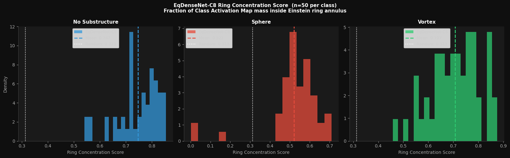
  <br><em>Figure 7.2 —Ring concentration analysis for EqDenseNet-C8. Higher values indicate
that model activation is concentrated within the Einstein ring annulus rather than
the image centre or background. The result supports the qualitative CAM finding
that the model primarily relies on ring-localised evidence..</em>
</p>


### 7.3 ResNet-50 vs E-ResNet 

Grad-CAM Comparison We next compare a strong conventional pretrained CNN (ResNet-50) against a compact equivariant model (E-ResNet) to isolate how equivariant inductive bias changes spatial evidence usage.

#### 7.3.1 Main Result

Grad-CAM is used here as a qualitative diagnostic of class-discriminative spatial
evidence. The comparison asks a narrow question: when ResNet-50 and E-ResNet inspect
the same lensing image, do they rely on the same spatial region, or does the
equivariant model use a more physically aligned strategy?

Across these examples, the main difference is **not** that E-ResNet always produces
sharper or more confident predictions. Instead, the difference is **where** each
model places its activation. **ResNet-50 tends to produce broader, more interior-filled
activation**, whereas **E-ResNet more often breaks its response into ring-localised or
arc-localised components**. This is most visible in the No-Substructure and Vortex
examples. In the Sphere case, both models attend to the relevant side of the image,
but E-ResNet is noticeably less confident on this particular example despite still
predicting the correct class.

| Class | ResNet-50 attention | E-ResNet attention | Interpretation |
|:------|:--------------------|:-------------------|:---------------|
| No Substructure | Broad, smooth activation covering much of the ring interior, with the highest response spread across the central arc region | More fragmented, ring-following activation distributed around the annulus, with stronger suppression of the dark interior | E-ResNet is more spatially aligned with the Einstein ring geometry, while ResNet-50 blends ring evidence with interior response |
| Sphere | Strong activation concentrated on the left bright perturbation, with some spillover into adjacent arc structure; highly confident correct prediction (0.999) | Activation also concentrates on the left perturbation and nearby arc segments, but is more partitioned and less confident overall (0.639 Sphere, 0.331 No Substructure) | Both models identify the relevant perturbation region, but E-ResNet shows weaker class separation on this example despite qualitatively correct localisation |
| Vortex | Large vertically extended blob spanning the image interior and upper ring region, only partially aligned with the perturbed arc | Tighter, more compact activation near the upper-left perturbed arc, with less diffuse interior coverage; fully confident correct prediction | E-ResNet is more arc-specific, whereas ResNet-50 relies on a broader central response that is less tightly tied to the local perturbation |

<p align="center">
  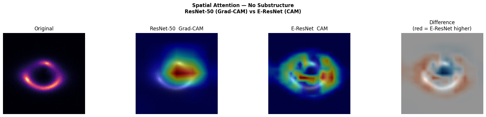
  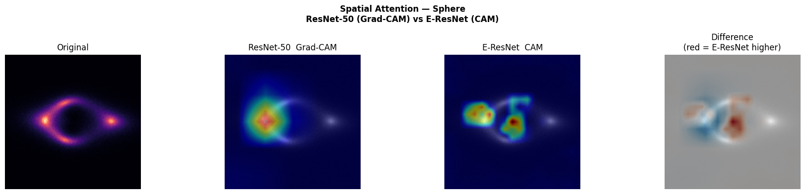
  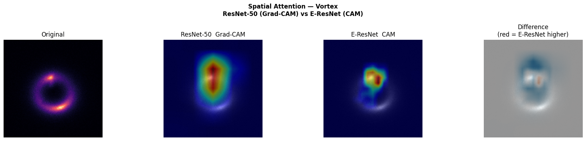
  <br><em>Figure 7.3 — Spatial attention comparison between ResNet-50 and E-ResNet for representative No-Substructure, Sphere, and Vortex examples. Each row shows the original image, ResNet-50 Grad-CAM, E-ResNet CAM, and a difference map (red = higher E-ResNet response, blue = higher ResNet-50 response). In the No-Substructure and Vortex examples, E-ResNet places more of its response along ring-localised structure, whereas ResNet-50 shows broader interior-heavy activation. In the Sphere example, both models attend to the physically relevant perturbation region, but E-ResNet is substantially less confident on this instance despite remaining correct.</em>
</p>

#### 7.3.2 Disagreement Analysis

To move beyond selected examples, we partition the full validation set into four
mutually exclusive cases: both models correct, ResNet-50 correct / E-ResNet wrong,
E-ResNet correct / ResNet-50 wrong, and both wrong. This makes it possible to ask
whether the two architectures fail on the same images or on different ones.

| Case | Description | Count | Share of val set | Class pattern |
|:-----|:------------|------:|-----------------:|:--------------|
| Case 1 | Both correct | 7,064 | 94.19% | Most of the dataset is jointly solved |
| Case 2 | ResNet-50 ✓, E-ResNet ✗ | 142 | 1.89% | Dominated by Sphere (69), then Vortex (50), then No Substructure (23) |
| Case 3 | E-ResNet ✓, ResNet-50 ✗ | 133 | 1.77% | Dominated by Sphere (80), then Vortex (35), then No Substructure (18) |
| Case 4 | Both wrong | 161 | 2.15% | Overwhelmingly Sphere (125), with fewer Vortex (29) and very few No Substructure (7) |

Two points stand out immediately. First, the disagreement region is **small**:
the models agree on the correct label for **94.19%** of the validation set, so the
comparison is about a relatively narrow subset of hard examples. Second, the
hardest class is clearly **Sphere**. It is the largest component of both
single-model disagreement cases and dominates the shared-failure set
(**125 / 161**, or **77.6%** of Case 4).

This means the practical difference between ResNet-50 and E-ResNet is not driven
by easy No-Substructure images. It is driven primarily by **whether the model can
correctly interpret subtle localised perturbations on Sphere images**, where small
changes in spatial evidence usage matter most.

<p align="center">
  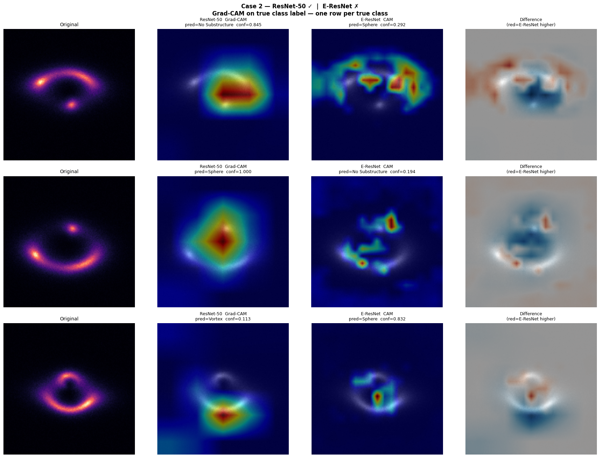
  <br><em>Figure 7.3b — Case 2: ResNet-50 correct, E-ResNet wrong. One representative example is shown for each true class. In these cases, E-ResNet often still places activation on ring-localised structure, but the resulting class decision is unstable or shifted to the wrong label. The largest number of such failures occurs on Sphere images (69/142).</em>
</p>

<p align="center">
  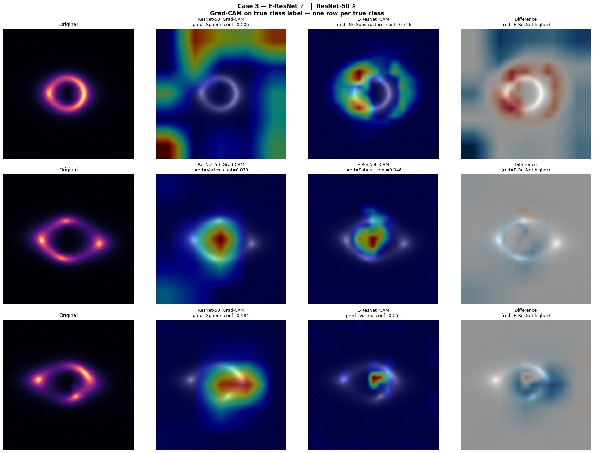
  <br><em>Figure 7.3c — Case 3: E-ResNet correct, ResNet-50 wrong. These examples are especially informative because they show cases where E-ResNet’s more ring-structured spatial strategy is sufficient for the correct decision while ResNet-50 fails. Again, Sphere is the dominant class (80/133), indicating that the main advantage appears on the most discriminating class.</em>
</p>

<p align="center">
  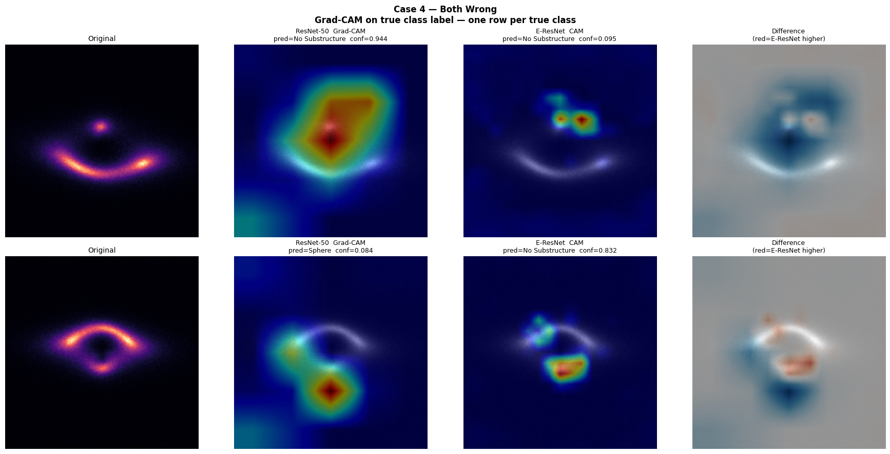
  <br><em>Figure 7.3d — Case 4: both models wrong. Shared failures are concentrated on Sphere images (125/161), suggesting that these examples are genuinely difficult rather than architecture-specific edge cases. In many such cases, both models still attend somewhere on or near the ring, but the signal is too weak, ambiguous, or misleading for either model to reach the correct decision.</em>
</p>


### 7.4 ViT vs DenseNet-121: Attention and Localisation

The ResNet-50 vs E-ResNet comparison asked whether equivariant inductive bias changes
*where* a model looks. This section asks a different question: **if a model attends
more strongly to the Einstein ring, does that necessarily lead to better
classification?** The comparison between **ViT-Base** and **DenseNet-121** shows that
the answer is **no**.

These two architectures are interpreted through different mechanisms. **DenseNet-121**
is analysed with **Grad-CAM**, which reflects class-discriminative gradient-weighted
activation at the final convolutional stage. **ViT-Base** is analysed with
**attention rollout**, which propagates CLS-token attention back through the
transformer layers and gives a class-agnostic view of how information flows across
patches. Because the two visualisations measure different quantities, they should
not be compared as if they were numerically equivalent saliency maps. The useful
comparison is instead at the level of **spatial pattern, class sensitivity, and
consistency**.

#### 7.4.1 Visual Comparison

A direct visual comparison already reveals a qualitative difference. DenseNet-121
produces broad, low-resolution Grad-CAM maps that often appear as diffuse blobs,
while ViT-Base produces more spatially structured patch-level attention maps.
Visually, ViT appears to place stronger emphasis on the Einstein ring region,
especially for the substructure classes.

<p align="center">
  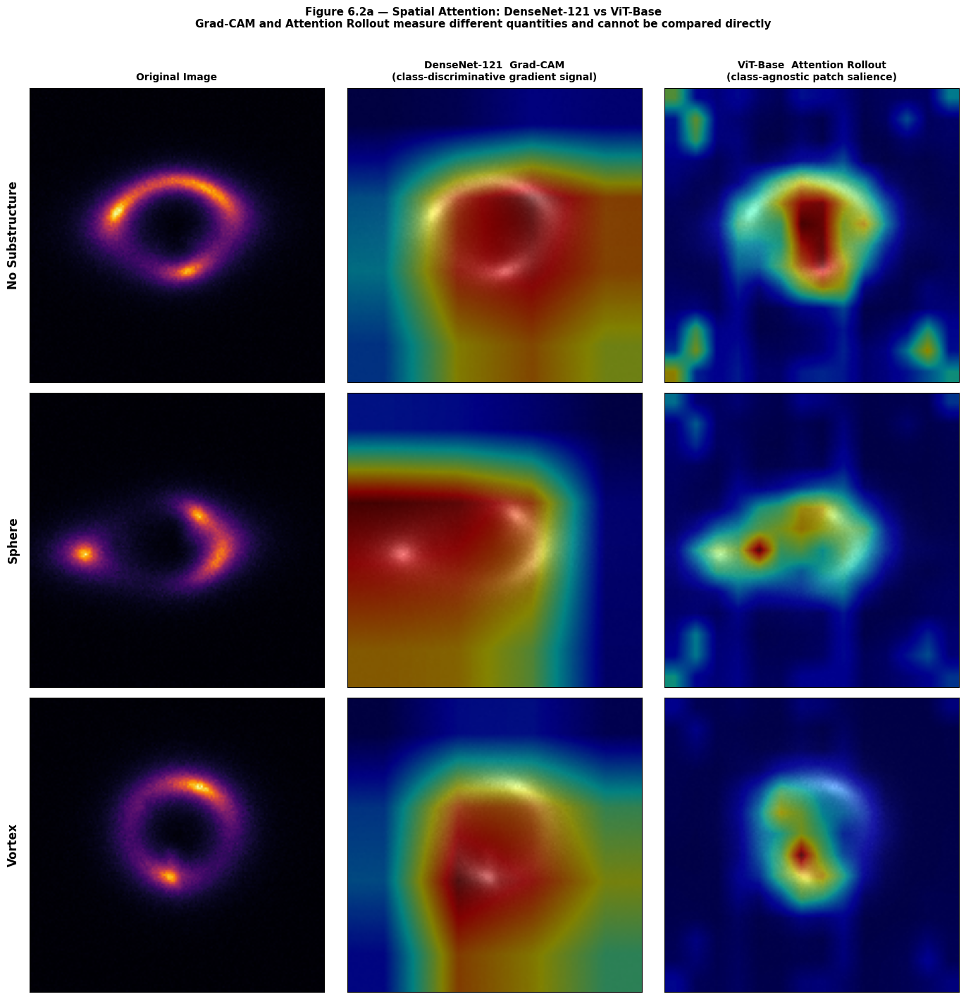
  <br><em>Figure 7.4a — Spatial attention comparison between DenseNet-121 and ViT-Base across representative No-Substructure, Sphere, and Vortex examples. DenseNet-121 Grad-CAM produces broad, smooth, class-discriminative activation maps, while ViT-Base attention rollout yields patch-structured class-agnostic saliency. ViT appears more tightly concentrated on the Einstein ring region, but the two methods measure different quantities and should not be compared pixel-for-pixel.</em>
</p>

#### 7.4.2 DenseNet Resolution Diagnostic

The diffuse blob-like appearance of DenseNet Grad-CAM is not, by itself, evidence
that DenseNet fails to track ring structure. The final DenseNet activation map is
generated after heavy spatial compression in the last dense block. In these examples,
the relevant feature map is only about **4×5 pixels** before upsampling back to the
original **150×150** image size. At that resolution, fine ring geometry cannot be
faithfully preserved.

This means that DenseNet’s broad Grad-CAM shape is largely a **resolution artefact**:
the network may still rely on ring-localised evidence, but that evidence is
represented on an extremely coarse spatial grid before visualisation.

<p align="center">
  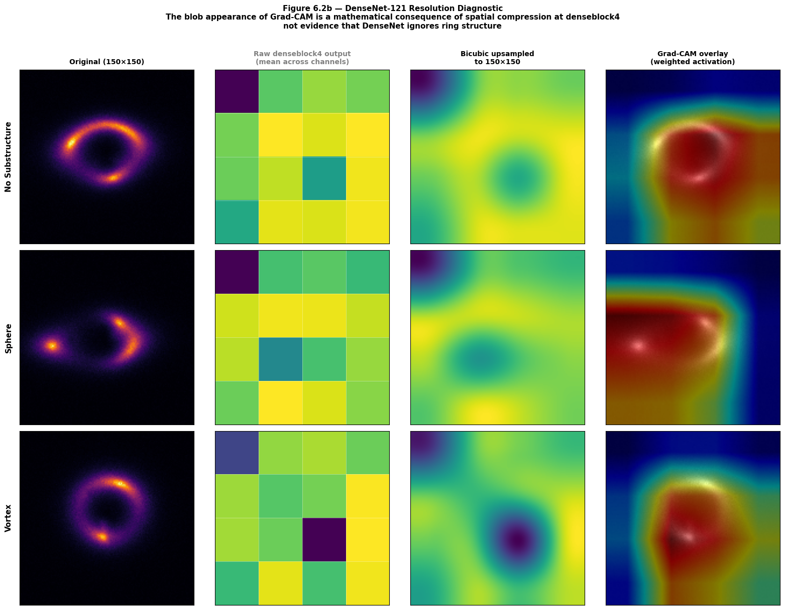
  <br><em>Figure 7.4b — DenseNet-121 resolution diagnostic. From left to right: original image, raw denseblock4 output at native coarse resolution, bicubic upsampling to 150×150, and the final Grad-CAM overlay. The apparent blob structure in DenseNet Grad-CAM follows directly from severe spatial compression before upsampling and should not be interpreted as evidence that the model ignores the Einstein ring.</em>
</p>

#### 7.4.3 Ring Concentration and Attention Stability

To move beyond visual inspection, we measure **ring concentration score**: the
fraction of total attention mass that lies inside a predefined Einstein ring annulus.
The annulus covers **19.0% of image pixels**, so a random attention baseline is
**0.190**.

**Ring concentration scores (mean ± std, n=50 per class):**

| Model | No Substructure | Sphere | Vortex |
|:------|:---------------:|:------:|:------:|
| DenseNet-121 | 0.282 ± 0.019 | 0.288 ± 0.020 | 0.285 ± 0.014 |
| ViT-Base | 0.371 ± 0.032 | 0.462 ± 0.050 | 0.468 ± 0.053 |
| Random baseline | 0.190 | 0.190 | 0.190 |

Two patterns are immediate. First, **both models concentrate attention on the ring
above random baseline**. Second, **ViT is much more class-sensitive**: its ring
concentration rises from **0.371** on No Substructure to **0.462–0.468** on Sphere
and Vortex. DenseNet, in contrast, stays almost flat across classes
(**0.282–0.288**).

<p align="center">
  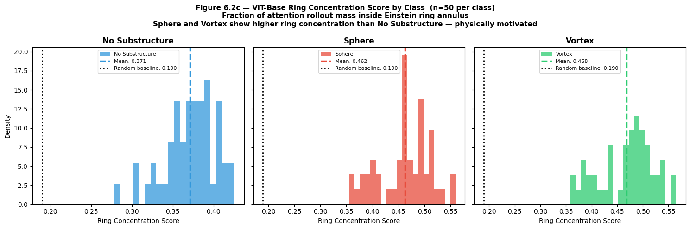
  <br><em>Figure 7.4c — ViT-Base ring concentration score distributions by class (n=50 per class). ViT attends to the Einstein ring well above the random baseline of 0.190 in all classes, with noticeably higher concentration for Sphere and Vortex than for No Substructure.</em>
</p>

We next ask whether ViT’s attention is **stable** across images of the same class.
The mean attention maps remain ring-centred, but the standard deviation maps show
clear class dependence. The reported mean per-pixel attention standard deviations are:

| Class | Mean attention std | Interpretation |
|:------|:------------------:|:---------------|
| No Substructure | 0.0409 | Most stable |
| Sphere | 0.0597 | Less stable |
| Vortex | 0.0516 | Less stable |

ViT is therefore **least stable on the substructure classes**, exactly where
precise localisation should matter most. This suggests that although ViT strongly
attends to the ring, the spatial deployment of that attention shifts more from
example to example when subtle perturbations are present.

<p align="center">
  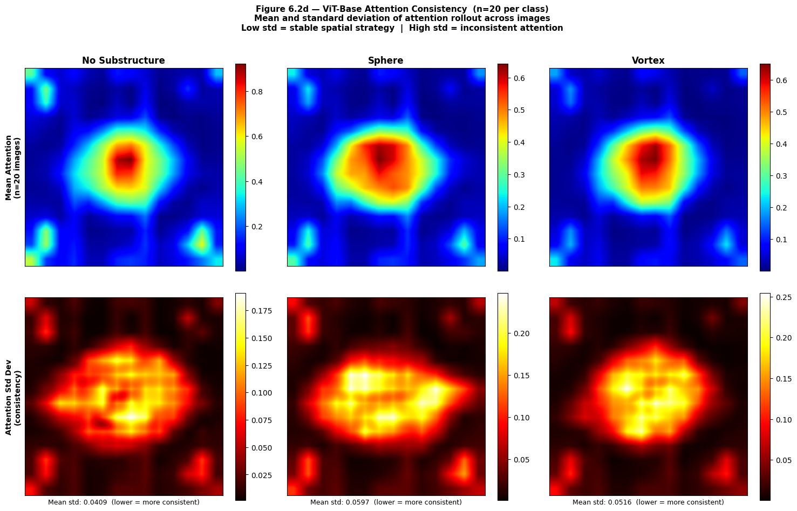
  <br><em>Figure 7.4d — ViT-Base attention consistency analysis (n=20 per class). The top row shows mean attention maps; the bottom row shows standard deviation maps. No Substructure has the lowest mean standard deviation (0.0409), while Sphere (0.0597) and Vortex (0.0516) are less stable. ViT’s global attention remains ring-centred, but its precise spatial allocation varies more on the harder substructure classes.</em>
</p>

Finally, a direct ring-concentration comparison makes the central paradox explicit:
**ViT concentrates more attention on the Einstein ring than DenseNet-121 in every
class, yet DenseNet-121 still achieves higher classification performance.**

<p align="center">
  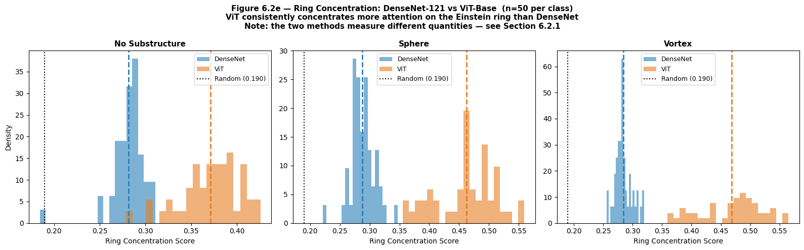
  <br><em>Figure 7.4e — Ring concentration comparison between DenseNet-121 and ViT-Base (n=50 per class). DenseNet remains nearly flat across classes at about 0.28, while ViT shifts upward to about 0.46–0.47 on the substructure classes. Higher ring concentration alone is therefore not sufficient to explain better classification performance.</em>
</p>

#### 7.4.4 Interpretation

The main lesson of this comparison is that **coarse localisation of the Einstein ring
is not the same as reliable recognition of substructure within the ring**. ViT-Base
attends more strongly to the physically relevant annulus and shows clear class
sensitivity, yet it still underperforms DenseNet-121 on classification. DenseNet’s
Grad-CAM, although visually blurrier, is resolution-limited rather than obviously
misdirected.

The most defensible interpretation is therefore:

- **DenseNet-121** may be using comparatively coarse but effective class-discriminative
  local detectors.
- **ViT-Base** clearly finds the ring, but its patch-level attention is less stable
  on the harder substructure classes.
- **Higher ring concentration does not guarantee higher macro-AUC**, because the task
  is not just to find the ring but to identify the discriminative perturbation
  embedded within it.

This is the central interpretability result of the ViT vs DenseNet comparison:
**attending to the right global structure is necessary but not sufficient; the harder
problem is stable, fine-grained reading of local perturbations on that structure.**

### 7.5 Predictive Uncertainty: Deep Ensemble

High classification accuracy does not imply uniformly reliable predictions. Some
images lie close to the decision boundary and remain sensitive to model choice even
when the overall benchmark performance is strong. To identify such cases, we estimate
predictive uncertainty with a **deep ensemble**.

Monte Carlo dropout is not applicable here because the trained models do not contain
active dropout layers at inference. Instead, uncertainty is estimated by averaging
the predicted probability vectors from **eight independently trained architectures**:

**ResNet-18, ResNet-50, DenseNet-121, EfficientNet-B3, ViT-Base, E-ResNet,
EqDenseNet-C8, and Equivariant-D4.**

**AlexNet** and **VGG-16** are excluded because their performance is substantially
below the rest of the benchmark, so their inclusion would add weak votes rather than
useful uncertainty information. The goal here is not to maximise ensemble accuracy,
but to use **cross-model disagreement** as a practical proxy for predictive
uncertainty.

The uncertainty score is the **predictive entropy** of the ensemble mean:

\[
H = -\sum_c \bar{p}_c \log \bar{p}_c,
\qquad
\bar{p}_c = \frac{1}{M} \sum_{m=1}^{M} p^{(m)}_c
\]

For a three-class problem, the maximum possible entropy is:

\[
\log 3 \approx 1.099
\]

The resulting ensemble reaches **0.9688 accuracy** on the validation set. The entropy
range is **[0.0002, 1.0968]**, covering almost the full theoretical range up to the
three-class maximum.

#### 7.5.1 Entropy Distribution Results

Per-class entropy statistics are:

| Class | Mean H | Std H | Median H | p95 H |
|:------|:------:|:-----:|:--------:|:-----:|
| No Substructure | 0.2401 | 0.1882 | 0.1740 | 0.6308 |
| Sphere | 0.2491 | 0.2911 | 0.1117 | 0.8447 |
| Vortex | 0.1798 | 0.2537 | 0.0448 | 0.7557 |

Two aspects matter more than the means alone. First, **Sphere has the heaviest high-entropy
tail**: its 95th percentile (**0.8447**) is substantially above No Substructure
(**0.6308**) and Vortex (**0.7557**). Second, its **median entropy is relatively low
(0.1117)**, which indicates that many Sphere images are easy, but a subset is
extremely difficult. This is exactly the pattern expected of a class with a mixed
population of easy positives and hard borderline cases.

The statistical comparisons support that reading. Sphere entropy is **not**
significantly higher than No Substructure (**p = 1.000000**), but it is
significantly higher than Vortex (**p ≈ 8.91 × 10⁻¹⁵**). So the defining feature of
Sphere is not a uniformly elevated uncertainty level, but a much broader and heavier
tail of difficult cases.

<p align="center">
  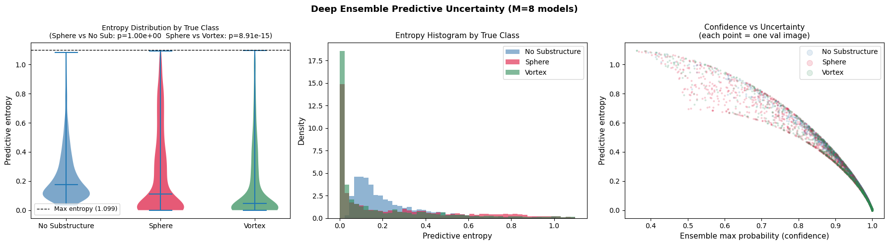
  <br><em>Figure 7.5 — Predictive uncertainty from an 8-model deep ensemble. Left: entropy distributions by true class. Sphere shows the broadest spread and the heaviest high-entropy tail. Centre: entropy histogram confirming that all classes contain many low-entropy images, but Sphere extends furthest toward the maximum entropy limit. Right: confidence–uncertainty scatter showing the expected inverse relation between ensemble max probability and predictive entropy.</em>
</p>

A complementary view is the fraction of ensemble members that disagree with the final
ensemble prediction:

| Class | Mean disagreement | Max disagreement |
|:------|:-----------------:|:----------------:|
| No Substructure | 0.0104 | 0.6250 |
| Sphere | 0.0688 | 0.7500 |
| Vortex | 0.0410 | 0.7500 |

Again, **Sphere** is the least consensus-stable class on average.

#### 7.5.2 High-Entropy Sphere Images

The top **12 highest-entropy Sphere images** lie near the theoretical maximum
(**H = 1.080–1.093**, with maximum possible **1.099**). These are the images about
which the ensemble is most uncertain. Their ensemble predictions scatter across
multiple classes, confirming that these are not merely low-confidence correct cases,
but genuinely ambiguous examples with unstable cross-model interpretation.

<p align="center">
  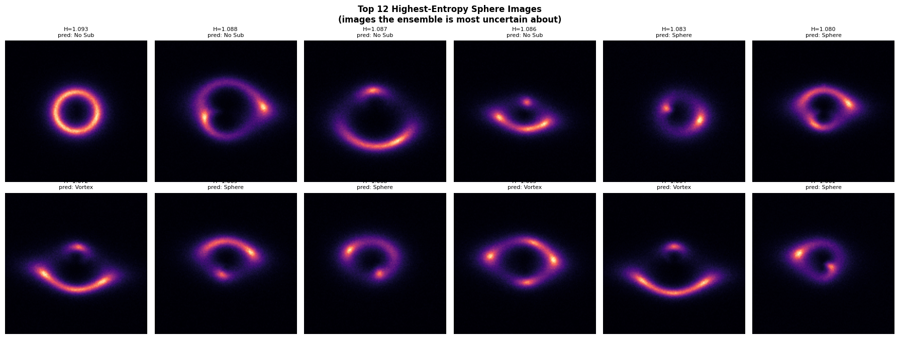
  <br><em>Figure 7.5b — Top 12 highest-entropy Sphere images. Each image is annotated with predictive entropy and ensemble majority prediction. These examples lie extremely close to the maximum three-class entropy, indicating near-maximal model disagreement. They represent genuinely ambiguous cases rather than simple low-margin variants of easy Sphere images.</em>
</p>

#### 7.5.3 Two Distinct Sphere Failure Populations

A particularly important result is that uncertainty is **not** a complete safeguard
against failure. There are **54 Sphere images** that are predicted as
**No Substructure by all 8 ensemble members**. These are consensus failures:
the ensemble is wrong, but not uncertain.

This creates two distinct Sphere failure populations:

1. **High-entropy ambiguous cases** — the ensemble visibly disagrees, so these can be
   flagged for review.
2. **Low-entropy silent failures** — all models agree on the wrong answer, so entropy
   does not detect them.

The separation between these two populations is strict in the current experiment:
the overlap between the **top-12 highest-entropy Sphere images** and the
**54 universally misclassified Sphere images** is **0/12**.

That is a strong operational result. It means that predictive entropy can identify
some difficult images, but it cannot catch the most dangerous class of errors:
**confident consensus failures**.

#### 7.5.4 Practical Implication for Survey Pipelines

For a realistic lens-search pipeline, predictive entropy is useful as a **triage
signal**, not as a full reliability solution. High-entropy examples are natural
candidates for human review or downstream verification because they correspond to
genuine disagreement across strong models. But low entropy should **not** be treated
as proof of correctness.

In this benchmark, the hardest practical problem is therefore not only uncertainty
itself, but the existence of **silent Sphere failures**: images where subtle
substructure is missed confidently by every strong model in the ensemble. Any
operational pipeline that uses entropy-based triage should explicitly account for
this limitation.

### 7.6 E-ResNet Ablation Study

This ablation isolates two design choices inside the equivariant family:

1. **Residual connections**
2. **Explicit D₄ augmentation during training**

The goal is not to make a strong causal claim from a single four-run study, but to
ask a narrower question: within a controlled equivariant setting, which of these
changes is more strongly associated with better optimisation and better validation
performance?

All four runs use the same corrected architecture setup and the same training
recipe, so the comparison is internally consistent.

| Run | Architecture | Augmentation |
|:---:|:-------------|:------------:|
| A | Plain equivariant CNN | None |
| B | Plain equivariant CNN | D₄ augmentation |
| C | E-ResNet | None |
| D | E-ResNet | D₄ augmentation |

#### 7.6.1 Results

The full validation-set results are:

| Run | Architecture | Augmentation | Macro AUC | Accuracy | No Sub Recall | Sphere Recall | Vortex Recall |
|:---:|:-------------|:------------:|:---------:|:--------:|:-------------:|:-------------:|:-------------:|
| A | Plain CNN | None | 0.9866 | 0.9277 | 0.9524 | 0.8932 | 0.9376 |
| B | Plain CNN | D₄ augmentation | 0.9956 | 0.9621 | 0.9908 | 0.9268 | 0.9688 |
| C | E-ResNet | None | 0.9879 | 0.9296 | 0.9556 | 0.9028 | 0.9304 |
| D | E-ResNet | D₄ augmentation | 0.9952 | 0.9596 | 0.9880 | 0.9224 | 0.9684 |

The most obvious pattern is that **augmentation improves performance strongly in both
architectures**. The gain is visible in overall discrimination (**Macro AUC**),
overall correctness (**Accuracy**), and the most sensitive class-specific metric
(**Sphere Recall**).

The corresponding effect sizes are:

**Effect sizes on Macro AUC**

| Effect | Δ Macro AUC |
|:-------|------------:|
| Residual connections (no aug): C − A | +0.0014 |
| Residual connections (with aug): D − B | −0.0004 |
| Augmentation (plain CNN): B − A | +0.0090 |
| Augmentation (E-ResNet): D − C | +0.0073 |

**Effect sizes on Sphere Recall**

| Effect | Δ Sphere Recall |
|:-------|----------------:|
| Residual connections (no aug): C − A | +0.0096 |
| Residual connections (with aug): D − B | −0.0044 |
| Augmentation (plain CNN): B − A | +0.0336 |
| Augmentation (E-ResNet): D − C | +0.0196 |

These numbers make the hierarchy of effects clear: **augmentation is the dominant
performance driver**, while the marginal contribution of residual connections is
small and inconsistent.

<p align="center">
  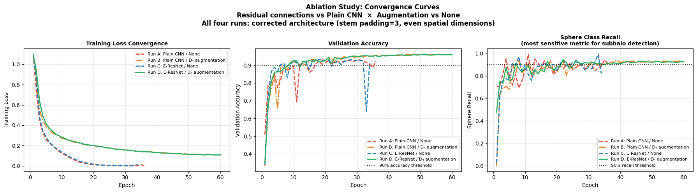
  <br><em>Figure 7.6 — Ablation study convergence curves for the four equivariant runs. Left: training loss. Centre: validation accuracy. Right: Sphere Recall, the most sensitive metric for local subhalo detection. In both architectures, D₄ augmentation produces the clearest improvement in final validation behaviour. Residual connections have a comparatively small effect relative to augmentation.</em>
</p>

#### 7.6.2 Hypothesis Assessment

The ablation supports one strong conclusion and two weaker ones.

**1. Augmentation has the largest and most consistent effect.**  
Across both architectures, D₄ augmentation improves Macro AUC, Accuracy, and Sphere
Recall. The effect is especially strong on Sphere Recall, where the gains are
**+0.0336** for the plain CNN and **+0.0196** for E-ResNet. This is the clearest
result in the table.

**2. Residual connections provide a small benefit without augmentation.**  
Without augmentation, E-ResNet is slightly better than the plain equivariant CNN:

- **Macro AUC:** 0.9879 vs 0.9866
- **Sphere Recall:** 0.9028 vs 0.8932

The direction is consistent with a modest residual advantage, but the magnitude is
small.

**3. Under augmentation, the residual benefit does not persist.**  
With D₄ augmentation enabled, the plain equivariant CNN slightly exceeds E-ResNet on
both Macro AUC and Sphere Recall:

- **Macro AUC:** 0.9956 vs 0.9952
- **Sphere Recall:** 0.9268 vs 0.9224

This is not evidence that residual connections are generally harmful. It shows only
that, in this specific shallow equivariant setting, residual connections are **not**
the dominant reason for good performance once augmentation is already present.

#### 7.6.3 Interpretation

The practical takeaway is narrow but important: **equivariance alone is not enough**.
Even inside a symmetry-aware architecture family, **explicit augmentation still
provides a substantial benefit**.

The broader interpretation is that the strongest gains in this ablation come from
improving the model’s effective exposure to rotational variability during training,
not from adding residual pathways alone. Residual connections may still help
optimisation in some regimes, but in this experiment their effect is secondary
relative to augmentation.

So within the E-ResNet ablation, the most defensible conclusion is:

**augmentation is the strongest and most reliable performance lever, while residual
connections provide at most a modest conditional benefit.**

### 7.7 Equivariance Verification

This section tests **output invariance**, not internal feature equivariance. The
question is simple: if an input image is rotated or otherwise transformed, how much
does the model’s **output probability vector** change?

Two stages are separated:

- **Stage 1: untrained models** — tests the symmetry built into the architecture
  before learning.
- **Stage 2: trained models** — tests how much of that output stability remains
  after optimisation.

For the equivariant models, transformed inputs are generated using **escnn**’s own
group action via `in_type.transform`, which is the correct architecture-aware test.
For **ResNet-50**, standard tensor rotations are used. The metric is the **L2**
distance between the original and transformed output probability vectors; **smaller
values mean greater invariance**.

#### 7.7.1 Invariance Test Setup

The invariance test is purely an inference-time diagnostic. For each selected
validation image, the model is evaluated on the original input and on transformed
versions of the same image.

- **Equivariant models:** all **8 D₄ group elements** are tested using
  `in_type.transform`
- **ResNet-50:** **90°, 180°, and 270°** rotations are tested using `torch.rot90`

A perfectly invariant classifier would give **L2 distance = 0** for every transformed
copy of the same image.

#### 7.7.2 Stage 1 — Theoretical Invariance (Untrained Models)

Before training, both equivariant architectures show near-zero output variation under
the tested D₄ transformations:

| Model | Mean L2 |
|:------|--------:|
| EPlainCNN (untrained) | 0.00005 |
| E-ResNet (untrained) | 0.00009 |
| ResNet-50 (untrained) | 0.06480 |

This is the expected architectural pattern. Before any learning takes place, the
equivariant models are already almost perfectly output-stable under the tested group
actions, whereas the standard CNN is not. The small numerical difference between
EPlainCNN and E-ResNet at this stage is negligible in practical terms and should not
be over-interpreted.

So Stage 1 provides strong evidence that the symmetry-aware architectures are
behaving as intended at initialisation.

#### 7.7.3 Stage 2 — Empirical Invariance After Training

After training, the equivariant models remain more output-stable than ResNet-50, but
their invariance is no longer numerically near-perfect.

| Model | Training | Mean L2 | Max L2 |
|:------|:---------|--------:|-------:|
| E-ResNet D₄ | with augmentation | 0.01817 | 0.75205 |
| EPlainCNN D₄ | no augmentation | 0.03768 | 1.02230 |
| ResNet-50 | with augmentation | 0.05814 | 1.26498 |

Under this test, **E-ResNet** has the lowest mean output variation, followed by
**EPlainCNN**, then **ResNet-50**. So the trained equivariant models remain more
rotation-stable than the standard CNN, even though exact numerical invariance is
weakened by training.

A particularly useful comparison is that **EPlainCNN without augmentation** is still
more stable than **ResNet-50 with augmentation**. That suggests the architectural
symmetry prior contributes meaningfully to output stability beyond what augmentation
alone provides.

Within the equivariant family, the residual variant is also clearly more stable than
the plain variant after training. This is one of the clearest places in the notebook
where residual connections appear beneficial, even though their effect on validation
AUC was small in the earlier ablation.

The full trained EPlainCNN D₄ transformation table is:

| Group element | Mean L2 | Max L2 |
|:--------------|--------:|-------:|
| (+, 0[2π/4]) | 0.00000 | 0.00000 |
| (+, 1[2π/4]) | 0.03814 | 0.61942 |
| (+, 2[2π/4]) | 0.05050 | 0.65071 |
| (+, 3[2π/4]) | 0.06204 | 1.02225 |
| (-, 0[2π/4]) | 0.03815 | 0.61945 |
| (-, 1[2π/4]) | 0.00003 | 0.00064 |
| (-, 2[2π/4]) | 0.06205 | 1.02230 |
| (-, 3[2π/4]) | 0.05050 | 0.65070 |

This shows that the identity case and one reflection-aligned case remain near zero,
while most non-trivial transforms account for the observed empirical drift.

#### 7.7.4 Theoretical vs Empirical Invariance

The overall shift from untrained to trained behaviour is:

| Model | Theoretical | Empirical | Change |
|:------|------------:|----------:|-------:|
| E-ResNet D₄ | 0.00009 | 0.01817 | +0.01808 |
| EPlainCNN D₄ | 0.00005 | 0.03768 | +0.03763 |
| ResNet-50 | 0.06480 | 0.05814 | −0.00666 |

Three conclusions are supported by this comparison.

**1. Training increases output variation in the equivariant models.**  
Both equivariant architectures move away from their near-zero untrained baseline.
So the practically relevant result is not exact numerical invariance after training,
but whether the trained models remain more stable than a non-equivariant baseline.

**2. The equivariant models still retain a clear stability advantage.**  
After training, both **E-ResNet** and **EPlainCNN** remain more transformation-stable
than **ResNet-50** under this test. E-ResNet is the strongest of the three.

**3. E-ResNet preserves output stability better than EPlainCNN.**  
This is one of the clearest differences between the two equivariant variants: the
residual model shows substantially less empirical drift away from the untrained
baseline.

The small decrease for ResNet-50 after training should not be over-interpreted. Its
output variation remains much larger than that of the equivariant models, so the
main conclusion is unchanged: **architectural equivariance provides a substantial
stability advantage at the classifier output, even after training**.

#### 7.7.5 Connection to the Ablation and Practical Recommendation

The ablation in Section 7.6 and the invariance test here measure different
properties, so their conclusions are not contradictory.

In the ablation, the best validation performance within the equivariant family comes
from **Plain CNN + D₄ augmentation**:

- **Macro AUC:** 0.9956
- **Sphere Recall:** 0.9268

In the invariance test, the strongest output stability is obtained by **E-ResNet**:

- **Mean L2:** 0.01817, compared with
- **0.03768** for EPlainCNN (no augmentation), and
- **0.05814** for ResNet-50

That suggests the model choice depends on the deployment objective:

| Objective | More suitable model | Reason |
|:----------|:--------------------|:-------|
| Highest validation performance on this benchmark | Plain equivariant CNN + D₄ augmentation | Slightly better Macro AUC and Sphere Recall |
| Stronger output stability under transformation | E-ResNet | Lowest mean output variation under transformation |

A cautious practical takeaway is therefore this: if **orientation robustness** is a
priority, **E-ResNet** is the safer choice despite its slightly lower validation
metrics. If the priority is only benchmark performance on the current split, the
**plain equivariant CNN + augmentation** is marginally stronger.

That should still be treated as a practical recommendation, not a definitive one.
The invariance and accuracy comparisons are informative, but they do not by
themselves quantify downstream bias or robustness on real survey data.

---

## 8. Failure Mode Analysis

### 8.1 Cross-Architecture Sphere Confusion Pattern

A recurring error across the stronger models is the misclassification of **Sphere**
images as **No Substructure**. This subsection asks a narrower question: **which
Sphere images are missed consistently across models, and do those shared hard cases
differ in simple raw-image statistics from Sphere images that all models classify
correctly?**

The intersection analysis is performed over the eight stronger converged models used
in the updated benchmark:

**ResNet-18, ResNet-50, DenseNet-121, EfficientNet-B3, ViT-Base, E-ResNet,
EqDenseNet-C8, and Equivariant-D4.**

Two groups are compared:

- **Universally misclassified Sphere images** — Sphere images predicted as
  **No Substructure by all 8 models**
- **Universally correct Sphere images** — Sphere images predicted correctly as
  **Sphere by all 8 models**

The raw `.npy` arrays are analysed directly, without any additional normalisation,
to test whether these two groups differ in simple image-level statistics such as
mean intensity and pixel variability.

#### 8.1.1 Results

Across the **2,500 Sphere** validation images:

- **Sphere → No Substructure by all 8 models:** **54 images** (**2.2%**)
- **Sphere classified correctly by all 8 models:** **1,703 images** (**68.1%**)

The per-model **Sphere → No Substructure** error rates are:

| Model | Sphere → No Substructure | Rate |
|:------|:------------------------:|:----:|
| DenseNet-121 | 105 / 2500 | 4.2% |
| EqDenseNet-C8 | 107 / 2500 | 4.3% |
| E-ResNet | 129 / 2500 | 5.2% |
| ResNet-50 | 135 / 2500 | 5.4% |
| ResNet-18 | 153 / 2500 | 6.1% |
| EfficientNet-B3 | 193 / 2500 | 7.7% |
| ViT-Base | 309 / 2500 | 12.4% |
| Equivariant-D4 | 343 / 2500 | 13.7% |

So although the per-model rates vary substantially, there remains a nontrivial core
of **54 Sphere images** that all eight models miss in the **same** way.

The raw image statistics for the two intersection groups are:

| Metric | Universally wrong (n=54) | Universally correct (n=1703) | Mann–Whitney p |
|:-------|:------------------------:|:-----------------------------:|:--------------:|
| Contrast (max − min) | 1.0000 ± 0.0000 | 1.0000 ± 0.0000 | 1.0000 |
| Mean pixel intensity | 0.0581 ± 0.0072 | 0.0639 ± 0.0087 | 1.82 × 10⁻⁷ |
| Pixel std | 0.1114 ± 0.0158 | 0.1190 ± 0.0169 | 4.74 × 10⁻⁴ |
| Max pixel intensity | 1.0000 ± 0.0000 | 1.0000 ± 0.0000 | 1.0000 |

The informative differences are in **mean intensity** and **pixel standard
deviation**: the universally misclassified Sphere images are, on average, **dimmer**
and **slightly less variable** than the universally correct ones. By contrast,
contrast and maximum intensity are uninformative here because the arrays are already
min–max normalised.

<p align="center">
  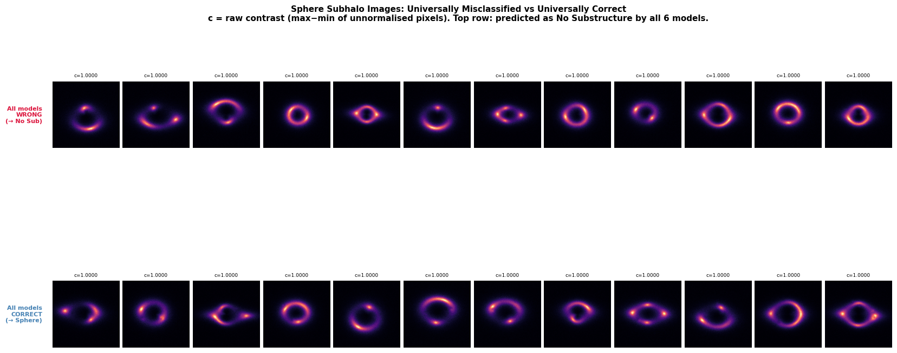
  <br><em>Figure 7.1a — Sphere images universally misclassified versus universally correct across all 8 models. The top row shows representative Sphere images that every model predicts as No Substructure. The bottom row shows representative Sphere images that every model classifies correctly as Sphere. Raw contrast is fixed at 1.0000 for all examples because the stored arrays are already min–max normalised, so the visible failure mode is not explained by dynamic-range collapse.</em>
</p>

<p align="center">
  
  <br><em>Figure 7.1b — Raw image statistics for universally wrong (n=54) versus universally correct (n=1703) Sphere images. Contrast is identical by construction and therefore uninformative. Mean pixel intensity is systematically lower for the universally misclassified group, and pixel standard deviation is also lower, indicating weaker overall image-level signal in the shared hard cohort.</em>
</p>

#### 8.1.2 Interpretation

Because the arrays are already min–max normalised per image, **contrast** and
**maximum intensity** are fixed by construction and therefore uninformative in this
comparison.

The two statistics that remain informative are **mean pixel intensity** and
**pixel standard deviation**. The universally misclassified Sphere images are, on
average, dimmer and slightly less variable than the universally correct Sphere
images. This indicates that the shared Sphere failures are associated with **weaker
image-level signal** under the representation used here.

That association should be interpreted cautiously. It does **not** establish a
single mechanism, and it does **not** prove a hard detection threshold. The two
distributions still overlap substantially. So this is a **shift in tendency**, not a
clean separating rule.

The important practical point is the **cross-model agreement**. These 54 images are
not isolated failures of one architecture, but a **common hard subset** across very
different model families. That makes them more likely to reflect a property of the
input cases themselves than an idiosyncratic weakness of any single classifier.

#### 8.1.3 Future DeepLense Project Activity — Failure-Cohort Analysis for Hard Sphere Cases

A focused next step is to treat the **54 universally misclassified Sphere images** as
a dedicated failure cohort and analyse them against two control groups:

1. **Sphere images classified correctly by all strong models**
2. **Sphere images misclassified by only a subset of models**

The aim is to determine whether these failures are associated mainly with:

- weak signal,
- missing spatial context,
- morphological similarity to No Substructure,
- or multiple distinct failure modes.

A high-value next analysis would be to build a compact feature table for each image,
including:

- raw mean intensity and raw standard deviation,
- ring-only mean intensity and ring-only standard deviation,
- fraction of total flux inside a ring mask,
- arc length / ring completeness,
- number and prominence of bright knots on the ring,
- per-model predicted probabilities,
- and ensemble entropy.

From there, the project can compare **universally wrong vs universally correct**
Sphere cohorts using both statistical tests and effect sizes, and then move to
ring-specific geometric analysis, embedding-space analysis, and nearest-neighbour
retrieval.

The central scientific question is:

**Are the universally wrong Sphere images hard because the perturbation signal is
weak, because the ring geometry removes useful spatial context, or because they lie
morphologically close to No Substructure?**

Answering that would move the analysis beyond aggregate benchmark metrics toward a
more mechanistic account of why the hardest Sphere cases fail.

### 8.2 E-ResNet Failure Mode Analysis
#### E-ResNet Sphere False Negatives

**E-ResNet:** Sphere true positives: **2306** · Sphere false negatives (**→ No Substructure**): **129**

To characterise the Sphere images that E-ResNet misses entirely, we compare
**true positives** against **false negatives misclassified as No Substructure** using
ring-level statistics computed on the normalised validation images.

| Feature | FN mean | TP mean | p-value | Significant |
|:--------|:-------:|:-------:|:-------:|:-----------:|
| Ring mean flux | 0.1423 | 0.1586 | 6.07×10⁻¹⁰ | ✅ |
| Ring flux std | 0.1630 | 0.1699 | 2.91×10⁻³ | ✅ |
| Ring compactness | 0.6585 | 0.6375 | 3.78×10⁻⁸ | ✅ |
| Ring asymmetry | 0.0805 | 0.0782 | 8.99×10⁻¹ | ❌ |

The clearest differences are **lower ring mean flux**, **slightly lower ring flux
standard deviation**, and **higher compactness** in the false-negative group. By
contrast, **ring asymmetry does not separate** true positives from false negatives in
a meaningful way.

The safest interpretation is descriptive: Sphere images missed as No Substructure
tend to have **weaker ring-level signal** and a **more compact intensity
distribution**, making them easier to confuse with smooth lenses. This supports a
signal-strength interpretation, but does not by itself establish a single causal
mechanism.

<p align="center">
  
  <br><em>Figure 8.4 — E-ResNet Sphere true positives (n=2306) versus false negatives to No Substructure (n=129). False negatives show significantly lower ring mean flux and ring flux standard deviation, while ring asymmetry is not significantly different. Compactness is also higher in the false-negative group, indicating a more concentrated ring-level intensity pattern.</em>
</p>

<p align="center">
  
  <br><em>Figure 8.5 — E-ResNet Sphere false negatives predicted as No Substructure, sorted by descending confidence in the wrong class. Most examples have relatively low ring mean flux, although there are exceptions. This indicates that low flux is an important correlate of failure, but not a complete explanation on its own.</em>
</p>

#### E-ResNet Sphere↔Vortex Confusion

A second, distinct failure mode is **Sphere↔Vortex confusion**, which should not be
mixed with the dominant **Sphere→No Substructure** failure above.

- **Sphere predicted as Vortex:** 65  
- **Vortex predicted as Sphere:** 54  

These error sets are different from the universally missed Sphere cohort in the
previous subsection, which is dominated by **Sphere→No Substructure**, not
Sphere↔Vortex swaps.

To test whether this confusion is explained by simple residual shape, we compare the
**CAE residual elongation** (major/minor axis ratio) across correct and confused
groups:

| Feature | Sphere→Vortex (n=65) | Sphere TP (n=2306) | Vortex→Sphere (n=54) | Vortex TP (n=2421) |
|:--------|:--------------------:|:------------------:|:--------------------:|:-----------------:|
| Mean elongation | 1.199 | 1.205 | 1.213 | 1.205 |

These values are very similar, and the distributions overlap strongly. So
**residual elongation alone does not explain the Sphere–Vortex confusion in a useful
way**.

The gallery should therefore be read qualitatively: some confused cases do show mixed
local and arc-level structure, but no single visual pattern appears sufficient on
its own.

<p align="center">
  
  <br><em>Figure 8.6 — Sphere↔Vortex confusion gallery. Row 1: correctly classified Sphere. Row 2: Sphere misclassified as Vortex. Row 3: Vortex misclassified as Sphere. These examples illustrate that the confused cases can look morphologically intermediate, but not in a way captured cleanly by a single scalar shape statistic.</em>
</p>

<p align="center">
  
  <br><em>Figure 8.7 — Residual elongation distributions by confusion type. Sphere true positives, Sphere→Vortex, Vortex true positives, and Vortex→Sphere show substantial overlap. Residual elongation therefore does not provide a strong standalone explanation for Sphere–Vortex confusion.</em>
</p>

---

### 8.3 Confidence and Accuracy vs Ring Brightness

Classification accuracy and model confidence both increase with **ring mean flux**
across all three classes, with the strongest effect visible for **Sphere**.

This result is consistent with the earlier false-negative analysis: **low-brightness
Sphere images are systematically harder to classify**, and they also tend to receive
lower confidence. No Substructure and Vortex show the same broad trend, but with a
higher performance floor.

This should still be interpreted descriptively rather than causally. The result shows
that **ring brightness is associated with classification difficulty**, not that
brightness alone determines success or failure.

<p align="center">
  
  <br><em>Figure 8.8 — Classification accuracy (solid) and mean confidence (dashed) versus ring mean flux, binned by brightness. The trend is strongest for Sphere, where low-brightness cases are much harder than high-brightness ones. Across all classes, lower ring brightness is associated with both lower accuracy and lower confidence.</em>
</p>

---

### 8.4 Perturbation Position Analysis

Perturbation position along the Einstein ring is tested as a possible predictor of
failure using **CAE residual centroids**.

Across all panels, the centroid positions remain tightly clustered near the image
centre, with substantial overlap between correct and incorrect classifications. No
clear angular or radial separation is visible between true positives and the
different confusion types.

Under this centroid-based summary, **perturbation position does not provide a strong
explanation for the observed errors**.

That conclusion should remain limited to this representation: the absence of
separation in centroid position does not rule out more subtle position-dependent
effects that are not captured by a single centroid statistic.

<p align="center">
  
  <br><em>Figure 8.9 — CAE residual centroid positions by classification outcome. Each point marks the spatial position of the peak residual signal for one image. Correct and incorrect cases overlap strongly, with no obvious spatial separation. In this representation, perturbation position does not appear to be a major driver of classification failure.</em>
</p>

---

### 8.5 Physical Interpretation

The failure analysis supports a fairly specific picture of the class structure.

- **Sphere** corresponds to a compact, approximately symmetric perturbation. That
  makes it the most difficult class because its signature can be weak and locally
  similar to smooth arc structure.
- **Vortex** corresponds to a more extended and asymmetric perturbation, which is
  generally easier to separate from both smooth lenses and Sphere-like substructure.

The updated benchmark shows that **EqDenseNet-C8 achieves the highest Sphere recall
(0.9448)**, ahead of **DenseNet-121 (0.9364)** and **E-ResNet (0.9224)**. This is an
important result because EqDenseNet-C8 combines **strong representational capacity**
with **explicit rotational structure**, showing that equivariance does not inherently
limit performance when paired with sufficient model expressivity.

By contrast, **E-ResNet underperforms DenseNet-121 on Sphere recall** despite its
stronger measured rotational stability. That indicates that **equivariance alone is
not sufficient**. Model capacity, feature reuse, and overall architectural
expressivity remain critical for detecting subtle, locally symmetric perturbations.

So the key lesson is not simply that *equivariance helps*. It is that
**equivariance appears most effective when embedded in a sufficiently expressive
architecture**. EqDenseNet-C8 is the strongest evidence for that claim in this
benchmark.

At the same time, causal attribution remains unresolved. The performance gap between
E-ResNet and EqDenseNet-C8 could reflect one or more of the following:

- residual vs dense connectivity,
- parameter scale,
- differences in feature propagation,
- optimisation dynamics,
- or interactions between symmetry constraints and model capacity.

Disentangling those factors — for example by training larger equivariant dense
architectures under controlled conditions — remains a natural next research
direction.

#### 8.6 EqDenseNet-C8 Failure Mode Analysis

EqDenseNet-C8 (**Macro AUC 0.9973**, **validation accuracy 97.35%**) misclassifies
**107 / 2500 Sphere** images as **No Substructure** and correctly classifies
**2362 / 2500**. Both figures are better than E-ResNet, consistent with the higher
Sphere recall reported earlier.

**Sphere → No Substructure false negatives (Fig. 12a–12b).**  
Like E-ResNet, EqDenseNet-C8 can still be strongly confident on the Sphere images it
misses. The highest-confidence false negatives receive very high predicted
No-Substructure probabilities, indicating that these are not merely low-margin
mistakes.

Morphological statistics comparing **Sphere true positives** against **Sphere false
negatives misclassified as No Substructure** are:

| Statistic | TP mean | FN mean | Mann–Whitney p |
|:----------|--------:|--------:|:--------------:|
| Ring mean flux | 0.15830 | 0.14046 | 2.73×10⁻¹⁰ |
| Ring flux std | 0.16969 | 0.16253 | 2.23×10⁻³ |
| Ring max intensity | 0.99990 | 1.00000 | 6.34×10⁻¹ |
| Ring asymmetry | 0.07859 | 0.08226 | 6.54×10⁻¹ |
| Compactness | 0.63773 | 0.66217 | 1.05×10⁻⁸ |

The main pattern closely matches E-ResNet: false negatives have **lower ring mean
flux**, **slightly lower ring flux standard deviation**, and **higher compactness**,
while **ring asymmetry** and **maximum intensity** do not separate the groups in a
useful way here.

So although EqDenseNet-C8 reduces the number of Sphere false negatives, the
**morphology of the missed cases remains similar**: they are typically weaker,
more compact ring-level signals that are easier to mistake for smooth lenses.

<p align="center">
  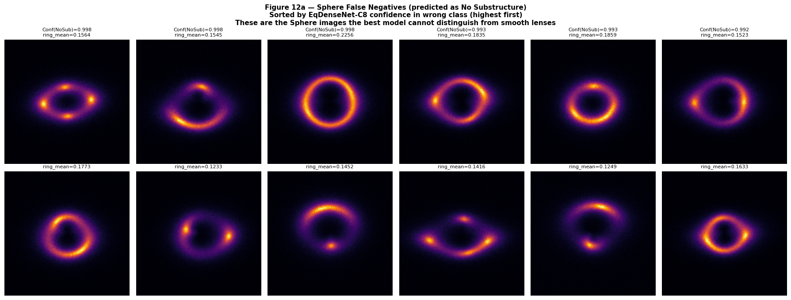
  <br><em>Figure 12a — EqDenseNet-C8 Sphere false negatives predicted as No Substructure, sorted by descending confidence in the wrong class. As with E-ResNet, the model can be strongly confident on the Sphere cases it misses. Most examples appear to have relatively weak ring-level signal, though brightness alone is not sufficient to explain every error.</em>
</p>

<p align="center">
  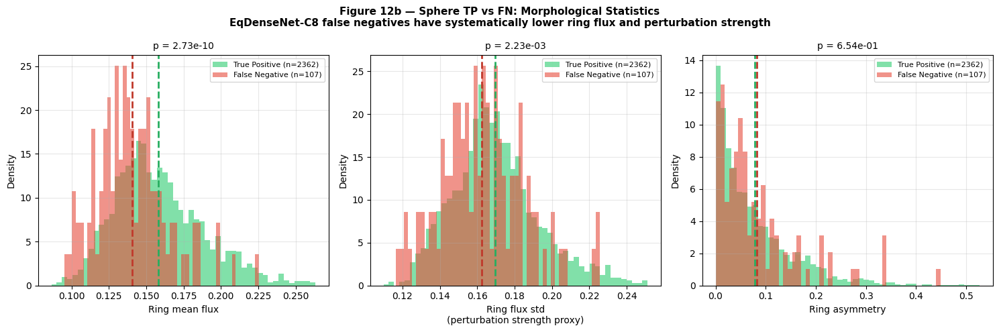
  <br><em>Figure 12b — EqDenseNet-C8 Sphere true positives versus false negatives to No Substructure. False negatives show significantly lower ring mean flux and lower ring flux standard deviation, along with higher compactness. Ring asymmetry and maximum intensity do not separate the groups meaningfully in this analysis.</em>
</p>

**Sphere ↔ Vortex confusion (Fig. 12c–12d).**  
EqDenseNet-C8 confuses **31 Sphere** images as **Vortex** and **34 Vortex** images as
**Sphere**, which is substantially fewer than E-ResNet.

Residual elongation values are:

| Group | n | Mean elongation |
|:------|--:|----------------:|
| Sphere TP | 2362 | 1.205 |
| Sphere → Vortex | 31 | 1.200 |
| Vortex TP | 2449 | 1.205 |
| Vortex → Sphere | 34 | 1.194 |

As with E-ResNet, **residual elongation does not separate the confused groups in a
useful way**. The means are very similar and the distributions overlap strongly, so
this scalar morphology measure does not explain the Sphere–Vortex confusions by
itself.

<p align="center">
  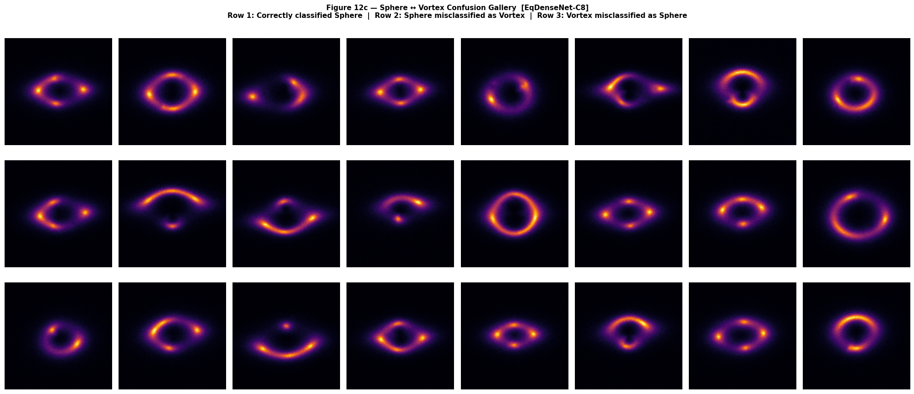
  <br><em>Figure 12c — EqDenseNet-C8 Sphere↔Vortex confusion gallery. Correctly classified and confused examples show visually overlapping morphologies, reinforcing that this confusion is not cleanly explained by a single obvious visual cue.</em>
</p>

<p align="center">
  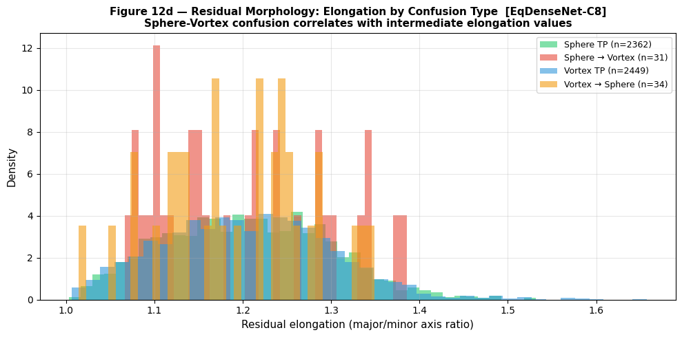
  <br><em>Figure 12d — Residual elongation distributions by confusion type for EqDenseNet-C8. The confused and correctly classified populations overlap strongly, indicating that residual elongation alone is not a useful separator for Sphere–Vortex confusion.</em>
</p>

**Classification accuracy vs ring brightness (Fig. 12e).**  
The brightness–accuracy pattern is qualitatively similar to E-ResNet, but shifted
upward overall. EqDenseNet-C8 performs better across most brightness bins, while the
lowest-brightness Sphere regime remains difficult for both architectures.

<p align="center">
  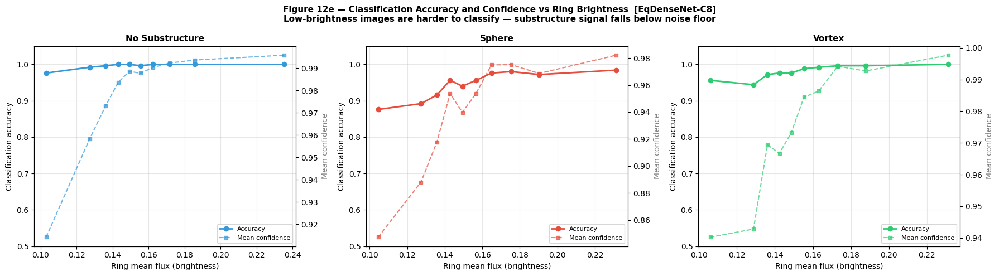
  <br><em>Figure 12e — EqDenseNet-C8 classification accuracy and mean confidence versus ring mean flux. Accuracy rises with brightness across all classes, and the pattern is strongest for Sphere. Even for the best model, the lowest-brightness Sphere regime remains the hardest.</em>
</p>

**Perturbation position vs failure (Fig. 12f).**  
The CAE residual centroids remain tightly clustered near the image centre for both
correct and incorrect predictions. No clear spatial separation is visible between
true positives and the different confusion types under this centroid-based summary.

<p align="center">
  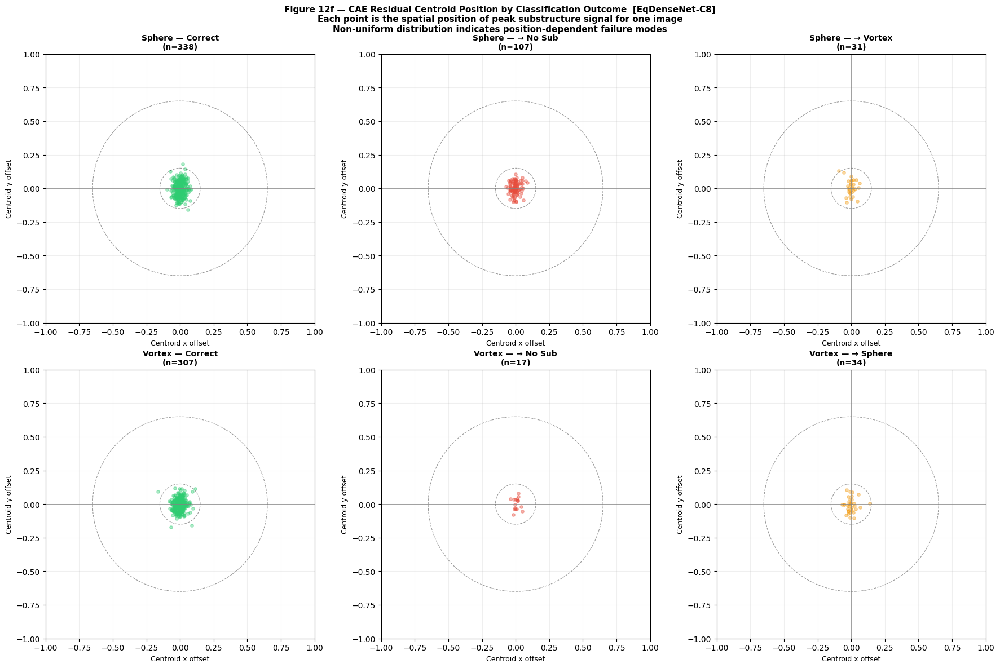
  <br><em>Figure 12f — CAE residual centroid positions by classification outcome for EqDenseNet-C8. Correct and incorrect cases overlap strongly, with no obvious centroid-level separation. Under this representation, perturbation position does not appear to be a major driver of failure.</em>
</p>

**Cross-model summary.**

| Metric | E-ResNet | EqDenseNet-C8 |
|:-------|---------:|--------------:|
| Validation accuracy | 95.96% | 97.35% |
| Sphere FN (→ No Sub) | 129 (5.2%) | 107 (4.3%) |
| Sphere → Vortex | 65 | 31 |
| Vortex → Sphere | 54 | 34 |
| FN ring mean flux gap | -10.3% | -11.3% |
| FN ring mean flux p | 6.07×10⁻¹⁰ | 2.73×10⁻¹⁰ |
| Asymmetry p | 0.899 | 0.654 |
| Clear centroid separation | none visible | none visible |

EqDenseNet-C8 reduces the **number** of failures relative to E-ResNet, but the
**type** of Sphere false negative remains very similar. In both models, missed Sphere
cases are associated with **lower ring-level signal** and **higher compactness**,
which is more consistent with a **shared hard subset of the data** than with two
fundamentally different failure regimes.

## 9. Residual Image Approach

### 9.1 Motivation

A physically motivated idea is to remove the smooth macro-lens structure from each image and classify only the remaining **residual**. If the smooth lens morphology can be reconstructed accurately, the residual should concentrate the substructure perturbation signal and suppress irrelevant variation.

This idea is most attractive in a **heterogeneous lens population**, where macro-lens morphology varies strongly across images and may act as nuisance variation. In that setting, a residual-based representation could be more robust than direct classification on raw images.

For the present dataset, the question is narrower: **does subtracting a learned smooth-lens reconstruction improve substructure classification, or does it discard useful information and introduce reconstruction noise?**

---

### 9.2 Convolutional Autoencoder

A direct analytical subtraction approach using `lenstronomy` to fit smooth SIE + shear lens models was explored first, but was not practical for this benchmark because of parameter degeneracy and slow per-image convergence.

Instead, a **convolutional autoencoder (CAE)** was trained **only on No Substructure images**. This forces the CAE to learn the smooth lens morphology without access to perturbation-bearing examples. The trained CAE is then applied to Sphere and Vortex images, and the residual is defined as:

\[
\text{residual} = \text{observed image} - \text{CAE reconstruction}
\]

Under this setup, any unreconstructed structure should correspond mainly to substructure-related signal.

**CAE architecture**

    Encoder: 4 × (Conv2d + ReLU + MaxPool) → Flatten → Linear(128)
               channels: 1 → 16 → 32 → 64 → 128

    Decoder: Linear(128) → Unflatten → 4 × (ConvTranspose2d + ReLU / Sigmoid)
               channels: 128 → 64 → 32 → 16 → 1

The CAE converges stably on the smooth-lens reconstruction task:

<p align="center">
  
  <br><em>Figure 9.1 — CAE training curve on No Substructure images only. Train and validation MSE converge rapidly and track closely, indicating stable optimisation of the smooth-lens reconstruction task.</em>
</p>

The residual quality is then assessed visually and statistically.

<p align="center">
  
  <br><em>Figure 9.2 — CAE residual visualisation for representative No Substructure, Sphere, and Vortex images. No Substructure residuals are near-zero, while Sphere and Vortex leave localised residual structure in the ring region, consistent with unreconstructed perturbation signal.</em>
</p>

<p align="center">
  
  <br><em>Figure 9.3 — Residual value distributions inside the Einstein ring annulus by class. The substructure classes retain broader residual distributions than No Substructure, indicating that the CAE does not fully reconstruct perturbation-bearing structure.</em>
</p>

<p align="center">
  
  <br><em>Figure 9.4 — Mean residual maps (top) and pixel-wise standard deviation maps (bottom), computed over multiple examples per class. No Substructure shows little coherent residual structure, while Sphere and Vortex exhibit elevated residual variance concentrated around the ring annulus.</em>
</p>

**Residual statistics inside the ring annulus**

| Class | Mean residual | Std residual | Mean \|residual\| |
|:------|:-------------:|:------------:|:-----------------:|
| No Substructure | 0.03290 | 0.18149 | 0.12398 |
| Sphere | 0.03915 | 0.15966 | 0.10564 |
| Vortex | 0.04661 | 0.17307 | 0.11574 |

These residual maps confirm that the CAE subtraction is not trivial: substructure images retain structured residual signal. The relevant downstream question is whether that residual representation is **better for classification** than the raw image.

---

### 9.3 Residual Classifiers

To test that, two classifiers were trained directly on the CAE residuals and compared with the raw-image DenseNet-121 baseline.

| Model | Input | Macro AUC | Val Accuracy | Training |
|:------|:-----:|:---------:|:------------:|:--------:|
| DenseNet-121 | Raw images | 0.9950 † | 96.95% | Pretrained |
| DenseNet-121 | CAE residuals | 0.9614 | 84.88% | Scratch |
| ResNet-18 | CAE residuals | 0.9543 | 83.80% | Scratch |

*† This raw-image DenseNet-121 number comes from the dedicated residual-comparison run. The main benchmark result reported earlier remains 0.9962 from the primary evaluation pipeline.*

Both residual classifiers underperform the raw-image baseline by a substantial margin. The training curves show why: both models overfit rapidly, with training loss continuing to fall while validation loss deteriorates.

<p align="center">
  
  <br><em>Figure 9.5 — DenseNet-121 trained on CAE residuals. Validation performance peaks early and then degrades, while training loss continues toward zero, indicating strong overfitting.</em>
</p>

<p align="center">
  
  <br><em>Figure 9.6 — ResNet-18 trained on CAE residuals. The best checkpoint occurs early, with little evidence of sustained validation improvement afterward.</em>
</p>

The evaluation results on the validation set are shown below.

<p align="center">
  
  <br><em>Figure 9.7 — DenseNet-121 residual classifier confusion matrix. Sphere shows the largest off-diagonal leakage, indicating that the Sphere residual signal is the hardest to use reliably in isolation.</em>
</p>

<p align="center">
  
  <br><em>Figure 9.8 — DenseNet-121 residual classifier ROC curves. Macro AUC = 0.9614. Sphere is again the weakest class, with the lowest per-class AUC among the three classes.</em>
</p>

<p align="center">
  
  <br><em>Figure 9.9 — ResNet-18 residual classifier confusion matrix. Compared with DenseNet-121 on residuals, Sphere recall is somewhat higher, but Vortex performance is weaker and overall macro-AUC is lower.</em>
</p>

<p align="center">
  
  <br><em>Figure 9.10 — ResNet-18 residual classifier ROC curves. Macro AUC = 0.9543, below DenseNet-121 on residuals and well below the raw-image baseline.</em>
</p>

**Per-class AUC on residual inputs**

| Class | DenseNet-121 (residual) | ResNet-18 (residual) |
|:------|:----------------------:|:--------------------:|
| No Substructure | 0.9724 | 0.9683 |
| Vortex | 0.9630 | 0.9556 |
| Sphere | 0.9488 | 0.9390 |

The main result is straightforward: the residual contains real class-discriminative signal, but that signal is **not sufficient to match raw-image classification** on this dataset.

---
### 9.4 Summary and Interpretation

| Finding | Value |
|:--------|:------|
| AUC gap (raw → residual DenseNet-121) | −0.034 |
| DenseNet-121 residual best checkpoint | Epoch 10 |
| DenseNet-121 residual train/val loss gap at epoch 30 | 0.0013 vs 0.8211 |
| ResNet-18 residual best checkpoint | Epoch 5 |

The residual branch is therefore **scientifically informative but not competitive**
on this benchmark.

The most defensible interpretation is:

1. **The residual representation does preserve some class-discriminative signal.**  
   Both residual classifiers perform well above chance, and the residual maps show
   structured differences between No Substructure and the substructure classes.

2. **That signal is weaker than the signal available in the raw image.**  
   On this homogeneous simulated dataset, direct raw-image classification remains
   clearly superior.

3. **The residual pipeline introduces additional costs.**  
   These include reconstruction artefacts from the CAE, loss of potentially useful
   macro-lens context, and strong overfitting when residual classifiers are trained
   from scratch.

So for the present benchmark, **classifying raw images directly is the better
engineering choice**.

That does not make the residual idea useless. Its value is more likely to appear in
a **heterogeneous lens population**, where macro-lens morphology varies more strongly
across images and acts as nuisance variation. In that setting, isolating local
perturbation signal may become more useful than it is here.

The appropriate conclusion is therefore conditional:

**For this homogeneous benchmark, residual classification is inferior to direct
raw-image classification. For more heterogeneous lens populations, the residual
approach remains a plausible research direction rather than a discarded idea.**

---

## 10. Discussion

### 10.1 The Sphere Class is Systematically Harder

Across the stronger models in this benchmark, the **Sphere** class is consistently
the most difficult. The dominant error is **Sphere → No Substructure**, while the
No Substructure / Vortex boundary is much easier. This is consistent with the visual
character of the classes: Sphere perturbations are compact and relatively subtle,
whereas Vortex perturbations are typically more extended and asymmetric.

For that reason, **Sphere-specific metrics** are more informative than macro AUC
alone. In particular, **Sphere Recall** and **Sphere PR-AUC** separate models that
look very similar under macro-averaged performance.

The detailed failure analysis supports the same interpretation. For both
**EqDenseNet-C8** and **E-ResNet**, Sphere false negatives are associated with
**lower ring mean flux** and **higher compactness**, while coarse measures such as
**asymmetry** and **centroid position** do not separate the groups well. The two
models differ in error rate, but the morphological signature of the missed Sphere
cases is very similar, which suggests a **shared hard subset** rather than two
qualitatively different failure regimes.

The cross-model cohort analysis points in the same direction. The **54 Sphere
images missed by all 8 models** are, on average, dimmer and slightly less variable
than the universally correct Sphere images. That does not prove a hard detection
limit, but it does indicate that the hardest Sphere cases occupy a **weaker-signal
region** of the simulated data distribution.

Taken together, the benchmark suggests a simple interpretation: the main challenge
is not distinguishing Vortex from the other classes, but detecting the **weakest
compact Sphere perturbations** against the smooth lens background. That is why
improvements on Sphere-specific performance are more scientifically meaningful here
than very small gains in macro AUC alone.

### 10.2 Skip Connections Strongly Improve Performance in This Benchmark

| Architecture | Macro AUC | Params | Skip connections |
|:-------------|:---------:|:------:|:----------------:|
| AlexNet | 0.6589 | 57M | ✗ |
| VGG-16 | 0.8944 | 134M | ✗ |
| ResNet-18 | 0.9927 | 11.2M | ✓ |
| EqDenseNet-C8 | 0.9973 | 0.093M | ✓ (dense) |

The largest performance jump in the benchmark is between the **plain sequential
CNNs** and the **skip-connected models**. Even with far more parameters, VGG-16
remains well below ResNet-18, and AlexNet performs substantially worse than the
stronger modern architectures. Within this benchmark, skip-connected models are
consistently superior.

That said, this is **not** a clean one-factor causal test. The sequential models
differ from the residual and dense models not only in connectivity, but also in
normalization, optimization behavior, and compatibility with pretraining. So the
safest interpretation is empirical: **architectures with skip connections are much
better suited to this task under the present training setup**.

The equivariant models point in the same direction. **EqDenseNet-C8** achieves the
best overall result at very small parameter count, while the shallower
**Equivariant-D4** model is much weaker despite sharing a symmetry-aware inductive
bias. This suggests that **symmetry alone is not enough**; feature reuse and
information flow through the network also matter.

The practical takeaway is therefore simple: for this benchmark, **skip connections
appear to be a major architectural advantage**, especially when the discriminative
signal is subtle and localized.

### 10.3 Equivariant Inductive Bias Improves Parameter Efficiency

**EqDenseNet-C8** achieves the strongest overall result in the benchmark while using
very few parameters and no ImageNet pretraining. **E-ResNet** shows a similar
pattern: it remains competitive with strong pretrained models at a much lower
parameter count.

The cleanest interpretation is a **parameter-efficiency result**, not a
sample-efficiency one. This benchmark does not include a data-scaling experiment, so
the claim should remain limited: symmetry-aware architectures can perform very well
on this task **without large model size or external pretraining**.

The parameter-efficiency plot supports that reading visually. EqDenseNet-C8 and
E-ResNet occupy the **low-parameter, high-AUC** region of the benchmark, whereas the
strongest non-equivariant baselines require substantially more parameters and, in
several cases, ImageNet initialization.

The weaker **Equivariant-D4** model is also important here: it shows that
equivariance without enough architectural capacity or feature reuse does **not**
automatically reach top-tier performance. So the fairest interpretation is specific
rather than universal: **for this benchmark, the combination of equivariant
inductive bias with an effective architecture yields unusually strong performance at
low parameter count**.

A secondary advantage is robustness. **E-ResNet** is also substantially more
rotation-stable than **ResNet-50** at the classifier output after training, which
makes the equivariant result attractive not only in efficiency terms, but also in
terms of symmetry consistency.

### 10.4 The Role of Augmentation in Equivariant Networks

Within the equivariant-family ablation, **augmentation** has the largest and most
consistent effect on validation performance. The gains from adding **D₄
augmentation** are substantially larger than the differences associated with adding
residual connections in the same small-model setting.

On **Macro AUC**:

- Plain CNN: Aug − NoAug = **+0.0090**
- E-ResNet: Aug − NoAug = **+0.0073**

On **Sphere Recall**:

- Plain CNN: **+0.0336**
- E-ResNet: **+0.0196**

By contrast, the residual effect is small in the no-augmentation setting and does
not persist once augmentation is already present.

A cautious interpretation is that **architectural equivariance and data augmentation
are complementary rather than redundant**. The equivariant layers encode the desired
symmetry into the model class, but augmentation still improves how well that
symmetry is realized under the actual training and image-discretization conditions
of this benchmark.

The rotation-stability results point in the same direction: the equivariant models
are much more stable than a standard CNN, but training does not preserve exact
numerical invariance automatically. Augmentation appears to help close part of that
gap in practice.

The role of residual connections is narrower here. In this shallow equivariant
setting, they do not produce a large validation-performance gain, although they do
appear to help preserve output stability under rotation after training. So the
cleanest conclusion is not that residual connections are unimportant, but that
**augmentation is the stronger performance-side factor in this particular ablation**.

### 10.5 Architecture Priors Aligned with the Task Appear Advantageous

Across the benchmark, the strongest models tend to be those whose architectural
biases are well matched to the structure of the problem. This is a **descriptive
pattern** in the current dataset, not a universal rule.

Two comparisons illustrate it.

**1. Symmetry-aware models vs standard CNNs.**  
The best equivariant models achieve top-tier performance at very small parameter
count and without ImageNet pretraining. They also retain much stronger output
stability under rotation than a standard CNN. This is consistent with the
rotational symmetry prior being useful for lensing images, although the comparison
is not cleanly attributable to symmetry alone because architecture family and
training regime also differ.

**2. Dense local feature reuse vs patch-based global attention.**  
**DenseNet-121** clearly outperforms **ViT-Base** on this benchmark, especially on
the Sphere class. The interpretability analysis suggests a plausible reason: the
difficult signal in Sphere appears to be a **subtle local perturbation within the
ring**, and dense convolutional feature reuse may be better matched to that kind of
localized structure than patch-based transformer attention at this image scale. That
interpretation remains suggestive rather than causal.

The common thread is modest but consistent: when the architecture encodes a prior
that fits the task geometry, such as **rotational symmetry** or **strong locality**,
the model seems to need less help from scale, pretraining, or data volume to
perform well. In this benchmark, those task-aligned priors appear to be more useful
than relying on a more flexible architecture to learn the same structure from data
alone.

### 10.6 Deep Ensemble Uncertainty Reveals Two Distinct Failure Groups

The deep ensemble adds a useful reliability signal beyond single-model accuracy. In
particular, it shows that difficult Sphere cases do not form one uniform
uncertainty pattern.

The class-level entropy statistics are slightly counterintuitive: Sphere has the
highest **mean entropy**, but not the highest **median**. This indicates a
distribution with a **heavier high-uncertainty tail** rather than a uniformly
uncertain class. Many Sphere images are classified confidently, but a smaller subset
is much more ambiguous than the corresponding tail in the other classes.

The more important result is the separation between two empirical failure groups:

| Failure group | Entropy | Approx. size | Operational implication |
|:--------------|:-------:|:------------:|:------------------------|
| Silent failures | Low | 54 | Not flagged by entropy-based review |
| High-entropy ambiguous cases | High | ~12 | Naturally flagged for secondary review |

These two groups do not overlap in the current analysis. That matters because they
suggest different practical problems. High-entropy cases are difficult, but at least
the ensemble signals that difficulty. **Silent failures are more serious**: the
ensemble is confidently wrong, so uncertainty alone does not catch them.

The cohort analysis suggests that the silent-failure Sphere images are also weaker
on simple image-level statistics such as **mean intensity** and **pixel standard
deviation**. That does not identify a single mechanism, but it supports the view
that the most dangerous errors come from a **shared hard subset** of the data rather
than from isolated architectural mistakes.

The practical lesson is therefore limited but important: **uncertainty is useful,
but incomplete**. Ensemble entropy can help identify ambiguous cases, but it cannot
be treated as a general safeguard against error.

### 10.7 The Residual Image Approach — Scientific Value and Practical Ceiling

The residual-image branch reaches **Macro AUC 0.9614** with DenseNet-121 and
**0.9543** with ResNet-18, remaining well below the corresponding raw-image
baseline. At the same time, the residual statistics show a modest class-dependent
effect: residual variation inside the ring is somewhat structured by class. So the
residual maps do retain some substructure-related information, but not strongly
enough to match direct classification on the original images.

Two limitations appear to define the practical ceiling of this branch.

First, the **residual representation is weak relative to the reconstruction noise
floor**. Both residual classifiers generalize poorly compared with their raw-image
counterparts, and the gap between DenseNet-121 and ResNet-18 on residuals is small
relative to the much larger drop from raw images to residuals. This suggests that
the representation itself is the dominant bottleneck, even if classifier choice
still matters somewhat.

Second, the **analytical fitting route** did not produce a clean alternative residual
representation. The forward-model fits were unstable and did not yield
class-separating residuals, so the notebook ultimately relied on a data-driven CAE
approximation instead. That does not prove that all analytical fitting strategies
would fail, but it does show that the straightforward version was not usable here.

A likely reason the residual branch underperforms is the **homogeneity of the
simulated dataset**. In this benchmark, the smooth lens morphology is already highly
constrained, so the raw image itself remains a very informative input. Subtracting a
learned smooth reconstruction removes some shared structure, but also introduces
reconstruction noise, and the net result is worse classification performance.

The residual approach is therefore **scientifically useful but practically limited**
in this setting. It shows that some discriminative signal survives subtraction, but
not enough to compete with direct raw-image classification on this dataset. A
stronger version of this idea may require either better residual extraction or a
dataset regime in which macro-lens variation is a larger confound than it is here.

---

## 11. Limitations

- **Single random seed.** All experiments were run with one fixed seed. Run-to-run
  variance is therefore unknown, and very small metric differences should not be
  over-interpreted.

- **Convergence and compute budget.** Some models, especially the equivariant ones,
  were still improving when training stopped. Their reported results may therefore
  be slightly conservative, but this was not tested systematically with longer
  schedules or repeated runs.

- **Homogeneous simulation regime.** The dataset is highly structured, with limited
  variation in macro-lens parameters. Strong performance here does not guarantee
  similar behavior on more heterogeneous simulations or on real observational data.

- **Asymmetric pretraining conditions.** Some models use ImageNet pretraining while
  the equivariant models are trained from scratch. This makes cross-family
  comparisons informative but not perfectly controlled.

- **Discrete symmetry approximation.** The equivariant models use discrete groups
  such as D₄ and C8, which are useful approximations in this benchmark but not exact
  physical symmetries of real lens systems. More flexible rotational groups may be
  more appropriate for realistic observations.

- **ViT input adaptation.** ViT-Base was adapted from its native pretrained
  resolution to this dataset through interpolation and patch-grid adjustment. That
  mismatch may have contributed to its weaker performance.

- **Single-band input only.** All experiments use one simulated intensity channel.
  Real substructure analysis may benefit from additional information such as
  multi-band imaging or other observational context.

- **Residual-branch limitations.** The CAE residual approach retained some
  class-dependent signal, but the residual classifiers generalized much more poorly
  than the raw-image models. This suggests that, in this benchmark, the residual
  representation is a major bottleneck.

- **Failure-analysis limitations.** Some summary statistics used in the failure
  analysis are coarse. For example, centroid-based position measures may miss angular
  effects along the ring, so null results on position should be interpreted
  cautiously.

- **Interpretability limitations.** CAM and Grad-CAM maps are constrained by the
  spatial resolution of the underlying feature maps and by the visualization method
  itself. The resulting heatmaps are useful for coarse spatial interpretation, but
  not for precise localization or causal claims.

---

## 12. Future Work

### 12.1 Architectural Directions

**Higher-order and continuous rotation equivariance.**  
The current equivariant models use discrete rotation groups such as D₄ and C8, which
are useful approximations but do not cover arbitrary sky orientations exactly. A
natural next step is to test higher cyclic groups or continuous-group steerable
CNNs. The goal would be to determine whether finer rotational structure improves
performance and stability on more realistic lens populations.

**Scaling equivariant dense architectures.**  
EqDenseNet-C8 achieved the strongest result at very low parameter count, which makes
it a strong base architecture for further scaling. A controlled study of wider or
deeper equivariant dense networks would test whether the remaining Sphere errors are
mainly a capacity issue or mainly a data/representation issue.

**Equivariant transformer variants.**  
ViT underperformed the strongest convolutional models in this benchmark. A useful
follow-up would be to test transformer-style architectures that incorporate explicit
rotational structure or ring-local attention, rather than relying on generic global
patch attention alone.

**Ring-aware spatial gating.**  
Several analyses suggest that the discriminative signal is concentrated on the
Einstein ring. A lightweight ring-localization module followed by a ring-focused
classifier could test whether explicitly restricting computation to the physically
relevant region reduces false positives and improves Sphere recall.

### 12.2 Detection and Estimation Extensions

**Subhalo mass regression.**  
The current pipeline predicts discrete classes only. A natural extension is to add a
regression head for subhalo mass and test whether the model representation preserves
continuous lensing information related to perturbation strength and scale, rather
than only class identity.

**Anomaly-detection framing.**  
The silent-failure Sphere cases suggest that three-class classification is not the
only useful formulation. A one-class or anomaly-detection approach, using
No Substructure as the reference manifold, could test whether subtle substructure
cases are better detected as deviations from smooth lenses than as standard
multiclass labels.

**Uncertainty-aware triage.**  
The ensemble analysis showed that entropy captures some ambiguous cases but misses
confident shared failures. A more complete triage pipeline could combine ensemble
uncertainty with an additional anomaly-style score or image-quality statistic to
detect both types of failure.

### 12.3 Robustness and Calibration

**Distribution-shift evaluation.**  
All current results are measured on validation data drawn from the same simulation
pipeline as training. A necessary next step is to test robustness under controlled
shifts in noise level, PSF, seeing, and lens morphology.

**Calibration under shifted class priors.**  
The benchmark uses balanced class proportions, whereas real survey data will not.
Post-hoc calibration and threshold analysis would therefore be required before using
model confidence operationally.

**Multi-channel or multi-band inputs.**  
All experiments here use a single simulated intensity channel. Adding extra channels,
such as multi-band information in a more realistic setting, would test whether some
of the current hard cases are limited by the available input representation rather
than by classifier design alone.

### 12.4 Interpretability and Analysis

**Angular position along the ring.**  
The centroid-based position analysis was coarse. A more physically meaningful
follow-up would parameterize perturbation position by angular coordinate along the
fitted ring and test whether certain arc regions are systematically harder.

**Direct arc-coverage measurements.**  
Several failure analyses suggest that weaker or sparser ring structure is associated
with errors. A direct measure of arc coverage or ring completeness would be more
interpretable than global mean intensity alone.

**CAE bottleneck study.**  
The residual branch may depend strongly on bottleneck size. A systematic sweep over
latent dimensionality would test the tradeoff between smooth-lens reconstruction
quality and preservation of substructure-related residual signal.

---

## 13. Future DeepLense Research Directions

The benchmark suggests five concrete follow-up directions.

1. **Continuous-rotation equivariant lens classifiers.**  
   Test whether moving beyond discrete D₄/C8 symmetry improves performance and
   stability on lens images with arbitrary orientations.

2. **Silent-failure detection through anomaly scoring.**  
   Use the CAE residual or a related one-class score to target the Sphere cases that
   remain confidently misclassified by all ensemble members.

3. **Ring-local perturbation detection.**  
   Build a two-stage system that first identifies the ring geometry, then classifies
   perturbations in a ring-aligned coordinate frame.

4. **Joint classification and subhalo-mass estimation.**  
   Extend the current classification setting to a more physically informative output
   space with calibrated uncertainty.

5. **Evaluation on heterogeneous lens populations.**  
   Move beyond the current homogeneous simulation regime and test whether the
   observed advantage of symmetry-aware architectures persists when macro-lens
   properties vary more realistically.

---

## 13. Repository Structure
```
DeepLense-GSoC-2026/
│
└── Test_I_Classification/
    │
    ├── README.md                              ← This file
    ├── Test_I_Classification_final.ipynb      ← Main notebook (all experiments)
    ├── requirements.txt
    │
    └── assets/                                ← All figures generated by the notebook
        │
        ├── ── EDA ──────────────────────────────────────────────────────
        ├── fig2_1_sample_images.png
        ├── fig2_2_eda_statistic.png
        │
        ├── ── Section 5: Architecture Evaluations ──────────────────────
        ├── fig5_1_resnet18_eval.png
        ├── fig5_2_resnet50_eval.png
        ├── fig5_3_densenet121_eval.png
        ├── fig5_4_efficientnetb3_eval.png
        ├── fig5_5_alexnet_eval.png
        ├── fig5_6_vgg16_eval.png
        ├── fig5_7_vit_eval.png
        ├── fig5_8_enn_eval.png
        ├── fig5_9_eresnet_eval.png
        ├── fig5_10a_eqdensenet_c8_training.png
        ├── fig5_10b_eqdensenet_c8_eval.png
        ├── fig5_11_ensemble_eval.png
        │
        ├── ── Section 6: Results Summary ───────────────────────────────
        ├── fig6_1_roc_comparison.png
        ├── fig6_2_sphere_pr_curves.png
        ├── fig6_3_param_efficiency.png
        │
        ├── ── Section 7: Interpretability ──────────────────────────────
        ├── fig7_1_gradcam_resnet50_eresnet.png
        ├── fig7_2_gradcam_resnet50_eresnet.png
        ├── fig7_3_gradcam_resnet50_eresnet.png
        ├── fig6_1_case2_gradcam.png
        ├── fig6_1_case3_gradcam.png
        ├── fig6_1_case4_gradcam.png
        ├── fig7_2a_spatial_attention_vit_densene.png
        ├── fig7_2b_densenet_resolution.png
        ├── fig7_2c_vit_ring_concentration.png
        ├── fig7_2d_vit_attention_consistency.png
        ├── fig6_2e_ring_concentration_comparison.png
        ├── fig7_3_ensemble_entropy.png
        ├── fig7_4_ensemble_entropy.png
        ├── fig7_4_ablation_training_curves.png
        ├── fig7_5_equivariance_verification.png
        ├── eqdensenet_c8_cam.png
        │
        ├── ── Section 8: Failure Mode Analysis ─────────────────────────
        ├── fig8_1_universally_misclassified_correct.png
        ├── fig8_1_sphere_class_difficulty.png
        ├── fig8_1_cross_arch_confusion.png
        ├── fig8_2_sphere_failure_statistics.png
        ├── fig8_3_confidence_vs_brightness.png
        ├── fig12a_sphere_false_negatives.png
        ├── fig12c_sv_confusion_gallery.png
        ├── fig12d_elongation_distribution.png
        ├── fig12e_confidence_vs_brightness.png
        ├── fig12f_perturbation_position.png
        │
        └── ── Section 9: Residual Image Approach ───────────────────────
            ├── fig11_cae_training.png
            ├── fig9_1_cae_residuals.png
            ├── fig11_residual_distributions.png
            ├── fig11_mean_residual_maps.png
            ├── fig9_2_residual_classifier_training.png
            ├── fig9_3_residual_classifier_training.png
            ├── fig11f_dn_res_confusion_matrix.png
            ├── fig11g_dn_res_roc.png
            ├── fig11i_r18_res_confusion_matrix.png
            └── fig11j_r18_res_roc.png


*Model weights are linked individually in each architecture section above.
All weights are raw PyTorch state dicts — load with
`model.load_state_dict(torch.load(path, map_location=device))`.*
```

### Model Weights — Google Drive

All weights are saved as raw PyTorch state dicts via torch.save(model.state_dict(), path). Load with model.load_state_dict(torch.load(path, map_location=device)) directly — no key unpacking needed.

| Model | AUC | Drive Link |
|:------|:---:|:----------:|
| EqDenseNet-C8 | 0.9974 | [Download](https://drive.google.com/file/d/108P4VtKzX7agb9jeRPM5xGSCqITmA5kQ/view?usp=sharing) |
| DenseNet-121 | 0.9962 | [Download](https://drive.google.com/file/d/1A-3ghbzmvuOIs5EZg8HITDRBWMEmQXTn/view?usp=sharing) |
| E-ResNet | 0.9952 | [Download](https://drive.google.com/file/d/11KBV8v5_pXaUsrvin8uWFB6o0jqX65SB/view?usp=sharing) |
| ResNet-50 | 0.9946 | [Download](https://drive.google.com/file/d/1D0DC-M3HzY8J2Rmz01OcJplzbG5Zz3Rq/view?usp=sharing) |
| ResNet-18 | 0.9927 | [Download](https://drive.google.com/file/d/1cRMRDweT49wT09Fu9wDVLrGTqvn5Nh-q/view?usp=sharing) |
| EfficientNet-B3 | 0.9898 | [Download](https://drive.google.com/file/d/1IOim4Px37em7PMdYW3rKLfpTAy2Usq5A/view?usp=sharing) |
| ViT-Base/16 | 0.9761 | [Download](https://drive.google.com/file/d/1DgXgMUY5hit5lI7_rtetaJ3eIAzsujCO/view?usp=sharing) |
| VGG-16 | 0.8944 | [Download](https://drive.google.com/file/d/1GkuBBv8cUmCTDhd5DfZA4WXxA-BEGPob/view?usp=sharing) |
| Equivariant-D4 (ENN) | 0.7362 | [Download](https://drive.google.com/file/d/1UYCFOdl_TEqnV8iYnuzLuNalViNkK-qg/view?usp=sharing) |
| AlexNet | 0.6589 | [Download](https://drive.google.com/file/d/13d5yiDvb9LcVxVXu5DmxkVQC0r5s8O9_/view?usp=sharing) |
| CAE (smooth lens) | — | [Download](https://drive.google.com/file/d/1hQsnWvwOzBHeOozeuBiqHacK4SI5nWQa/view?usp=sharing) |


---

## 14. Citation

If you use this work, please cite the ML4SCI DeepLense project and the DeepLenseSim simulation pipeline:

```bibtex
@misc{deeplense_gsoc2026_testi,
  author       = {Rafiqus Salehin},
  title        = {ML4SCI DeepLense GSoC 2026 — Common Test I:
                  Multi-Class Classification of Dark Matter Substructure},
  year         = {2026},
  url          = {https://github.com/rsalehin/DeepLense-GSoC-2026}
}

```

**Related work:**

- Selvaraju et al. (2017) — Grad-CAM: Visual Explanations from Deep Networks
- Alexander et al. (2020) — Deep Learning the Morphology of Dark Matter Substructure
- Abnar & Zuidema (2020) — Quantifying Attention Flow in Transformers
- Weiler & Cesa (2019) — General E(2)-Equivariant Steerable CNNs (`escnn`)
- He et al. (2016) — Deep Residual Learning for Image Recognition
- Huang et al. (2017) — Densely Connected Convolutional Networks
- Dosovitskiy et al. (2020) — An Image is Worth 16×16 Words: Transformers for Image Recognition

---

<div align="center">

**ML4SCI DeepLense — GSoC 2026**
*Searching for dark matter substructure, one Einstein ring at a time.*

</div>

