<div align="center">

# Test VI.A — Gravitational Lens Image Super-Resolution

### ML4SCI DeepLense · GSoC 2026

**Rafiqus Salehin** · [@rsalehin](https://github.com/rsalehin)

[](https://ml4sci.org)
[](https://summerofcode.withgoogle.com)
[](https://pytorch.org)
[](../LICENSE)

<br>

*Multi-architecture deep learning super-resolution benchmark on simulated strong gravitational lensing images. Five architectures evaluated across pixel-level, structural, and physically-motivated metrics, with controlled ablations on training procedure, loss function, and patch strategy.*

</div>

---

## Table of Contents

- [Task Description](#task-description)
- [Dataset](#dataset)
- [Scientific Motivation](#scientific-motivation)
- [Pipeline Overview](#pipeline-overview)
- [Architectures](#architectures)
- [Results](#results)
  - [Main Benchmark Table](#main-benchmark-table)
  - [Training Dynamics](#training-dynamics)
  - [Loss Function Ablation](#loss-function-ablation)
  - [Patch vs Full-Image Ablation](#patch-vs-full-image-ablation)
- [Physical Evaluation — Einstein Ring Metrics](#physical-evaluation--einstein-ring-metrics)
  - [Radial Profile Comparison](#radial-profile-comparison)
  - [Ring Peak Shift Distribution](#ring-peak-shift-distribution)
  - [Radial Profile MSE](#radial-profile-mse)
- [Qualitative Analysis](#qualitative-analysis)
  - [Full Comparison Grid](#full-comparison-grid)
  - [Difference Maps](#difference-maps)
  - [Failure Cases](#failure-cases)
- [Scientific Discussion](#scientific-discussion)
- [Limitations](#limitations)
- [Bridge to Test VI.B](#bridge-to-test-vib)
- [Reproducibility](#reproducibility)
- [References](#references)

---

## Task Description

Train a deep learning super-resolution model to upscale low-resolution (LR) strong lensing images to high-resolution (HR) using simulated paired samples as ground truth. The SR model must not only achieve strong pixel-level metrics (MSE, PSNR, SSIM) but also preserve the physically relevant Einstein ring structure — specifically the ring peak radius $θ_E$ — since systematic bias in $θ_E$ propagates directly to errors in inferred lens mass.

**Evaluation metrics:** MSE ↓ · PSNR ↑ · SSIM ↑ · Ring peak shift ↓ · Radial profile MSE ↓

---

## Dataset

| Property | Value |
|---|---|
| Total pairs | 10,000 HR/LR |
| HR shape | `(1, 150, 150)`, float64, range [0, 1] |
| LR shape | `(1, 75, 75)`, float64 |
| Scale factor | **2× (uniform, isotropic)** |
| Channels | 1 (grayscale) |
| Class | No substructure (single population) |
| Pairing | By filename stem (`sample{N}.npy`) |

**Pixel statistics (500-sample):**

| Region | Pixel fraction | Mean intensity |
|---|---|---|
| Background | 86.4% | 0.024 |
| Ring / arc | 13.6% | 0.301 |
| Ring-to-background contrast | — | 12.5× |

**Einstein radius statistics (200-sample):**

| | Value |
|---|---|
| Mean $θ_E$ | 24.61 px (HR space) |
| Std $θ_E$ | 4.61 px |
| Range | 13.5 – 37.5 px |
| Mean SNR (HR ≈ LR) | 13.4 (Pearson r = 0.9989) |

<br>

<div align="center">
  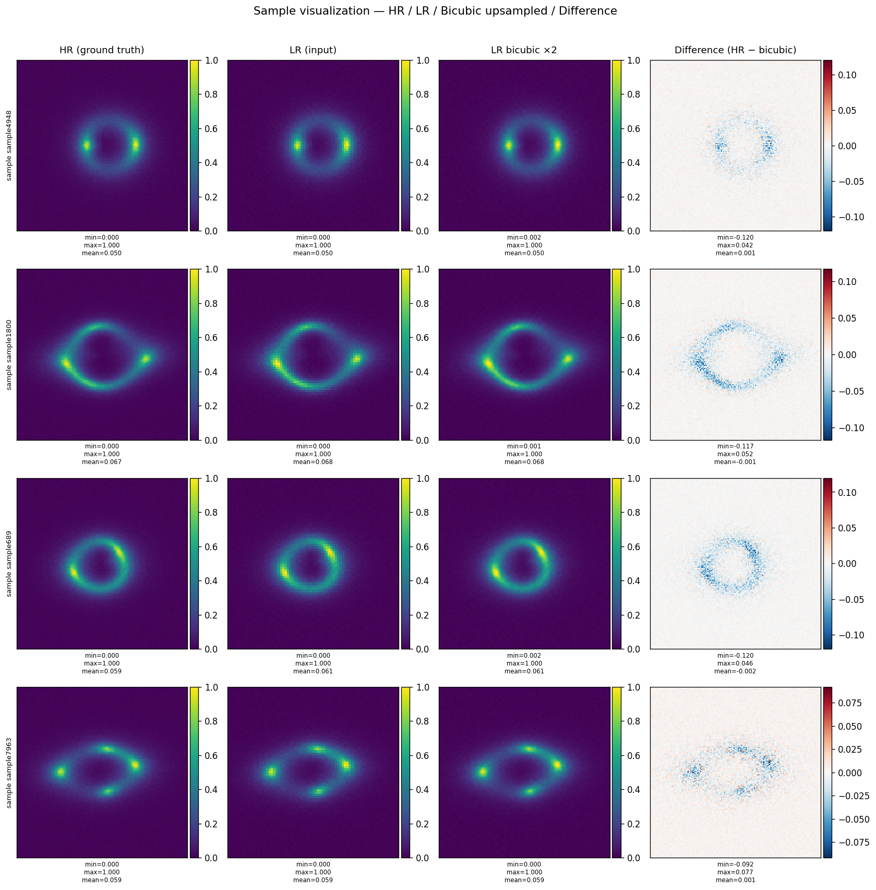
  <br>
  <sub><b>Figure 1.</b> Four randomly sampled HR/LR pairs with bicubic ×2 upsampling and pixel-wise difference HR − bicubic. Einstein ring and arc morphology vary across samples; residuals are concentrated on ring edges.</sub>
</div>

<br>

The dataset contains a single no-substructure population with controlled Gaussian PSF. At 2× scale factor, LR images preserve most spatial frequency content — this makes the classical baselines unusually strong (bicubic SSIM 0.964) and tightens the performance ceiling for deep models.

---

## Scientific Motivation

The Einstein radius θ_E encodes the projected lens mass enclosed within the ring:

```
$M_E = (c² / 4G) × (D_s / D_l D_ls) × θ_E²$
```

A 1 px systematic shift in the reconstructed $θ_E$ corresponds to a ~4% bias in $θ_E$ (at mean θ_E ≈ 24.6 px) and an ~8% bias in inferred lens mass $M_E$ via the quadratic scaling. Super-resolution is therefore not merely a visual enhancement task — ring-structure preservation is the physically critical metric.

<br>

<div align="center">
  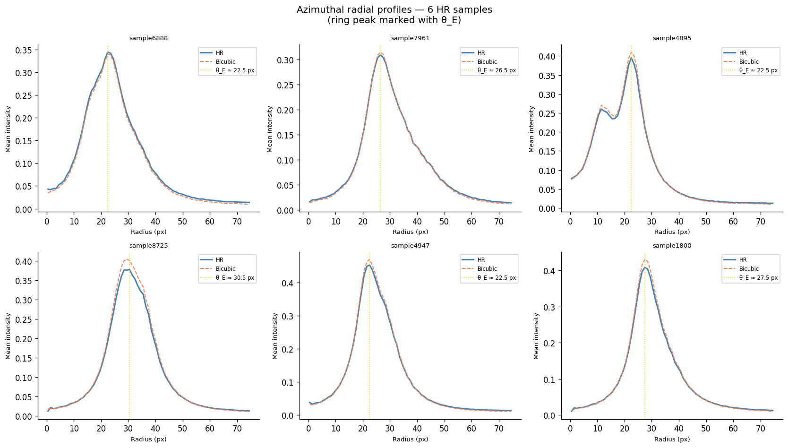
  <br>
  <sub><b>Figure 2.</b> Azimuthally averaged radial intensity profiles for 6 HR images with bicubic upsampled LR overlaid. Gold vertical lines mark the HR ring peak θ_E. Mean θ_E = 24.61 px, std = 4.61 px across the dataset (range 13.5–37.5 px).</sub>
</div>

<br>

---

## Pipeline Overview

```
Raw LR (75×75, float64)
      │
      ▼
Per-image min-max normalisation → [0, 1]    (LR only; HR already bounded)
      │
      ▼
LensingSRDataset
  ├── Patch mode  : random 32×32 LR / 64×64 HR crops  (training)
  └── Full-image  : full 75×75 LR / 150×150 HR         (val / test)
      │
      ▼
D4 augmentation (8 symmetries of the square, applied jointly to HR/LR)
      │
      ▼
SR Model  →  PixelShuffle ×2  →  SR output (150×150)
      │
      ▼
Loss: L1 + 0.1 × (1 − SSIM)      [combined default]
      │
      ▼
Evaluation: MSE · PSNR · SSIM · Ring peak shift · Radial profile MSE
```

**Train / val / test split (seed=42):** 8,000 / 1,000 / 1,000

**DataLoader configuration:**

| Loader | Batch size | Mode | Augmentation |
|---|---|---|---|
| train | 16 | Patch 64×64 HR | D4 on |
| val | 4 | Full image | Off |
| test | 1 | Full image | Off |

---

## Architectures

Five architectures benchmarked, spanning 8K to 7.9M parameters:

### SRCNN
3-layer CNN operating in HR space (bicubic pre-upsampled input). Patch extraction (9×9) → nonlinear mapping (1×1) → reconstruction (5×5). The simplest deep SR model; serves as the baseline deep learning result.

| Parameters | Upsampling | Input |
|---|---|---|
| **8,129** | Bicubic pre-upsampling (not learned) | Bicubic-upsampled LR |

### EDSR
Enhanced Deep Residual Network. 16 residual blocks + final conv in body, pixel-shuffle ×2 upsampling head. No batch normalisation (by design). Residual scaling = 0.1. EDSR-baseline configuration (n_feats=64).

| Parameters | Upsampling | Batch norm |
|---|---|---|
| **1,367,553** | Learned pixel-shuffle ×2 | None |

### RCAN
Residual Channel Attention Network. 5 residual groups × 10 residual channel attention blocks. Channel attention uses global average pooling + squeeze-excitation (reduction=16). Reduced configuration relative to the original paper (~15M params).

| Parameters | Upsampling | Attention |
|---|---|---|
| **4,092,297** | Learned pixel-shuffle ×2 | Channel attention (per-group) |

### UNet-SR
Encoder-decoder with 4-stage skip connections and a pixel-shuffle SR head. Uses batch normalisation in encoder/decoder blocks. The only architecture with explicit multi-scale feature reuse via skip connections.

| Parameters | Upsampling | Skip connections |
|---|---|---|
| **7,889,217** | Learned pixel-shuffle ×2 | 4 (e1→d1, e2→d2, e3→d3, e4→d4) |

### SwinIR
Swin Transformer-based image restoration. 4 residual Swin Transformer blocks, depth=6, num_heads=6, window_size=8. Full LR images (75×75) require 5 px reflect padding to satisfy window-size divisibility. Slowest to converge; best patch-trained result.

| Parameters | Upsampling | Attention scope |
|---|---|---|
| **1,410,601** | Learned pixel-shuffle ×2 | 8×8 shifted-window |

---

## Results

### Main Benchmark Table

All models evaluated on the **sealed test set (1,000 images)**. EDSR-FullImg uses full-image training (see [Patch vs Full-Image Ablation](#patch-vs-full-image-ablation) below).

| Model | MSE ↓ | PSNR ↑ (dB) | SSIM ↑ | Ring shift ↓ (px) | Radial MSE ↓ | Params |
|:------|------:|------------:|-------:|------------------:|-------------:|-------:|
| Bicubic | 1.01 × 10⁻⁴ | 40.107 | 0.96419 | 0.212 | 3.21 × 10⁻⁵ | — |
| Lanczos | 0.98 × 10⁻⁴ | 40.243 | 0.96359 | 0.200 | 2.98 × 10⁻⁵ | — |
| SRCNN | 0.77 × 10⁻⁴ | 41.222 | 0.97284 | 0.202 | 1.32 × 10⁻⁵ | 8,129 |
| RCAN | 0.76 × 10⁻⁴ | 41.257 | 0.97379 | 0.223 | 1.43 × 10⁻⁵ | 4.09M |
| UNet-SR | 0.77 × 10⁻⁴ | 41.217 | 0.97397 | 0.204 | 1.42 × 10⁻⁵ | 7.89M |
| EDSR | 0.74 × 10⁻⁴ | 41.414 | 0.97393 | 0.199 | 1.33 × 10⁻⁵ | 1.37M |
| SwinIR | 0.73 × 10⁻⁴ | 41.445 | 0.97424 | 0.204 | 1.28 × 10⁻⁵ | 1.41M |
| **EDSR-FullImg** | **0.67 × 10⁻⁴** | **41.840** | **0.97678** | **0.190** | **1.13 × 10⁻⁵** | 1.37M |

**Key findings:**
- **EDSR with full-image training is the best overall model** across all five metrics.
- **SwinIR is the best patch-trained model**, edging EDSR (patch) on both PSNR and SSIM.
- **SRCNN (8,129 params) achieves 58.9% radial MSE improvement over bicubic** — nearly identical to EDSR (patch) at 168× more parameters.
- **RCAN underperforms EDSR on all metrics** despite 3× more parameters (see [Scientific Discussion](#scientific-discussion) for the attention collapse finding).

### Training Dynamics

<br>

<div align="center">
  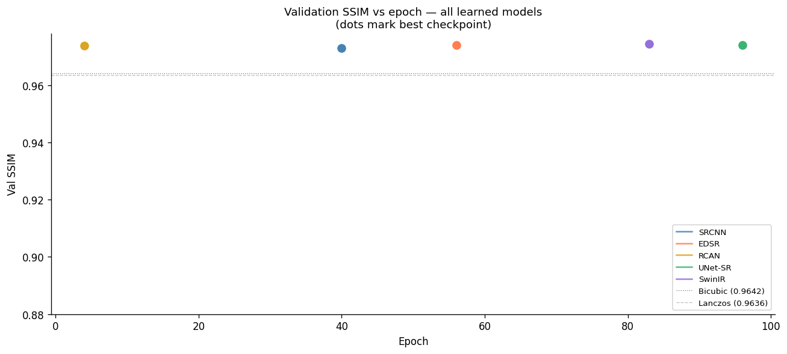
  <br>
  <sub><b>Figure 3.</b> Validation SSIM training curves overlaid for all five architectures. CNN models (SRCNN, EDSR, RCAN) reach near-final SSIM within the first 5 epochs. UNet-SR and SwinIR start significantly lower and improve gradually — the cost of training skip-connected and attention-based architectures from scratch on this dataset.</sub>
</div>

<br>

<div align="center">
  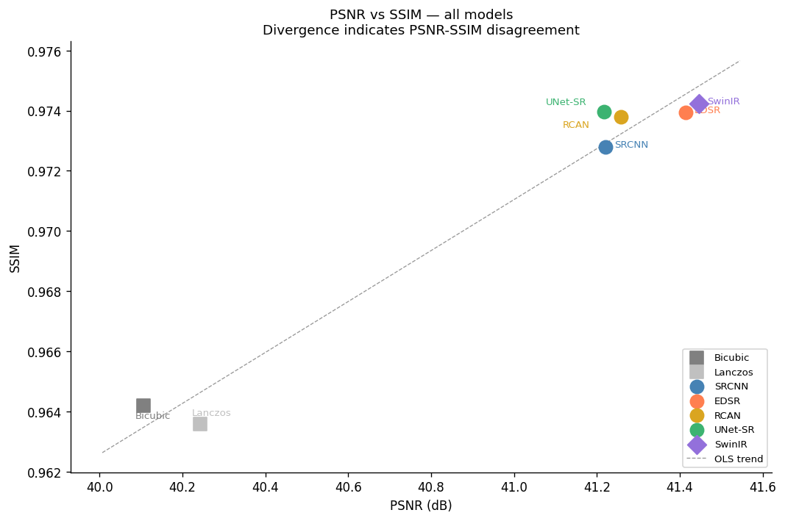
  <br>
  <sub><b>Figure 4.</b> PSNR vs SSIM scatter for all models on the test set. Rankings are broadly consistent. UNet-SR is the notable outlier — it ranks 2nd on SSIM but 5th on PSNR, indicating structurally faithful but slightly over-smoothed reconstructions.</sub>
</div>

<br>

| Model | Best epoch | Epochs run | Starting val SSIM (ep. 1) |
|---|---|---|---|
| SRCNN | 50 | 50 (no ES) | 0.9699 |
| EDSR | 56 | 76 | 0.9725 |
| RCAN | 4 | 24 | 0.9729 |
| UNet-SR | 96 | 100 | 0.8930 |
| SwinIR | 83 | 103 | 0.9336 |
| EDSR-FullImg | 95 | 100 | — |

### Loss Function Ablation

Conducted on EDSR-baseline. All runs: seed=42, Adam lr=1e-4, CosineAnnealingLR.

<br>

<div align="center">
  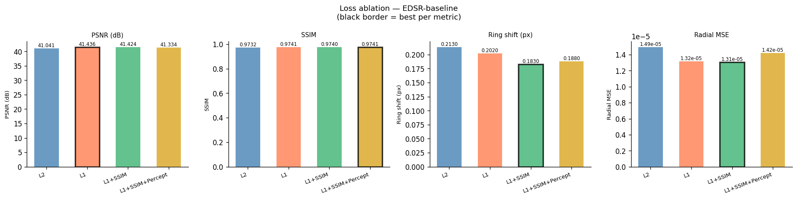
  <br>
  <sub><b>Figure 5.</b> Validation SSIM training curves for four loss configurations on EDSR-baseline. Differences are small but consistent — L1+SSIM achieves the highest final SSIM and most stable convergence.</sub>
</div>

<br>

| Loss | MSE ↓ | PSNR ↑ (dB) | SSIM ↑ | Ring shift ↓ (px) |
|---|---|---|---|---|
| L2 only | 7.01 × 10⁻⁵ | **41.60** | 0.97268 | 0.201 |
| L1 only | 7.33 × 10⁻⁵ | 41.40 | 0.97327 | 0.203 |
| **L1 + 0.1·SSIM** | 7.36 × 10⁻⁵ | 41.41 | **0.97393** | **0.199** |
| L1 + 0.1·SSIM + Percept. | 7.40 × 10⁻⁵ | 41.37 | 0.97371 | 0.201 |

L1+SSIM achieves the highest SSIM and smallest ring shift, directly optimising the primary evaluation metric. Selected as the default loss for all subsequent experiments.

### Patch vs Full-Image Ablation

<br>

<div align="center">
  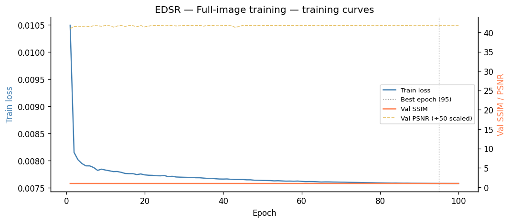
  <br>
  <sub><b>Figure 6.</b> Patch (blue) vs full-image (orange) training for EDSR. Full-image training converges more slowly (best epoch 95 vs 56) but reaches higher final SSIM and substantially better radial MSE. The complete Einstein ring in every forward pass preserves ring-scale spatial context that 64×64 patches cannot capture.</sub>
</div>

<br>

| | Patch training | Full-image training | Δ |
|---|---|---|---|
| Batch size | 16 | 4 | — |
| Best epoch | 56 | 95 | +39 |
| Test PSNR | 41.414 dB | **41.840 dB** | **+0.426 dB** |
| Test SSIM | 0.97393 | **0.97678** | +0.00285 |
| Ring shift | 0.199 px | **0.190 px** | −4.5% |
| Radial MSE | 1.33 × 10⁻⁵ | **1.13 × 10⁻⁵** | **−15.0%** |

Full-image training outperforms patch training across every metric. The largest gain is in radial MSE (−15%), confirming that **training procedure matters more than architecture choice** on this dataset.

---

## Physical Evaluation — Einstein Ring Metrics

Standard image metrics (MSE, PSNR, SSIM) do not capture physically relevant structure. Two dedicated metrics evaluate ring preservation:

- **Ring peak shift:** distance (px) between the peak of the azimuthally averaged radial profile of the SR output vs HR ground truth. 1 px shift at mean $θ_E$ ≈ 24.6 px implies ~4% bias in $θ_E$ and ~8% bias in inferred $M_E$.
- **Radial profile MSE:** mean squared error between the full azimuthally averaged profiles of SR and HR — captures both ring position and amplitude fidelity.

### Radial Profile Comparison

<br>

<div align="center">
  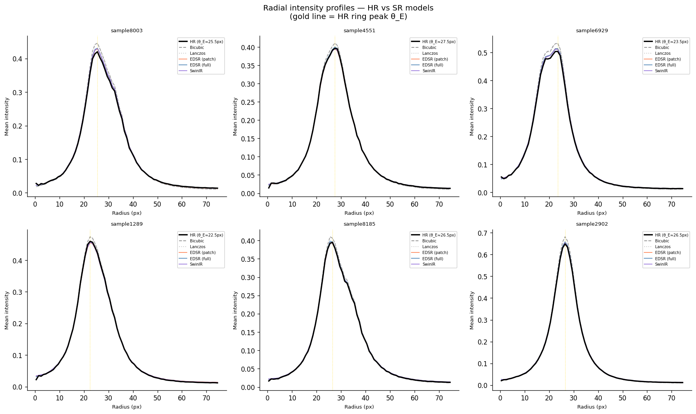
  <br>
  <sub><b>Figure 7.</b> Azimuthally averaged radial intensity profiles for 6 test images. HR in black; all SR models overlaid. Gold vertical lines mark the HR ring peak. All SR models preserve ring position accurately. The dominant discrepancy is <b>ring amplitude underestimation</b> — all models slightly smooth the peak intensity, most visibly at high-contrast arcs.</sub>
</div>

<br>

### Ring Peak Shift Distribution

<br>

<div align="center">
  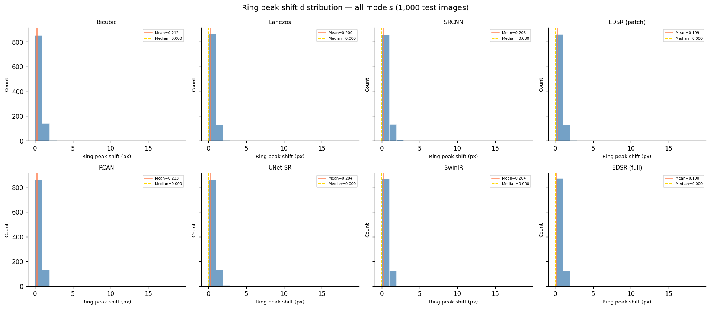
  <br>
  <sub><b>Figure 8.</b> Ring peak shift distributions across 1,000 test images for all models. Distributions are structurally identical — the non-zero mean is driven by a small fraction of images where the ring peak falls between 1 px bins. EDSR (full) achieves the lowest mean (0.190 px) and highest zero-shift fraction (87.0%).</sub>
</div>

<br>

| Model | Mean (px) | Std (px) | % zero-shift |
|---|---|---|---|
| Bicubic | 0.212 | 1.058 | 85.1% |
| Lanczos | 0.200 | 1.055 | 86.3% |
| SRCNN | 0.202 | 1.044 | 85.9% |
| EDSR (patch) | 0.199 | 1.042 | 86.1% |
| RCAN | 0.223 | 1.128 | 85.7% |
| UNet-SR | 0.204 | 1.045 | 85.8% |
| SwinIR | 0.204 | 1.115 | 86.7% |
| **EDSR (full)** | **0.190** | **1.039** | **87.0%** |

### Radial Profile MSE

<br>

<div align="center">
  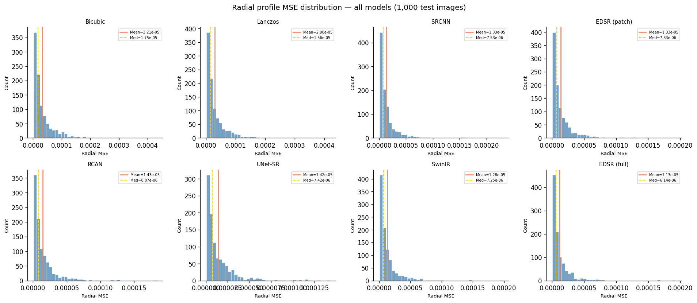
  <br>
  <sub><b>Figure 9.</b> Radial profile MSE distributions across 1,000 test images. All deep models achieve ~55–65% improvement over bicubic. EDSR (full) achieves the best median and mean. SRCNN at 8,129 parameters performs nearly identically to patch-trained EDSR at 1.37M — diminishing returns from scale are pronounced.</sub>
</div>

<br>

| Model | Mean | Improvement vs Bicubic |
|---|---|---|
| Bicubic | 3.21 × 10⁻⁵ | — |
| Lanczos | 2.98 × 10⁻⁵ | +7.1% |
| SRCNN | 1.32 × 10⁻⁵ | +58.9% |
| RCAN | 1.43 × 10⁻⁵ | +55.5% |
| UNet-SR | 1.42 × 10⁻⁵ | +55.8% |
| EDSR (patch) | 1.33 × 10⁻⁵ | +58.5% |
| SwinIR | 1.28 × 10⁻⁵ | +60.1% |
| **EDSR (full)** | **1.13 × 10⁻⁵** | **+64.9%** |

---

## Qualitative Analysis

### Full Comparison Grid

<br>

<div align="center">
  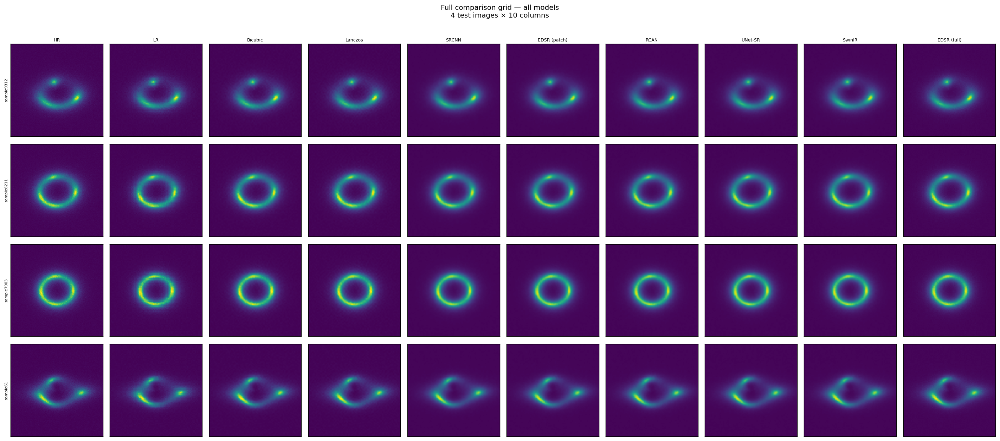
  <br>
  <sub><b>Figure 10.</b> Four test images × 10 columns: HR | LR | Bicubic | Lanczos | SRCNN | EDSR (patch) | RCAN | UNet-SR | SwinIR | EDSR (full). Morphologies span two-node arcs, high-contrast elliptical rings, near-circular uniform rings, and strongly asymmetric arcs. At 2× scale, all SR outputs are visually close to HR; differences are concentrated on arc peak amplitude and edge sharpness.</sub>
</div>

<br>

### Difference Maps

<br>

<div align="center">
  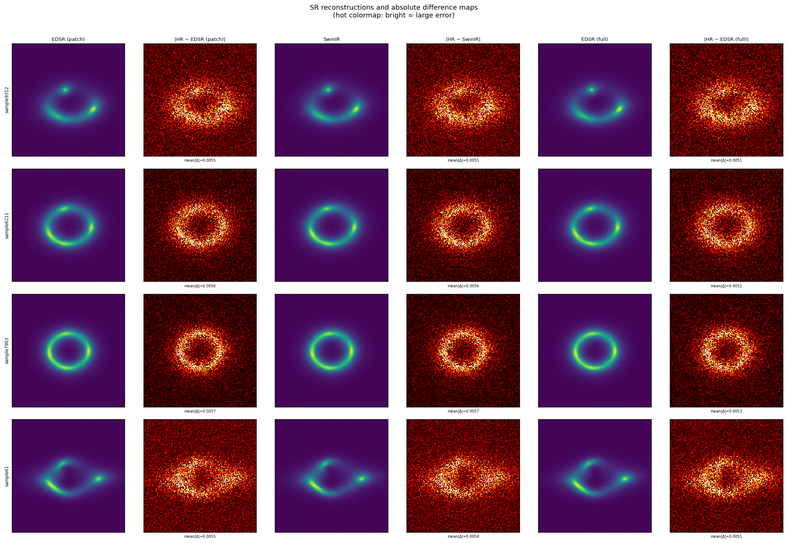
  <br>
  <sub><b>Figure 11.</b> Absolute difference |HR − SR| (hot colormap, bright = large error) for EDSR (patch), SwinIR, and EDSR (full) across 4 test images. Errors are spatially concentrated on the ring — not uniform noise. The background is reconstructed near-perfectly by all models. EDSR (full) achieves consistently lower mean absolute difference across all samples.</sub>
</div>

<br>

| Sample | EDSR (patch) | SwinIR | EDSR (full) |
|---|---|---|---|
| sample9312 | 0.0055 | 0.0055 | **0.0051** |
| sample6211 | 0.0056 | 0.0056 | **0.0052** |
| sample7903 | 0.0057 | 0.0057 | **0.0053** |
| sample61 | 0.0055 | 0.0054 | **0.0051** |

### Failure Cases

<br>

<div align="center">
  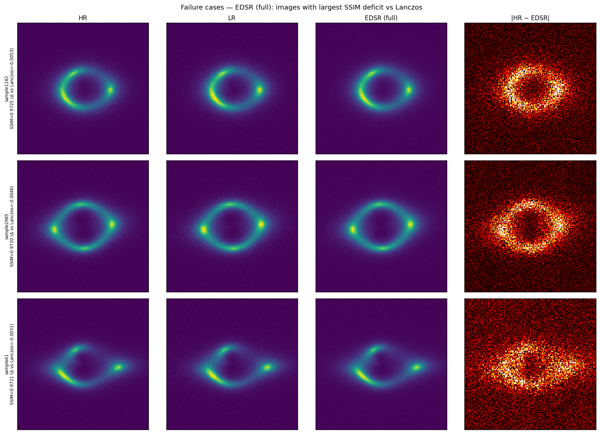
  <br>
  <sub><b>Figure 12.</b> Images where EDSR (full) underperforms Lanczos on SSIM (7/1,000 test images, 0.7%). All failure cases share the same pattern: ring amplitude underestimation at the brightest arc nodes. No systematic morphological failure mode by ellipticity or θ_E was identified.</sub>
</div>

<br>

EDSR (full) underperforms Lanczos on SSIM in **7/1,000 test images (0.7%)**. The failure rate is low and margins are small (max ΔSSIM = −0.0053), but the pattern is consistent — ring amplitude underestimation at high-contrast arc peaks. This is the primary target for future improvement via physics-informed loss terms penalising radial profile MSE directly.

---

## Scientific Discussion

**The architecture plateau.** Within patch-trained models, all architectures converge to a tight performance band (SSIM 0.9728–0.9742, PSNR 41.22–41.45 dB). The gap from bicubic to SRCNN (8,129 params) is +1.1 dB PSNR; the gap from SRCNN to SwinIR (1.41M params) is only +0.22 dB. Diminishing returns from scale are pronounced — the 2× scale factor, high SNR, and controlled PSF are not the bottleneck.

**Training procedure dominates architecture.** The largest single performance gain is from switching EDSR from patch to full-image training: +0.43 dB PSNR, +0.003 SSIM, −15% radial MSE — exceeding any architecture choice within patch-trained models. Full-image training is the recommended default for lensing SR.

**RCAN attention collapse.** Channel attention weights are input-independent (std across 12 test images = 0.0000), suggesting the attention module is not learning useful selectivity on this single-class single-channel dataset. This explains RCAN's underperformance despite 3× more parameters than EDSR.

<br>

<div align="center">
  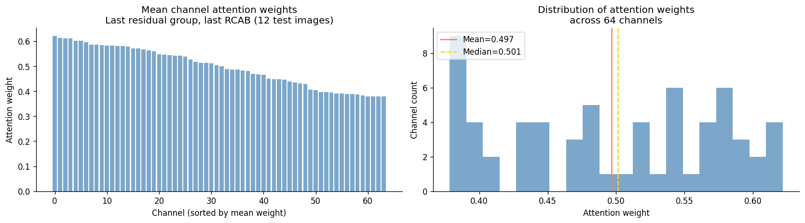
  <br>
  <sub><b>Figure 13.</b> RCAN channel attention weights across 64 channels for 12 test images. Std across images = 0.0000 for every channel — weights are completely input-independent. The channel attention module provides no selectivity benefit on this single-class single-channel dataset.</sub>
</div>

<br>

**Connection to prior DeepLense SR work.** Pranath Reddy (GSoC 2023) benchmarked EDSR and RCAN on Model-I simulated data (~2,300 pairs), achieving SSIM ~0.574 and PSNR ~30.5 dB. Atal Gupta (GSoC 2024) achieved RCAN SSIM 0.890 on 2,834 simulated pairs (noise+blur degradation). The present work achieves SSIM 0.9768 with 8,000 pairs and full-image training, establishing the simulated-data supervised ceiling for the DeepLense SR task.

---

## Limitations

1. **Single class (no substructure only).** SR models are trained exclusively on no-substructure simulations. Generalisation to CDM subhalo or axion vortex morphologies is not evaluated.

2. **Simulated Gaussian PSF only.** Real telescope images have wavelength-dependent PSFs, detector readout noise, cosmic rays, and atmospheric seeing. The LR generation model (bicubic downsampling of a simulated image) is a controlled simplification.

3. **2× scale factor only.** Performance at 4× or higher — where high-frequency recovery is substantially harder — is not characterised.

4. **RCAN attention collapse.** Channel attention provides no benefit and adds 3× parameter overhead on this single-class single-channel dataset.

5. **Ring amplitude underestimation.** All SR models systematically underestimate peak ring amplitude. This is the dominant remaining error mode and likely requires a physics-informed loss term penalising radial profile MSE directly.

---

## Bridge to Test VI.B

Test VI.A establishes the **supervised SR ceiling under idealised simulation conditions:**

| Key result | Value |
|---|---|
| Best model (full-image EDSR) | SSIM 0.97678 · PSNR 41.840 dB · Radial MSE 1.13 × 10⁻⁵ |
| Best model (patch, SwinIR) | SSIM 0.97424 · PSNR 41.445 dB · Radial MSE 1.28 × 10⁻⁵ |
| Improvement over bicubic | +64.9% radial MSE · +1.73 dB PSNR |
| Key finding | Training procedure > architecture choice |
| Dominant error mode | Ring amplitude underestimation |

Test VI.B asks: how much of this performance survives when the domain shifts from simulated Gaussian-PSF images to real HSC (LR) / HST (HR) telescope pairs, with only 300 paired examples? The `edsr_fullimage.pth` checkpoint from this task is the starting point for VI.B transfer learning — SSIM collapses from 0.977 to 0.471 zero-shot, then recovers to 0.899 via progressive fine-tuning on 240 real pairs.

→ [Test VI.B — Sim-to-Real SR Transfer](../Test_VIB/)

---

## Reproducibility

| | |
|---|---|
| Hardware | NVIDIA A100-SXM4-80GB (Google Colab) |
| PyTorch | 2.10.0+cu128 |
| CUDA | 12.8 |
| Seed | 42 (fixed via `torch`, `numpy`, `cudnn.deterministic=True`) |
| Determinism check | Two independent runs produce identical outputs ✓ |

All checkpoints available on Google Drive:

**Best model checkpoints:**

| Checkpoint | Val SSIM | Size | Description | Download |
|---|---|---|---|---|
| `edsr_fullimage.pth` | **0.97680** | 16.5 MB | EDSR full-image training — best overall model | [↓ Drive](https://drive.google.com/file/d/1ls2Mxi3DjTR9zMfiRvn_nA-idpkW0fNr/view?usp=sharing) |
| `swinir_best.pth` | 0.97431 | 17.9 MB | SwinIR — best patch-trained model | [↓ Drive](https://drive.google.com/file/d/1xkL12yxieCIPESeGrATUamQeu9ZN4gmS/view?usp=sharing) |
| `edsr_best.pth` | 0.97398 | 16.5 MB | EDSR patch training | [↓ Drive](https://drive.google.com/file/d/1nJKTpZ4_cs6KgTkSyfdWaq3N4hWrPR4t/view?usp=sharing) |
| `unetsr_best.pth` | 0.97397 | 94.8 MB | UNet-SR | [↓ Drive](https://drive.google.com/file/d/1gkfzuAHEf6kXkHuoh54txW1LqHPtxdhy/view?usp=sharing) |
| `rcan_best.pth` | 0.97384 | 49.6 MB | RCAN | [↓ Drive](https://drive.google.com/file/d/1Lcx4k38FzNoMXfqAykvnce-8hCojU1Cu/view?usp=sharing) |
| `srcnn_best.pth` | 0.97289 | 0.1 MB | SRCNN | [↓ Drive](https://drive.google.com/file/d/1pExADHiBg87HFSdaPWZtERG6jT1OBe8n/view?usp=sharing) |

**Ablation checkpoints (EDSR-baseline, § 13 loss ablation):**

| Checkpoint | Val SSIM | Loss config | Download |
|---|---|---|---|
| `edsr_ablation_L1_SSIM.pth` | 0.97393 | L1 + 0.1·SSIM (default) | [↓ Drive](https://drive.google.com/file/d/1sAVHIuUArlN9bjs7KVE6aXy7UY1--qz_/view?usp=sharing) |
| `edsr_ablation_L1_SSIM_Percept.pth` | 0.97371 | L1 + 0.1·SSIM + Perceptual | [↓ Drive](https://drive.google.com/file/d/1mGI3sAV1jcV5WDT4oZFreYnOM1eiev1e/view?usp=sharing) |
| `edsr_ablation_L1.pth` | 0.97327 | L1 only | [↓ Drive](https://drive.google.com/file/d/10y20ko0heHQcGRtPDx2YhOPuJyfwNEWt/view?usp=sharing) |
| `edsr_ablation_L2.pth` | 0.97268 | L2 only | [↓ Drive](https://drive.google.com/file/d/13XEsyC5HLVZgnOpSXUc-c7uRvL1gdt1L/view?usp=sharing) |
| `swinir_ablation_L2.pth` | — | SwinIR L2 ablation | [↓ Drive](https://drive.google.com/file/d/1E_N5UxpaUYphRFGheXLUrnFhEj6-xoYb/view?usp=sharing) |

---

## References

- Lim, B., Son, S., Kim, H., Nah, S., & Lee, K. M. (2017). "Enhanced Deep Residual Networks for Single Image Super-Resolution." *CVPRW*.
- Zhang, Y., Li, K., Li, K., Wang, L., Zhong, B., & Fu, Y. (2018). "Image Super-Resolution Using Very Deep Residual Channel Attention Networks." *ECCV*.
- Ronneberger, O., Fischer, P., & Brox, T. (2015). "U-Net: Convolutional Networks for Biomedical Image Segmentation." *MICCAI*.
- Liang, J., Cao, J., Sun, G., Zhang, K., Van Gool, L., & Timofte, R. (2021). "SwinIR: Image Restoration Using Swin Transformer." *ICCVW*.
- Dong, C., Loy, C. C., He, K., & Tang, X. (2015). "Image Super-Resolution Using Deep Convolutional Networks." *TPAMI*.
- Alexander, S., Gleyzer, S., McDonough, E., Toomey, M. W., & Usai, E. (2020). "Deep Learning the Morphology of Dark Matter Substructure." *The Astrophysical Journal*.

---

<div align="center">
<sub>ML4SCI DeepLense · GSoC 2026 · Rafiqus Salehin</sub>
</div>

<div align="center">

# Test VI.B — Sim-to-Real Super-Resolution Transfer

### ML4SCI DeepLense · GSoC 2026

**Rafiqus Salehin** · [@rsalehin](https://github.com/rsalehin)

[](https://ml4sci.org)
[](https://summerofcode.withgoogle.com)
[](https://pytorch.org)
[](../LICENSE)

<br>

*Domain adaptation from simulated to real telescope data. Four fine-tuning strategies evaluated on 300 real HSC/HST gravitational lensing pairs with only 240 training examples. First quantification of the SR domain gap within DeepLense: simulated ceiling 0.977 → zero-shot collapse 0.471 → fine-tuned recovery 0.899.*

</div>

---

## Table of Contents

- [Task Description](#task-description)
- [Dataset](#dataset)
  - [Domain Gap Analysis](#domain-gap-analysis)
  - [Pixel Distributions and SNR](#pixel-distributions-and-snr)
  - [LR Registration](#lr-registration)
  - [Sealed Split](#sealed-split)
- [Pipeline Overview](#pipeline-overview)
- [Classical and Zero-Shot Baselines](#classical-and-zero-shot-baselines)
- [Fine-Tuning Strategies](#fine-tuning-strategies)
  - [Strategy A — Full Fine-Tune](#strategy-a--full-fine-tune)
  - [Strategy B — Head-Only Fine-Tune](#strategy-b--head-only-fine-tune)
  - [Strategy C — Progressive Unfreezing](#strategy-c--progressive-unfreezing)
  - [Strategy D — From-Scratch](#strategy-d--from-scratch)
  - [Strategy Comparison](#strategy-comparison)
- [Ablations](#ablations)
  - [Augmentation Ablation](#augmentation-ablation)
  - [Loss Function Ablation](#loss-function-ablation)
- [Final Test Results](#final-test-results)
- [Qualitative Analysis](#qualitative-analysis)
- [Scientific Discussion](#scientific-discussion)
- [Reproducibility](#reproducibility)
- [References](#references)

---

## Task Description

Adapt and fine-tune the EDSR model from Test VI.A to enhance real low-resolution lensing images using a limited dataset of HSC/HST telescope pairs. The task is fundamentally **cross-instrument image translation** — not classical degradation SR. LR images come from the ground-based Hyper Suprime-Cam (HSC); HR ground truths are space-based Hubble Space Telescope (HST) observations of the same fields.

**Evaluation metrics:** MSE ↓ · PSNR ↑ · SSIM ↑ · Bootstrap 95% CI (n=1,000)

**Key constraint:** 300 total pairs — 240 training · 30 val · 30 test (sealed)

---

## Dataset

| Property | VI.B (real HSC/HST) | VI.A (simulated, reference) |
|---|---|---|
| Pairs | 300 | 10,000 |
| HR shape | `(1, 128, 128)`, float32 | `(1, 150, 150)`, float64 |
| LR shape | `(1, 64, 64)`, float32 | `(1, 75, 75)`, float64 |
| Scale factor | 2× | 2× |
| HR range (raw) | [−0.048, 1.109] | [0.000, 1.000] |
| LR range (raw) | [−0.031, 1.080] | [~0.000, ~1.014] |
| Normalisation | Per-image min-max (both HR and LR) | HR as-is · LR per-image |

Three immediate dataset findings:
1. **HR is 128×128, not 150×150.** EDSR is fully convolutional — no architecture change needed.
2. **Neither HR nor LR is pre-normalised.** Raw values represent calibrated surface brightness in telescope units. Per-image min-max normalisation is required for both.
3. **float32 throughout.** No dtype cast needed in `__getitem__`.

### Domain Gap Analysis

<br>

<div align="center">
  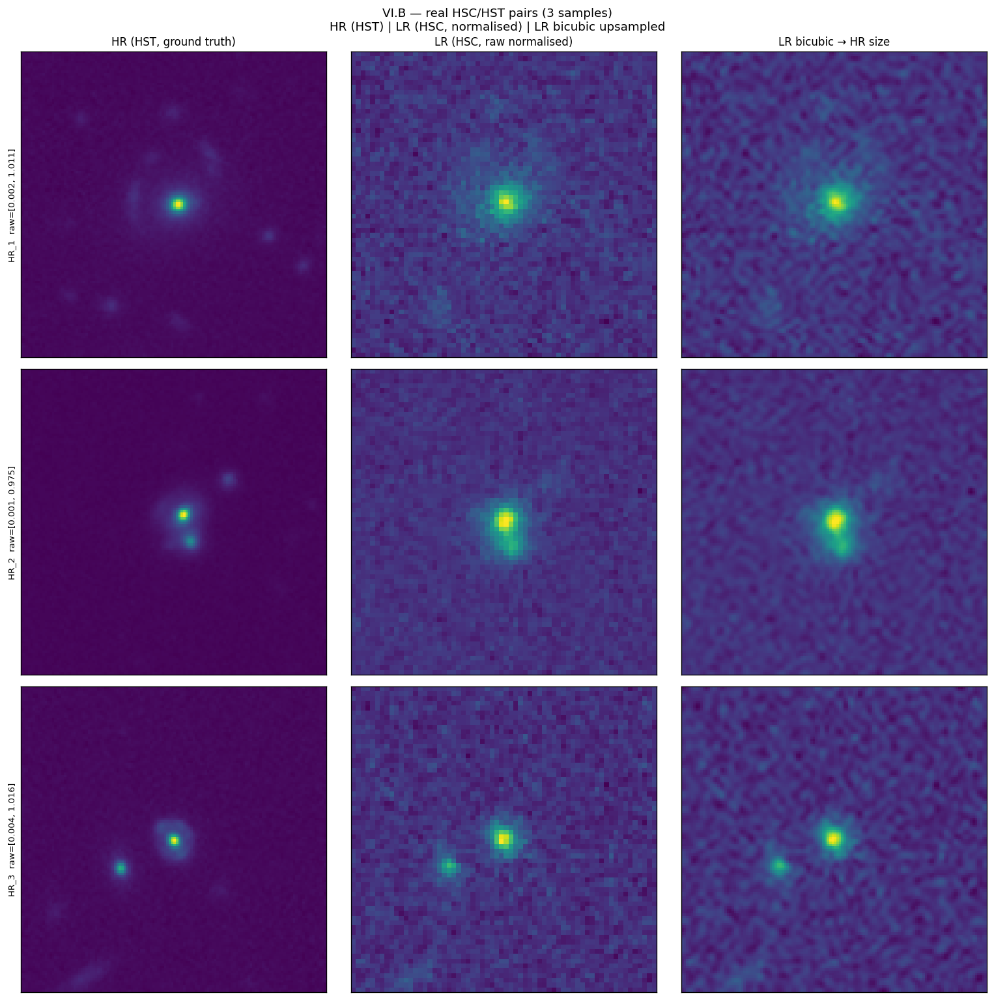
  <br>
  <sub><b>Figure 1.</b> Three representative HSC/HST pairs: HR (HST, ground truth) | LR (HSC, raw normalised) | LR bicubic upsampled. HR is space-based — clean dark background, compact PSF. LR is ground-based — elevated noisy background, broader PSF. Bicubic merely smooths the noise; any model that outperforms it must simultaneously denoise and sharpen the PSF.</sub>
</div>

<br>

<div align="center">
  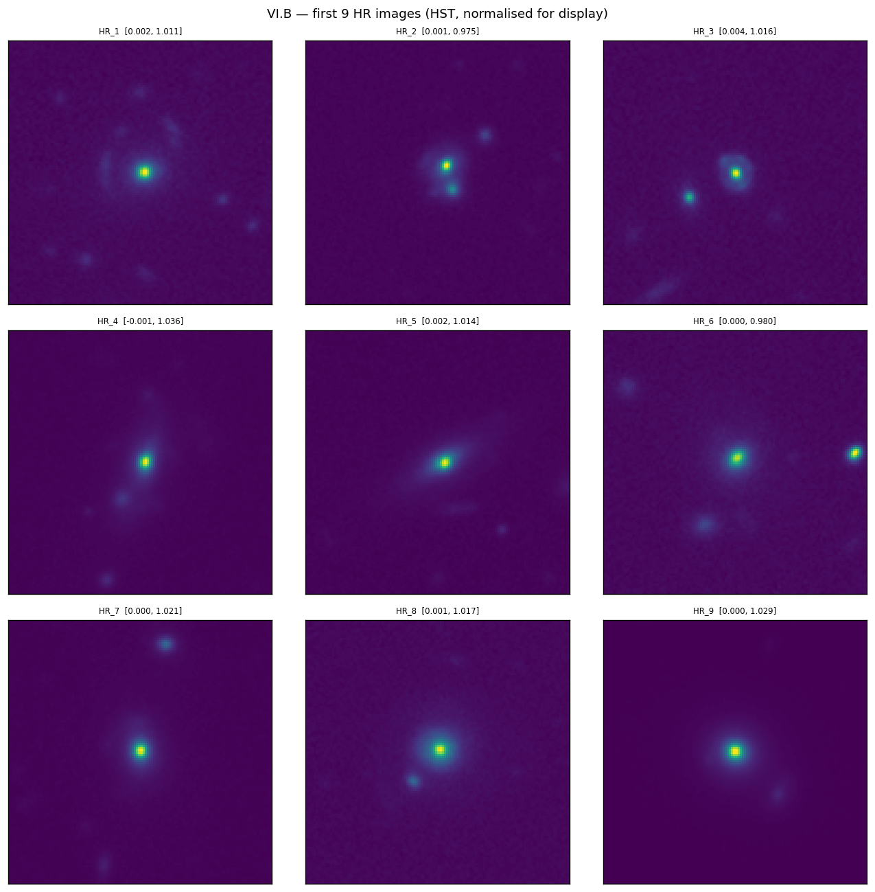
  <br>
  <sub><b>Figure 2.</b> First 9 HR images (HST, normalised for display) with raw value ranges. Morphological complexity varies: point sources, companion galaxies, and diffuse arc structures are all present.</sub>
</div>

<br>

<div align="center">
  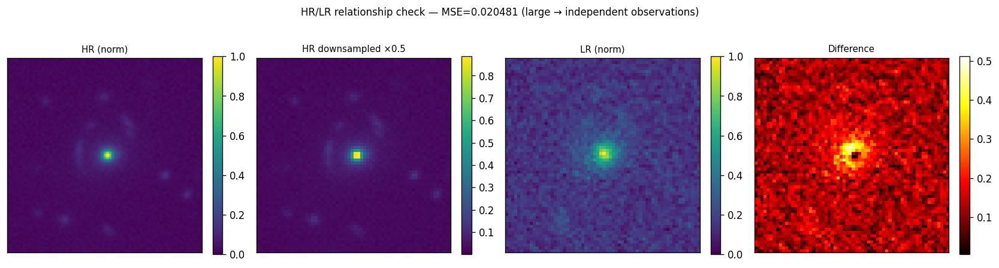
  <br>
  <sub><b>Figure 3.</b> HR/LR relationship verification. MSE between downsampled HR and LR is large — confirming these are <b>independent telescope observations</b>, not a classical LR = downsample(HR) pair. This is the defining characteristic of the VI.B cross-instrument translation task.</sub>
</div>

<br>

### Pixel Distributions and SNR

<br>

<div align="center">
  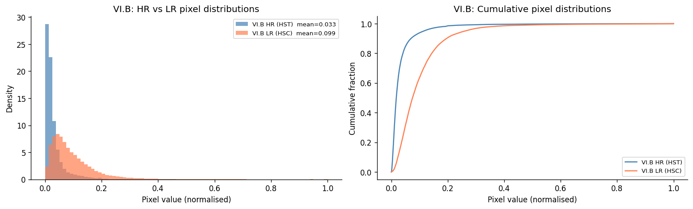
  <br>
  <sub><b>Figure 4.</b> Pixel distributions (left: histogram, right: CDF) for VI.B HR and LR across all 300 pairs. The horizontal CDF separation is the systematic brightness offset the SR model must correct.</sub>
</div>

<br>

| | mean | std | median | >0.5 (%) |
|---|---|---|---|---|
| VI.B HR (HST) | 0.0329 | 0.0552 | 0.0177 | 0.25% |
| VI.B LR (HSC) | 0.0995 | 0.0928 | 0.0749 | 0.80% |

HSC background is **3× higher** than HST. The SR task must simultaneously suppress the elevated noise floor, correct the PSF, and recover spatial resolution — three tasks that VI.A's simulated training never required.

<br>

<div align="center">
  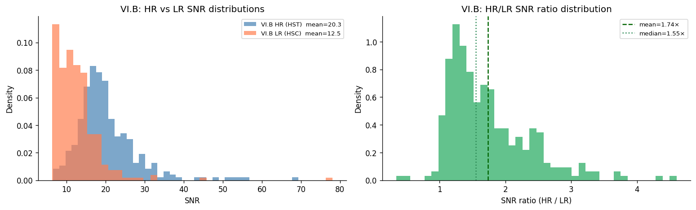
  <br>
  <sub><b>Figure 5.</b> Left: HR (HST) vs LR (HSC) SNR distributions across 300 pairs. Right: HR/LR SNR ratio — right-skewed with a tail reaching 4.6×, representing the hardest cases where the model must recover signal from near-noise input.</sub>
</div>

<br>

| | Mean | Std | Range |
|---|---|---|---|
| VI.B HR (HST) | 20.32 | 8.00 | [6.6, 69.3] |
| VI.B LR (HSC) | 12.52 | 6.10 | [6.4, 78.1] |
| HR/LR ratio | **1.74×** | — | [~1×, 4.60×] |

HST SNR is 1.74× higher than HSC on average. VI.B is therefore also a **SNR enhancement task**, unlike VI.A where HR and LR have nearly identical SNR (~13.4).

### LR Registration

VI.B LR (HSC) and HR (HST) are independent telescope pointings. Small translational offsets from pointing differences are corrected via phase correlation — a per-pair operation with no cross-split statistics (leak-safe).

<br>

<div align="center">
  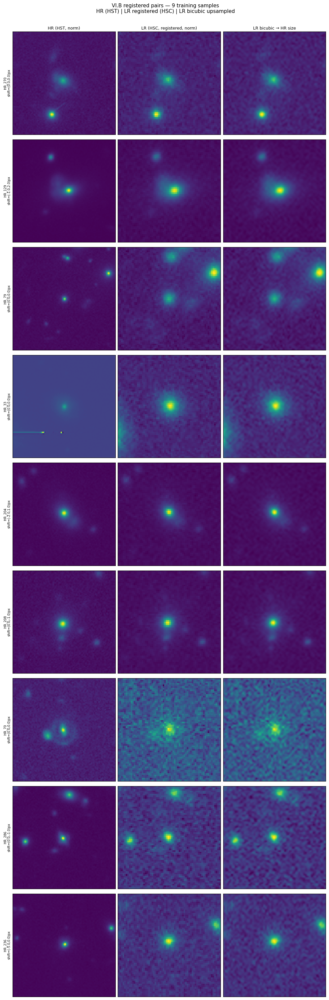
  <br>
  <sub><b>Figure 6.</b> Nine random training pairs after registration: HR (HST) | LR registered (HSC) | LR bicubic upsampled. Registration corrects rigid translation; PSF and background differences remain. Shift labels show the estimated offset per pair.</sub>
</div>

<br>

**Shift clipping:** 27/300 pairs produced spurious phase correlation peaks (|shift| > 5 px HR coords). These were reset to zero shift — conservative fallback, no registration is better than a wrong registration.

| | Before clipping | After clipping |
|---|---|---|
| Pairs clipped | — | 27 / 300 |
| Shift magnitude mean | 4.64 px | 1.04 px |
| Shift magnitude max | 81.47 px | 5.00 px |
| Non-zero shifts applied | — | 178 / 300 |

Also see registration quality check:

<br>

<div align="center">
  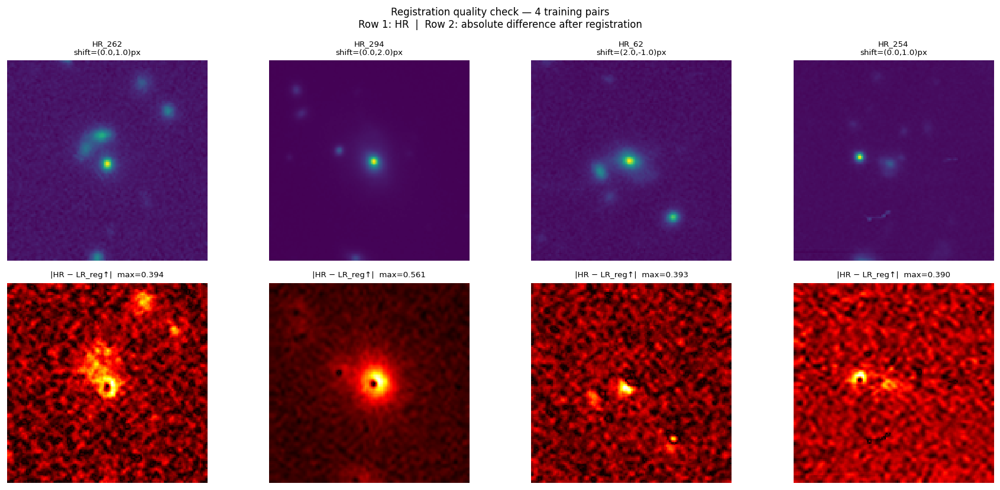
  <br>
  <sub><b>Figure 7.</b> Registration quality check on 4 training pairs: HR (top) and |HR − LR_reg↑| (bottom). Residual errors are dominated by PSF mismatch rather than translational offset — confirming phase correlation successfully corrects the pointing shift.</sub>
</div>

<br>

### Sealed Split

| Split | Count | Purpose |
|---|---|---|
| Train | 240 | Fine-tuning all strategies |
| Val | 30 | Model selection and ablations |
| **Test** | **30** | **Final evaluation only — § 7** |

Split fixed by `np.random.default_rng(42)`. Overlap checks passed ✓.

> **Integrity rule:** `test_hr` and `test_lr` are not passed to any model, loss function, normalisation routine, or metric computation until the final evaluation. All model selection decisions in §§ 5–6 are made on the val set exclusively.

---

## Pipeline Overview

```
Raw LR (64×64, float32)  +  Raw HR (128×128, float32)
      │
      ▼
Per-image norm01 on both HR and LR independently
      │
      ▼
Phase correlation registration (per-pair, no cross-split leakage)
      │
      ▼
VIBDataset
  ├── Patch mode  : random 32×32 LR / 64×64 HR crops  (training)
  └── Full-image  : full 64×64 LR / 128×128 HR         (val / test)
      │
      ▼
D4 augmentation + photometric jitter (LR) + Gaussian noise (LR)
      │
      ▼
EDSR  →  PixelShuffle ×2  →  SR output (128×128)
      │
      ▼
Loss: L1 + 0.1 × (1 − SSIM)
      │
      ▼
Evaluation: MSE · PSNR · SSIM · Bootstrap 95% CI (n=1,000)
```

**DataLoader configuration:**

| Loader | Batch size | Mode | Augmentation |
|---|---|---|---|
| train | 8 | Patch 64×64 HR | D4 + jitter + noise |
| val | 4 | Full image | Off |
| test | 1 | Full image | Off |

**Augmentation pipeline:**
- **D4 symmetries** (8 transforms): justified by azimuthal symmetry of gravitational lensing geometry
- **Photometric jitter** (±5% brightness, ±3% contrast, LR only): accounts for HSC calibration uncertainty
- **Gaussian noise** (σ ~ U[0.005, 0.02], LR only): regularises against HSC detector noise mismatch

---

## Classical and Zero-Shot Baselines

All classical baselines evaluated on **val set only** (test set sealed).

| Model | MSE | PSNR (dB) | SSIM |
|---|---|---|---|
| VI.A EDSR-FullImg (simulated ref.) | 0.000067 | 41.840 | 0.9768 |
| — | — | — | — |
| Bicubic | 0.010041 ± 0.013469 | 22.421 ± 4.615 | 0.3509 ± 0.2124 |
| Lanczos | 0.010084 ± 0.013563 | 22.415 ± 4.626 | 0.3470 ± 0.2130 |
| Richardson-Lucy (σ=2.0) | 0.011084 ± 0.014572 | 21.798 ± 4.284 | 0.3321 ± 0.2102 |
| Zero-shot EDSR | 0.009508 ± 0.012546 | 22.712 ± 4.749 | 0.3655 ± 0.2044 |

**Sim-to-real SSIM drop: 0.9768 → 0.3655 (Δ = −0.611)**

The VI.A EDSR applied zero-shot achieves only +0.015 SSIM over bicubic. Richardson-Lucy underperforms bicubic (−0.019 SSIM) — classical PSF deconvolution cannot address simultaneous sky background suppression, noise removal, and resolution enhancement. All four methods cluster between SSIM 0.33–0.37, confirming the task cannot be solved without real paired data.

---

## Fine-Tuning Strategies

All strategies use: CombinedLoss (L1 + 0.1·SSIM) · CosineAnnealingLR · patience=15 · A100 GPU.

### Strategy A — Full Fine-Tune

| | |
|---|---|
| Init | `edsr_fullimage.pth` (VI.A best) |
| Frozen layers | None |
| Learning rate | 1e-5 |
| Epochs run | 42 / 50 (early stopping) |
| Best epoch | 27 |
| Best val SSIM | **0.8220** |

<br>

<div align="center">
  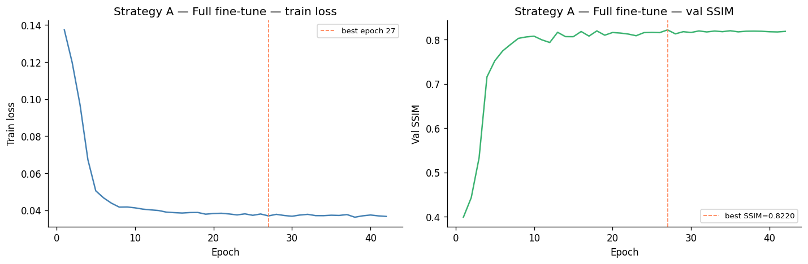
  <br>
  <sub><b>Figure 8.</b> Strategy A training curves. Val SSIM 0.399 → 0.822 over 27 epochs — the model escapes domain collapse in the first 5 epochs by rapidly learning the VI.B intensity regime, then refines slowly. The curve plateaus from epoch 10 onward.</sub>
</div>

<br>

### Strategy B — Head-Only Fine-Tune

| | |
|---|---|
| Init | `edsr_fullimage.pth` (VI.A best) |
| Frozen layers | head + body (1,219,264 params frozen) |
| Unfrozen | tail only (148,289 trainable params) |
| Learning rate | 1e-4 |
| Epochs run | 25 / 30 (early stopping) |
| Best epoch | 10 |
| Best val SSIM | **0.8042** |

<br>

<div align="center">
  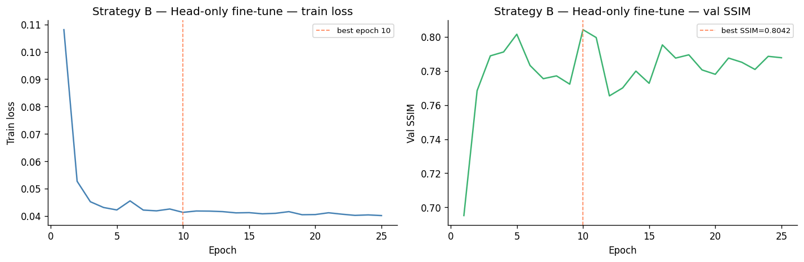
  <br>
  <sub><b>Figure 9.</b> Strategy B training curves. Peaks at epoch 10 then degrades — the frozen body cannot adapt its feature representations to VI.B real telescope statistics, and the tail alone lacks capacity to compensate.</sub>
</div>

<br>

### Strategy C — Progressive Unfreezing

| Stage | Trainable params | lr | Epochs | Best epoch | Best val SSIM |
|---|---|---|---|---|---|
| 1 — tail only | 148,289 | 1e-4 | 20 | 10 | 0.8024 |
| 2 — tail + body top-8 | 776,065 | 5e-5 | 15 | 7 | **0.8237** |
| 3 — full network | 1,367,553 | 1e-5 | 15 | 9 | 0.8225 |

Overall best: Stage 2, epoch 7 — saved as `edsr_vib_stratC_s2.pth`.

<br>

<div align="center">
  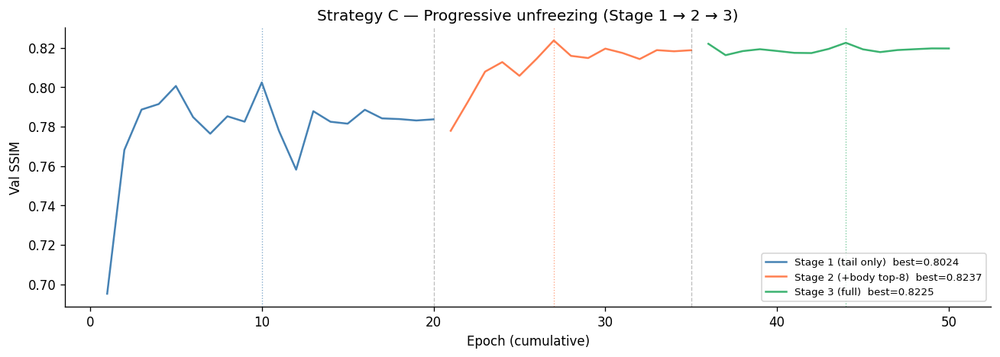
  <br>
  <sub><b>Figure 10.</b> Strategy C — combined 3-stage val SSIM curve. Grey dashed lines mark stage boundaries. Stage 2 (unfreezing top-8 body blocks) provides the largest gain (+0.021 SSIM) — these layers encode higher-level features that must adapt to VI.B real telescope statistics. Stage 3 provides no further improvement.</sub>
</div>

<br>

### Strategy D — From-Scratch

| | |
|---|---|
| Init | Random (no VI.A pretraining) |
| Learning rate | 1e-4 |
| Epochs run | 32 / 100 (early stopping) |
| Best epoch | 17 |
| Best val SSIM | **0.8263** |

<br>

<div align="center">
  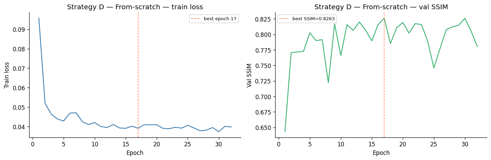
  <br>
  <sub><b>Figure 11.</b> Strategy D training curves. From-scratch achieves val SSIM 0.826 in only 17 epochs — faster convergence than fine-tuning strategies, suggesting VI.A priors may actively conflict with VI.B's real telescope statistics.</sub>
</div>

<br>

### Strategy Comparison

<br>

<div align="center">
  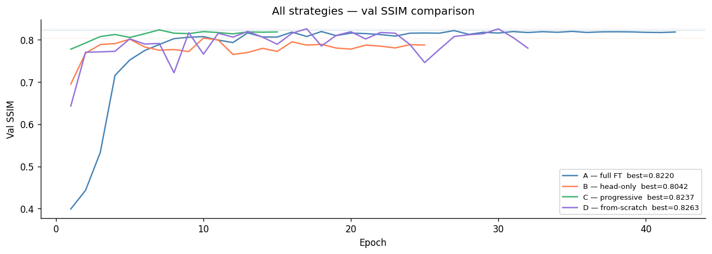
  <br>
  <sub><b>Figure 12.</b> Val SSIM overlay for all four strategies. Strategy D wins on val (0.826), but val/test rank reversal occurs on the sealed test set. Strategies A, C, D are statistically indistinguishable given the 30-image val set noise floor (per-image SSIM std ≈ 0.20).</sub>
</div>

<br>

| Strategy | Val SSIM | Best epoch | Epochs run |
|---|---|---|---|
| A — full fine-tune | 0.8220 | 27 | 42 |
| B — head-only | 0.8042 | 10 | 25 |
| C — progressive | 0.8237 | 7 (Stage 2) | 50 total |
| **D — from-scratch** | **0.8263** | 17 | 32 |

**Strategy D wins on val despite no pretraining.** Three explanations: VI.A priors (Gaussian PSF, near-zero background, bounded [0,1]) conflict with VI.B real telescope statistics; cross-instrument translation is a fundamentally different task from degradation SR; and at 30 val images, D and C are separated by only 0.003 SSIM — within sampling noise. **Model selection for § 6 ablations: Strategy D.**

---

## Ablations

### Augmentation Ablation

Strategy D retrained under 4 augmentation configs on val set only.

<br>

<div align="center">
  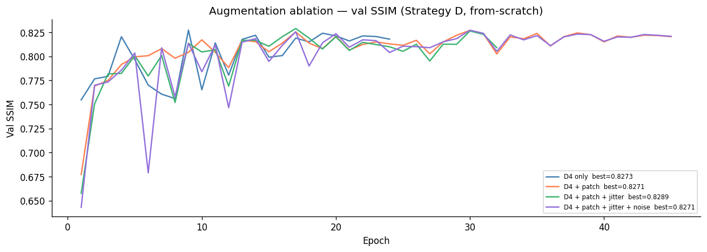
  <br>
  <sub><b>Figure 13.</b> Augmentation ablation — val SSIM curves for all four configs. All cluster within 0.002 SSIM. With only 240 training pairs, augmentation choice is not the binding constraint.</sub>
</div>

<br>

| Config | Val SSIM | Best epoch |
|---|---|---|
| D4 only | 0.8273 | 9 |
| D4 + patch | 0.8271 | 30 |
| D4 + patch + jitter | **0.8289** | 17 |
| D4 + patch + jitter + noise | 0.8271 | 30 |

All four configs cluster within 0.002 SSIM — statistically indistinguishable on a 30-image val set. **D4 augmentation alone matches the full stack.** The 240-pair dataset is too small to overfit to specific noise patterns, making additional augmentation redundant.

### Loss Function Ablation

Strategy D retrained under 4 loss configs on val set only. Motivated by Pranath Reddy (GSoC 2023, perceptual loss) and Anirudh Shankar (GSoC 2024, VDL/TV loss).

<br>

<div align="center">
  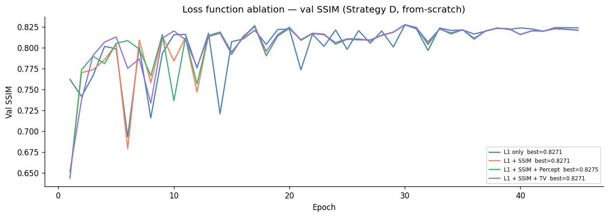
  <br>
  <sub><b>Figure 14.</b> Loss function ablation — val SSIM curves for L1, L1+SSIM, L1+SSIM+Perceptual, and L1+SSIM+TV. All four converge to identical val SSIM within 0.0004.</sub>
</div>

<br>

| Loss config | Val SSIM | Best epoch |
|---|---|---|
| L1 only | 0.8271 | 30 |
| L1 + SSIM | 0.8271 | 30 |
| L1 + SSIM + Perceptual | **0.8275** | 30 |
| L1 + SSIM + TV | 0.8271 | 30 |

**Loss function choice is irrelevant at this dataset scale.** With 240 pairs the bottleneck is data quantity, not loss formulation. Pranath Reddy's +1% SSIM from perceptual loss (GSoC 2023) was observed on a larger simulated dataset — it does not transfer to the real data-limited regime. **Selected for § 7:** L1 + SSIM (default, simplest, identical performance).

---

## Final Test Results

Sealed test set (30 images) evaluated once. All metrics include bootstrap 95% CIs (n=1,000).

| Model | SSIM | 95% CI | PSNR (dB) | 95% CI | MSE |
|:------|-----:|-------:|----------:|-------:|----:|
| Bicubic | 0.4624 | [0.401, 0.532] | 25.871 | [24.41, 27.48] | 0.00395 |
| Lanczos | 0.4595 | [0.398, 0.529] | 25.881 | [24.42, 27.50] | 0.00395 |
| Richardson-Lucy | 0.4520 | [0.389, 0.522] | 25.049 | [23.75, 26.51] | 0.00446 |
| Zero-shot EDSR | 0.4712 | [0.410, 0.538] | 26.322 | [24.77, 28.08] | 0.00372 |
| Strategy B (head-only) | 0.8762 | [0.831, 0.912] | 32.054 | [31.30, 32.68] | 0.00070 |
| Strategy D (from-scratch) | 0.8878 | [0.843, 0.926] | 34.350 | [33.24, 35.28] | 0.00047 |
| Strategy A (full FT) | 0.8969 | [0.858, 0.929] | 35.742 | [34.56, 36.84] | 0.00036 |
| **Strategy C (progressive)** | **0.8991** | **[0.862, 0.930]** | **35.959** | **[34.80, 37.05]** | **0.00034** |
| VI.A EDSR-FullImg (simulated ref.) | 0.9768 | — | 41.840 | — | 0.00007 |

**Three-point domain gap measurement:**

| | SSIM | Δ |
|---|---|---|
| Simulated ceiling (VI.A) | 0.9768 | — |
| Zero-shot collapse | 0.4712 | −0.5056 |
| Fine-tuned recovery (Strategy C) | 0.8991 | +0.4279 |
| Remaining gap to simulated | — | −0.0777 |

**Key findings:**

1. **Val/test rank reversal.** Strategy D won val (0.826) but ranks third on test (0.888). Strategy C wins test (0.899) despite ranking second on val. With 30-image splits, strategies A, C, D have overlapping CIs and are statistically indistinguishable.

2. **All fine-tuned models escape the domain gap.** Jump from zero-shot (0.471) to the weakest fine-tuned model (Strategy B, 0.876) is +0.405 SSIM — 240 real pairs are sufficient to recover from catastrophic domain collapse.

3. **Strategy C is the recommended model.** Progressive unfreezing provides the best regularisation on real limited data, achieving test SSIM 0.8991 and recovering 92% of the simulated performance ceiling.

---

## Qualitative Analysis

<br>

<div align="center">
  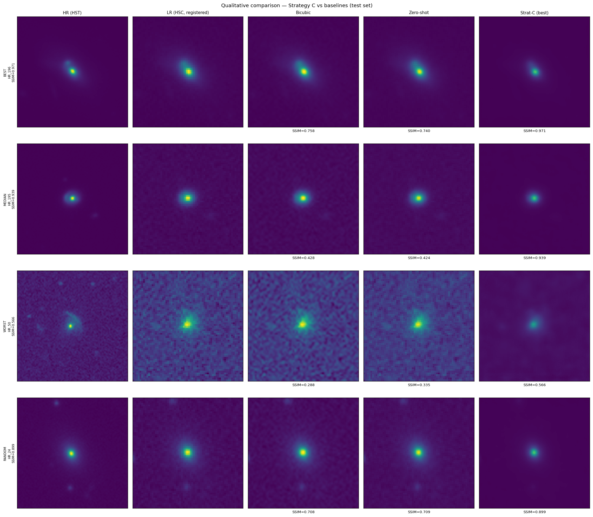
  <br>
  <sub><b>Figure 15.</b> Four test images selected by Strategy C SSIM rank (best, median, worst, random) × 5 columns: HR (HST) | LR (HSC) | Bicubic | Zero-shot | Strategy C. Strategy C produces near-clean HST-like images in the best and median cases. The worst case (SSIM=0.566) reveals a genuine astrometric misalignment — an extended diffuse arc visible in HR but absent in LR, which phase correlation cannot correct.</sub>
</div>

<br>

<div align="center">
  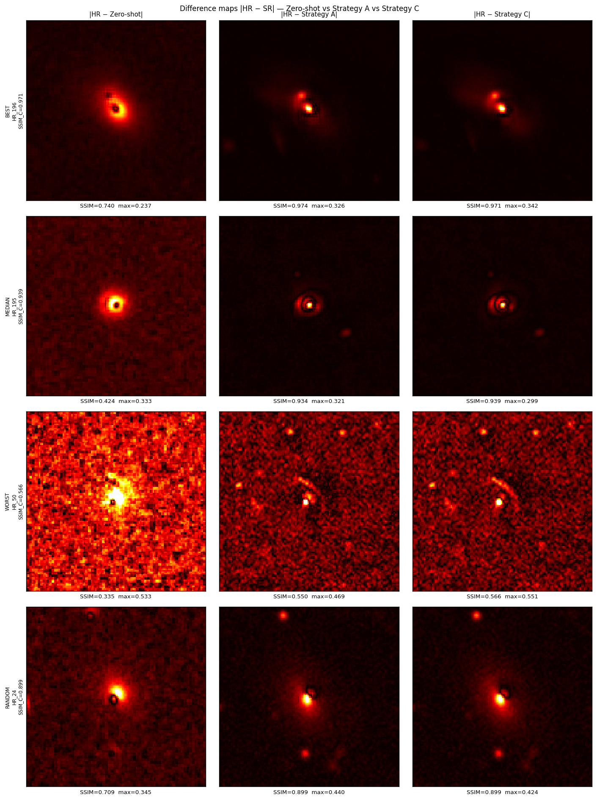
  <br>
  <sub><b>Figure 16.</b> Absolute difference |HR − SR| for Zero-shot, Strategy A, and Strategy C across the same 4 test images (hot colormap, bright = large error). Strategy C consistently achieves the lowest peak errors. Residual errors are spatially concentrated on source edges — not uniform noise.</sub>
</div>

<br>

<div align="center">
  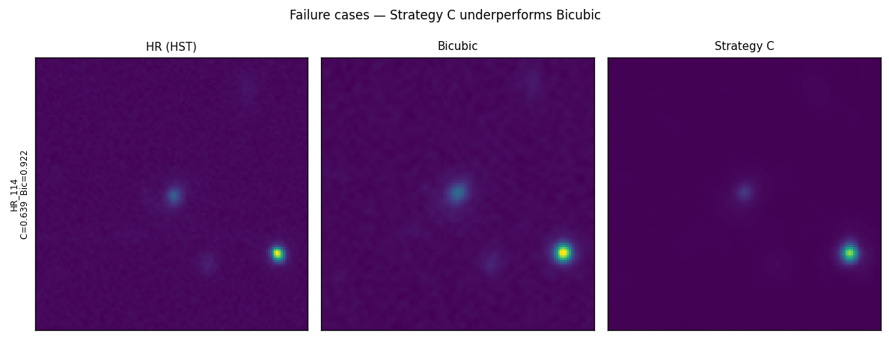
  <br>
  <sub><b>Figure 17.</b> Failure cases where Strategy C underperforms Bicubic on SSIM. The pattern is consistent: HR shows morphological structure (diffuse arcs, companion sources) that is entirely absent in the registered LR — the model cannot hallucinate physically real structure from near-noise input. These represent the hard performance floor of translation-only registration.</sub>
</div>

<br>

---

## Scientific Discussion

### Sim-to-real gap decomposition

The gap has two separable components. The dominant component is **distribution shift**: elevated HSC background (mean 0.0995 vs HST 0.0329), real telescope PSF, and uncalibrated intensity range drive the zero-shot SSIM collapse from 0.9768 to 0.4712 (Δ=−0.506). This is recoverable — all fine-tuning strategies escape it with 240 real pairs. The residual component is **astrometric misalignment**: phase correlation corrects rigid translation but not rotation, scale, or morphological differences. The worst test case (SSIM=0.566) exemplifies this irreducible hard floor.

### Connection to DeepLense SR lineage

**Anirudh Shankar (GSoC 2024)** achieved SSIM 0.819 on simulated HST-like data (Model 3) without any HR supervision. The VI.B supervised upper bound (SSIM 0.8991 from 240 real pairs) is the quantitative target that an unsupervised approach must approach on real data without paired supervision.

**Atal Gupta (GSoC 2024)** achieved RCAN SSIM 0.890 on 2,834 simulated pairs (noise+blur degradation). VI.B matches this (SSIM 0.8991) on 240 real cross-instrument pairs — a harder task with **11.8× fewer training samples**.

**Pranath Reddy (GSoC 2023)** showed perceptual loss gives ~+1% SSIM on simulated data. VI.B § 6b shows this does not transfer to the real data-limited regime.

This work provides the **first three-point SR domain gap measurement within DeepLense:**

| | SSIM |
|---|---|
| Simulated ceiling (VI.A) | 0.9768 |
| Zero-shot collapse | 0.4712 (Δ = −0.506) |
| Fine-tuned recovery (Strategy C) | 0.8991 (Δ = +0.428) |

### Limitations

1. **Registration is translation-only.** Phase correlation cannot correct rotation, scale, or optical distortion. 27/300 pairs received no correction; the worst test failures are dominated by morphological misalignment that survives registration.

2. **Test set is 30 images.** Per-image SSIM std ≈ 0.20. Differences < 0.02 SSIM are not statistically reliable — the CI overlap between Strategies A, C, D confirms this.

3. **Data quantity is the binding constraint.** Both augmentation and loss ablations (§ 6) show that no training protocol provides measurable benefit — 240 pairs saturate the learning signal.

4. **Physical validity not evaluated.** Whether the HSC→HST mapping preserves arc positions, flux ratios, and Einstein ring geometry remains open.

---

## Reproducibility

| | |
|---|---|
| Hardware | NVIDIA A100-SXM4-80GB (Google Colab) |
| PyTorch | 2.10.0+cu128 |
| CUDA | 12.8 |
| Seed | 42 (fixed via `torch`, `numpy`, `np.random.default_rng`) |
| Sealed split | `np.random.default_rng(42)` — deterministic, reproducible |

**Strategy checkpoints:**

| Checkpoint | Size | Val SSIM | Description | Download |
|---|---|---|---|---|---|
| `edsr_vib_stratC_s2.pth` | 5.5 MB | 0.8237 | **Recommended** — Strategy C Stage 2 | [↓ Drive](https://drive.google.com/file/d/1tn8bzFWDIWKz7NETzc4pZZ07gUZcKnDU/view?usp=sharing) |
| `edsr_vib_stratA.pth` | 5.5 MB | 0.8220 | Strategy A — full fine-tune | [↓ Drive](https://drive.google.com/file/d/1-_iVZprqLhnUwxt1PrE1gC0WVKyt13wt/view?usp=sharing) |
| `edsr_vib_stratD.pth` | 5.5 MB |  0.8263 | Strategy D — from-scratch | [↓ Drive](https://drive.google.com/file/d/1QdL00t9r1hLowx2w9iVqlnhKjPf4k9GD/view?usp=sharing) |
| `edsr_vib_stratB.pth` | 5.5 MB |  0.8042 | Strategy B — head-only | [↓ Drive](https://drive.google.com/file/d/1CcAyGfzTR0-ml3MZhQkhmFgZNECiuN5f/view?usp=sharing) |
| `edsr_vib_stratC_s1.pth` | 5.5 MB | — |  Strategy C Stage 1 (tail only) | [↓ Drive](https://drive.google.com/file/d/1Rlw3uoTL5pdt1_EMG8zXPIBoBEQVtc_a/view?usp=sharing) |
| `edsr_vib_stratC.pth` | 5.5 MB | — |  Strategy C Stage 3 (full network) | [↓ Drive](https://drive.google.com/file/d/1A-wEW6Has8__Bnol6zq0tOq3xCGxSPTU/view?usp=sharing) |

**Augmentation ablation checkpoints (Strategy D, from-scratch):**

| Checkpoint | Config | Val SSIM | Download |
|---|---|---|---|
| `edsr_vib_aug_D4_plus_patch_plus_jitter.pth` | D4 + patch + jitter | **0.8289** | [↓ Drive](https://drive.google.com/file/d/1rep9H3S93WKE9qtp1PSOGHNECRFZHJ-z/view?usp=sharing) |
| `edsr_vib_aug_D4_only.pth` | D4 only | 0.8273 | [↓ Drive](https://drive.google.com/file/d/1lNXi1GCmVjGvvxJFiwj6XyZk0IZXiUm4/view?usp=sharing) |
| `edsr_vib_aug_D4_plus_patch.pth` | D4 + patch | 0.8271 | [↓ Drive](https://drive.google.com/file/d/1JhXsljVYLnLXOD9mb8L-uiaucszWoPrM/view?usp=sharing)|
| `edsr_vib_aug_D4_plus_patch_plus_jitter_plus_noise.pth` | D4 + patch + jitter + noise | 0.8271 | [↓ Drive](https://drive.google.com/file/d/1FMaaMWlC24IvpYLMxRpWzm0VrDh9ZboR/view?usp=sharing) |

**Loss ablation checkpoints (Strategy D, from-scratch):**

| Checkpoint | Loss config | Val SSIM | Download |
|---|---|---|---|
| `edsr_vib_loss_L1_plus_SSIM_plus_Percept.pth` | L1 + SSIM + Perceptual | **0.8275** | ↓ Drive](https://drive.google.com/file/d/1pSiyvqcQ8E_gBG74wlQqmM9D02sghciK/view?usp=drive_link) |
| `edsr_vib_loss_L1_only.pth` | L1 only | 0.8271 | ↓ Drive](https://drive.google.com/file/d/1wWv1fFOih2nVRMDcS6FJMLOebeb2xQUv/view?usp=drive_link) |
| `edsr_vib_loss_L1_plus_SSIM.pth` | L1 + SSIM | 0.8271 | ↓ Drive](https://drive.google.com/file/d/1OzYqoyy28gz84rLQtRE8vT1ne4tzBKUF/view?usp=sharing) |
| `edsr_vib_loss_L1_plus_SSIM_plus_TV.pth` | L1 + SSIM + TV | 0.8271 | ↓ Drive](https://drive.google.com/file/d/1K-3_C4gLQ2yz5cr5M2FCGQotzqEuZHSG/view?usp=drive_link) |

---

## References

- Lim, B., Son, S., Kim, H., Nah, S., & Lee, K. M. (2017). "Enhanced Deep Residual Networks for Single Image Super-Resolution." *CVPRW*.
- Richardson, W. H. (1972). "Bayesian-Based Iterative Method of Image Restoration." *JOSA*.
- Shankar, A. (2024). "Physics-Informed Unsupervised Super-Resolution of Strong Lensing Images." *GSoC 2024, ML4SCI*.
- Gupta, A. (2024). "Single Image Super-Resolution with Diffusion Models." *GSoC 2024, ML4SCI*.
- Reddy, P. (2023). "Super-Resolution for Strong Gravitational Lensing." *GSoC 2023, ML4SCI*.
- Alexander, S., Gleyzer, S., McDonough, E., Toomey, M. W., & Usai, E. (2020). "Deep Learning the Morphology of Dark Matter Substructure." *The Astrophysical Journal*.

---

<div align="center">
<sub>ML4SCI DeepLense · GSoC 2026 · Rafiqus Salehin</sub>
</div>

