<div align="center">

# ML4SCI DeepLense — GSoC 2026
## Common Test V: Gravitational Lens Finding on Real Observational Data

[](https://python.org)
[](https://pytorch.org)
[](https://github.com/QUVA-Lab/escnn)
[](https://www.nvidia.com)
[](https://hsc.mtk.nao.ac.jp)
[](LICENSE)
[](https://colab.research.google.com)

<br>

**Binary classification of gravitational lenses in real multi-band survey images (HSC)**
using five architectures — three ImageNet-pretrained CNNs and two physics-motivated
equivariant networks encoding rotational symmetry directly into their weights —
followed by a soft ensemble combining all five models.

Unlike Test I (simulated single-channel data), all images here are **real Hyper
Suprime-Cam (HSC) observational data** across three photometric bands (g, r, i),
presenting real sky backgrounds, PSF effects, and a severe 99.8:1 class imbalance
at test time that challenges all models and evaluation metrics.

<br>

| | |
|:-:|:-:|
| **Best AUC-ROC** | **0.9905** — Soft-Ensemble (5 models) |
| **Best AUC-PR** | **0.8233** — Soft-Ensemble (83× above random baseline of 0.010) |
| **Best Precision@τ*** | **0.328** — Soft-Ensemble (FP:TP = 2.0:1) |
| **Best Individual AUC-ROC** | 0.9881 — ResNet-34 (21.29M params, ImageNet) |
| **Best Efficiency (AUC-ROC)** | **0.9872** — EqDenseNet-C8 (**0.183M params, from scratch**) |
| **Fewest Missed Lenses** | **FN = 7** — EqDenseNet-C8 (96.4% sensitivity at τ*) |
| **Task** | Binary classification (lens / non-lens) |
| **Input** | 64 × 64 × 3 (g, r, i bands — real HSC imaging) |
| **Test imbalance** | 195 lenses / 19,455 non-lenses (99.8:1) |

</div>

---

> **Note on the Real-Data Setting**
>
> Test V is structurally harder than Test I. All images are real HSC observational
> data — not simulations — introducing genuine sky backgrounds, variable PSF, and
> photometric noise. The test-set class ratio is 99.8:1: AUC-ROC alone is insufficient
> to characterise operational usefulness. PR-AUC is the primary diagnostic metric;
> a random classifier achieves precision ≈ 0.010 at all recall levels.
>
> All equivariant models are adapted from Test I via a 3-channel input representation
> (`3 × trivial_repr`) and trained entirely from scratch. Three escnn bugs that broke
> D₄ invariance in the original Test I implementation were identified and corrected
> during this work via the `in_type.transform` group action verification protocol —
> documented in §5 and applied to both notebooks.

---

## Table of Contents

1. [Scientific Background](#1-scientific-background)
2. [Dataset](#2-dataset)
   - [2.1 Data Source and Structure](#21-data-source-and-structure)
   - [2.2 Class Statistics and Imbalance Regimes](#22-class-statistics-and-imbalance-regimes)
   - [2.3 Key Observational Properties from EDA](#23-key-observational-properties-from-eda)
3. [Environment Setup](#3-environment-setup)
4. [Training & Evaluation Framework](#4-training--evaluation-framework)
   - [4.1 Data Pipeline](#41-data-pipeline)
   - [4.2 Key Design Decisions](#42-key-design-decisions)
   - [4.3 Evaluation Protocol](#43-evaluation-protocol)
5. [Architecture Evaluations](#5-architecture-evaluations)
   - [5.1 EfficientNet-B2](#51-efficientnet-b2)
   - [5.2 ResNet-34](#52-resnet-34)
   - [5.3 DenseNet-121](#53-densenet-121)
   - [5.4 E-ResNet D₄ (3-channel)](#54-e-resnet-d-3-channel)
   - [5.5 EqDenseNet-C8 (3-channel)](#55-eqdensenet-c8-3-channel)
   - [5.6 Soft Ensemble](#56-soft-ensemble)
6. [Comprehensive Results Summary](#6-comprehensive-results-summary)
   - [6.1 Full Benchmark Table](#61-full-benchmark-table)
   - [6.2 ROC and Precision-Recall Curves](#62-roc-and-precision-recall-curves)
   - [6.3 Parameter Efficiency](#63-parameter-efficiency)
   - [6.4 Key Takeaways](#64-key-takeaways)
7. [Interpretability Analysis](#7-interpretability-analysis)
   - [7.1 Grad-CAM: EfficientNet-B2](#71-grad-cam-efficientnet-b2)
   - [7.2 Grad-CAM: DenseNet-121](#72-grad-cam-densenet-121)
   - [7.3 Per-Channel Attribution — Integrated Gradients](#73-per-channel-attribution--integrated-gradients)
8. [Failure Mode Analysis](#8-failure-mode-analysis)
   - [8.1 Missed Lenses Gallery](#81-missed-lenses-gallery)
   - [8.2 False Positive Gallery](#82-false-positive-gallery)
   - [8.3 Per-model Scores on Ensemble False Negatives](#83-per-model-scores-on-ensemble-false-negatives)
   - [8.4 Cross-architecture Disagreement](#84-cross-architecture-disagreement)
   - [8.5 Statistical Characterisation](#85-statistical-characterisation)
9. [Discussion](#9-discussion)
10. [Limitations & Future Work](#10-limitations--future-work)
11. [GSoC 2026 Research Directions](#11-gsoc-2026-research-directions)
12. [Repository Structure](#12-repository-structure)
13. [Citation](#13-citation)

---

## 1. Scientific Background

Strong gravitational lensing — the deflection of light from a distant source galaxy by
a massive foreground lens — produces characteristic arc and Einstein ring morphologies.
Detecting these systems at survey scale is a prerequisite for constraining dark matter
substructure models, measuring cosmological parameters through lens statistics, and
identifying targets for high-resolution follow-up.

The challenge is the extreme scarcity of genuine gravitational lenses relative to
the non-lens population in ground-based imaging surveys:

```
          HYPER SUPRIME-CAM FIELD
                    │
         ┌──────────┴──────────────┐
         │                         │
   ~0.01% lenses        ~99.99% non-lenses
   (Einstein rings,      (galaxies, stars,
    arcs, knots)          galaxy pairs,
                          ring galaxies, ...)
                    │
         At 64×64 + PSF smearing:
         Arc geometry is rarely resolved.
         Models must classify on subtle
         radial flux profiles, not shapes.
```

At 64×64, PSF convolution suppresses resolved arc geometry in most cases. The
discriminative signal is statistical — a radial brightness profile difference between
lens and non-lens populations — rather than explicit morphology.

---

## 2. Dataset

### 2.1 Data Source and Structure

All images are real Hyper Suprime-Cam (HSC) survey cutouts from the Wide layer,
stored as `.npy` arrays of shape `(3, 64, 64)` in three photometric bands (g, r, i).

```
lens_finding_data/
├── train_lenses/      1,730  .npy files
├── train_nonlenses/  28,675  .npy files
├── test_lenses/         195  .npy files   ← held out until final evaluation
└── test_nonlenses/   19,455  .npy files   ← held out until final evaluation
```

### 2.2 Class Statistics and Imbalance Regimes

| Split | Lenses | Non-Lenses | Total | Ratio (neg:pos) |
|:------|-------:|-----------:|------:|----------------:|
| **Train** | 1,730 | 28,675 | 30,405 | 16.6 : 1 |
| **Val** (from train, 10% stratified) | 173 | 2,868 | 3,041 | 16.6 : 1 |
| **Test** | 195 | 19,455 | 19,650 | **99.8 : 1** |

Two distinct imbalance regimes are relevant throughout. Training (16.6:1) requires
explicit handling via `WeightedRandomSampler` and Focal Loss. Test (99.8:1) is extreme:
a random score-based classifier achieves precision ≈ 0.010 at all recall levels — the
PR-AUC random baseline throughout.

### 2.3 Key Observational Properties from EDA

**Sample visualisation — lenses and non-lenses across three bands:**

<p align="center">
  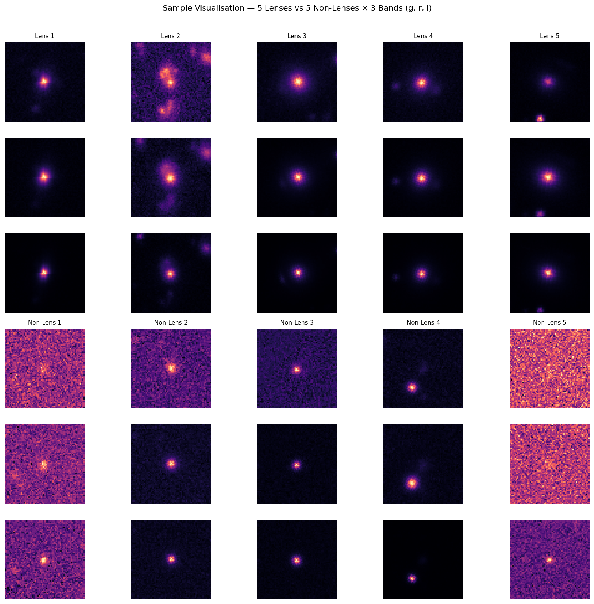
  <br><em>Figure 2.1 — Representative 64×64 HSC images for lens (top 3 rows) and non-lens
  (bottom 3 rows) classes, shown across g, r, and i bands. At this resolution, PSF
  convolution suppresses resolved arc geometry in most cases. What remains is a radial
  brightness gradient around the central source — the primary discriminative signal.
  Several non-lenses (compact isolated sources, galaxy pairs) are morphologically
  indistinguishable from lenses by visual inspection alone.</em>
</p>

**Pixel intensity distributions per class and band:**

<p align="center">
  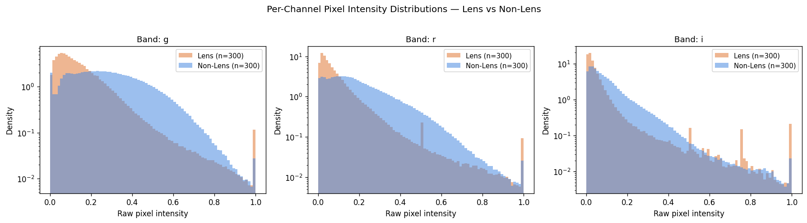
  <br><em>Figure 2.2 — Pixel intensity distributions per band (g, r, i) for lenses and
  non-lenses (n=300 per class, raw arrays). Both distributions are heavily concentrated
  near zero — background sky dominates the pixel budget in both classes. Non-lenses have
  higher mean intensity across all three bands (g: 0.288 vs 0.146; r: 0.198 vs 0.088;
  i: 0.103 vs 0.055), consistent with more spatially distributed flux. The distributions
  overlap heavily; no intensity threshold separates the classes.</em>
</p>

**Spatial structure analysis — mean images and difference maps:**

<p align="center">
  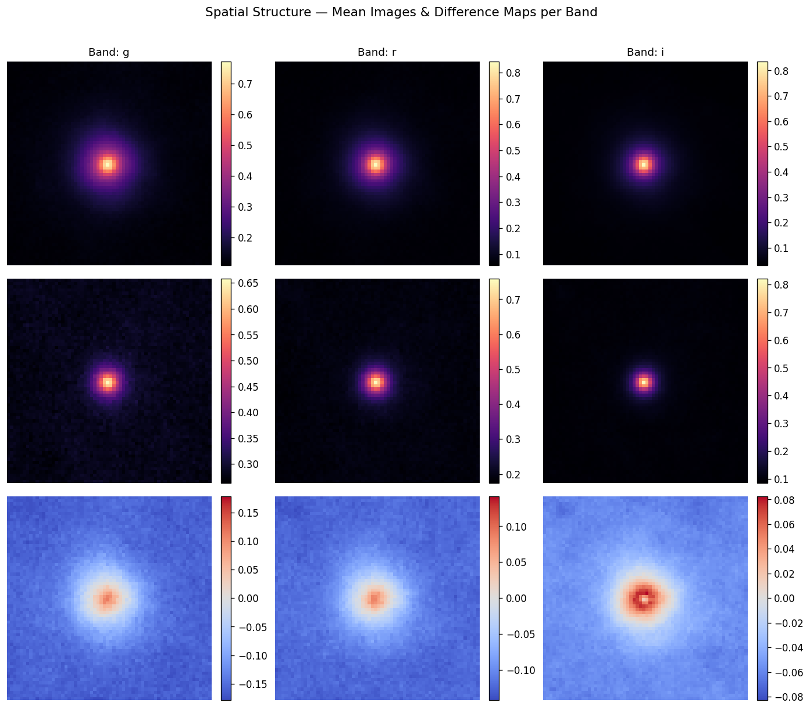
  <br><em>Figure 2.3 — Spatial structure analysis. Row 1: mean lens image per band (g, r, i).
  Row 2: mean non-lens image per band. Row 3: difference map (lens − non-lens) on a
  symmetric coolwarm scale. The difference maps are negative-dominant — non-lenses carry
  more distributed flux across the full 64×64 cutout. The maps show no preferred orientation
  after averaging 300 samples: discriminative information is encoded in the radial brightness
  profile, not any angular direction. The i-band centre flips positive (+0.015), consistent
  with the deflector being a red early-type galaxy (hypothesis from population averages,
  not confirmed for individual objects).</em>
</p>

Three properties of the data drive all modelling choices:

**F1 — Low-SNR problem.** Pixel distributions overlap heavily. Difference map magnitudes
peak at 0.08–0.11. Deep non-linear models are necessary because the discriminative signal
is weak and distributed, not localised in obvious structures.

**F2 — Signal is isotropic in expectation.** Difference maps show no preferred orientation
after averaging. Orientation is not a systematically useful discriminative feature —
motivates D₄ augmentation and equivariant architectures.

**F3 — Centre–surround contrast is more informative than the central peak alone.**
Both classes share a compact bright core; the surround difference is consistently larger.

**F4 — i-band shows the most prominent spatial excess in difference maps.** All three
bands are used jointly; single-band approaches lose cross-channel flux relationships.

**F5 — Severe and asymmetric imbalance.** Train: 16.6:1. Test: 99.8:1. PR-AUC is
more diagnostic than AUC-ROC under the test imbalance.

**F6 — Arc geometry not accessible at 64×64.** PSF convolution reduces arc structure
to smooth radial brightness gradients. Classification relies on flux statistics.

---

## 3. Environment Setup

All experiments on **NVIDIA A100-SXM4-80GB (Google Colab high-memory runtime)**.

```bash
pip install escnn          # equivariant neural networks
pip install grad-cam       # Grad-CAM saliency maps
pip install captum         # Integrated Gradients
pip install "numpy==1.26.4"  # pin AFTER other installs — escnn requires numpy 1.x
# ⚠️  Restart runtime after numpy pin before importing model code
```

### Verified Version Matrix

| Package | Version | Note |
|:--------|:-------:|:-----|
| Python | 3.12.12 | Colab default |
| PyTorch | 2.10.0+cu128 | — |
| torchvision | 0.25.0+cu128 | — |
| numpy | **1.26.4** | pinned — lie-learn requires numpy < 2 |
| escnn | 1.0.11 | D₄ and C8 equivariant layers |
| grad-cam | 1.5.5 | Grad-CAM visualisation |
| captum | latest | Integrated Gradients |
| scikit-learn | 1.6.1 | AUC, calibration, PR curves |
| CUDA | 12.8 | A100 |

---

## 4. Training & Evaluation Framework

### 4.1 Data Pipeline

```
Raw .npy files (3, 64, 64) — g, r, i bands
              │
              ▼
Per-sample global min-max normalisation:
  x̂ = (x − min(x)) / (max(x) − min(x))
  applied jointly across all three channels
  → preserves relative cross-band flux ratios
              │
              ├── [TRAIN] D₄ augmentation:
              │   torch.rot90 (k∈{1,2,3}) + torch.flip
              │   Exact pixel permutation — zero interpolation
              │
              └── [VAL / TEST] No augmentation
```

**Why global (not per-channel) normalisation:** Per-channel normalisation destroys
inter-band intensity relationships. Global normalisation preserves relative chromatic
structure — a source genuinely brighter in i than g remains relatively brighter.

**Why `torch.rot90` and not `T.RandomRotation`:** `RandomRotation` applies bilinear
interpolation and samples continuous angles — not genuine D₄ and not lossless.
`torch.rot90` is an exact index permutation; unique value count before and after
augmentation is identical (10,625 = 10,625 ✓).

### What Each Split Is Used For

**Train** — the only data the model sees gradients from. Served via `WeightedRandomSampler` to produce ~50:50 batches per step.

**Val** — two roles, both completed before the test set is ever accessed:
- **Checkpoint selection:** val AUC-ROC is computed after every epoch. Weights are saved when val AUC improves by `> min_delta = 1e-4`. Early stopping fires after no improvement for `patience` epochs (10 for pretrained models, 15 for equivariant models).
- **Threshold derivation:** once training ends, the best checkpoint is run on val to compute Youden's J (argmax TPR − FPR). This produces τ*, which is then fixed.

**Test** — touched exactly once. The best-checkpoint weights and the val-derived τ* are both applied unchanged. No thresholds, hyperparameters, or architectural decisions are revisited here.

### 4.2 Key Design Decisions

| Decision | Choice | Rationale |
|:---------|:------:|:----------|
| Optimiser | AdamW (wd=1e-3) | Standard Default |
| Scheduler | CosineAnnealingLR | Smooth LR decay |
| Loss | **Focal Loss (γ=2, α=0.5)** | γ down-weights easy negatives; α=0.5 avoids double-compensation |
| Batch balancing | WeightedRandomSampler (~50:50) | Stable gradient signal with 1,557 train lenses |
| Gradient clipping | max_norm=1.0 | Prevents explosions |
| Checkpoint | Highest val AUC (min_delta=1e-4) | min_delta guards noisy AUC on 173 val lenses |
| Threshold | Youden's J on **val set** → fixed to test | Prevents threshold leakage |

> **On α=0.5:** `WeightedRandomSampler` produces ~50:50 batches. Using
> `alpha=0.943` (inverse class frequency) on top of balanced batches would amplify
> positive-class gradients twice — a double-compensation flaw. `alpha=0.5` is neutral;
> only `gamma=2` addresses imbalance through the focusing term.

### 4.3 Evaluation Protocol

| Metric | Role |
|:-------|:-----|
| **AUC-ROC** | Primary required metric; threshold-free; robust to class ratio |
| **AUC-PR** | Primary operational metric under 99.8:1; random baseline ≈ 0.010 |
| Brier score | Completeness only — dominated by majority class under this imbalance |
| **Youden τ*** | argmax(TPR − FPR) from **val set**, applied fixed to test |
| **FP / FN counts** | Absolute operational cost; rates alone mislead at 99.8:1 |

### Metric Categories

This distinction matters for interpreting results:

| Metric | Depends on τ*? | Notes |
|:-------|:--------------:|:------|
| AUC-ROC, AUC-PR | No | Threshold-free; clean test-set measurements |
| Sensitivity, Specificity, FP/FN, Precision@τ* | Yes | τ* derived on val, applied fixed to test — no leakage |

---

## 5. Architecture Evaluations

### Architecture Overview

```
ImageNet pretrained (fine-tuned)         Equivariant from scratch
───────────────────────────────          ──────────────────────────────
EfficientNet-B2  (7.70M, compound)       E-ResNet D₄   (0.513M, residual)
ResNet-34       (21.29M, residual)       EqDenseNet-C8 (0.183M, dense)
DenseNet-121     (6.95M, dense)
                    │
                    └── Soft Ensemble (mean of all 5)
```

All equivariant models: `in_type = 3 × trivial_repr` — each band as a scalar field
(no directional component — physically correct for photometric flux).

---

### 5.1 EfficientNet-B2

**Architecture:** EfficientNet-B2 with `Dropout(0.3) → Linear(1408, 1)`. 7.70M params fine-tuned.
**Training:** Early stopping epoch 23, best val AUC = 0.9886.

<p align="center">
  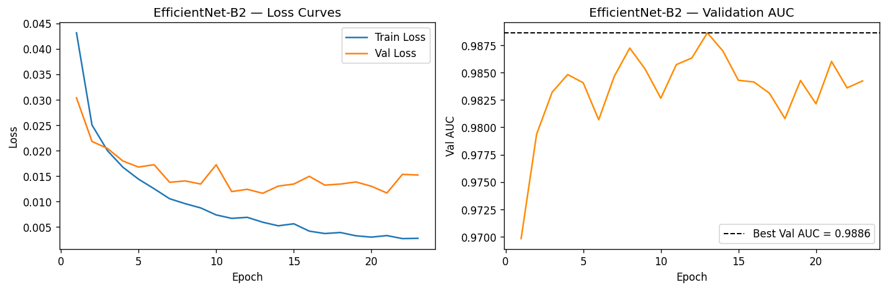
  <br><em>Figure 5.1a — EfficientNet-B2 training dynamics. Left: train/val loss over 23 epochs —
  train loss decreases throughout; val loss fluctuates without a clean minimum. Right: val AUC
  curve — peaks at 0.9886 (epoch 13), then oscillates below without a min_delta=1e-4
  improvement, triggering early stopping at epoch 23.</em>
</p>

<p align="center">
  
  <br><em>Figure 5.1b — EfficientNet-B2 evaluation on the held-out test set. Top-left: ROC curve
  (AUC-ROC = 0.9790). Top-right: confusion matrix at val-set Youden τ* = 0.275 — 179 true lenses
  recovered, 16 missed, 778 false positives. Bottom-left: Precision-Recall curve (AUC-PR = 0.7087,
  72× above the 0.0099 random baseline). Bottom-right: calibration curve — the model is poorly
  calibrated, as expected when training on 50:50 batches but evaluating on 99.8:1 data.</em>
</p>

| Metric | Value |
|:-------|------:|
| **AUC-ROC** | **0.9790** |
| **AUC-PR** | **0.7087** (72× baseline) |
| Youden τ* | 0.2751 |
| Sensitivity / Specificity | 0.9179 / 0.9600 |
| Precision@τ* | 0.187 (179/957) |
| FP / FN | 778 / 16 |
| FP:TP | 4.3:1 |
| Params | 7.70M ✅ ImageNet |

**Confusion matrix at τ* = 0.275:**

| | Non-Lens | Lens |
|:---|---:|---:|
| True Non-Lens | 18,677 | 778 |
| True Lens | 16 | 179 |

**[Download the Weights](https://drive.google.com/file/d/10TKUpFJ36icQ6cOsqrG0G42QRUUk9CY6/view?usp=sharing)**

---

### 5.2 ResNet-34

**Architecture:** ResNet-34 with `Linear(512, 1)`. 21.29M params fine-tuned.
**Training:** Early stopping epoch 26, best val AUC = 0.9954.

<p align="center">
  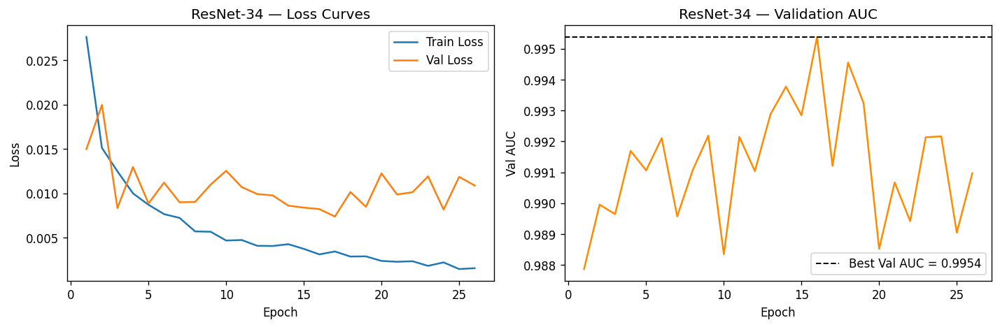
  <br><em>Figure 5.2a — ResNet-34 training dynamics. Left: train/val loss — val loss fluctuates
  without dramatic spikes; best val AUC reached at epoch 16 and not exceeded in subsequent epochs.
  Right: val AUC — peak 0.9954 at epoch 16, gradual decline thereafter, early stopping at epoch 26
  after 10 epochs without a min_delta improvement.</em>
</p>

<p align="center">
  
  <br><em>Figure 5.2b — ResNet-34 evaluation. Top-left: ROC curve (AUC-ROC = 0.9881 — best
  individual model). Top-right: confusion matrix at τ* = 0.279 — 176 true lenses recovered, 19
  missed, 374 false positives (fewest FP of any individual model). Bottom-left: PR curve (AUC-PR =
  0.7851 — best individual, 79× baseline). Bottom-right: calibration curve.</em>
</p>

| Metric | Value |
|:-------|------:|
| **AUC-ROC** | **0.9881** 🥇 |
| **AUC-PR** | **0.7851** 🥇 (79× baseline) |
| Youden τ* | 0.2792 |
| Sensitivity / Specificity | 0.9026 / 0.9808 |
| Precision@τ* | 0.320 (176/550) |
| **FP / FN** | **374** / 19 |
| FP:TP | 2.1:1 |
| Params | 21.29M ✅ ImageNet |

**Confusion matrix at τ* = 0.279:**

| | Non-Lens | Lens |
|:---|---:|---:|
| True Non-Lens | 19,081 | 374 |
| True Lens | 19 | 176 |

ResNet-34 leads all individual models on AUC-ROC, AUC-PR, and fewest false positives.
Its Brier score (0.0089) falls below the trivial 0.0099 baseline — the only model
where this holds. This is noted but does not imply good calibration under this imbalance.

**[Download the Weights](https://drive.google.com/file/d/1M54eKgVRNA-VeMJwaTgcjBBsUdpTlkoS/view?usp=sharing)**

---

### 5.3 DenseNet-121

**Architecture:** DenseNet-121 with `Linear(1024, 1)`. 6.95M params fine-tuned.
**Training:** Early stopping epoch 36, best val AUC = 0.9943.

<p align="center">
  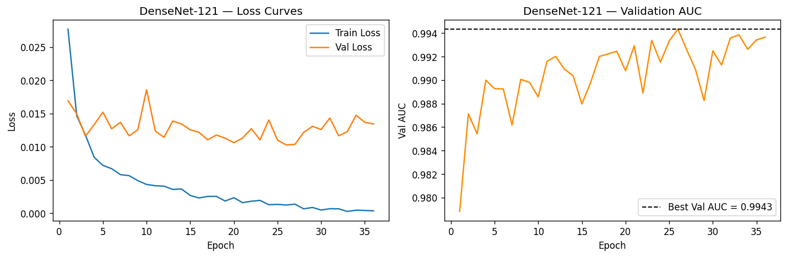
  <br><em>Figure 5.3a — DenseNet-121 training dynamics. Left: train/val loss — train loss reaches
  near-zero by epoch 28; val loss fluctuates without dramatic spikes, gradually trending up from
  epoch 26. Right: val AUC — slow but steady improvement across 36 epochs, peaking at 0.9943 at
  epoch 26, then plateauing until early stopping.</em>
</p>

<p align="center">
  
  <br><em>Figure 5.3b — DenseNet-121 evaluation. Top-left: ROC curve (AUC-ROC = 0.9844).
  Top-right: confusion matrix at τ* = 0.136 — 181 lenses recovered, 14 missed, 642 false positives.
  Note the very low threshold (0.136) — the model's score distribution is compressed toward low
  values. Bottom-left: PR curve (AUC-PR = 0.7632, 77× baseline). Bottom-right: calibration curve.</em>
</p>

| Metric | Value |
|:-------|------:|
| **AUC-ROC** | **0.9844** |
| **AUC-PR** | **0.7632** (77× baseline) |
| Youden τ* | **0.1359** |
| Sensitivity / Specificity | 0.9282 / 0.9670 |
| Precision@τ* | 0.220 (181/823) |
| FP / FN | 642 / 14 |
| FP:TP | 3.5:1 |
| Params | **6.95M** ✅ ImageNet |

**Confusion matrix at τ* = 0.136:**

| | Non-Lens | Lens |
|:---|---:|---:|
| True Non-Lens | 18,813 | 642 |
| True Lens | 14 | 181 |

DenseNet-121 achieves the second-best AUC-PR among pretrained models at the smallest
parameter count. Its τ* = 0.136 — the lowest among pretrained models — reflects
score compression toward low values; calibration curve should be consulted directly.

**[Download the Weights](https://drive.google.com/file/d/1zgaB7eO4XPsJfnw2uXVLey-zJa9AEP20/view?usp=sharing)**


---

### 5.4 E-ResNet $D_4$ (3-channel)

**Architecture:** $D_4$-equivariant ResNet (`flipRot2dOnR2(N=4)`, order 8).  
`in_type = 3 × trivial_repr`.  
$0.513$M parameters, trained from scratch.

**Key constraint:** Strided `R2Conv` under `flipRot2dOnR2` breaks equivariance
($\lvert \Delta \text{logit} \rvert \approx 3.4$ at layer2, verified via `in_type.transform`).
All downsampling therefore uses `enn.PointwiseAvgPool + stride-1 conv` in both the main path and the shortcut.

**$D_4$ invariance check** (all 8 group elements, max $\lvert \Delta \text{logit} \rvert = 7.84\times10^{-6}$ ✓):

| Element | $\lvert \Delta \text{logit} \rvert$ | Element | $\lvert \Delta \text{logit} \rvert$ |
|:--|--:|:--|--:|
| identity | $0.00\times10^{0}$ | flip | $1.40\times10^{-6}$ |
| rot $90^\circ$ | $2.38\times10^{-6}$ | flip $\circ$ rot $90^\circ$ | $1.64\times10^{-6}$ |
| rot $180^\circ$ | **$7.84\times10^{-6}$** | flip $\circ$ rot $180^\circ$ | $1.43\times10^{-6}$ |
| rot $270^\circ$ | $4.11\times10^{-6}$ | flip $\circ$ rot $270^\circ$ | $2.38\times10^{-6}$ |

**Training:** Early stopping at epoch 17. Best validation AUC = $0.9932$, first reached at epoch 2.

<p align="center">
  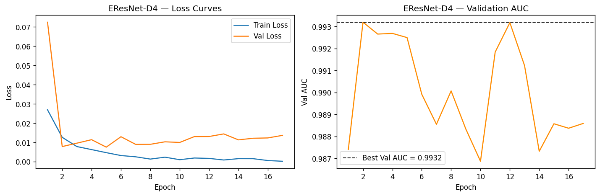
  <br><em>Figure 5.4a — E-ResNet D₄ training dynamics. Left: train/val loss — val loss spikes at
  epoch 1 (0.0725) then stabilises; train loss reaches near-zero by epoch 8. Right: val AUC —
  best val AUC of 0.9932 is reached at epoch 2 and not exceeded in the remaining 15 epochs.
  Early stopping triggers at epoch 17. The best checkpoint being selected at epoch 2 may
  reflect a lucky initialisation rather than stable convergence.</em>
</p>

<p align="center">
  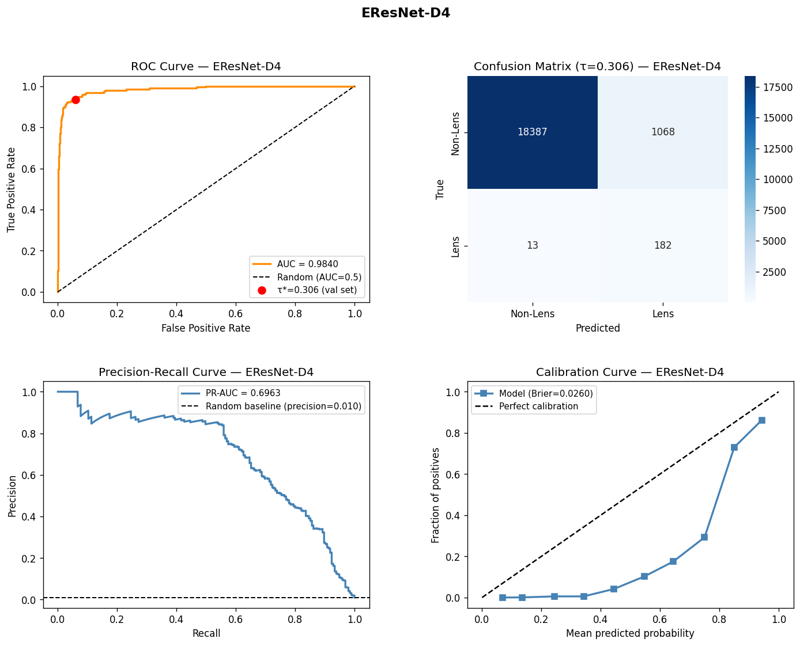
  <br><em>Figure 5.4b — E-ResNet D₄ evaluation. Top-left: ROC curve (AUC-ROC = 0.9840 — close to
  DenseNet-121 at 13.5× fewer parameters). Top-right: confusion matrix at τ* = 0.306 — 182 lenses
  recovered, 13 missed, 1,068 false positives. Bottom-left: PR curve (AUC-PR = 0.6963 — the lowest
  of any model, below EfficientNet-B2). Bottom-right: calibration curve.</em>
</p>

| Metric | Value |
|:-------|------:|
| **AUC-ROC** | **0.9840** |
| **AUC-PR** | **0.6963** *(lowest of all models)* |
| Youden τ* | 0.3064 |
| Sensitivity / Specificity | 0.9333 / 0.9451 |
| Precision@τ* | 0.146 (182/1250) |
| FP / FN | 1,068 / 13 |
| FP:TP | 5.9:1 |
| Params | **0.513M** ❌ Scratch |

**Confusion matrix at τ* = 0.306:**

| | Non-Lens | Lens |
|:---|---:|---:|
| True Non-Lens | 18,387 | 1,068 |
| True Lens | 13 | 182 |

On AUC-ROC (0.9840) E-ResNet D₄ is close to DenseNet-121 (0.9844) at 13.5× fewer
parameters. On AUC-PR (0.6963) it has the lowest score of any model — the equivariance
efficiency advantage does not hold on this metric.

**[Download the Weights](https://drive.google.com/file/d/14wBi5-Sbvvvxh0IWWBPVjdsvSQwzJfG0/view?usp=sharing)**

---

### 5.5 EqDenseNet-C8 (3-channel)

**Architecture:** C8-equivariant DenseNet (`rot2dOnR2(N=8)`, order 8, rotations only).
`in_type = 3 × trivial_repr`. 0.183M params, from scratch.

```
Input (64×64) → Stem (stride=2) → 32×32
  → DenseBlock 1 + Transition → 16×16
  → DenseBlock 2 + Transition → 8×8
  → DenseBlock 3
  → PointwiseAvgPool(k=8) → 1×1 → GroupPooling
  → Flatten → Linear(1)
```

**C8 Invariance Verification:**
C4 subgroup (90° rotations) at machine precision ✓. Odd elements (45°, 135°, 225°, 315°)
show ~2.5e-03 from bilinear interpolation in `in_type.transform` on discrete pixel grids —
a grid artifact, not an architecture flaw. C8 equivariance holds exactly in the
continuous domain via escnn weight-sharing.

**Training:** Early stopping epoch 41, best val AUC = 0.9958.

<p align="center">
  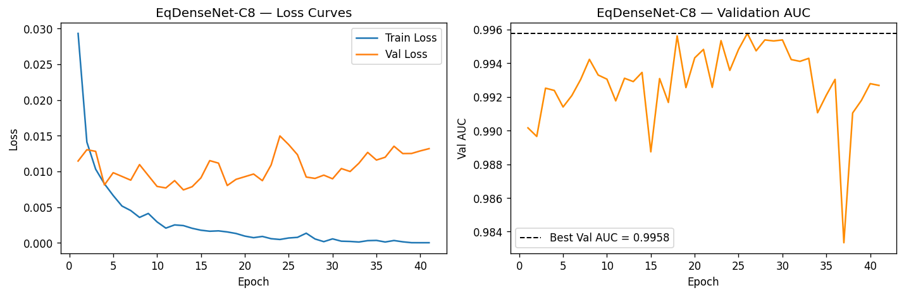
  <br><em>Figure 5.5a — EqDenseNet-C8 training dynamics. Left: train/val loss — more stable than
  E-ResNet D₄, no catastrophic val loss spikes. Train loss reaches near-zero around epoch 20; val
  loss fluctuates but without divergence. Right: val AUC — gradual improvement across 41 epochs,
  peaking at 0.9958 at epoch 26, then plateauing until early stopping.</em>
</p>

<p align="center">
  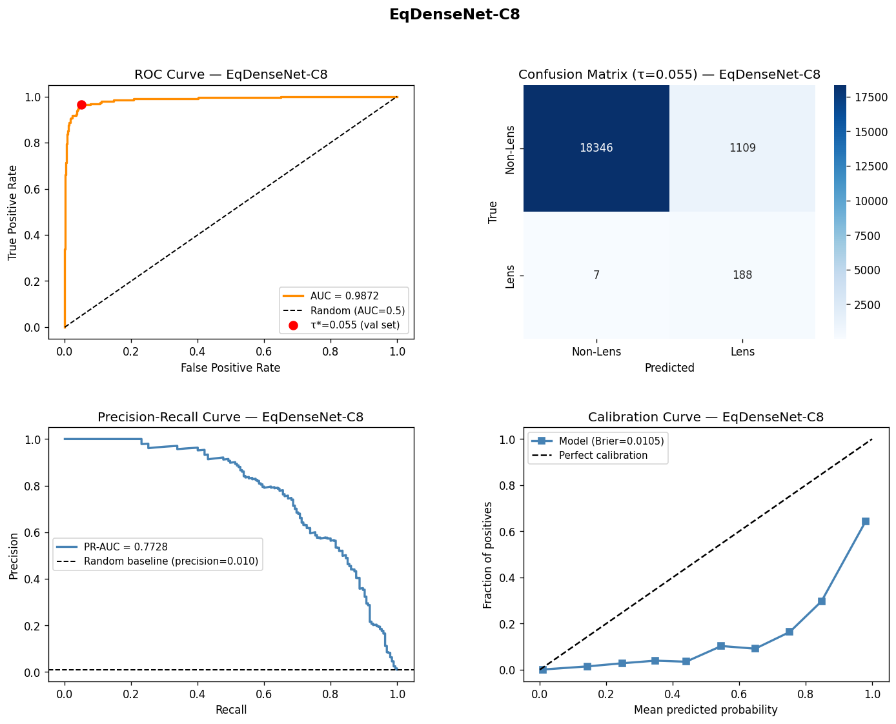
  <br><em>Figure 5.5b — EqDenseNet-C8 evaluation. Top-left: ROC curve (AUC-ROC = 0.9872 — best
  from-scratch model, exceeding DenseNet-121 at 37.9× fewer parameters). Top-right: confusion
  matrix at τ* = 0.055 — 188 lenses recovered (FN=7, fewest of any model), 1,109 false positives
  (most of any model). The extremely low threshold drives both results simultaneously.
  Bottom-left: PR curve (AUC-PR = 0.7728). Bottom-right: calibration curve.</em>
</p>

| Metric | Value |
|:-------|------:|
| **AUC-ROC** | **0.9872** *(best from-scratch)* |
| **AUC-PR** | **0.7728** *(best from-scratch)* |
| Youden τ* | **0.0548** *(lowest in benchmark)* |
| **Sensitivity** | **0.9641** 🥇 *(highest)* |
| Specificity | 0.9430 |
| Precision@τ* | 0.145 (188/1297) |
| FP count | 1,109 |
| **FN count** | **7** 🥇 *(fewest)* |
| FP:TP | 5.9:1 |
| Params | **0.183M** ❌ Scratch |

**Confusion matrix at τ* = 0.055:**

| | Non-Lens | Lens |
|:---|---:|---:|
| True Non-Lens | 18,346 | 1,109 |
| True Lens | 7 | 188 |

EqDenseNet-C8's τ* = 0.055 — the lowest in the benchmark — means any sample above
score 0.055 is flagged as a lens. This produces the highest recall (96.4%) and fewest
missed lenses (FN=7), but also the most false positives (1,109). High recall and high
FP count are the direct consequence of operating at this threshold.

**[Download the Weights](https://drive.google.com/file/d/1-cVDhdOgpiCWsTtnXpYe3fgPetibX_1Y/view?usp=sharing)**

---

### 5.6 Soft Ensemble

**Members:** EfficientNet-B2, ResNet-34, DenseNet-121, E-ResNet D₄, EqDenseNet-C8.
**Method:** Mean of per-model sigmoid probabilities. Youden τ* from val-set ensemble
probabilities (deployment-clean). No retraining.

**Per-model probability correlation matrix:**

| | EffNet-B2 | ResNet-34 | DenseNet | EResNet | EqDenseNet |
|:---|:---:|:---:|:---:|:---:|:---:|
| EfficientNet-B2 | 1.000 | 0.765 | 0.761 | 0.748 | 0.737 |
| ResNet-34 | — | 1.000 | 0.817 | 0.750 | 0.819 |
| DenseNet-121 | — | — | 1.000 | 0.708 | 0.804 |
| E-ResNet D₄ | — | — | — | 1.000 | 0.761 |
| EqDenseNet-C8 | — | — | — | — | 1.000 |

Range: 0.708–0.819. Lowest pair: DenseNet-121 / E-ResNet D₄ (0.708). Highest pair:
ResNet-34 / EqDenseNet-C8 (0.819). No clean pretrained vs equivariant separation.

<p align="center">
  
  <br><em>Figure 5.6 — Soft Ensemble evaluation on the held-out test set. Top-left: ROC curve
  (AUC-ROC = 0.9905 — best of all systems). Top-right: confusion matrix at val-set Youden
  τ* = 0.314 — 185 lenses recovered, 10 missed, 379 false positives. Bottom-left: PR curve
  (AUC-PR = 0.8233 — best of all systems, 83× above the 0.0099 random baseline). Bottom-right:
  calibration curve — poorly calibrated for the same structural reason as individual models.</em>
</p>

| Metric | Value | vs ResNet-34 |
|:-------|------:|-------------:|
| **AUC-ROC** | **0.9905** | +0.0024 ↑ |
| **AUC-PR** | **0.8233** (83× baseline) | +0.038 ↑ |
| Youden τ* | 0.3143 | — |
| Sensitivity / Specificity | 0.9487 / 0.9805 | — |
| **Precision@τ*** | **0.328** (185/564) | — |
| FP / FN | 379 / 10 | — |
| **FP:TP** | **2.0:1** | — |

**Confusion matrix at τ* = 0.314:**

| | Non-Lens | Lens |
|:---|---:|---:|
| True Non-Lens | 19,076 | 379 |
| True Lens | 10 | 185 |

The ensemble improves AUC-ROC (+0.0024) and AUC-PR (+0.038) on threshold-free metrics.
Note: ResNet-34 achieves 374 FP at its own Youden threshold vs ensemble's 379 — the
ensemble does not uniformly reduce false positives at all operating thresholds.

---

## 6. Comprehensive Results Summary

### 6.1 Full Benchmark Table

All architectures evaluated on the held-out test set (19,650 images, 195 lenses).
Sorted by AUC-ROC descending.

| Rank | Architecture | Pretrained | Params (M) | AUC-ROC ↑ | AUC-PR ↑ | Sens@τ* | Spec@τ* | Prec@τ* | FP | FN | FP:TP |
|:----:|:-------------|:----------:|:----------:|:---------:|:--------:|:-------:|:-------:|:-------:|---:|---:|------:|
| 1 | **Soft-Ensemble** | Mixed | N/A | **0.9905** | **0.8233** | 0.9487 | 0.9805 | **0.328** | 379 | 10 | **2.0** |
| 2 | ResNet-34 | ✅ | 21.29 | 0.9881 | 0.7851 | 0.9026 | **0.9808** | 0.320 | **374** | 19 | 2.1 |
| 3 | EqDenseNet-C8 | ❌ | **0.183** | 0.9872 | 0.7728 | **0.9641** | 0.9430 | 0.145 | 1,109 | **7** | 5.9 |
| 4 | DenseNet-121 | ✅ | 6.95 | 0.9844 | 0.7632 | 0.9282 | 0.9670 | 0.220 | 642 | 14 | 3.5 |
| 5 | E-ResNet D₄ | ❌ | 0.513 | 0.9840 | 0.6963 | 0.9333 | 0.9451 | 0.146 | 1,068 | 13 | 5.9 |
| 6 | EfficientNet-B2 | ✅ | 7.70 | 0.9790 | 0.7087 | 0.9179 | 0.9600 | 0.187 | 778 | 16 | 4.3 |

*Random PR baseline: 0.0099 (195/19,650). All six models exceed Mriganka 2022 HSC baseline
(AUC 0.816) by >0.16 points (This is the only baseline I have found in the past DeepLense project repositories to compare with). Threshold-dependent metrics at val-set Youden τ* for each
model — thresholds differ across models; direct CM comparisons are indicative, not controlled.*

### 6.2 ROC and Precision-Recall Curves

<p align="center">
  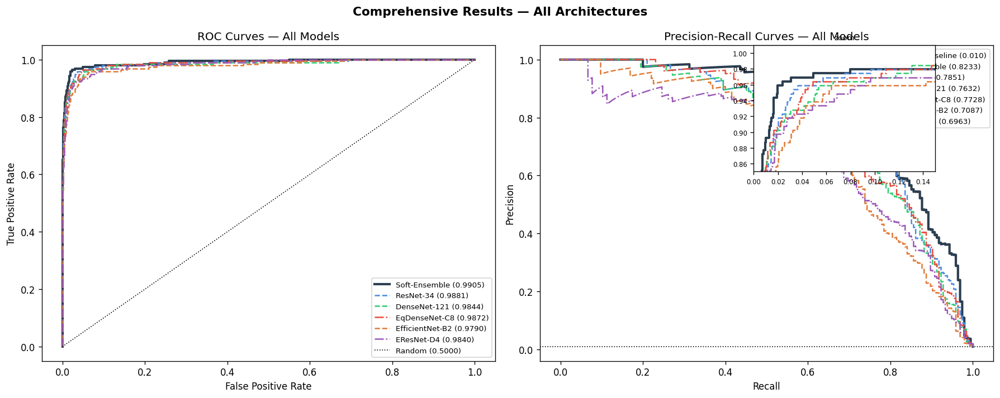
  <br><em>Figure 6.1 — Comparative ROC and PR curves for all six systems on the test set.
  Left: ROC curves — all models achieve AUC-ROC > 0.979; individual model span is only 0.009
  (0.9790–0.9881), making the ensemble's margin (+0.0024 over ResNet-34) modest but consistent.
  Right: Precision-Recall curves — substantially more separation is visible. PR-AUC span across
  individual models is 0.089 (0.6963–0.7851). E-ResNet D₄ shows the steepest precision collapse
  at high recall; the ensemble dominates at all recall levels above ~0.4. The random baseline
  at precision = 0.0099 is shown for reference.</em>
</p>

**ROC ordering:** Ensemble > ResNet-34 > EqDenseNet-C8 > DenseNet-121 > E-ResNet D₄ > EfficientNet-B2.

**PR ordering (differs from ROC):** Ensemble > ResNet-34 > EqDenseNet-C8 > DenseNet-121 >
EfficientNet-B2 > E-ResNet D₄. E-ResNet D₄ ranks 5th on AUC-ROC but last on AUC-PR — a
significant divergence that PR-AUC correctly exposes.

### 6.3 Parameter Efficiency

<p align="center">
  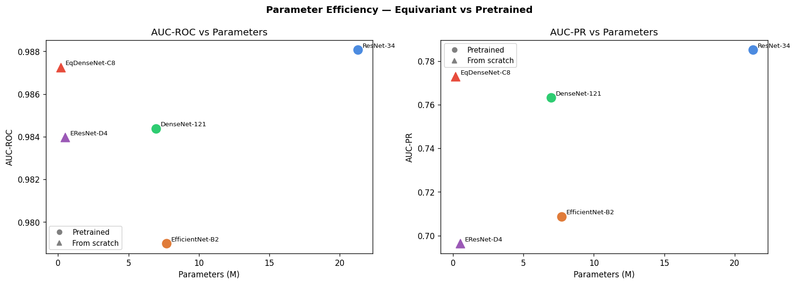
  <br><em>Figure 6.2 — Parameter efficiency scatter (log-scale x-axis: parameter count in millions;
  y-axis: AUC). Triangles = trained from scratch; circles = ImageNet pretrained.
  Left: AUC-ROC vs parameters — EqDenseNet-C8 (cyan triangle, far left) achieves AUC-ROC 0.9872
  at 0.183M parameters, exceeding DenseNet-121 (0.9844, 6.95M) and EfficientNet-B2 (0.9790, 7.70M)
  at 37.9× and 42× fewer parameters. E-ResNet D₄ (0.513M) also exceeds EfficientNet-B2.
  Right: AUC-PR vs parameters — the efficiency advantage for EqDenseNet-C8 holds (0.7728 vs
  DenseNet-121 0.7632), but E-ResNet D₄ (0.6963) falls below EfficientNet-B2 (0.7087). The
  equivariant efficiency advantage is real for EqDenseNet-C8 on both metrics, but does not
  generalise to E-ResNet D₄ on AUC-PR.</em>
</p>

### 6.4 Key Takeaways

**T1 — Ensemble leads on threshold-free metrics.** AUC-ROC 0.9905 and AUC-PR 0.8233 both
exceed every individual model. PR-AUC gain of +0.038 over ResNet-34 indicates maintained
precision across the recall range. At the respective Youden thresholds, ResNet-34 produces
slightly fewer FP (374 vs 379) — the FP advantage depends on threshold, not AUC.

**T2 — EqDenseNet-C8 achieves competitive AUC at 0.183M parameters.** AUC-ROC 0.9872
exceeds DenseNet-121 (0.9844) and EfficientNet-B2 (0.9790) at 37.9× and 42× fewer
parameters. Does not exceed ResNet-34. Efficiency result holds for two of three
pretrained comparators on both AUC-ROC and AUC-PR.

**T3 — PR-AUC separates models more than ROC-AUC.** Span 0.089 vs 0.009. Rankings
partially disagree: E-ResNet D₄ ranks 5th on AUC-ROC but last on AUC-PR. Report both.

**T4 — FN and FP tradeoffs differ at operating points.** EqDenseNet-C8: fewest FN (7),
most FP (1,109). ResNet-34: fewest FP (374), most FN (19). These are at different τ*
and describe operating point choices, not absolute model properties.

**T5 — EfficientNet-B2 underperforms its parameter count.** 7.70M pretrained parameters,
ranks last on AUC-ROC (0.9790) and fourth on AUC-PR (0.7087) — below DenseNet-121
on both despite similar parameter counts.

---

## 7. Interpretability Analysis

Grad-CAM heatmaps are computed at the final convolutional feature map of each model
and upsampled to 64×64. At this resolution, maps are spatially coarse — they reflect
gradient accumulation over large receptive fields. Descriptions are limited to what
is directly visible; no claims are made about model reasoning from these maps.

### 7.1 Grad-CAM: EfficientNet-B2

**Correct Lenses (TP, p=1.000)**

<p align="center">
  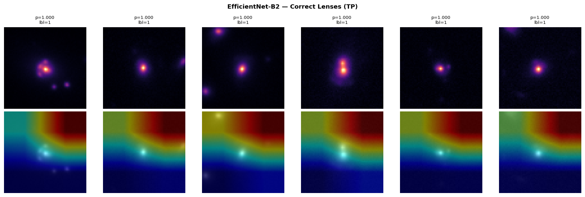
  <br><em>Figure 7.1 — EfficientNet-B2 Grad-CAM on 6 correctly classified lenses (all p=1.000).
  Top row: i-band images. Bottom row: Grad-CAM overlays. High activation (red) consistently
  occupies the upper portion — a dark, structurally featureless region — in all 6 panels,
  regardless of source morphology. The bright central source falls in low-activation (blue/cyan)
  territory throughout. The nearly identical pattern across panels suggests a fixed spatial
  response rather than source-specific attention.</em>
</p>

**Missed Lenses (FN, p=0.001–0.035)**

<p align="center">
  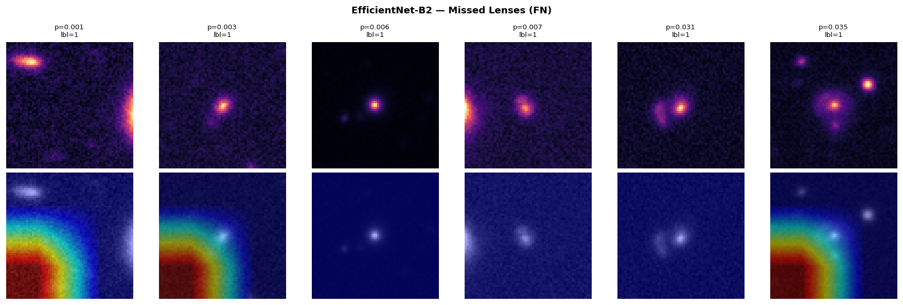
  <br><em>Figure 7.2 — EfficientNet-B2 Grad-CAM on 6 missed lenses (p=0.001–0.035). Morphologies:
  elongated off-centre source (col 1), compact source in noisy field (col 2), two-source
  configuration (col 3), double source in noisy field (col 4), close galaxy pair (col 5),
  compact source with faint companion (col 6). Columns 3–6 show near-uniform blue — essentially
  no gradient signal. Columns 1–2 show activation at the lower image boundary, away from the source.
  No consistent spatial pattern characterises all missed lenses.</em>
</p>

**False Positives (FP, p=0.948–0.995)**

<p align="center">
  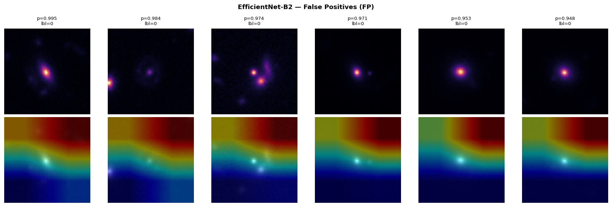
  <br><em>Figure 7.3 — EfficientNet-B2 Grad-CAM on 6 high-confidence false positives (p=0.948–0.995).
  Sources include compact isolated sources (cols 1, 2, 4, 5, 6) and a triple-source configuration
  (col 3). The Grad-CAM activation patterns are visually indistinguishable from the TP maps — the
  same upper-image high-activation template with the source in low-activation territory. The heatmaps
  provide no basis for separating TP from FP cases.</em>
</p>

---

### 7.2 Grad-CAM: DenseNet-121

**Correct Lenses (TP, p=0.999–1.000)**

<p align="center">
  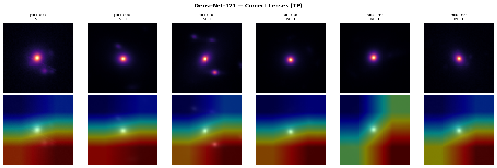
  <br><em>Figure 7.4 — DenseNet-121 Grad-CAM on 6 correctly classified lenses (p=0.999–1.000).
  High activation concentrated in the lower image portion in columns 1–4; column 5 shows lower-right
  activation; column 6 is predominantly blue. More inter-panel variation than EfficientNet-B2, but
  no consistent physically motivated spatial pattern related to the source or arc region is visible.</em>
</p>

**Missed Lenses (FN, p=0.000–0.014)**

<p align="center">
  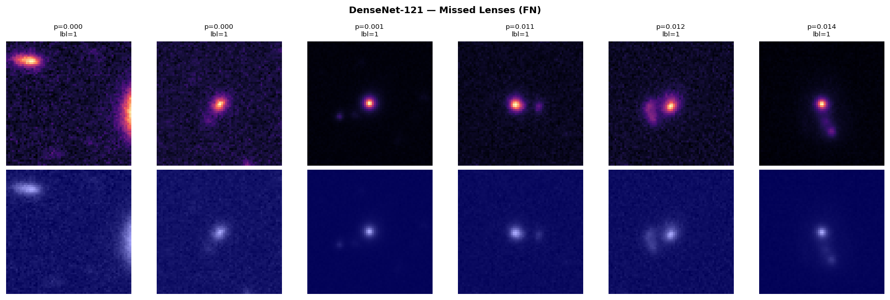
  <br><em>Figure 7.5 — DenseNet-121 Grad-CAM on 6 missed lenses (p=0.000–0.014). All 6 panels
  show near-uniform blue — the model produces essentially no gradient signal on any of these
  examples. This is more uniformly low than EfficientNet-B2's FN maps, where columns 1–2 showed
  some lower-boundary activation. The maps are uninformative about why these lenses are missed.</em>
</p>

**False Positives (FP, p=0.964–0.985)**

<p align="center">
  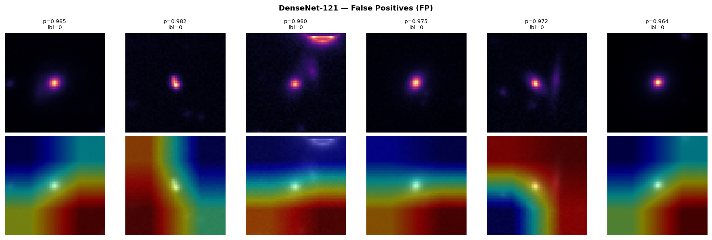
  <br><em>Figure 7.6 — DenseNet-121 Grad-CAM on 6 high-confidence false positives (p=0.964–0.985).
  Sources include compact isolated sources (cols 1, 2, 4, 6), a source with bright linear edge feature
  (col 3), and a source with asymmetric extended companion (col 5). Activation patterns vary
  substantially — column 2 shows a sharp vertical gradient, column 3 responds to the edge feature,
  column 5 shows activation curving around the companion. More inter-panel variation than
  EfficientNet-B2 FP maps; no consistent pattern across panels.</em>
</p>

**Overall Grad-CAM assessment:** Neither model reveals clear, physically interpretable
spatial attention. EfficientNet-B2 produces a near-uniform upper-image template that is
visually identical across TP and FP cases — the maps cannot distinguish correct from
incorrect predictions. DenseNet-121 shows more inter-sample variation but no consistent
physically motivated pattern. For missed lenses, both models produce near-zero gradient
signal. Grad-CAM at 64×64 is insufficient to characterise model reasoning.

---

### 7.3 Per-Channel Attribution — Integrated Gradients

Channel-masking Grad-CAM (zeroing non-target channels after global min-max normalisation)
creates out-of-distribution inputs — zero is the minimum observed pixel value, not "absence
of signal." **Integrated Gradients (IG)** with a physically motivated baseline replaces this.

**Baseline:** Per-channel training set mean over 500 randomly sampled training images:
**g = 0.270, r = 0.188, i = 0.105.** All IG interpolation steps remain within the data
distribution. IG satisfies the completeness axiom: attributions sum to the output difference
between input and baseline.

<p align="center">
  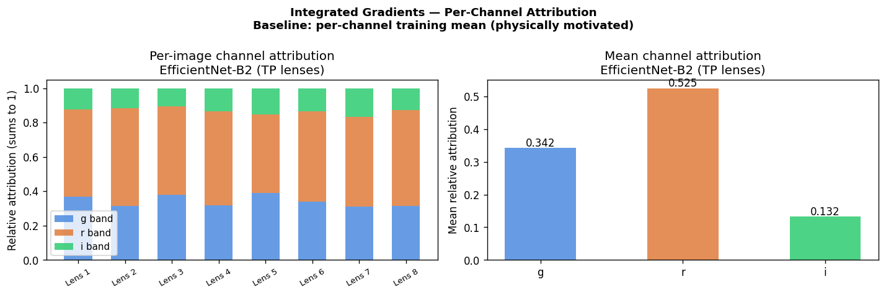
  <br><em>Figure 7.7 — Integrated Gradients per-channel attribution for EfficientNet-B2 on
  correctly classified lenses (TP, n=8). Left: stacked bar chart showing relative per-channel
  attribution for each lens — r band consistently dominates (0.46–0.57 per image), g band second
  (0.31–0.39), i band lowest (0.11–0.17). Right: mean attribution across n=8 lenses
  (g=0.342, r=0.525, i=0.132). Baseline is the per-channel training mean, physically motivated
  to keep all interpolation steps within the data manifold. The FN mean attribution (not shown)
  is: g=0.332, r=0.564, i=0.104 — slightly more r-band and less i-band than TP, though this
  comparison is based on only 6 FN examples.</em>
</p>

**IG Attribution Table — EfficientNet-B2 (TP n=8 vs FN n=6):**

| | g band | r band | i band |
|:---|:------:|:------:|:------:|
| Lens 1 | 0.369 | 0.507 | 0.123 |
| Lens 2 | 0.314 | 0.571 | 0.115 |
| Lens 3 | 0.381 | 0.513 | 0.106 |
| Lens 4 | 0.319 | 0.545 | 0.136 |
| Lens 5 | 0.389 | 0.458 | 0.152 |
| Lens 6 | 0.341 | 0.526 | 0.133 |
| Lens 7 | 0.309 | 0.525 | 0.166 |
| Lens 8 | 0.315 | 0.558 | 0.127 |
| **TP Mean** | **0.342** | **0.525** | **0.132** |
| **FN Mean** | **0.332** | **0.564** | **0.104** |

> **Caveat:** IG measures sensitivity relative to the per-channel training mean baseline.
> Higher r-band attribution means the model's output changed more when r was moved from the
> mean to the actual value — not that r is inherently more informative for all lenses or for
> all models. Results reflect EfficientNet-B2's specific behaviour under this baseline.

The legacy per-channel saliency figure (channel-masking Grad-CAM) is retained below
for reference, but the IG results above supersede it for all interpretation purposes.

<p align="center">
  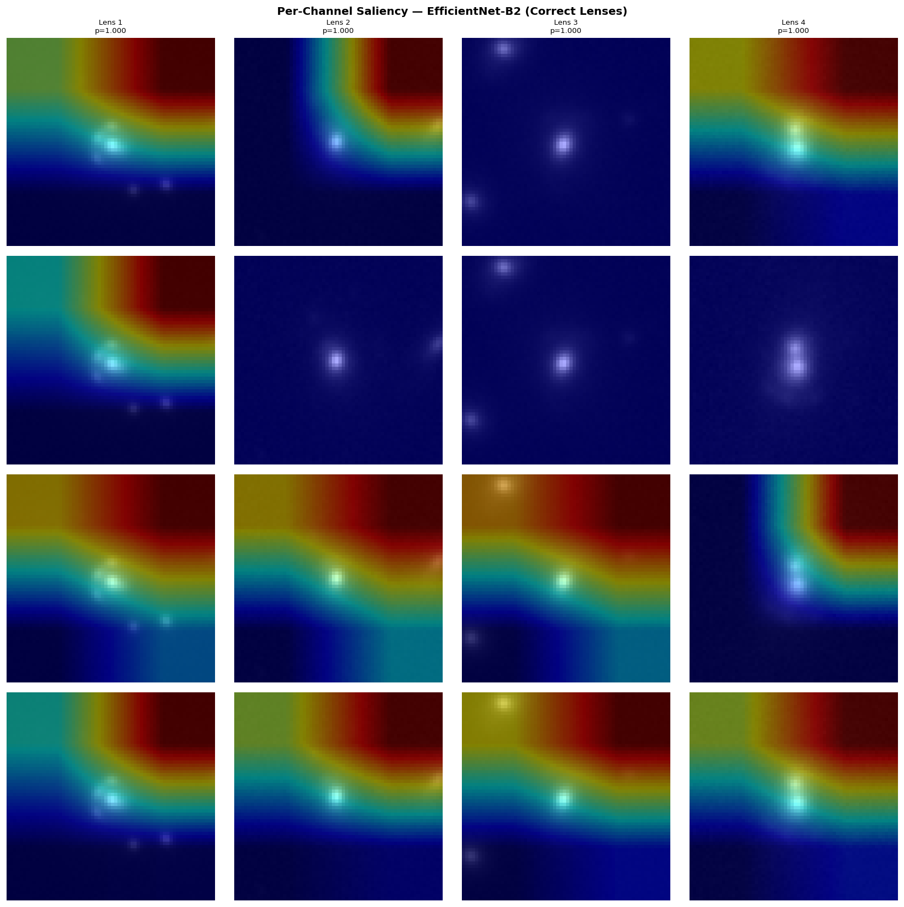
  <br><em>Figure 7.8 — Legacy per-channel saliency via channel-masking Grad-CAM on 4 correctly
  classified lenses. Rows: g band (row 1), r band (row 2), i band (row 3), all bands (row 4).
  ⚠️ This method zeros out non-target channels after global min-max normalisation, creating
  out-of-distribution inputs (zero ≠ absence of signal). The resulting maps reflect gradient
  behaviour on unphysical inputs and should not be used for interpretation. Retained for
  reference only; superseded by the Integrated Gradients analysis in Figure 7.7.</em>
</p>

---

## 8. Failure Mode Analysis

Analysis at Soft-Ensemble operating point τ* = 0.3143. **FN = 10, FP = 379.**

### 8.1 Missed Lenses Gallery

<p align="center">
  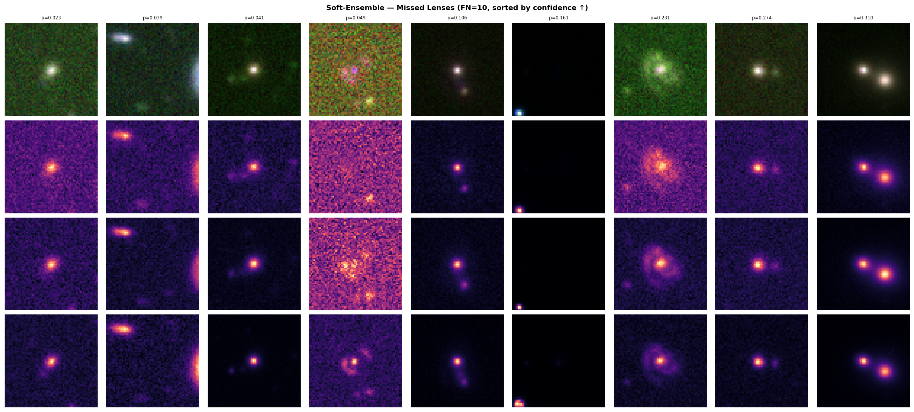
  <br><em>Figure 8.1 — All 10 missed lenses (FN=10), sorted by ascending ensemble confidence
  (p=0.023 to p=0.313). Rows per column: RGB composite (g→R, r→G, i→B), g band, r band, i band.
  FN 1–4 (p=0.023–0.049): missed by all models with very low confidence — morphologically diverse:
  multi-source fields (cols 1, 4), compact sources in noisy backgrounds (cols 2, 3).
  FN 6 (p=0.161): extended multi-source field with complex morphology.
  FN 7 (p=0.231): EfficientNet-B2 scores 0.606 but is averaged down by the majority.
  FN 9–10 (p=0.310–0.313): borderline cases just below τ* = 0.3143 — potentially recoverable
  at a slightly lower threshold. Mean pixel intensity for missed lenses (0.133) is higher than
  caught lenses (0.089), consistent with more spatially distributed flux.</em>
</p>

### 8.2 False Positive Gallery

<p align="center">
  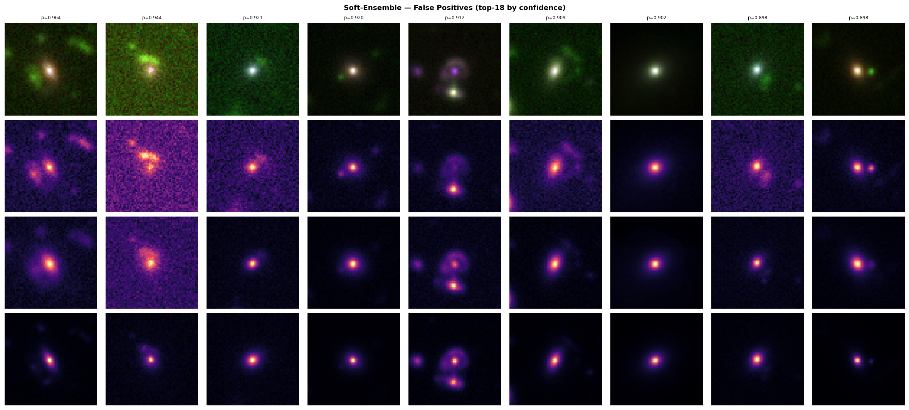
  <br><em>Figure 8.2 — Top-18 false positives by ensemble confidence (p=0.898–0.964).
  Rows per column: RGB composite, g band, r band, i band. The highest-confidence FP (col 1, p=0.964)
  shows visible arc-like peripheral emission — the most lens-like contaminant in the top-18 and a
  genuine ambiguity at 64×64 resolution. Other high-confidence FPs include: an irregular multi-source
  field with extended structure (col 2), compact isolated sources (cols 3, 4, 7, 8, 9), and a
  close double-source system (cols 5, 6). All 18 would require higher-resolution imaging or
  spectroscopic follow-up to definitively classify.</em>
</p>

### 8.3 Per-model Scores on Ensemble False Negatives

| | EffNet-B2 | ResNet-34 | DenseNet | EResNet | EqDenseNet | Ensemble |
|:---|:---:|:---:|:---:|:---:|:---:|:---:|
| FN 1 | 0.003 | 0.014 | 0.000 | 0.091 | 0.005 | 0.023 |
| FN 2 | 0.001 | 0.005 | 0.000 | 0.174 | 0.017 | 0.039 |
| FN 3 | 0.006 | 0.052 | 0.001 | 0.141 | 0.003 | 0.041 |
| FN 4 | 0.063 | 0.026 | 0.023 | 0.120 | 0.011 | 0.049 |
| FN 5 | 0.055 | 0.034 | 0.014 | **0.404** | 0.023 | 0.106 |
| FN 6 | 0.288 | 0.204 | 0.194 | 0.094 | 0.024 | 0.161 |
| FN 7 | **0.606** | 0.067 | 0.096 | 0.293 | 0.094 | 0.231 |
| FN 8 | 0.348 | **0.636** | 0.011 | 0.250 | 0.125 | 0.274 |
| FN 9 | 0.591 | 0.286 | 0.084 | 0.492 | 0.098 | 0.310 |
| FN 10 | 0.340 | 0.333 | 0.154 | **0.629** | 0.108 | **0.313** |

**FN 1–4** (ensemble 0.023–0.049): missed by all models with very low confidence — no
individual model assigns meaningful probability to any of them.

**FN 9 and FN 10** (scores 0.310 and 0.313, just below τ* = 0.3143): FN 10 reaches
0.629 from E-ResNet D₄; FN 9 reaches 0.591 from EfficientNet-B2 — both averaged down
by the majority. This illustrates the primary cost of soft averaging: individually
confident votes are suppressed.

### 8.4 Cross-architecture Disagreement

| | Count | Fraction |
|:---|:---:|:---:|
| Equivariant models score higher than pretrained | **6** | 6/10 |
| Pretrained models score higher than equivariant | 4 | 4/10 |

Equivariant models assign higher maximum confidence on FN 1–5 and FN 10 — in all 6
cases driven by E-ResNet D₄. Pretrained models lead on FN 6–9. Whether this reflects
the rotational symmetry prior or simply different training dynamics cannot be determined
from a single training run.

### 8.5 Statistical Characterisation

| Property | Missed (FN=10) | Caught (TP=185) |
|:---------|:--------------:|:---------------:|
| Mean max intensity | 1.0000 | 1.0000 |
| **Mean pixel intensity** | **0.1333** | **0.0885** |
| Mean i-band peak | 1.0000 | 1.0000 |
| Mean ensemble score | 0.155 | 0.837 |
| Max ensemble score among FN | 0.313 | — |

**Peak intensity is uninformative** — both groups saturate at 1.0 after global min-max
normalisation by construction. **Mean pixel intensity is higher for missed lenses**
(0.133 vs 0.089), consistent with more spatially distributed flux visible in the FN gallery.
FN 9–10 are potentially recoverable at a lower threshold; the PR curve slope in the
0.31–0.32 range should be consulted to estimate the FP cost.

---

## 9. Discussion

### The Real-Data Challenge

Test V introduces genuine sky backgrounds, PSF variation, and a 99.8:1 test imbalance
absent from Test I. At 64×64, PSF convolution suppresses resolved arc geometry; models
classify on radial flux profiles and multi-band intensity relationships, not explicit arc
detection.

### The Equivariance Hypothesis: Partial Confirmation

EqDenseNet-C8 (0.183M, from scratch) achieves AUC-ROC 0.9872 and AUC-PR 0.7728, both
exceeding DenseNet-121 (0.9844/0.7632, 6.95M, ImageNet) at 37.9× fewer parameters. The
efficiency result is real for EqDenseNet-C8 against two of three pretrained comparators
on both metrics. E-ResNet D₄ achieves competitive AUC-ROC but has the lowest AUC-PR of
any model. The equivariance advantage does not generalise uniformly across architectures
or metrics.

### Three Documented escnn Implementation Bugs

Identified and corrected via `in_type.transform` group action verification:

1. **Strided `R2Conv`** → |Δlogit| ~ 3.4.
   Fix: `enn.PointwiseAvgPool + stride-1 conv` in main path and shortcut.
2. **`nn.Sequential` wrapping equivariant modules** → `GeometricTensor` handling fails.
   Fix: `enn.SequentialModule` throughout.
3. **`nn.AdaptiveAvgPool2d` after `GroupPooling`** on non-1×1 maps → invariance broken.
   Fix: `enn.PointwiseAvgPool(kernel_size=H)` inside the equivariant chain.

Corrections applied to both Test V and the companion Test I notebook.

### Comparison to Prior Work

| Reference | Method | AUC-ROC |
|:----------|:-------|:-------:|
| Mriganka (2022) | CNN baseline on HSC | 0.816 |
| Sreehari (2024) | SSL ViT on HSC-like data | not directly comparable |
| **This work — ResNet-34** | Fine-tuned pretrained | **0.9881** |
| **This work — ensemble** | Soft-Ensemble (5 models) | **0.9905** |

All five individual models exceed the 2022 baseline by >0.16 AUC points. A direct
comparison with Sreehari 2024 is not possible; different test splits and metrics.

---

## 10. Limitations & Future Work

**L1 → Higher resolution.** 64×64 suppresses arc morphology. Moving to 128×128 or
256×256 would expose arc structure with the largest expected benefit for partial arcs
and low-flux lenses.

**L2 → Self-supervised pretraining.** 1,557 training lenses constrains from-scratch
models. SSL pretraining (DINO, iBOT, MAE) on unlabelled HSC cutouts could learn
domain-appropriate representations without labels, potentially closing the from-scratch
vs ImageNet gap.

**L3 → Post-hoc calibration.** All models trained on ~50:50 batches; poorly calibrated
at 99.8:1 test time. Platt scaling or isotonic regression required before probabilistic
triage.

**L4 → Uncertainty quantification.** Models output point-estimate probabilities.
MC-dropout or deep ensemble decomposition (aleatoric vs epistemic) would enable
risk-stratified candidate ranking rather than hard thresholding.

**L5 → Cross-survey evaluation.** All results on HSC data. Generalisation to KiDS,
DES, Euclid not evaluated. Domain shift from PSF and pipeline differences can be
substantial.

**L6 → Stronger symmetry groups.** D₄ and C8 cover discrete subgroups of SO(2).
Higher-order cyclic groups (C16, C32) or SO(2)-approximate groups would provide finer
angular coverage at increased parameter cost.

**L7 → Two-stage pipeline.** FP:TP = 2.0:1 at ensemble operating point. A lightweight
second-stage classifier on flagged candidates could suppress FP further.

---

## 11. GSoC 2026 Research Directions

**Direction 1 — Equivariant Lens Finding on Multi-Band Real Data**

Test V establishes the `3 × trivial_repr` adaptation and `in_type.transform` verification
as reusable infrastructure. Proposed work: systematic ablation of group order × parameter
count × AUC-ROC/PR using `flipRot2dOnR2(N)` and `rot2dOnR2(N)` on full-resolution HSC
cutouts; test whether higher-order groups improve on partial arcs; apply `in_type.transform`
verification as standard practice for all future DeepLense architectures.

**Direction 2 — Self-Supervised Equivariant Pretraining**

The gap: EqDenseNet-C8 (0.7728 AUC-PR) marginally exceeds DenseNet-121 (0.7632);
E-ResNet D₄ (0.6963) does not. Whether SSL pretraining on unlabelled HSC cutouts closes
this gap is the central open question. Proposed work: equivariant backbone SSL (DINO/iBOT),
fine-tune on labelled task, compare SSL-equivariant vs SSL-standard vs supervised-equivariant.

**Direction 3 — Uncertainty-Aware Candidate Ranking**

FN 9 and FN 10 (scores 0.310–0.313, just below τ* = 0.3143) are borderline cases an
uncertainty-aware system could flag. Proposed work: MC-dropout + deep ensemble uncertainty
decomposition; risk-stratified ranking combining p(lens) and uncertainty; evaluate FN 9–10
recovery at maintained specificity; connect to LSST DESC budget-constrained follow-up requirements.

**Research arc:**
```
Test V (this work)
    ↓
Direction 1: verify + extend equivariant architectures to real multi-band data
    ↓
Direction 2: close the pretraining gap via equivariant SSL on unlabelled HSC
    ↓
Direction 3: deploy with uncertainty quantification at LSST survey scale
```

---

## 12. Repository Structure

```
DeepLense-GSoC-2026/
│
└── Test_V_Lens_Finding/
    │
    ├── README.md                              ← This file
    ├── Test_V_Lens_Finding_Final.ipynb        ← Main notebook (all experiments)
    ├── requirements.txt
    │
    └── figures/
        ├── eda_samples.png                    ← §2.3 sample images
        ├── eda_intensity_distributions.png    ← §2.3 pixel distributions
        ├── eda_spatial_structure.png          ← §2.3 mean images + difference maps
        ├── EfficientNet-B2_curves.png         ← §5.1 training curves
        ├── EfficientNet-B2_results.png        ← §5.1 ROC/PR/CM/calibration
        ├── ResNet-34_curves.png               ← §5.2 training curves
        ├── ResNet-34_results.png              ← §5.2 ROC/PR/CM/calibration
        ├── DenseNet-121_curves.png            ← §5.3 training curves
        ├── DenseNet-121_results.png           ← §5.3 ROC/PR/CM/calibration
        ├── EResNet-D4_curves.png              ← §5.4 training curves
        ├── EResNet-D4_results.png             ← §5.4 ROC/PR/CM/calibration
        ├── EqDenseNet-C8_curves.png           ← §5.5 training curves
        ├── EqDenseNet-C8_results.png          ← §5.5 ROC/PR/CM/calibration
        ├── Soft-Ensemble_results.png          ← §5.6 ROC/PR/CM/calibration
        ├── results_overlay.png                ← §6.2 comparative ROC + PR curves
        ├── auc_vs_params.png                  ← §6.3 parameter efficiency scatter
        ├── gradcam_EfficientNet_B2_co.png     ← §7.1 EfficientNet TP Grad-CAM
        ├── gradcam_EfficientNet_B2_mi.png     ← §7.1 EfficientNet FN Grad-CAM
        ├── gradcam_EfficientNet_B2_fa.png     ← §7.1 EfficientNet FP Grad-CAM
        ├── gradcam_DenseNet_121_co.png        ← §7.2 DenseNet TP Grad-CAM
        ├── gradcam_DenseNet_121_mi.png        ← §7.2 DenseNet FN Grad-CAM
        ├── gradcam_DenseNet_121_fa.png        ← §7.2 DenseNet FP Grad-CAM
        ├── gradcam_channel_saliency.png       ← §7.3 legacy channel-masking (reference only)
        ├── ig_channel_attribution.png         ← §7.3 Integrated Gradients per-channel
        ├── failure_false_negatives.png        ← §8.1 all 10 missed lenses gallery
        └── failure_false_positives_top18.png  ← §8.2 top-18 false positives gallery
```

### Model Weights

Load with: `model.load_state_dict(torch.load(path, map_location=device))`


| Model | AUC-ROC | AUC-PR | Params | Weights |
|:------|:-------:|:------:|:------:|:--------|
| ResNet-34 | 0.9881 | 0.7851 | 21.29M | [Download the Weights](https://drive.google.com/file/d/1M54eKgVRNA-VeMJwaTgcjBBsUdpTlkoS/view?usp=sharing) |
| EqDenseNet-C8 | 0.9872 | 0.7728 | 0.183M | [Download the Weights](https://drive.google.com/file/d/1-cVDhdOgpiCWsTtnXpYe3fgPetibX_1Y/view?usp=sharing) |
| DenseNet-121 | 0.9844 | 0.7632 | 6.95M | [Download the Weights](https://drive.google.com/file/d/1zgaB7eO4XPsJfnw2uXVLey-zJa9AEP20/view?usp=sharing) |
| E-ResNet D₄ | 0.9840 | 0.6963 | 0.513M | [Download the Weights](https://drive.google.com/file/d/14wBi5-Sbvvvxh0IWWBPVjdsvSQwzJfG0/view?usp=sharing) |
| EfficientNet-B2 | 0.9790 | 0.7087 | 7.70M | [Download the Weights](https://drive.google.com/file/d/10TKUpFJ36icQ6cOsqrG0G42QRUUk9CY6/view?usp=sharing) |

---

## 13. Citation

```bibtex
@misc{deeplense_gsoc2026_testv,
  author       = {Rafiqus Salehin},
  title        = {ML4SCI DeepLense GSoC 2026 — Common Test V:
                  Gravitational Lens Finding on Real HSC Observational Data},
  year         = {2026},
  url          = {https://github.com/rsalehin/DeepLense-GSoC-2026}
}
```

**Related work:** Mriganka (2022) · Sreehari (2024) · Weiler & Cesa (2019) `escnn` ·
Lin et al. (2017) Focal Loss · He et al. (2016) ResNet · Huang et al. (2017) DenseNet ·
Tan & Le (2019) EfficientNet

---

<div align="center">

**ML4SCI DeepLense — GSoC 2026**
*Finding gravitational lenses in real survey data, one Einstein ring at a time.*

</div>
